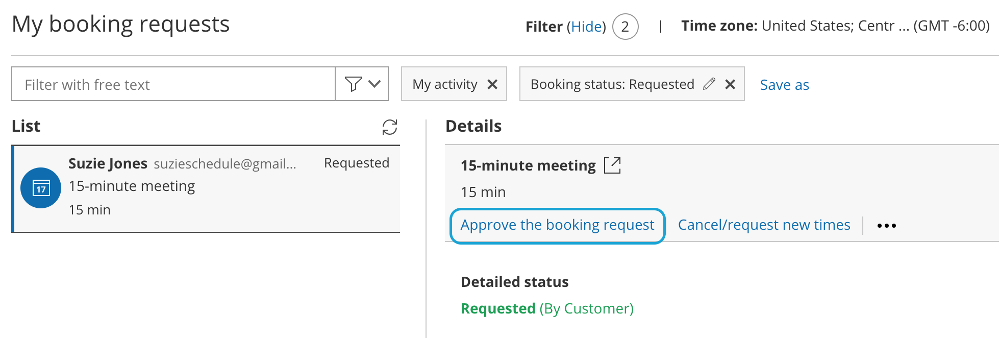

import { Aside } from '@astrojs/starlight/components';

When you work in [Booking with approval mode](/automatic-booking-or-booking-with-approval/ "Automatic booking or Booking with approval") and a Customer submits a booking request, you'll receive an email with the suggested meeting times that the Customer selected. You can also access the suggested times directly from the activity in the [Activity stream](/introduction-to-the-activity-stream/ "Introduction to the ScheduleOnce Activity stream")

In this article, you'll learn about responding to booking requests from Customers.

```
&lt;script id="snippet-prepend">
$(function()&#123;
  
  /*disable in widget*/
  if($('.w-documentation-article').length === 0)&#123;

     var ToC =
  "&lt;nav role='navigation' class='table-of-contents toc-top'><h4>In this article:" + "<ul>";
     var el,     title, link, header;
      //Define the heading levels you want to use in ascending order. Can add extra or remove unneeded.
     $(".hg-article-body h1, .hg-article-body h2, .hg-article-body h3, .hg-article-body h4").each(function() &#123;
              el = $(this);
              title = el.text();
                 if(title != '')&#123;
                anchorTitle = el.text().replace(/([~!@#$%^&*()_+=`&#123;&#125;\[\]\|\\:;'&lt;>,.\/\? ])+/g, '-').toLowerCase();
                link = "#" + anchorTitle;
                //Set all headers to a 0-nesting level.
                header = 'header-nesting-0';
                //Adjust header-nesting layers so that they point to the correct html tag. header-nesting-1 should match the second .hg-article-body h# listed above; header-nesting-2 should match the third, etc.
                if($(this).is('h2'))&#123;
                    header = 'header-nesting-1';
                &#125;else if($(this).is('h3'))&#123;
                    header = 'header-nesting-2'
                &#125;
                el.html('<a id="'+anchorTitle+'" class="toc-anchor">' + el.html());
                newLine =
      "<li class='"+header+"'>" +
        "<a class='article-anchor' href='" + link + "'>" +
          title +
        "" +
      "";


                ToC += newLine;
              &#125;
              &#125;);
     ToC +=
   "" +
  "";
    $("#snippet-prepend").before(ToC);
  &#125;
&#125;);

&lt;/script>
```

```
&lt;style>
/* CSS to style the TOC as it displays and the auto-created anchors
.toc-top styles the box for the TOC; adjust styles here to tweak look and feel */
  
.toc-top &#123;
  background-color: #FAFAFA; /* set to #fff or delete entirely for no background */
  border: 1px solid #C8C8C8; /* adjust the color hex here to change border color */
  box-shadow: 0 1px 1px rgba(0, 0, 0, 0.05) inset;
  margin-top: 24px;
  margin-bottom: 36px;
  min-height: 20px;
  padding: 13px 20px;
  max-width: 75%;
&#125;
.toc-top h4 &#123;
  font-size: 18px;
  line-height: 26px;
  margin: 0 0 8px;
  font-weight: 400;
&#125;
.toc-top ul &#123;
  padding: 0 0 0 15px !important;
  margin-bottom: 0;	
&#125;
.toc-top > ul &#123;
  margin-bottom: 13px!important;
&#125;
.toc-anchor &#123;
  display: block;
  height: 90px; 
  margin-top: -90px; 
  visibility: hidden;
&#125;

/* Set the indentation for the nesting levels. May need to be edited to match changes above. Increase or decrease the margin-left to get your desired level of indentation. */
.header-nesting-1 &#123;
    margin-left: 14px;
&#125;
.header-nesting-1:before &#123;
	background-image: url(https://dyzz9obi78pm5.cloudfront.net/app/image/id/5d31bcc88e121c9b25ba22c4/n/bulletv2.svg)!important;
&#125;
.header-nesting-2 &#123;
    margin-left: 28px;
&#125;
.header-nesting-2:before &#123;
	background-image: url(https://dyzz9obi78pm5.cloudfront.net/app/image/id/5d31be536e121cf22b0cc6ae/n/bulletv3.svg)!important;
&#125;
&lt;/style>
```

# Requirements

To respond to a booking request, you must be [the Owner, an Editor, or a Viewer](/booking-page-ownership/ "Booking page ownership") of the [Booking page](/introduction-to-booking-pages/ "Introduction to Booking pages") that the booking was made on.

# Scheduling a booking request

When you use Booking with approval mode, you can set the number of times your Customers must suggest. The more times you ask your Customers to suggest, the more flexibility you'll have when you pick the final time. Once a Customer submits their booking, you'll receive an email notification to review the suggested times and approve the booking request (Figure 1). The booking request will also be visible in your [Activity stream](/introduction-to-the-activity-stream/ "Introduction to the ScheduleOnce Activity stream"). 

Figure 1: Booking request notification email

# Approving a booking request

To schedule the booking request, click the **Approve the request** button in the email notification. This will open the **Find a time and schedule** page. 

You can also schedule the booking request in your Activity stream. In the **Details** pane for the activity, select Approve the booking request (Figure 2). This will take you to the **Find a time and schedule** page. 

Figure 2: Schedule a booking button

# The Find a time and schedule page

The **Find a time and schedule** page presents all the times selected by the Customer who submitted the booking request. The relevant days are highlighted with green in the Month row above the table. 

To select a time, you can click on the green days directly, or use the arrow buttons (Figure 3).

Figure 3: Find a time and schedule

When you click the **Schedule** button, the meeting is created in your [selected calendar](/booking-page-associated-calendars-section/ "Booking page: Associated calendars section") and a [calendar invite can be sent to your Customers](/customer-calendar-event-options/ "Customer Calendar Event options"), depending on your Customer notification settings. In addition, OnceHub sends email confirmations with all the meeting details to your Customers based on your [Customer notification settings](/introduction-to-customer-notifications/ "The Customer Notifications section").

# Canceling a booking request or requesting new times

If none of the times work for you, you can click the **Request new times** link on the **Find a time and schedule** page.

You can also request new times or cancel the booking request in your Activity stream. In the **Details** pane for the activity, select **Cancel/request new times** (Figure 4). [Learn more about managing bookings from the Activity stream](/managing-bookings-in-the-activity-stream/ "Managing bookings from the Activity stream")

Figure 4: Cancel/request new times button

[Learn more about canceling a booking request and requesting new times](/user-action-cancel-a-booking-request-and-request-new-times/ "User action: Cancel a booking request and request new times")