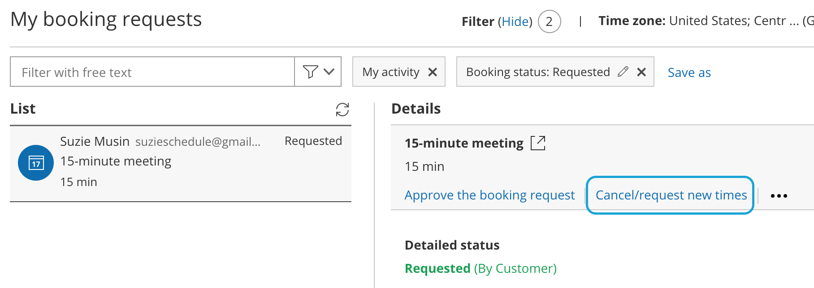
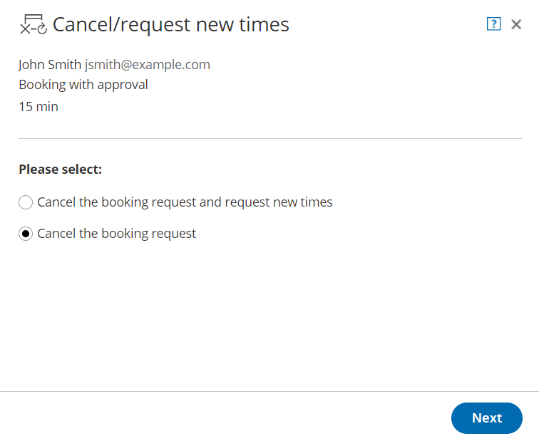

import { Aside } from '@astrojs/starlight/components';

When you work in [Booking with approval mode](/automatic-booking-or-booking-with-approval/ "Automatic Booking or Booking with Approval") and a Customer submits a booking request, you'll receive an email with the suggested meeting times that the Customer selected. You can also access the suggested times directly from the activity in the [Activity stream.](/introduction-to-the-activity-stream/ "Introduction to the Activity Stream")

If the times suggested by the Customer don't work for you, you can cancel the request or request new times. In both cases, email notifications will be sent to both the User and Customer. [Learn more about the Customer notifications scenarios](/introduction-to-customer-notifications/ "The Customer Notifications section")

In this article, you'll learn how to cancel a booking request and request new times or cancel a booking request.

```
&lt;script id="snippet-prepend">
$(function()&#123;
  
  /*disable in widget*/
  if($('.w-documentation-article').length === 0)&#123;

     var ToC =
  "&lt;nav role='navigation' class='table-of-contents toc-top'><h4>In this article:" + "<ul>";
     var el,     title, link, header;
      //Define the heading levels you want to use in ascending order. Can add extra or remove unneeded.
     $(".hg-article-body h1, .hg-article-body h2, .hg-article-body h3, .hg-article-body h4").each(function() &#123;
              el = $(this);
              title = el.text();
                 if(title != '')&#123;
                anchorTitle = el.text().replace(/([~!@#$%^&*()_+=`&#123;&#125;\[\]\|\\:;'&lt;>,.\/\? ])+/g, '-').toLowerCase();
                link = "#" + anchorTitle;
                //Set all headers to a 0-nesting level.
                header = 'header-nesting-0';
                //Adjust header-nesting layers so that they point to the correct html tag. header-nesting-1 should match the second .hg-article-body h# listed above; header-nesting-2 should match the third, etc.
                if($(this).is('h2'))&#123;
                    header = 'header-nesting-1';
                &#125;else if($(this).is('h3'))&#123;
                    header = 'header-nesting-2'
                &#125;
                el.html('<a id="'+anchorTitle+'" class="toc-anchor">' + el.html());
                newLine =
      "<li class='"+header+"'>" +
        "<a class='article-anchor' href='" + link + "'>" +
          title +
        "" +
      "";


                ToC += newLine;
              &#125;
              &#125;);
     ToC +=
   "" +
  "";
    $("#snippet-prepend").before(ToC);
  &#125;
&#125;);

&lt;/script>
```

```
&lt;style>
/* CSS to style the TOC as it displays and the auto-created anchors
.toc-top styles the box for the TOC; adjust styles here to tweak look and feel */
  
.toc-top &#123;
  background-color: #FAFAFA; /* set to #fff or delete entirely for no background */
  border: 1px solid #C8C8C8; /* adjust the color hex here to change border color */
  box-shadow: 0 1px 1px rgba(0, 0, 0, 0.05) inset;
  margin-top: 24px;
  margin-bottom: 36px;
  min-height: 20px;
  padding: 13px 20px;
  max-width: 75%;
&#125;
.toc-top h4 &#123;
  font-size: 18px;
  line-height: 26px;
  margin: 0 0 8px;
  font-weight: 400;
&#125;
.toc-top ul &#123;
  padding: 0 0 0 15px !important;
  margin-bottom: 0;	
&#125;
.toc-top > ul &#123;
  margin-bottom: 13px!important;
&#125;
.toc-anchor &#123;
  display: block;
  height: 90px; 
  margin-top: -90px; 
  visibility: hidden;
&#125;

/* Set the indentation for the nesting levels. May need to be edited to match changes above. Increase or decrease the margin-left to get your desired level of indentation. */
.header-nesting-1 &#123;
    margin-left: 14px;
&#125;
.header-nesting-1:before &#123;
	background-image: url(https://dyzz9obi78pm5.cloudfront.net/app/image/id/5d31bcc88e121c9b25ba22c4/n/bulletv2.svg)!important;
&#125;
.header-nesting-2 &#123;
    margin-left: 28px;
&#125;
.header-nesting-2:before &#123;
	background-image: url(https://dyzz9obi78pm5.cloudfront.net/app/image/id/5d31be536e121cf22b0cc6ae/n/bulletv3.svg)!important;
&#125;
&lt;/style>
```

# Requirements

To cancel a booking request or request new times, you must be [the Owner, an Editor, or a Viewer](/booking-page-ownership/ "Booking page ownership") of the [Booking page](/introduction-to-booking-pages/ "Introduction to Booking pages") that the booking was made on.

# Canceling a booking request and requesting new times

1.  Select the activity in the Activity stream.
2.  In the **Details** pane, select **Cancel/request new times** (Figure 1).  
    
    
    Figure 1: Cancel/request new times button
    
3.  The **Cancel/request new times** pop-up will appear.
4.  Select **Cancel the booking request and request new times** (Figure 2). 
    
    Figure 2: Cancel/request new times pop-up—selection step
    
5.  Click **Next**.
6.  In the **Notification** step, you can add a reschedule reason that will be provided to the Customer. 
7.  Click **Next**.
8.  In the **Review** step, you can confirm the details of the booking request that you're about to cancel and request new times for.
9.  Click the **Request new times** button to cancel the booking request and request new times.
10.  In the **Confirmation** step, you'll see confirmation that your request for new times has been sent and that the former booking request has been canceled.
11.  Both the User and the Customer will receive the **Booking request resubmission requested by User** email notification. [Learn more about notification scenarios](/notification-scenarios/ "Notification scenarios")

**Note**

You can always decide to change your selection by clicking **Back** at any step of the Cancel/request new times wizard. 

To confirm the action, you must click the **Request new times** button in the last step of the wizard.

# Canceling a booking request

1.  Select the activity in the Activity stream.
2.  In the **Details** pane, click the **Cancel/request new times** button (Figure 3). 
    
    Figure 3: Cancel/request new times button
    
3.  The **Cancel/request new times** pop-up will appear.
4.  Select **Cancel the booking request** (Figure 4). Figure 4: Cancel/request new times pop-up—selection step
5.  Click **Next**.
6.  In the **Notification** step, you can add a reschedule reason that will be provided to the Customer. 
7.  Click **Next**.
8.  In the **Review** step, you can confirm the details of the booking request that you're about to cancel or request new times for.
9.  Click **Cancel the booking request** to cancel the request.
10.  In the **Confirmation** step, you'll see confirmation that the activity has been canceled and all attendees have been notified.
11.  Both the User and Customer will receive the **Booking request canceled by User** email notification. [Learn more about notification scenarios](/notification-scenarios/ "Notification scenarios")

**Note** You can always decide to change your selection by clicking **Back** at any step of the Cancel/request new times process. 

To confirm the action, you must click the **Cancel the Booking request** in the last step of the wizard.