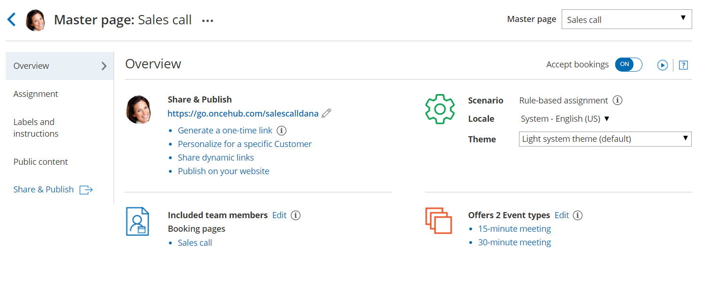
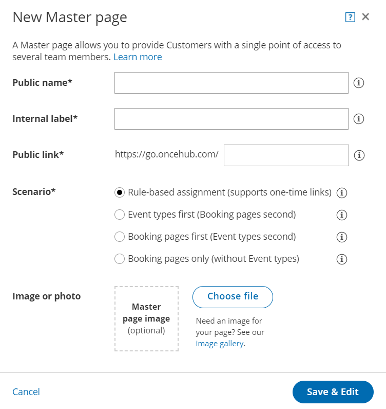

import { Aside } from '@astrojs/starlight/components';

[Master pages](/introduction-to-master-pages/ "Introduction to Master pages") allow you to combine multiple [Booking pages](/introduction-to-booking-pages/ "Introduction to Booking pages") and [Event types](/introduction-to-event-types/ "Introduction to Event types") into one point of access for your Customers, providing support for a wide range of scheduling scenarios. 

When you create a Master page, you can it set up so that Customers can select the Team member they want to book with, or set it up so that bookings are [automatically assigned to Team members](/team-or-panel-page/ "Master page scenario: Rule-based assignment") according to rules you create. Alternatively, you can create a Master page that combines Booking pages representing different locations or channels. You can create as many Master pages as you need to meet your organization’s requirements.

Figure 1: Master page Overview

In this article, you'll learn how to create a Master page.

**Tip**

If you would like to [generate one-time links](/one-time-links/ "Using one-time links with your Master page") which are good for one booking only, you should use a Master page using [Rule-based assignment](/team-or-panel-page/ "Master page scenario: Rule-based assignment") with [Dynamic rules](/assignment-with-team-or-panel-pages/ "Rule-based assignment: Dynamic rules").

One-time links eliminate any chance of unwanted repeat bookings. A Customer who receives the link will only be able to use it for the intended booking and will not have access to your underlying [Booking page](/introduction-to-booking-pages/ "Introduction to Booking pages"). One-time links [can be personalized](/using-personalized-links/ "Using Personalized links"), allowing the Customer to pick a time and schedule without having to fill out the [Booking form](/booking-form/ "Collecting Customer data with Booking forms"). 

# Requirements

To create a Master page, you must be a [OnceHub Administrator](/user-type-member-vs-admin-team-manager/ "Differences between Administrator and Member").

# Creating a Master page

1.  **Booking pages** on the left.
2.  Click the Plus button  in the **Master pages** pane.
3.  The **New Master page** pop-up will appear (Figure 2).  
    Figure 2: New Master page pop-up
4.  Define the properties for your Master page.
    *   **Public name:** The Public name is visible to Customers as the page title. It can be changed at any time in the [Public content section](/master-page-public-content-section/ "Master Page: Public Content section").
    *   **Internal label:** The Internal label is only visible internally, and not visible to your Customers. A recognizable label is recommended because the Master page will be identified with this label throughout your OnceHub app. It can be changed at any time in the Master Page [Overview section](/master-page-overview-section/ "Master Page: Overview section").
    *   **Public link:** The Public link is the link used by Customers to access the page. It must be unique and include at least four characters. It can be changed at any time in the Overview section. [Learn more about Public links](/using-general-links/ "Using General links")
5.  Select your [Master page scenario](/master-page-scenarios/ "Master page scenarios"). This determines your Master page's scheduling flow. Master pages can have one of four different flows.
    *   [**Team or panel page**](/team-or-panel-page/ "Team or panel page"): Customers select a time and bookings are automatically assigned to Team members according to the rules that you define in the Master page [Assignment section](/master-page-event-types-and-assignment-section/ "Master page: Assignment section"). 
    *   [**Event types first**](/event-types-first-booking-pages-second/ "Event types first (Booking pages second)"): Customers first select an Event type, then they are presented with the Booking pages that provide that Event type. Once they select a Booking page, they will be presented with time slots based on that Booking page’s availability.
    *   [**Booking pages first**](/booking-pages-first-event-types-second/ "Booking pages first (Event types second)"): Customers first select a Booking page, then they are presented with the Event types offered by that Booking page. Once they select an Event type, they are presented with the availability of the Booking page they selected. 
    *   [**Booking pages only**](/booking-pages-only-without-event-types/ "Booking pages only (without Event types)")**:** Customers select a Booking page. Then, they are presented with the Booking page’s availability. This option is useful if you don't use Event types and there are no shared settings between your Booking pages.
        
        **Note**The scenario cannot be changed after you create a Master page.
        
6.  Add an **Image or photo** to your page. This will be visible to Customers. It can be changed at any time in the [Public content section](/master-page-public-content-section/ "Master Page: Public Content section").
7.  Click **Save & Edit**. 

You're all set! You'll be redirected to the [Master page Overview section](/master-page-overview-section/ "Master Page: Overview section") to continue editing your settings.