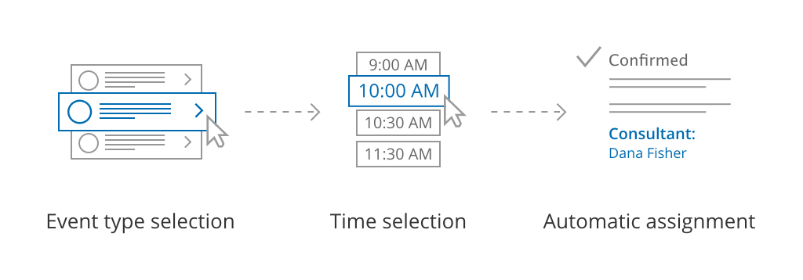

import { Aside } from '@astrojs/starlight/components';

When your Master page uses team or panel pages, you can set up specific rules to define which Team member is assigned to a booking. 

```
&lt;script id="snippet-prepend">
$(function()&#123;
  
  /*disable in widget*/
  if($('.w-documentation-article').length === 0)&#123;

     var ToC =
  "&lt;nav role='navigation' class='table-of-contents toc-top'><h4>In this article:" + "<ul>";
     var el,     title, link, header;
      //Define the heading levels you want to use in ascending order. Can add extra or remove unneeded.
     $(".hg-article-body h1, .hg-article-body h2, .hg-article-body h3, .hg-article-body h4").each(function() &#123;
              el = $(this);
              title = el.text();
                 if(title != '')&#123;
                anchorTitle = el.text().replace(/([~!@#$%^&*()_+=`&#123;&#125;\[\]\|\\:;'&lt;>,.\/\? ])+/g, '-').toLowerCase();
                link = "#" + anchorTitle;
                //Set all headers to a 0-nesting level.
                header = 'header-nesting-0';
                //Adjust header-nesting layers so that they point to the correct html tag. header-nesting-1 should match the second .hg-article-body h# listed above; header-nesting-2 should match the third, etc.
                if($(this).is('h2'))&#123;
                    header = 'header-nesting-1';
                &#125;else if($(this).is('h3'))&#123;
                    header = 'header-nesting-2'
                &#125;
                el.html('<a id="'+anchorTitle+'" class="toc-anchor">' + el.html());
                newLine =
      "<li class='"+header+"'>" +
        "<a class='article-anchor' href='" + link + "'>" +
          title +
        "" +
      "";


                ToC += newLine;
              &#125;
              &#125;);
     ToC +=
   "" +
  "";
    $("#snippet-prepend").before(ToC);
  &#125;
&#125;);

&lt;/script>
```

```
&lt;style>
/* CSS to style the TOC as it displays and the auto-created anchors
.toc-top styles the box for the TOC; adjust styles here to tweak look and feel */
  
.toc-top &#123;
  background-color: #FAFAFA; /* set to #fff or delete entirely for no background */
  border: 1px solid #C8C8C8; /* adjust the color hex here to change border color */
  box-shadow: 0 1px 1px rgba(0, 0, 0, 0.05) inset;
  margin-top: 24px;
  margin-bottom: 36px;
  min-height: 20px;
  padding: 13px 20px;
  max-width: 75%;
&#125;
.toc-top h4 &#123;
  font-size: 18px;
  line-height: 26px;
  margin: 0 0 8px;
  font-weight: 400;
&#125;
.toc-top ul &#123;
  padding: 0 0 0 15px !important;
  margin-bottom: 0;	
&#125;
.toc-top > ul &#123;
  margin-bottom: 13px!important;
&#125;
.toc-anchor &#123;
  display: block;
  height: 90px; 
  margin-top: -90px; 
  visibility: hidden;
&#125;

/* Set the indentation for the nesting levels. May need to be edited to match changes above. Increase or decrease the margin-left to get your desired level of indentation. */
.header-nesting-1 &#123;
    margin-left: 14px;
&#125;
.header-nesting-1:before &#123;
	background-image: url(https://dyzz9obi78pm5.cloudfront.net/app/image/id/5d31bcc88e121c9b25ba22c4/n/bulletv2.svg)!important;
&#125;
.header-nesting-2 &#123;
    margin-left: 28px;
&#125;
.header-nesting-2:before &#123;
	background-image: url(https://dyzz9obi78pm5.cloudfront.net/app/image/id/5d31be536e121cf22b0cc6ae/n/bulletv3.svg)!important;
&#125;
&lt;/style>
```

# Team or panel pages

Booking assignment is defined per Event type offered on your Master page. Each Event type can be provided by a specific Booking page, or a member of a [Resource pool](/introduction-to-scheduleonce-resource-pools/ "Introduction to ScheduleOnce Resource pools"), allowing you to dynamically assign bookings to your team. This allows for flexible setup that can be different for each Master page.

You can also [generate one-time links](/one-time-links/ "Using One-time links with your Master page") which are good for one booking only, eliminating any chance of unwanted repeat bookings. A Customer who receives the link will only be able to use it for the intended booking and will not have access to your underlying [Booking page](/introduction-to-booking-pages/ "Introduction to Booking pages"). One-time links [can be personalized](/using-personalized-links/ "Using Personalized links"), allowing the Customer to pick a time and schedule without having to fill out the [Booking form](/booking-form/ "Collecting Customer data with Booking forms"). [Learn more about using one-time links](/one-time-links/ "Using one-time links with your Master page")

# 

**Tip**You can use the [OnceHub for Gmail extension](/integrations/browser-extension/introduction-to-oncehub-for-gmail/ "Introduction to OnceHub for Gmail") to schedule with general links directly from your Gmail account. You can generate links, copy them in a single click, and send them in an email. 

[Learn more about OnceHub for Gmail](/integrations/browser-extension/introduction-to-oncehub-for-gmail/ "Introduction to OnceHub for Gmail")

**Note** Master pages using the Team or panel page scenario do not work with Event types that have  [Booking with approval](/automatic-booking-or-booking-with-approval/ "Automatic booking or Booking with approval") or [Session packages](/single-or-multiple-sessions/ "Session packages") enabled.

# The Customer scheduling flow

Figure 1: Team or panel pages

First, Customers select an Event type. Then, they are presented with all available times. Once they select a date and time, the booking is automatically assigned to a Team member or members according to the rules you defined.

[](https://help.oncehub.com/help/rule-based-assignment-dynamic-rules "Rule-based assignment: Dynamic rules")

[Learn more about team or panel pages](/rule-based-assignment-dynamic-rules/ "Rule-based assignment: Team or panel pages")

**Note**If there is only one Event type included in the Master page, the Customer skips selecting  an [Event type](/introduction-to-event-types/ "Introduction to Event types") and moves directly to choosing a time slot.