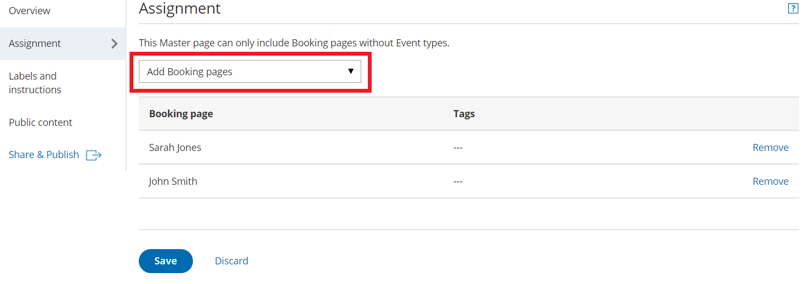

import { Aside } from '@astrojs/starlight/components';

The **Event types and assignment** section of a [Master page](/introduction-to-master-pages/ "Introduction to Master pages") is where you determine how the bookings made on the Master page will be assigned to your Team members. This section is different depending on [which scenario](/master-page-scenarios/ "Master page scenarios") you selected for your Master page. 

The four scenarios you can choose from are: 

*   [Team or panel page](/team-or-panel-page/ "Master page scenario: Team or panel pages") 
*   [Booking pages first](/booking-pages-first-event-types-second/ "Booking pages first (Event types second)")
*   [Event types first](/event-types-first-booking-pages-second/ "Event types first (Booking pages second)")
*   [Booking pages only](/booking-pages-only-without-event-types/ "Booking pages only (without Event types)")

**Tip**

If you would like to [generate one-time links](/one-time-links/ "Using one-time links with your Master page") which are good for one booking only, you should use a Master page using a [Team or panel page](/team-or-panel-page/ "Master page scenario: Team or panel pages").

One-time links eliminate any chance of unwanted repeat bookings. A Customer who receives the link will only be able to use it for the intended booking and will not have access to your underlying [Booking page](/introduction-to-booking-pages/ "Introduction to Booking pages"). One-time links [can be personalized](/using-personalized-links/ "Using Personalized links"), allowing the Customer to pick a time and schedule without having to fill out the [Booking form](/booking-form/ "Collecting Customer data with Booking forms"). [Learn more about one-time links](/one-time-links/ "Using one-time links with your Master page")

```
&lt;script id="snippet-prepend">
$(function()&#123;
  
  /*disable in widget*/
  if($('.w-documentation-article').length === 0)&#123;

     var ToC =
  "&lt;nav role='navigation' class='table-of-contents toc-top'><h4>In this article:" + "<ul>";
     var el,     title, link, header;
      //Define the heading levels you want to use in ascending order. Can add extra or remove unneeded.
     $(".hg-article-body h1, .hg-article-body h2, .hg-article-body h3, .hg-article-body h4").each(function() &#123;
              el = $(this);
              title = el.text();
                 if(title != '')&#123;
                anchorTitle = el.text().replace(/([~!@#$%^&*()_+=`&#123;&#125;\[\]\|\\:;'&lt;>,.\/\? ])+/g, '-').toLowerCase();
                link = "#" + anchorTitle;
                //Set all headers to a 0-nesting level.
                header = 'header-nesting-0';
                //Adjust header-nesting layers so that they point to the correct html tag. header-nesting-1 should match the second .hg-article-body h# listed above; header-nesting-2 should match the third, etc.
                if($(this).is('h2'))&#123;
                    header = 'header-nesting-1';
                &#125;else if($(this).is('h3'))&#123;
                    header = 'header-nesting-2'
                &#125;
                el.html('<a id="'+anchorTitle+'" class="toc-anchor">' + el.html());
                newLine =
      "<li class='"+header+"'>" +
        "<a class='article-anchor' href='" + link + "'>" +
          title +
        "" +
      "";


                ToC += newLine;
              &#125;
              &#125;);
     ToC +=
   "" +
  "";
    $("#snippet-prepend").before(ToC);
  &#125;
&#125;);

&lt;/script>
```

```
&lt;style>
/* CSS to style the TOC as it displays and the auto-created anchors
.toc-top styles the box for the TOC; adjust styles here to tweak look and feel */
  
.toc-top &#123;
  background-color: #FAFAFA; /* set to #fff or delete entirely for no background */
  border: 1px solid #C8C8C8; /* adjust the color hex here to change border color */
  box-shadow: 0 1px 1px rgba(0, 0, 0, 0.05) inset;
  margin-top: 24px;
  margin-bottom: 36px;
  min-height: 20px;
  padding: 13px 20px;
  max-width: 75%;
&#125;
.toc-top h4 &#123;
  font-size: 18px;
  line-height: 26px;
  margin: 0 0 8px;
  font-weight: 400;
&#125;
.toc-top ul &#123;
  padding: 0 0 0 15px !important;
  margin-bottom: 0;	
&#125;
.toc-top > ul &#123;
  margin-bottom: 13px!important;
&#125;
.toc-anchor &#123;
  display: block;
  height: 90px; 
  margin-top: -90px; 
  visibility: hidden;
&#125;

/* Set the indentation for the nesting levels. May need to be edited to match changes above. Increase or decrease the margin-left to get your desired level of indentation. */
.header-nesting-1 &#123;
    margin-left: 14px;
&#125;
.header-nesting-1:before &#123;
	background-image: url(https://dyzz9obi78pm5.cloudfront.net/app/image/id/5d31bcc88e121c9b25ba22c4/n/bulletv2.svg)!important;
&#125;
.header-nesting-2 &#123;
    margin-left: 28px;
&#125;
.header-nesting-2:before &#123;
	background-image: url(https://dyzz9obi78pm5.cloudfront.net/app/image/id/5d31be536e121cf22b0cc6ae/n/bulletv3.svg)!important;
&#125;
&lt;/style>
```

# Requirements

To define the **Event types and assignment** section of a Master page, you must be a [OnceHub Administrator](/user-type-member-vs-admin-team-manager/ "Differences between Administrator and Member").

# Building a team or panel page

The associations between Event types and Meeting providers are created on the Master page, allowing for a flexible setup that can be different for each Master page.

1.  Go to the **Event types and assignment** section
2.  Click **Add Event type**.  
    Figure 1: Add an Event-based rule
3.  Select which [Event types](/introduction-to-event-types/ "Introduction to Event types") will be offered in your Master page (Figure 1). Master pages with team or panel pages can only include Event types configured to [Automatic booking](/automatic-booking-or-booking-with-approval/ "Automatic booking or Booking with approval") and Single session. [Learn more about conflicting settings when using team or panel pages](/master-page-setup-conflicting-settings-when-using-team-or-panel-pages/ "Conflicting settings when using team or panel pages")
4.  Next, use the [Booking assignment](/booking-owners/ "Booking assignment") drop-down to select who will provide your Event types. You can select a specific Booking page or a Resource pool.
5.  If your Event type requires multiple team members from your organization, use the [Additional team members](/additional-team-members/ "Additional Team Members") drop-down to add them. These team members can be defined by selecting specific Booking pages or by selecting [Resource pools](/introduction-to-resource-pools/ "Introduction to ScheduleOnce Resource pools").
    
    **Note** The same Resource pool cannot be selected as the Booking assignment and as the Additional team member in a single rule. [Learn more about conflicting settings when using team or panel pages](/master-page-setup-conflicting-settings-when-using-team-or-panel-pages/ "Conflicting settings when using team or panel pages")
    
6.  Reorder the Event types to ensure they appear on your Master page in the order that you want. You can move a row up or down by clicking on the left side of the row and dragging to the position you want (Figure 2).  
    Figure 2: Click and drag a row to reorder
7.  Click **Save**.

# Master pages with Event types first or Booking pages first 

1.  Go to **Booking pages** on the left and select the relevant Master page. 
2.  Click on the **Event types and assignment** section of the Master page. 
3.  Use the drop-down menu to select the Booking pages that you want to include in the Master page (Figure 3). Only Booking pages that [are associated with Event types](/adding-event-types-to-booking-pages/ "Adding Event types to Booking pages") can be selected.  
    Figure 3: Adding Booking pages to your Master page
4.  In the **Assignment upon reschedule** section, you can choose to assign a rescheduled booking to the same Booking page it was originally assigned to it. To enable this, check the box marked **Reschedule is only possible on the page on which the booking was made**.
5.  Click **Save**.

# Master pages with Booking pages only 

1.  Go to **Booking pages** on the left and select the relevant Master page. 
2.  Click on the **Event types and assignment** section of the Master page.
3.  Use the drop-down menu to select the Booking pages that you want to include in the Master page (Figure 4). Only Booking pages that are not associated with any Event types can be included in this Master page.  
    Figure 4: Adding Booking pages to your Master page
4.  Click **Save**.