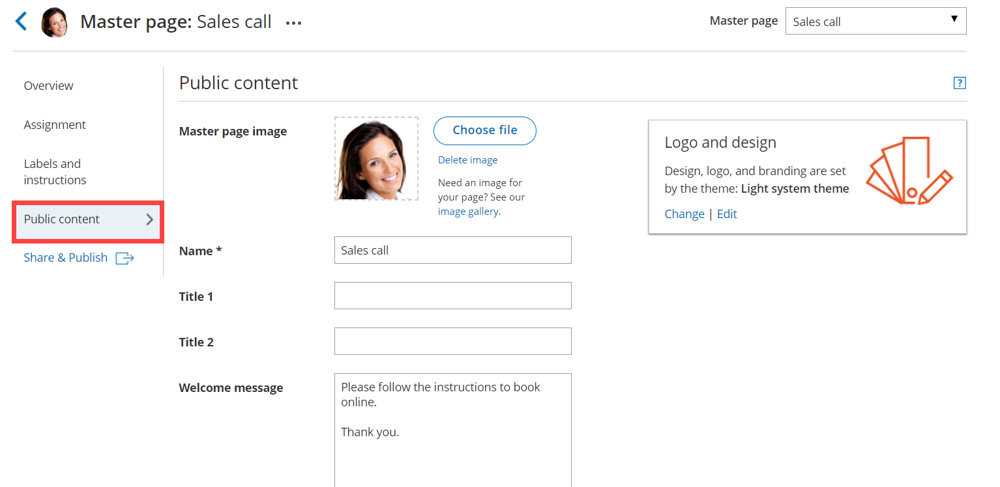

import { Aside } from '@astrojs/starlight/components';

In the Public content section, you can define information that will help your Customers understand what your Master page is for. You can include basic information about yourself, your organization, your meeting type, location or your staff member and write a welcome message to the Customers who schedule time with you.

The Public content is used when your page is in **Enabled** status as well as in **Disabled** status. When you [disable your Master page](/disabling-your-master-page/ "Disabling your Master page"), you can keep the Public content section as is, or change it to display a different message. 

# Location of the Public content section

You can access this section by going to **Booking pages** on the left and select the relevant Master page **→** **Public content** (Figure 1).

Figure 1: Master page Public content section

# Public content features

## Add a Master page image 

Upload a photo or any other image in JPG, PNG or GIF format (max 200KB). It will be cropped or scaled to a 200 x 200 pixels rectangle as part of the upload process.

## Add a Master page name

Enter the name of your page. It can be your name, your organization's name, or the type of meeting your Customers are booking. You can use up to 75 characters, including spaces.

## Add Titles

Enter subheadings to the name of your page.

## Add a Welcome message

You can enter up to 2,000 characters with spaces. 

The welcome message can include hyperlinks (clickable URLs). The Welcome message also allows you to include HTML links. 

For instance, adding this code in the Public content session: 

Figure 2: HTML link in the Event type description

**Note**

Do not create a line break after **&lt;a** at the start of the code. In the above graphic, it wraps to the next line automatically due to spacing. However, your entry should not have any extra line breaks.

...results in this link shown on the customer end:

Figure 3: Event type description including HTML link

## Add Phone and Email

Enter a phone number and email address for your Customers to contact you.

## Add a Website link

Enter a URL to reference your organization's website or another relevant site you want to provide to people booking with you. The link entered will also automatically make the header logo at the top clickable, directing to the same URL.

## Social media links

### Add a link to Twitter

Copy and paste your full Twitter URL. It can be a personal or company handle, and must start with https://twitter.com/

### Add a link to LinkedIn

Copy and paste your full LinkedIn URL. It can be a personal or company profile, and must start with https://www.linkedin.com/

### Add a link to Facebook

Copy and paste your full Facebook URL. It can be a personal or company page, and must start with [https://www.facebook.com/](https://www.facebook.com/)

**Note**By default, the customer-facing interface also includes OnceHub branding in the left pane of your Master page; for instance, "Powered by OnceHub." You can adjust this according to your preference in your OnceHub account **Settings** page.