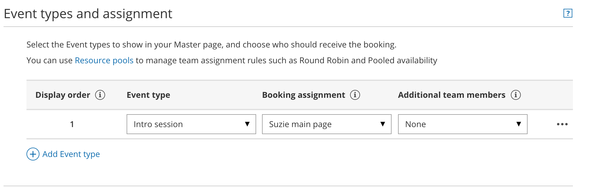
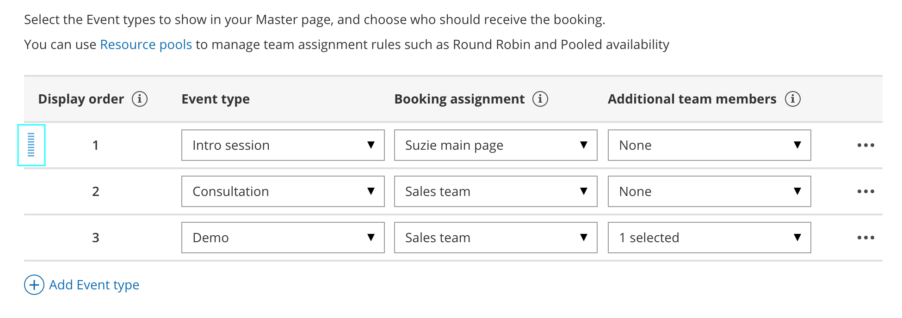

import { Aside } from '@astrojs/starlight/components';

[Resource pools](/introduction-to-resource-pools/ "Introduction to ScheduleOnce Resource pools") allow you to dynamically distribute bookings among a group of Team members in the same department, location, or with any other shared characteristic. After you've [created a Resource pool](/creating-a-resource-pool/ "Creating a Resource pool in ScheduleOnce") and added all the relevant [Booking pages](/introduction-to-booking-pages/ "Introduction to Booking pages") to it, you'll need to add the Resource pool to a Master page to start distributing bookings to your pool members.

In this article, you'll learn how to add a Resource pool to a Master page.

```
&lt;script id="snippet-prepend">
$(function()&#123;
  
  /*disable in widget*/
  if($('.w-documentation-article').length === 0)&#123;

     var ToC =
  "&lt;nav role='navigation' class='table-of-contents toc-top'><h4>In this article:" + "<ul>";
     var el,     title, link, header;
      //Define the heading levels you want to use in ascending order. Can add extra or remove unneeded.
     $(".hg-article-body h1, .hg-article-body h2, .hg-article-body h3, .hg-article-body h4").each(function() &#123;
              el = $(this);
              title = el.text();
                 if(title != '')&#123;
                anchorTitle = el.text().replace(/([~!@#$%^&*()_+=`&#123;&#125;\[\]\|\\:;'&lt;>,.\/\? ])+/g, '-').toLowerCase();
                link = "#" + anchorTitle;
                //Set all headers to a 0-nesting level.
                header = 'header-nesting-0';
                //Adjust header-nesting layers so that they point to the correct html tag. header-nesting-1 should match the second .hg-article-body h# listed above; header-nesting-2 should match the third, etc.
                if($(this).is('h2'))&#123;
                    header = 'header-nesting-1';
                &#125;else if($(this).is('h3'))&#123;
                    header = 'header-nesting-2'
                &#125;
                el.html('<a id="'+anchorTitle+'" class="toc-anchor">' + el.html());
                newLine =
      "<li class='"+header+"'>" +
        "<a class='article-anchor' href='" + link + "'>" +
          title +
        "" +
      "";


                ToC += newLine;
              &#125;
              &#125;);
     ToC +=
   "" +
  "";
    $("#snippet-prepend").before(ToC);
  &#125;
&#125;);

&lt;/script>
```

```
&lt;style>
/* CSS to style the TOC as it displays and the auto-created anchors
.toc-top styles the box for the TOC; adjust styles here to tweak look and feel */
  
.toc-top &#123;
  background-color: #FAFAFA; /* set to #fff or delete entirely for no background */
  border: 1px solid #C8C8C8; /* adjust the color hex here to change border color */
  box-shadow: 0 1px 1px rgba(0, 0, 0, 0.05) inset;
  margin-top: 24px;
  margin-bottom: 36px;
  min-height: 20px;
  padding: 13px 20px;
  max-width: 75%;
&#125;
.toc-top h4 &#123;
  font-size: 18px;
  line-height: 26px;
  margin: 0 0 8px;
  font-weight: 400;
&#125;
.toc-top ul &#123;
  padding: 0 0 0 15px !important;
  margin-bottom: 0;	
&#125;
.toc-top > ul &#123;
  margin-bottom: 13px!important;
&#125;
.toc-anchor &#123;
  display: block;
  height: 90px; 
  margin-top: -90px; 
  visibility: hidden;
&#125;

/* Set the indentation for the nesting levels. May need to be edited to match changes above. Increase or decrease the margin-left to get your desired level of indentation. */
.header-nesting-1 &#123;
    margin-left: 14px;
&#125;
.header-nesting-1:before &#123;
	background-image: url(https://dyzz9obi78pm5.cloudfront.net/app/image/id/5d31bcc88e121c9b25ba22c4/n/bulletv2.svg)!important;
&#125;
.header-nesting-2 &#123;
    margin-left: 28px;
&#125;
.header-nesting-2:before &#123;
	background-image: url(https://dyzz9obi78pm5.cloudfront.net/app/image/id/5d31be536e121cf22b0cc6ae/n/bulletv3.svg)!important;
&#125;
&lt;/style>
```

# Requirements

*   To create or edit a Master page, you must be a [OnceHub Administrator](/user-type-member-vs-admin-team-manager/ "Differences between Administrator and Member").
*   Resource pools can ONLY be added to Master pages using team or panel pages.

# Adding Resource pools to Master pages

1.  Go to **Booking pages** in the bar on the left.
2.  Click the Plus button  in the **Master pages** pane to [create a new Master page](/master-page-setup-creating-a-master-page/ "Creating a Master page"). 
3.  The **New Master page** pop-up appears (Figure 1).  
    Figure 1: New Master page pop-up
4.  After defining the Master page's Public name, Internal label and Public link, select **Team or panel page** as the [Scenario](/master-page-scenarios/ "Master page scenarios").  
    
    **Tip**When you use a Master page with team or panel pages, you can also [generate one-time links](/one-time-links/ "Using One-time links with your Master page") which are good for one booking only, eliminating any chance of unwanted repeat bookings.  
      
    A Customer who receives the link will only be able to use it for the intended booking and will not have access to your underlying [Booking page](/introduction-to-booking-pages/ "Introduction to Booking pages"). One-time links [can be personalized](/using-personalized-links/ "Using Personalized links"), allowing the Customer to pick a time and schedule without having to fill out the [Booking form](/booking-form/ "Collecting Customer data with Booking forms").
    
5.  Click **Save & Edit**. You'll be redirected to the Master page [Overview section](/master-page-overview-section/ "Master Page: Overview section") to continue editing your settings. 
6.  Go to the [Event types and assignment section](/master-page-event-types-and-assignment-section/ "Master page: Event types and assignment section") of the Master page.
7.  Click **Add Event type**.
8.  Select which [Event types](/introduction-to-event-types/ "Introduction to Event types") will be offered in your Master page (Figure 3). Master pages with Dynamic rules can only include Event types configured to [Automatic booking](/automatic-booking-or-booking-with-approval/ "Automatic booking or Booking with approval") and Single session. [Learn more about conflicting settings when using team and panel pages](/master-page-setup-conflicting-settings-when-using-team-or-panel-pages/ "Conflicting settings when using team and panel pages") Figure 3: Add Event types and assignment
9.  Next, use the [Booking assignment](/booking-owners/ "Booking assignment") drop-down to select which [Resource pool](/introduction-to-resource-pools/ "Introduction to ScheduleOnce Resource pools") should provide that Event type. 
10.  Finally, if your Event type requires participation from multiple Team members simultaneously, you can create Panel meetings by adding any number of [Additional team members](/additional-team-members/ "Additional Team Members"). These Team members can be defined by selecting specific Booking pages or by selecting Resource pools.
     
     **Note**The same Resource pool cannot be selected as the Booking assignment and as the Additional team member in a single rule. [Learn more about conflicting settings when using team or panel pages](/master-page-setup-conflicting-settings-when-using-team-or-panel-pages/ "Conflicting settings when using team or panel pages")
     
11.  You can use the same Resource pool across multiple rules, and you can use multiple Resource pools per rule and across rules. This ultimately allows you to have multiple distribution methods on a single Master page. 
12.  Reorder the Event types to ensure they appear on your Master page in the order that you want. You can move a row up or down by clicking on the left side of the row and dragging to the position you want (Figure 4). Figure 4: Click and drag a row to reorder
13.  Click **Save**.

Your Master page with Resource pools is now ready to go! When a Customer schedules using this Master page, bookings will be assigned to pool members according to the pool's distribution method. Once your pool starts to receive bookings, you'll have real-time visibility of [how many bookings each Team member received](/scheduleonce-resource-pool-statistics-bookings-received/ "ScheduleOnce Resource pool statistics: Bookings received") and [how many bookings were removed](/scheduleonce-resource-pool-statistics-bookings-removed/ "ScheduleOnce Resource pool statistics: Bookings removed").