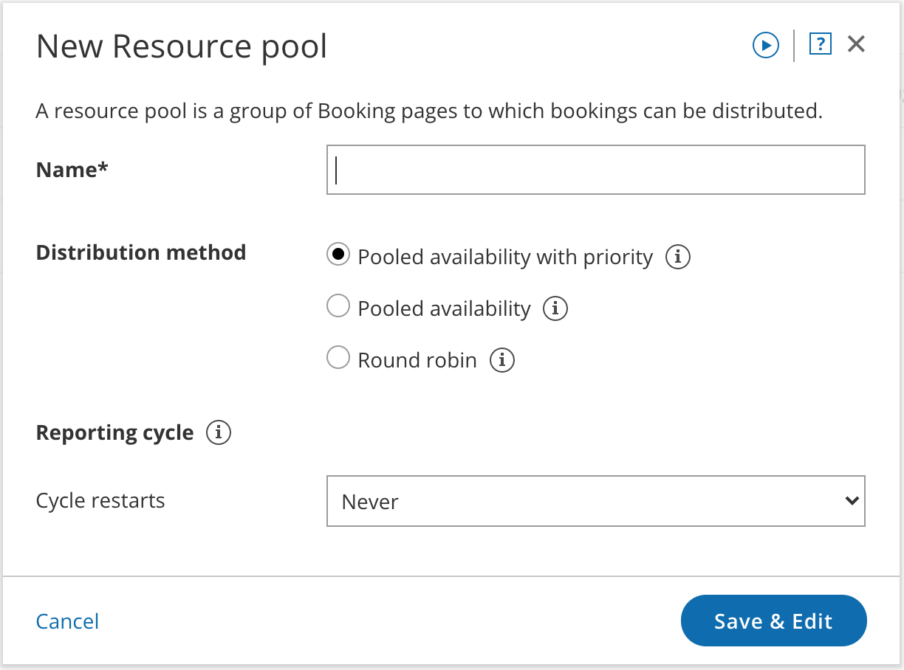
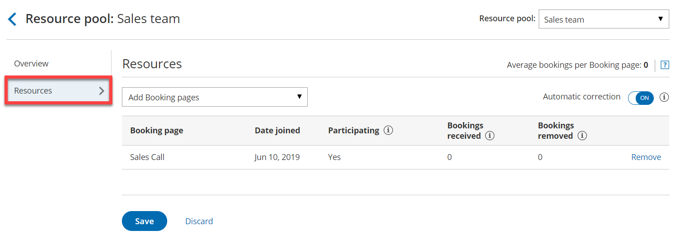

import { Aside } from '@astrojs/starlight/components';

Resource pools allow you to dynamically distribute bookings among a group of Team members in the same department, location, or with any other shared characteristic. 

Each Resource pool can have its own method for distributing bookings. As bookings come in, you'll be able to monitor how many bookings each Team member receives and ensure an optimal distribution of bookings at any point in time. You can create as many Resource pools as you need to meet your organization’s requirements. 

In this article, you'll learn how to create a Resource pool. 

```
&lt;script id="snippet-prepend">
$(function()&#123;
  
  /*disable in widget*/
  if($('.w-documentation-article').length === 0)&#123;

     var ToC =
  "&lt;nav role='navigation' class='table-of-contents toc-top'><h4>In this article:" + "<ul>";
     var el,     title, link, header;
      //Define the heading levels you want to use in ascending order. Can add extra or remove unneeded.
     $(".hg-article-body h1, .hg-article-body h2, .hg-article-body h3, .hg-article-body h4").each(function() &#123;
              el = $(this);
              title = el.text();
                 if(title != '')&#123;
                anchorTitle = el.text().replace(/([~!@#$%^&*()_+=`&#123;&#125;\[\]\|\\:;'&lt;>,.\/\? ])+/g, '-').toLowerCase();
                link = "#" + anchorTitle;
                //Set all headers to a 0-nesting level.
                header = 'header-nesting-0';
                //Adjust header-nesting layers so that they point to the correct html tag. header-nesting-1 should match the second .hg-article-body h# listed above; header-nesting-2 should match the third, etc.
                if($(this).is('h2'))&#123;
                    header = 'header-nesting-1';
                &#125;else if($(this).is('h3'))&#123;
                    header = 'header-nesting-2'
                &#125;
                el.html('<a id="'+anchorTitle+'" class="toc-anchor">' + el.html());
                newLine =
      "<li class='"+header+"'>" +
        "<a class='article-anchor' href='" + link + "'>" +
          title +
        "" +
      "";


                ToC += newLine;
              &#125;
              &#125;);
     ToC +=
   "" +
  "";
    $("#snippet-prepend").before(ToC);
  &#125;
&#125;);

&lt;/script>
```

```
&lt;style>
/* CSS to style the TOC as it displays and the auto-created anchors
.toc-top styles the box for the TOC; adjust styles here to tweak look and feel */
  
.toc-top &#123;
  background-color: #FAFAFA; /* set to #fff or delete entirely for no background */
  border: 1px solid #C8C8C8; /* adjust the color hex here to change border color */
  box-shadow: 0 1px 1px rgba(0, 0, 0, 0.05) inset;
  margin-top: 24px;
  margin-bottom: 36px;
  min-height: 20px;
  padding: 13px 20px;
  max-width: 75%;
&#125;
.toc-top h4 &#123;
  font-size: 18px;
  line-height: 26px;
  margin: 0 0 8px;
  font-weight: 400;
&#125;
.toc-top ul &#123;
  padding: 0 0 0 15px !important;
  margin-bottom: 0;	
&#125;
.toc-top > ul &#123;
  margin-bottom: 13px!important;
&#125;
.toc-anchor &#123;
  display: block;
  height: 90px; 
  margin-top: -90px; 
  visibility: hidden;
&#125;

/* Set the indentation for the nesting levels. May need to be edited to match changes above. Increase or decrease the margin-left to get your desired level of indentation. */
.header-nesting-1 &#123;
    margin-left: 14px;
&#125;
.header-nesting-1:before &#123;
	background-image: url(https://dyzz9obi78pm5.cloudfront.net/app/image/id/5d31bcc88e121c9b25ba22c4/n/bulletv2.svg)!important;
&#125;
.header-nesting-2 &#123;
    margin-left: 28px;
&#125;
.header-nesting-2:before &#123;
	background-image: url(https://dyzz9obi78pm5.cloudfront.net/app/image/id/5d31be536e121cf22b0cc6ae/n/bulletv3.svg)!important;
&#125;
&lt;/style>
```

# Requirements

To create Resource pools, you must be a [OnceHub Administrator](/user-type-member-vs-admin-team-manager/ "Differences between Administrator and Member").

# How to create a new Resource pool

1.  Goto **Booking pages** in the bar on the left.
2.  Select **Resource pools** (Figure 1) on the left.  
    
    
    Figure 1: Resource pools in the Tools section
    
3.  Click the **Add a Resource pool** button on the right. 
4.  The **New Resource pool** pop-up appears (Figure 2).  
    
    
    Figure 2: New Resource pool pop-up
    
    Next, you'll need to define the properties for your Resource pool.
    
    **Note**These properties cannot be changed once the Resource pool has been created.
    
5.  Add a name for your Resource pool. It's useful to give it a name related to what it represents. For example, if the pool will group together Team members in your Sales department, name the pool **Sales team**_._
6.  Select a method for distributing bookings among the Team members in the pool. The best method to choose depends on each team’s requirements.
    *   [Pooled availability with priority](/resource-pool-distribution-method---pooled-availability-with-priority/ "Resource pool distribution method: Pooled availability with priority"): This is a hybrid method which provides Customers with the maximum amount of time slots while also giving priority to specific Team members. When scheduling, Customers see the combined availability of all team members in one booking calendar. When the Customer selects a time, the booking is assigned to the Team member with the highest priority ranking.
        
    *   [Pooled availability](/resource-pool-distribution-method---pooled-availability/ "Resource pool distribution method: Pooled availability"): This method is Customer-focused and should be used if you want to provide Customers with the maximum number of time slots. When scheduling, Customers see the combined availability of all Team members in one booking calendar. When the Customer selects a time, the booking is assigned to the Team member with the longest idle time.
        
    *   [Round robin](/resource-pool-distribution-method---round-robin/ "Resource pool distribution method: Round robin"): This method is organization-focused and should be used if you want to ensure a fair and equal distribution among your Team members. When scheduling, Customers will only be presented with the availability of the next Team member in line.
        
7.  [](https://oncehub.knowledgeowl.com/help/resource-pool-reporting-cycle "ScheduleOnce Resource pool: Reporting cycle")Choose the [reporting cycle](/resource-pool-reporting-cycle/ "ScheduleOnce Resource pool: Reporting cycle") for your Resource pool. This determines how often the statistics for your pool will be reset. The reporting cycle can be monthly, quarterly, or go on continuously. Select the reporting cycle you use in your organization to ensure your scheduling stats are fully aligned with your business metrics.
    
    **Note**If the Reporting cycle of the Resource pool is **Every calendar month** or **Every calendar quarter**, you'll be required to define the time zone that will be used every Reporting cycle to reset the statistics for your pool. [Learn more about Resource pool Reporting cycles](/resource-pool-reporting-cycle/ "ScheduleOnce Resource pools: Reporting cycle")
    
8.  Click **Save & Edit**. 

You'll be redirected to the [Resource pool Overview section](/scheduleonce-resource-pools-overview-section/ "ScheduleOnce Resource pools: Overview section"). This section gives you a summary of your Resource pool’s main properties. Here, you will also see real-time booking metrics once your pool starts receiving bookings. The next step is to add the Booking pages of your Team members to your Resource pool.

# Adding Booking pages to your Resource pool

1.  Go to the **Resources** section of your new Resource pool (Figure 3).  
    Figure 3: Resource pool Resources section
2.  Select the [Booking pages](/introduction-to-booking-pages/ "Introduction to Booking pages") you want to add from the drop-down menu. 
3.  You can add as many Booking pages as you like. All types of Booking pages can be added to the pool, regardless of any existing [associations between Booking pages and Event types](/adding-event-types-to-booking-pages/ "Adding Event types to Booking pages").

Your Resource pool is ready! To start distributing bookings to your pool members, you need to [add it to a Master page](/adding-resource-pools-to-master-pages/ "Adding Resource pools to Master pages") using [team or panel pages](/team-or-panel-page/ "Master page scenario: Team or panel page"). Once your pool starts receiving bookings, you will have visibility in how many bookings each Team member received and how many were removed.

**Note**If your Resource pool's distribution method is [Pooled availability with priority](/resource-pool-distribution-method---pooled-availability-with-priority/ "Resource pool distribution method: Pooled availability with priority"), you will be able to [set a priority](/scheduleonce-resource-pools-assignment-priority/ "ScheduleOnce Resource pools: Assignment priority") for each booking page. Bookings will be assigned to the Booking page with the highest priority which is available at the selected time.