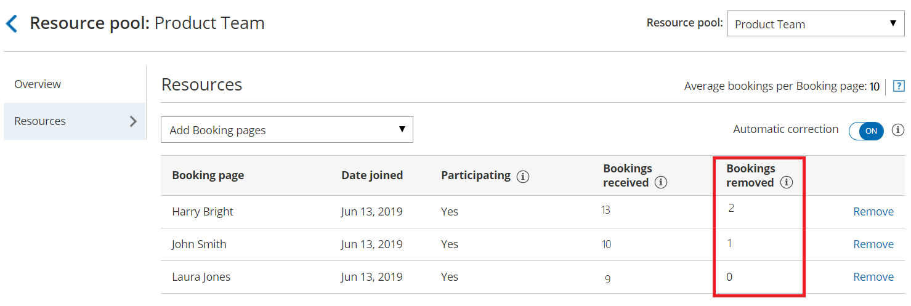

import { Aside } from '@astrojs/starlight/components';

[Resource pools](/introduction-to-resource-pools/ "Introduction to ScheduleOnce Resource pools") allow you to dynamically distribute bookings among a group of Team members in the same department, location, or with any other shared characteristic.

**Bookings removed** is a metric provided for each [Booking page](/introduction-to-booking-pages/ "Introduction to Booking pages") you've included in a Resource pool. **Bookings removed** is the number of bookings that were taken away from a specific Booking page to date, within the existing [Reporting cycle](/resource-pool-reporting-cycle/ "ScheduleOnce Resource pool: Reporting cycle"). 

In this article, you'll learn about viewing and understanding the Bookings removed metric.

```
&lt;script id="snippet-prepend">
$(function()&#123;
  
  /*disable in widget*/
  if($('.w-documentation-article').length === 0)&#123;

     var ToC =
  "&lt;nav role='navigation' class='table-of-contents toc-top'><h4>In this article:" + "<ul>";
     var el,     title, link, header;
      //Define the heading levels you want to use in ascending order. Can add extra or remove unneeded.
     $(".hg-article-body h1, .hg-article-body h2, .hg-article-body h3, .hg-article-body h4").each(function() &#123;
              el = $(this);
              title = el.text();
                 if(title != '')&#123;
                anchorTitle = el.text().replace(/([~!@#$%^&*()_+=`&#123;&#125;\[\]\|\\:;'&lt;>,.\/\? ])+/g, '-').toLowerCase();
                link = "#" + anchorTitle;
                //Set all headers to a 0-nesting level.
                header = 'header-nesting-0';
                //Adjust header-nesting layers so that they point to the correct html tag. header-nesting-1 should match the second .hg-article-body h# listed above; header-nesting-2 should match the third, etc.
                if($(this).is('h2'))&#123;
                    header = 'header-nesting-1';
                &#125;else if($(this).is('h3'))&#123;
                    header = 'header-nesting-2'
                &#125;
                el.html('<a id="'+anchorTitle+'" class="toc-anchor">' + el.html());
                newLine =
      "<li class='"+header+"'>" +
        "<a class='article-anchor' href='" + link + "'>" +
          title +
        "" +
      "";


                ToC += newLine;
              &#125;
              &#125;);
     ToC +=
   "" +
  "";
    $("#snippet-prepend").before(ToC);
  &#125;
&#125;);

&lt;/script>
```

```
&lt;style>
/* CSS to style the TOC as it displays and the auto-created anchors
.toc-top styles the box for the TOC; adjust styles here to tweak look and feel */
  
.toc-top &#123;
  background-color: #FAFAFA; /* set to #fff or delete entirely for no background */
  border: 1px solid #C8C8C8; /* adjust the color hex here to change border color */
  box-shadow: 0 1px 1px rgba(0, 0, 0, 0.05) inset;
  margin-top: 24px;
  margin-bottom: 36px;
  min-height: 20px;
  padding: 13px 20px;
  max-width: 75%;
&#125;
.toc-top h4 &#123;
  font-size: 18px;
  line-height: 26px;
  margin: 0 0 8px;
  font-weight: 400;
&#125;
.toc-top ul &#123;
  padding: 0 0 0 15px !important;
  margin-bottom: 0;	
&#125;
.toc-top > ul &#123;
  margin-bottom: 13px!important;
&#125;
.toc-anchor &#123;
  display: block;
  height: 90px; 
  margin-top: -90px; 
  visibility: hidden;
&#125;

/* Set the indentation for the nesting levels. May need to be edited to match changes above. Increase or decrease the margin-left to get your desired level of indentation. */
.header-nesting-1 &#123;
    margin-left: 14px;
&#125;
.header-nesting-1:before &#123;
	background-image: url(https://dyzz9obi78pm5.cloudfront.net/app/image/id/5d31bcc88e121c9b25ba22c4/n/bulletv2.svg)!important;
&#125;
.header-nesting-2 &#123;
    margin-left: 28px;
&#125;
.header-nesting-2:before &#123;
	background-image: url(https://dyzz9obi78pm5.cloudfront.net/app/image/id/5d31be536e121cf22b0cc6ae/n/bulletv3.svg)!important;
&#125;
&lt;/style>
```

# Requirements

To view the **Bookings removed** metric, you must be a [OnceHub Administrator](/user-type-member-vs-admin-team-manager/ "Differences between Administrator and Member").

# Viewing the Bookings removed metric

1.  Go to **Booking pages** in the bar on the left.
2.  Select **Resource pools** on the left (Figure 1).
    
    Figure 1: Resource pools
    
3.  Select the specific Resource pool you would like to view **Bookings removed** for. 
4.  Go to the **Resources** section of the Resource pool (Figure 2).Figure 2:  Bookings removed in the Resource pool's Resources section

# Understanding the Bookings removed metric

If the specific [Resource pool is included in multiple Master pages](/adding-resource-pools-to-master-pages/ "Adding Resource pools to Master pages"), the **Bookings removed** metric shown for each Booking page is the total number of bookings taken away from that Booking page across all Master pages. 

Bookings can be removed from a Booking page due to cancellations, rescheduling, reassignments, or no-shows. 

*   **Bookings removed due to cancellations:** This happens when a Customer cancels a booking that was originally scheduled on the Master page that included the specific Resource pool, or when a User cancels a booking or requests the booking to be rescheduled. 
*   **Bookings removed due to rescheduling:** This happens when a Customer reschedules a booking and the booking is assigned to a different Booking page from the original Booking page that was assigned. In this case, the **Bookings removed** counter will go up by one for the original Booking page that the Customer scheduled with. The [Bookings received](/scheduleonce-resource-pool-statistics-bookings-received/ "ScheduleOnce Resource pool statistics: Bookings received") counter will go up by one for the new Booking page that the Customer rescheduled with.
*   **Bookings removed due to reassignment:** This happens when a User reassigns a booking from one Booking page to another. In this case, the **Bookings removed** counter will go up by one for the original Booking page that the booking was reassigned from. The **Bookings received** counter will go up by one for the new Booking page that the User reassigned the booking to. 
*   **Bookings removed due to no-shows:** This happens when a User marks a booking as a no-show. The booking marked as no-show needs to have been originally scheduled on the Master page that included the specific Resource pool.