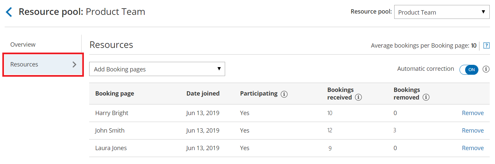

import { Aside } from '@astrojs/starlight/components';

[Resource pools](/introduction-to-resource-pools/ "Introduction to ScheduleOnce Resource pools") allow you to dynamically distribute bookings among a group of Team members in the same department, location, or with any other shared characteristic.

The **Resources** section of the Resource pool is where you determine which Team member's [Booking pages](/introduction-to-booking-pages/ "Introduction to Booking pages") are included in the pool. These are the Team members that will receive bookings. How bookings are assigned across these Team members is determined by the Resource pool's distribution method.

Figure 1: Resource pool Resources section

In this article, you'll learn about using the Resources section. 

```
&lt;script id="snippet-prepend">
$(function()&#123;
  
  /*disable in widget*/
  if($('.w-documentation-article').length === 0)&#123;

     var ToC =
  "&lt;nav role='navigation' class='table-of-contents toc-top'><h4>In this article:" + "<ul>";
     var el,     title, link, header;
      //Define the heading levels you want to use in ascending order. Can add extra or remove unneeded.
     $(".hg-article-body h1, .hg-article-body h2, .hg-article-body h3, .hg-article-body h4").each(function() &#123;
              el = $(this);
              title = el.text();
                 if(title != '')&#123;
                anchorTitle = el.text().replace(/([~!@#$%^&*()_+=`&#123;&#125;\[\]\|\\:;'&lt;>,.\/\? ])+/g, '-').toLowerCase();
                link = "#" + anchorTitle;
                //Set all headers to a 0-nesting level.
                header = 'header-nesting-0';
                //Adjust header-nesting layers so that they point to the correct html tag. header-nesting-1 should match the second .hg-article-body h# listed above; header-nesting-2 should match the third, etc.
                if($(this).is('h2'))&#123;
                    header = 'header-nesting-1';
                &#125;else if($(this).is('h3'))&#123;
                    header = 'header-nesting-2'
                &#125;
                el.html('<a id="'+anchorTitle+'" class="toc-anchor">' + el.html());
                newLine =
      "<li class='"+header+"'>" +
        "<a class='article-anchor' href='" + link + "'>" +
          title +
        "" +
      "";


                ToC += newLine;
              &#125;
              &#125;);
     ToC +=
   "" +
  "";
    $("#snippet-prepend").before(ToC);
  &#125;
&#125;);

&lt;/script>
```

```
&lt;style>
/* CSS to style the TOC as it displays and the auto-created anchors
.toc-top styles the box for the TOC; adjust styles here to tweak look and feel */
  
.toc-top &#123;
  background-color: #FAFAFA; /* set to #fff or delete entirely for no background */
  border: 1px solid #C8C8C8; /* adjust the color hex here to change border color */
  box-shadow: 0 1px 1px rgba(0, 0, 0, 0.05) inset;
  margin-top: 24px;
  margin-bottom: 36px;
  min-height: 20px;
  padding: 13px 20px;
  max-width: 75%;
&#125;
.toc-top h4 &#123;
  font-size: 18px;
  line-height: 26px;
  margin: 0 0 8px;
  font-weight: 400;
&#125;
.toc-top ul &#123;
  padding: 0 0 0 15px !important;
  margin-bottom: 0;	
&#125;
.toc-top > ul &#123;
  margin-bottom: 13px!important;
&#125;
.toc-anchor &#123;
  display: block;
  height: 90px; 
  margin-top: -90px; 
  visibility: hidden;
&#125;

/* Set the indentation for the nesting levels. May need to be edited to match changes above. Increase or decrease the margin-left to get your desired level of indentation. */
.header-nesting-1 &#123;
    margin-left: 14px;
&#125;
.header-nesting-1:before &#123;
	background-image: url(https://dyzz9obi78pm5.cloudfront.net/app/image/id/5d31bcc88e121c9b25ba22c4/n/bulletv2.svg)!important;
&#125;
.header-nesting-2 &#123;
    margin-left: 28px;
&#125;
.header-nesting-2:before &#123;
	background-image: url(https://dyzz9obi78pm5.cloudfront.net/app/image/id/5d31be536e121cf22b0cc6ae/n/bulletv3.svg)!important;
&#125;
&lt;/style>
```

# Requirements 

To define the **Resources** section in a Resource pool, you must be a [OnceHub Administrator](/user-type-member-vs-admin-team-manager/ "Differences between Administrator and Member").

# Defining Resources in a Resource pool

1.  Go to **Booking pages** in the bar on the left.
2.  Select **Resource pools** on the left (Figure 1).  
    
    
    Figure 1: Resource pools
    
3.  Select the Resource pool that you'd like to add [Booking pages](/introduction-to-booking-pages/ "Introduction to Booking pages") to.
4.  Go to the **Resources** section.
5.  Using the **Add Booking pages** drop-down menu, select the Booking pages you would like to be part of this Resource pool. You can add as many Booking pages as you like. All types of Booking pages can be added to the pool, regardless of [any existing associations between Booking pages and Event types](/adding-event-types-to-booking-pages/ "Adding Event types to Booking pages"). 
6.  To start distributing bookings to your pool members, you need to [add the Resource pool](/adding-resource-pools-to-master-pages/ "Adding Resource pools to Master pages") to a [Master page](/introduction-to-master-pages/ "Introduction to Master pages") using [team or panel pages](/team-or-panel-page/ "Master page scenario: Team or panel pages").

# Using Assignment priority

If you're using [Pooled availability with priority](/resource-pool-distribution-method---pooled-availability-with-priority/ "Resource pool distribution method: Pooled availability with priority") as your distribution method, you can set a priority for each Booking page after you've added them. Bookings will be assigned to the Booking page with the highest priority available at the selected time. [Learn more about Pooled availability with priority](/resource-pool-distribution-method---pooled-availability-with-priority/ "Resource pool distribution method: Pooled availability with priority")

Figure 2: Set the Assignment priority for each Booking page

# Using Automatic correction

If you're using [Round robin](/resource-pool-distribution-method---round-robin/ "Resource pool distribution method: Round robin") as your distribution method, you can decide whether you would like [removed bookings](/scheduleonce-resource-pool-statistics-bookings-removed/ "ScheduleOnce Resource pool statistics: Bookings removed") to be compensated for. By default, [Automatic correction](/resource-pools-autocorrecting-distribution-algorithm/ "Resource pools: Autocorrecting distribution algorithm") is toggled **ON** to make sure that any Team member who falls behind due to cancellations is automatically moved to the front of the line until they have caught up. If for any reason you want to turn this off, you can at any time. [Learn more about Automatic correction](/resource-pools-autocorrecting-distribution-algorithm/ "Resource pools: Automatic correction")

Figure 3: Automatic correction