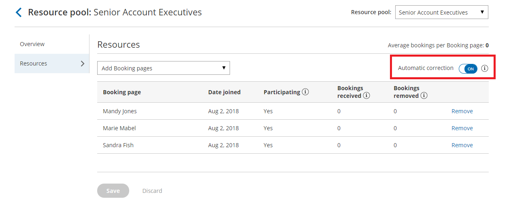

import { Aside } from '@astrojs/starlight/components';

[Resource pools](/introduction-to-resource-pools/ "Introduction to ScheduleOnce Resource pools") allow you to dynamically distribute bookings among a group of Team members in the same department, location, or with any other shared characteristic. Each Resource pool has its own method for distributing bookings, such as Round robin, [Pooled availability](/resource-pool-distribution-method---pooled-availability/ "Resource pool distribution method: Pooled availability"), or [Pooled availability with priority](/resource-pool-distribution-method---pooled-availability-with-priority/ "Resource pool distribution method: Pooled availability with priority"). 

In this article, you'll learn about the Round robin distribution method and how to set up a Resource pool with Round robin distribution. 

```
&lt;script id="snippet-prepend">
$(function()&#123;
  
  /*disable in widget*/
  if($('.w-documentation-article').length === 0)&#123;

     var ToC =
  "&lt;nav role='navigation' class='table-of-contents toc-top'><h4>In this article:" + "<ul>";
     var el,     title, link, header;
      //Define the heading levels you want to use in ascending order. Can add extra or remove unneeded.
     $(".hg-article-body h1, .hg-article-body h2, .hg-article-body h3, .hg-article-body h4").each(function() &#123;
              el = $(this);
              title = el.text();
                 if(title != '')&#123;
                anchorTitle = el.text().replace(/([~!@#$%^&*()_+=`&#123;&#125;\[\]\|\\:;'&lt;>,.\/\? ])+/g, '-').toLowerCase();
                link = "#" + anchorTitle;
                //Set all headers to a 0-nesting level.
                header = 'header-nesting-0';
                //Adjust header-nesting layers so that they point to the correct html tag. header-nesting-1 should match the second .hg-article-body h# listed above; header-nesting-2 should match the third, etc.
                if($(this).is('h2'))&#123;
                    header = 'header-nesting-1';
                &#125;else if($(this).is('h3'))&#123;
                    header = 'header-nesting-2'
                &#125;
                el.html('<a id="'+anchorTitle+'" class="toc-anchor">' + el.html());
                newLine =
      "<li class='"+header+"'>" +
        "<a class='article-anchor' href='" + link + "'>" +
          title +
        "" +
      "";


                ToC += newLine;
              &#125;
              &#125;);
     ToC +=
   "" +
  "";
    $("#snippet-prepend").before(ToC);
  &#125;
&#125;);

&lt;/script>
```

```
&lt;style>
/* CSS to style the TOC as it displays and the auto-created anchors
.toc-top styles the box for the TOC; adjust styles here to tweak look and feel */
  
.toc-top &#123;
  background-color: #FAFAFA; /* set to #fff or delete entirely for no background */
  border: 1px solid #C8C8C8; /* adjust the color hex here to change border color */
  box-shadow: 0 1px 1px rgba(0, 0, 0, 0.05) inset;
  margin-top: 24px;
  margin-bottom: 36px;
  min-height: 20px;
  padding: 13px 20px;
  max-width: 75%;
&#125;
.toc-top h4 &#123;
  font-size: 18px;
  line-height: 26px;
  margin: 0 0 8px;
  font-weight: 400;
&#125;
.toc-top ul &#123;
  padding: 0 0 0 15px !important;
  margin-bottom: 0;	
&#125;
.toc-top > ul &#123;
  margin-bottom: 13px!important;
&#125;
.toc-anchor &#123;
  display: block;
  height: 90px; 
  margin-top: -90px; 
  visibility: hidden;
&#125;

/* Set the indentation for the nesting levels. May need to be edited to match changes above. Increase or decrease the margin-left to get your desired level of indentation. */
.header-nesting-1 &#123;
    margin-left: 14px;
&#125;
.header-nesting-1:before &#123;
	background-image: url(https://dyzz9obi78pm5.cloudfront.net/app/image/id/5d31bcc88e121c9b25ba22c4/n/bulletv2.svg)!important;
&#125;
.header-nesting-2 &#123;
    margin-left: 28px;
&#125;
.header-nesting-2:before &#123;
	background-image: url(https://dyzz9obi78pm5.cloudfront.net/app/image/id/5d31be536e121cf22b0cc6ae/n/bulletv3.svg)!important;
&#125;
&lt;/style>
```

# When should I use Round robin?

Round robin is an organization-focused distribution method. You should use Round robin if your top priority is achieving an equal booking distribution among your Team members. For example, you might choose to use Round robin to distribute demos or initial consultations to Account Executives. Each Account Executive will have an equal opportunity to achieve their sales goals.

When you use Round robin assignment, you can ensure that cancellations, reassignments, and no-shows do not affect booking distribution equality. By enabling [Automatic correction](/resource-pools-autocorrecting-distribution-algorithm/ "Resource pools: Autocorrecting distribution algorithm"), any Team member who falls behind will be automatically moved to the front of the line until they have caught up.

# How are bookings assigned with Round robin?

To distribute bookings among Team members in your pool using Round robin, you must [add the Resource pool](/adding-resource-pools-to-master-pages/ "Adding Resource pools to Master pages") to a [Master page](/introduction-to-master-pages/ "Introduction to Master pages"). When a Customer visits your Master page, they will only see the availability of the next Team member in line to receive a booking.

# How do I create a Resource pool that uses Round robin?

1.  Go to **Booking pages** in the bar on the left.
2.  Select **Resource pools** on the left (Figure 1).  
    Figure 1: Resource pools in the Tools section
3.  Click the **Add a Resource pool** button to [create a new Resource pool](/creating-a-resource-pool/ "Creating a Resource pool in ScheduleOnce").
4.  The **New Resource pool** pop-up appears (Figure 2).  
    Figure 2: New Resource pool pop-up
5.  Name your Resource pool.
6.  In the **Distribution method** section, select **Round robin**.
7.  Select a [Reporting cycle](/resource-pool-reporting-cycle/ "ScheduleOnce Resource pool: Reporting cycle").
8.  Click **Save & Edit**. You'll be redirected to the Resource pool [Overview section](/scheduleonce-resource-pools-overview-section/ "ScheduleOnce Resource Pools: Overview Section").
9.  Navigate to the [Resources section](/scheduleonce-resource-pools-resources-section/ "ScheduleOnce Resource Pools: Resources Section") and select which Booking pages to include using the drop-down.
10.  By default, the [Automatic correction](/resource-pools-autocorrecting-distribution-algorithm/ "Resource pools: Automatic correction") toggle will be turned on to ensure that the booking distribution remains equal at all times (Figure 3). If for any reason you don't want removed bookings to be compensated for, you can set this toggle to **OFF**.  
     Figure 3: Automatic correction 
11.  Make sure to [add your Resource pool to a Master page](/adding-resource-pools-to-master-pages/ "Adding Resource pools to Master pages"). Bookings will not be distributed to pool members until the Resource pool is included in a Master page.