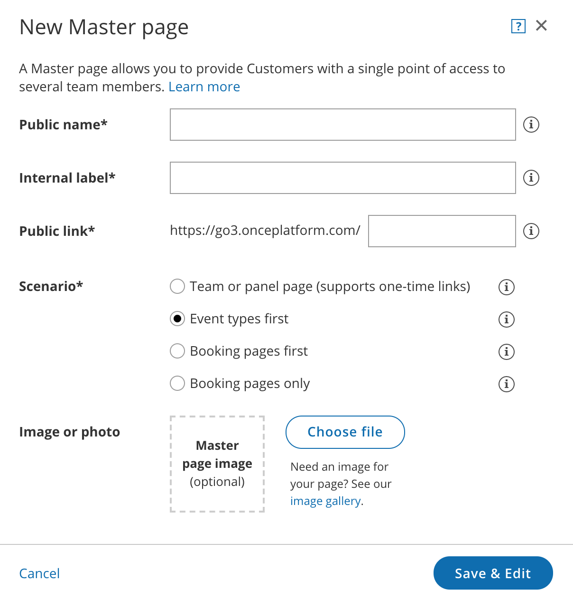

import { Aside } from '@astrojs/starlight/components';

In this article, you'll learn about the setup for booking resources such as a room directly, where the resource is the entity that is being booked.

If you need to accept appointments and also reserve a resource, please see the [Booking conditional on the availability of a single resource](/booking-conditional-on-the-availability-of-a-single-resource/ "Booking conditional on the availability of a single resource") article and the [Booking conditional on the availability of multiple resources](/booking-conditional-on-the-availability-of-one-of-several-resources/ "Booking conditional on the availability of one of several resources") article.

# Setting up scheduling for rooms and resources without Rule-based assignment

**Important**Resource scheduling can be done in your connected calendar with regular Outlook Calendar or Google Calendar, or with organizational resource calendars. 

1.  If you're not using organizational resource calendars, create a calendar for each resource. All resource calendars can be created in your calendar as sub calendars.
2.  ```
    &lt;style type="text/css">
    p.p1 &#123;margin: 0.0px 0.0px 0.0px 0.0px; font: 13.0px 'Helvetica Neue'&#125;
    &lt;/style>
    ```
    
    Hover over the lefthand menu, select the Booking pages icon, and [create a Booking page](/creating-a-booking-page/ "Creating a Booking page") for each resource.
3.  In the [Associated calendars section](/booking-page-associated-calendars-section/ "Booking page: Associated calendars section") of each Booking page, select the resource's calendar as the calendar that bookings are created in, and also as the calendar that busy time is retrieved from.
4.  In the Booking page [Public content](/booking-page-public-content-section/ "Booking page: Public content section") section, you can add [tags](/using-booking-page-tags-in-master-pages/ "Using Booking page tags in Master Pages") for each resource. This will allow Customers to filter the resource list by tag properties, enabling the Customer to quickly find the appropriate resource and make a booking.
5.  At this point, you need to decide between two approaches: you can either use [Booking pages only](/booking-pages-only-without-event-types/ "Booking pages only (without Event types)"), or you can use Booking pages and Event types.  
    Event types can be used to specify the booking duration, and enable use of [Payment integration](/payment-integration-throughout-the-booking-lifecycle/ "Payment integration throughout the booking lifecycle"), which you can use to collect payment every time the resource is booked. A different price can be set for each Event type specifying the different booking durations. [Learn more about using multiple Event types](/multiple-meeting-types--using-booking-pages/ "Multiple meeting types – Using Booking pages")
6.  If you choose to use Booking pages only, all settings are on the Booking page. 
7.  If you choose to use Event types for duration, the [Scheduling options](/introduction-to-the-scheduling-options-section/ "Introduction to the Scheduling options section"), [Time slot settings](/introduction-to-time-slot-settings/ "Introduction to Time slot settings"), [Customer notifications](/introduction-to-customer-notifications/ "The Customer notifications section"), [Booking form and redirect](/introduction-to-the-booking-form-redirect-section/ "Introduction to the Booking form and redirect section") and [Payment and cancel/reschedule policy](/event-type-payment-and-cancelreschedule-policy-section/ "Event type: Payment and cancel/reschedule policy section") sections will be on each Event type. [Learn more about Event types](/introduction-to-event-types/ "Introduction to Event types")
8.  If you want to work in [Automatic booking mode](/automatic-booking-or-booking-with-approval/ "Automatic booking or Booking with approval"), people will select a single time and the reservation will be made. You can also work in [Booking with approval mode](/automatic-booking-or-booking-with-approval/ "Automatic booking or Booking with approval") and then you will have to approve each reservation before it is created.
9.  Once you're done with the settings, [create a Master page](/master-page-setup-creating-a-master-page/ "Creating a Master page"). 
10.  If you **do not** want to use team or panel pages to automatically assign to bookings and want Customers to select the resource they need, select [one of the other three options](/master-page-scenarios/ "Master page scenarios") in the **New Master page** pop-up (Figure 1).  
     These are [Event types first](/event-types-first-booking-pages-second/ "Event types first (Booking pages second)"), [Booking pages first](/booking-pages-first-event-types-second/ "Booking pages first (Event types second)"), or [Booking pages only](/booking-pages-only-without-event-types/ "Booking pages only (without Event types)"). Figure 1: New Master page popup
11.  Go to the [Event types and assignment section](/master-page-event-types-and-assignment-section/ "Master Page: Event types and assignment section") and select which Booking pages you want to include from the drop-down.
12.  In the [Labels and instructions section](/master-page-labels-and-instructions-section/ "Master Page: Labels and Instructions section"), define the Public labels. 
13.  In the [Public content section](/master-page-public-content-section/ "Master Page: Public Content section"), provide details which your Customers see when they book with you.

You're all set! To test your Master page, go to the [Master page Overview](/master-page-overview-section/ "Master page: Overview section") and make a test booking by using the public link in the **Share & Publish** section.