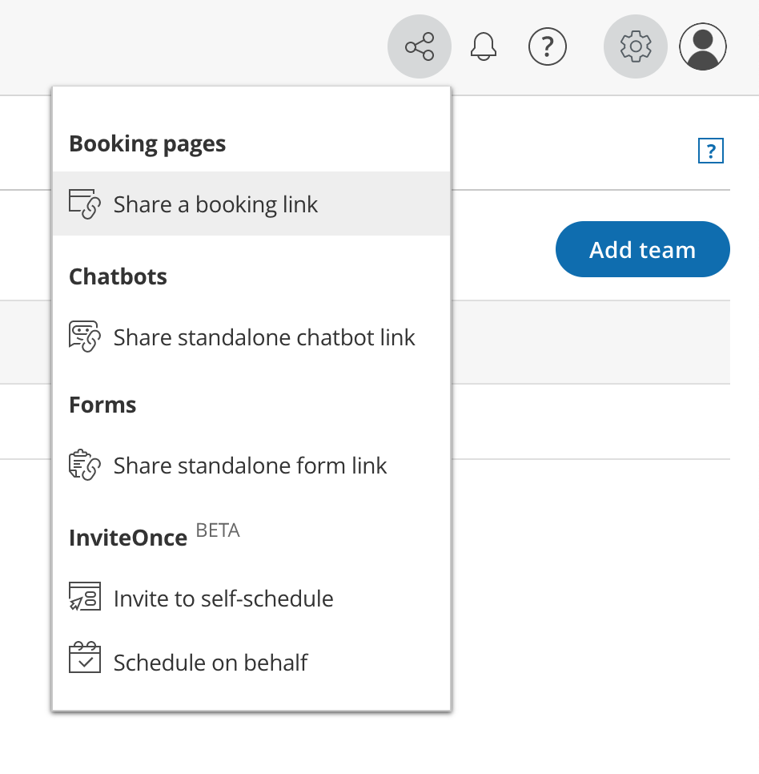
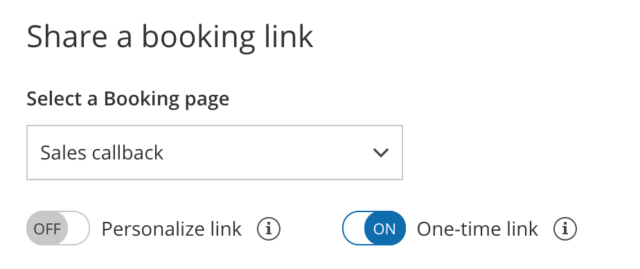
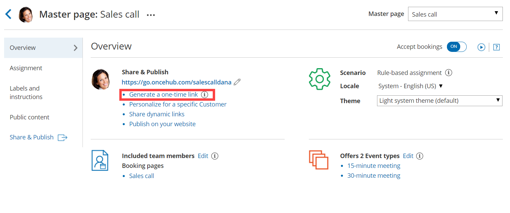
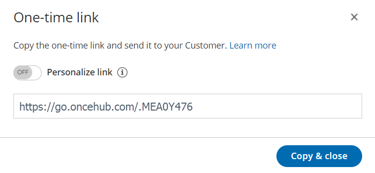
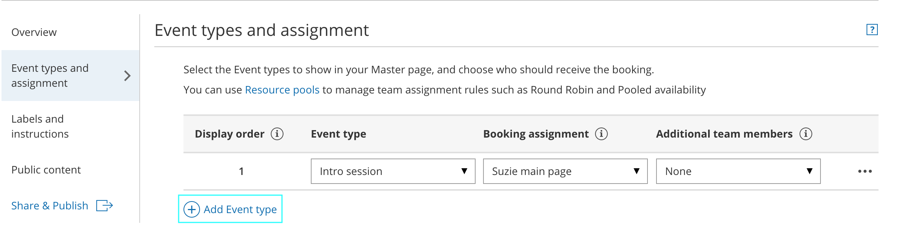

import { Aside } from '@astrojs/starlight/components';

**Note**One-time links are only available for [Master pages](/introduction-to-master-pages/ "Introduction to Master pages") using [team or panel pages](/team-or-panel-page/ "Master page scenario: Team or panel pages").

Master pages allow you to combine multiple [Booking pages](/introduction-to-booking-pages/ "Introduction to Booking pages") and [Event types](/introduction-to-event-types/ "Introduction to Event types") into one point of access for your Customers, providing support for a wide range of scheduling scenarios.

With OnceHub, you can [generate one-time links](/one-time-links/ "Using one-time links with your Master page"), which are good for one booking only, eliminating any chance of unwanted repeat bookings. A Customer who receives the link will only be able to use it for the intended booking and will not have access to your underlying [Booking page](/introduction-to-booking-pages/ "Introduction to Booking pages"). One-time links [can be personalized](/using-personalized-links/ "Using Personalized links"), allowing the Customer to pick a time and schedule without having to fill out the [Booking form](/booking-form/ "Collecting Customer data with Booking forms").

For example, you may have a Customer who wants to schedule a Support meeting to resolve a specific issue. However, you want to restrict access to your Support team because their time is limited. You can send this Customer a one-time link to schedule a booking for this specific issue. 

After the Customer schedules the booking, they won't be able to use that one-time link to schedule bookings for any other issues.

# Requirements

To create a Master page with a team or panel page scenario, you must be a [OnceHub Administrator](/user-type-member-vs-admin-team-manager/ "Differences between Administrator and Member"). 

# Generating a one-time link

To generate a one-time link:

1\. In the top navigation menu, click the quick share icon (Figure 1).

Figure 1: Quick share icon

2\. Toggle the **One-time link** option to ON (Figure 2). 

Figure 2: One-time link toggle ON/OFF

You can also generate a one-time link in the **Overview** section of the relevant Master page:

1.  Go to **Setup** in the top navigation bar.
2.  Select the relevant Master page that you would like to generate a one-time link for.
3.  In the [Master page Overview](/master-page-overview-section/ "Master page: Overview section") section, click **Generate a one-time link** in the **Share & Publish** section (Figure 3).  Figure 3: Generating a one-time link in the Master page Share & Publish section
4.  The **One-time link** pop-up will open (Figure 4).  
    Figure 4: One-time link pop-up
5.  Toggle **Personalize link** to ON if you would like to personalize the one-time link for a Customer (Figure 3). Enter a **Customer name** and **Customer email**.  
    
    **Note**When you personalize a one-time link, the [Booking form](/booking-form/ "Collecting Customer data with Booking forms") step will be skipped. Skipping the Booking form step allows for a quicker booking process for your Customers.  
      
    You can choose to show the Booking form by changing the **Skip** URL parameter to "&skip=0". [Learn more about using URL parameters](/scheduleonce-url-parameters-and-processing-rules/ "URL parameters and processing rules")
    
6.  Click **Copy & close** to copy the one-time link to your clipboard and close the pop-up. You can then paste the one-time link into an email or instant message and send it to your Customer. 

# Generating a one-time link for an individual Booking page

You can use the following workaround if you need to generate a one-time link for an individual Booking page.

1.  [Create a new Master page](/master-page-setup-creating-a-master-page/ "Creating a Master page") with the team or panel page scenario. 
2.  Go to the [**Event types and assignment** section](/master-page-event-types-and-assignment-section/ "Master page: Assignment section") of the Master page.
3.  Click **Add Event type** (Figure 5).  
    Figure 5: Add Event type
4.  Select which Event types will be offered on your Master page. Master pages with team or panel pages can only include Event types configured to [Automatic booking](/automatic-booking-or-booking-with-approval/ "Automatic booking or Booking with approval") and Single sessions. [Learn more about conflicting settings when using team or panel pages](/master-page-setup-conflicting-settings-when-using-team-or-panel-pages/ "Conflicting settings when using team or panel pages")
5.  Next, use the [Booking assignment](/booking-owners/ "Booking assignment") drop-down to select the specific Booking page that you would like to create a one-time link for. Select this Booking page for each Event-based rule you have created. 
6.  Click **Save**.
7.  Access the quick share icon or go back to the Master page **Overview** section and generate a one-time link.