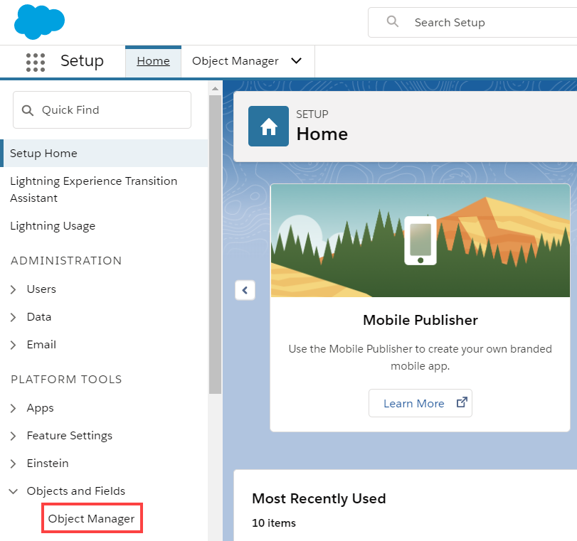

import { Aside } from '@astrojs/starlight/components';

The Salesforce setup process includes 5 phases:  [API connection](/connecting-a-salesforce-api-user/ "How to connect a Salesforce API User"), [Installation](/how-to-install-the-scheduleonce-connector-for-salesforce/ "How to install the ScheduleOnce connector for Salesforce"), [Field validation](/handling-required-salesforce-fields-in-the-field-validation-step/ "Handling required Salesforce fields in the Field validation step"), [Field mapping](/mapping-scheduleonce-fields-to-non-mandatory-salesforce-fields/ "Mapping ScheduleOnce fields to non-mandatory Salesforce fields"), and [Creation rules](/salesforce-record-creation-update-and-assignment-rules/ "Salesforce record creation, update, and assignment rules").

In this article, you'll learn how to add the **Event status** and the **Cancel/reschedule reason** fields to the Activity Event Page Layout in Salesforce. 

```
&lt;iframe width="640" height="360" src="https://www.youtube-nocookie.com/embed/zGbUqhiWsWY?wmode=opaque" allowfullscreen="" class="fr-draggable">&lt;/iframe>
```

  

```
&lt;script id="snippet-prepend">
$(function()&#123;
  
  /*disable in widget*/
  if($('.w-documentation-article').length === 0)&#123;

     var ToC =
  "&lt;nav role='navigation' class='table-of-contents toc-top'><h4>In this article:" + "<ul>";
     var el,     title, link, header;
      //Define the heading levels you want to use in ascending order. Can add extra or remove unneeded.
     $(".hg-article-body h1, .hg-article-body h2, .hg-article-body h3, .hg-article-body h4").each(function() &#123;
              el = $(this);
              title = el.text();
                 if(title != '')&#123;
                anchorTitle = el.text().replace(/([~!@#$%^&*()_+=`&#123;&#125;\[\]\|\\:;'&lt;>,.\/\? ])+/g, '-').toLowerCase();
                link = "#" + anchorTitle;
                //Set all headers to a 0-nesting level.
                header = 'header-nesting-0';
                //Adjust header-nesting layers so that they point to the correct html tag. header-nesting-1 should match the second .hg-article-body h# listed above; header-nesting-2 should match the third, etc.
                if($(this).is('h2'))&#123;
                    header = 'header-nesting-1';
                &#125;else if($(this).is('h3'))&#123;
                    header = 'header-nesting-2'
                &#125;
                el.html('<a id="'+anchorTitle+'" class="toc-anchor">' + el.html());
                newLine =
      "<li class='"+header+"'>" +
        "<a class='article-anchor' href='" + link + "'>" +
          title +
        "" +
      "";


                ToC += newLine;
              &#125;
              &#125;);
     ToC +=
   "" +
  "";
    $("#snippet-prepend").before(ToC);
  &#125;
&#125;);

&lt;/script>
```

```
&lt;style>
/* CSS to style the TOC as it displays and the auto-created anchors
.toc-top styles the box for the TOC; adjust styles here to tweak look and feel */
  
.toc-top &#123;
  background-color: #FAFAFA; /* set to #fff or delete entirely for no background */
  border: 1px solid #C8C8C8; /* adjust the color hex here to change border color */
  box-shadow: 0 1px 1px rgba(0, 0, 0, 0.05) inset;
  margin-top: 24px;
  margin-bottom: 36px;
  min-height: 20px;
  padding: 13px 20px;
  max-width: 75%;
&#125;
.toc-top h4 &#123;
  font-size: 18px;
  line-height: 26px;
  margin: 0 0 8px;
  font-weight: 400;
&#125;
.toc-top ul &#123;
  padding: 0 0 0 15px !important;
  margin-bottom: 0;	
&#125;
.toc-top > ul &#123;
  margin-bottom: 13px!important;
&#125;
.toc-anchor &#123;
  display: block;
  height: 90px; 
  margin-top: -90px; 
  visibility: hidden;
&#125;

/* Set the indentation for the nesting levels. May need to be edited to match changes above. Increase or decrease the margin-left to get your desired level of indentation. */
.header-nesting-1 &#123;
    margin-left: 14px;
&#125;
.header-nesting-1:before &#123;
	background-image: url(https://dyzz9obi78pm5.cloudfront.net/app/image/id/5d31bcc88e121c9b25ba22c4/n/bulletv2.svg)!important;
&#125;
.header-nesting-2 &#123;
    margin-left: 28px;
&#125;
.header-nesting-2:before &#123;
	background-image: url(https://dyzz9obi78pm5.cloudfront.net/app/image/id/5d31be536e121cf22b0cc6ae/n/bulletv3.svg)!important;
&#125;
&lt;/style>
```

# Salesforce Activity Events

When a booking is made, a Salesforce Activity Event is always created and related to a Salesforce Lead, Contact, or Case record. The creation of the Activity Event is only the first step in the booking lifecycle. After the Activity Event is created, it is continuously updated through all phases of the booking lifecycle: **Scheduled**, **Rescheduled**, **Completed**, **Canceled**, or **No-show**. [Learn more about activity statuses](/understanding-activity-statuses/ "Understanding ScheduleOnce activity statuses")

The **Event status** and the **Cancel/reschedule reason** fields are provided with the OnceHub connector for Salesforce and are mapped to OnceHub data. When these fields are added to the Event Page Layout, they are used for updating the Activity Event with any change in the booking lifecycle.

*   **Event status:** This field indicates the current phase of the booking in the booking lifecycle: **Scheduled**, **Rescheduled**, **Completed**, **Canceled**, or **No-show**.
*   **Cancel/reschedule reason:** This field adds additional information to the **Canceled** and **Rescheduled** lifecycle phases by providing the reason given by the Customer or Booking owner when a booking is canceled or rescheduled.

Salesforce provides a simple WYSIWYG editor (What You See Is What You Get) to customize the Event Page Layout. You can drag and drop new elements onto the page, or drag existing page elements around to change the layout to suit your preferences.

# Requirements

To add the **Event status** and the **Cancel/reschedule** **reason** fields to the Activity Event layout in Salesforce, you will need:

*   A Salesforce Administrator for your organization.
*   [An installed OnceHub connector for Salesforce](/how-to-install-the-scheduleonce-connector-for-salesforce/ "How to install the ScheduleOnce connector for Salesforce").

# Adding Custom fields to Activity Event Page Layout in Salesforce

1.  Sign in to Salesforce as [your API user](/connecting-a-salesforce-api-user/ "How to connect a Salesforce API User").
2.  Go to the **Setup** page.
3.  In the **Platform Tools** section, go to **Objects and Fields -> Object Manager** (Figure 1).  
    Figure 1: Object Manager in the Objects and Fields menu
4.  In the **Object Manager** list, select **Event** (Figure 2).  
    Figure 2: Event in the Object Manager list
5.  On the **Event** page, select **Page Layouts -> Event Layout** (Figure 3).  
    Figure 3: Event layout
6.  Drag the **Section** element from the Editor menu and drop it below the **Calendar Details** section (Figure 4) to create a new section for the OnceHub fields that you want to add.  
    Figure 4: Add a new section
7.  In the **Section Properties** pop-up, enter a **Section Name** and click **OK** (Figure 5).  
    Figure 5: Section Properties pop-up
8.  Click and drag the **Cancel/reschedule reason** element and drop it in the new section. Do the same with the **Event status** element (Figure 6).  
    Figure 6: Add elements to new section
9.  Click **Save**.
10.  Go back to the Salesforce setup page in OnceHub.
11.  After you refresh the page, the **Installation** tab will now be updated to show that you have completed **Step 3: Add Custom fields to the Event page layout** (Figure 7).  
     Figure 7: Event page layout customized
     
     **Important**The API User must be connected to OnceHub for the page to update correctly. [Learn more about connecting the Salesforce API User](/connecting-a-salesforce-api-user/ "How to connect a Salesforce API User")
     

That's it! You've completed **Step 3** of the Installation phase. You can now click **Continue** to start [mapping OnceHub fields to universally required Salesforce fields](/handling-required-salesforce-fields-in-the-field-validation-step/ "Handling required Salesforce fields in the Field validation step").