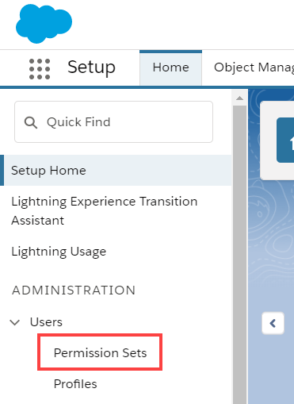
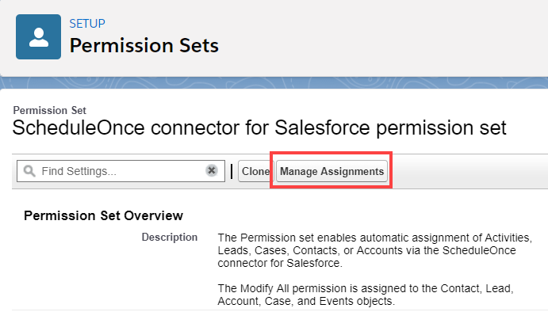
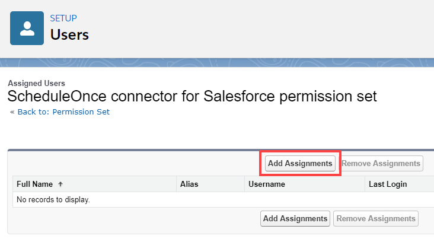

import { Aside } from '@astrojs/starlight/components';

The Salesforce setup process includes 5 phases: [API connection](/connecting-a-salesforce-api-user/ "How to connect a Salesforce API User"), [Installation](/how-to-install-the-scheduleonce-connector-for-salesforce/ "How to install the ScheduleOnce connector for Salesforce"), [Field validation](/handling-required-salesforce-fields-in-the-field-validation-step/ "Handling required Salesforce fields in the Field validation step"), [Field mapping](/mapping-scheduleonce-fields-to-non-mandatory-salesforce-fields/ "Mapping ScheduleOnce fields to non-mandatory Salesforce fields"), and [Creation rules](/salesforce-record-creation-update-and-assignment-rules/ "Salesforce record creation, update, and assignment rules"). 

In this article, you'll learn how to assign the OnceHub Permission Set to the [API User](/connecting-a-salesforce-api-user/ "How to connect a Salesforce API User") in Salesforce.

```
&lt;script id="snippet-prepend">
$(function()&#123;
  
  /*disable in widget*/
  if($('.w-documentation-article').length === 0)&#123;

     var ToC =
  "&lt;nav role='navigation' class='table-of-contents toc-top'><h4>In this article:" + "<ul>";
     var el,     title, link, header;
      //Define the heading levels you want to use in ascending order. Can add extra or remove unneeded.
     $(".hg-article-body h1, .hg-article-body h2, .hg-article-body h3, .hg-article-body h4").each(function() &#123;
              el = $(this);
              title = el.text();
                 if(title != '')&#123;
                anchorTitle = el.text().replace(/([~!@#$%^&*()_+=`&#123;&#125;\[\]\|\\:;'&lt;>,.\/\? ])+/g, '-').toLowerCase();
                link = "#" + anchorTitle;
                //Set all headers to a 0-nesting level.
                header = 'header-nesting-0';
                //Adjust header-nesting layers so that they point to the correct html tag. header-nesting-1 should match the second .hg-article-body h# listed above; header-nesting-2 should match the third, etc.
                if($(this).is('h2'))&#123;
                    header = 'header-nesting-1';
                &#125;else if($(this).is('h3'))&#123;
                    header = 'header-nesting-2'
                &#125;
                el.html('<a id="'+anchorTitle+'" class="toc-anchor">' + el.html());
                newLine =
      "<li class='"+header+"'>" +
        "<a class='article-anchor' href='" + link + "'>" +
          title +
        "" +
      "";


                ToC += newLine;
              &#125;
              &#125;);
     ToC +=
   "" +
  "";
    $("#snippet-prepend").before(ToC);
  &#125;
&#125;);

&lt;/script>
```

```
&lt;style>
/* CSS to style the TOC as it displays and the auto-created anchors
.toc-top styles the box for the TOC; adjust styles here to tweak look and feel */
  
.toc-top &#123;
  background-color: #FAFAFA; /* set to #fff or delete entirely for no background */
  border: 1px solid #C8C8C8; /* adjust the color hex here to change border color */
  box-shadow: 0 1px 1px rgba(0, 0, 0, 0.05) inset;
  margin-top: 24px;
  margin-bottom: 36px;
  min-height: 20px;
  padding: 13px 20px;
  max-width: 75%;
&#125;
.toc-top h4 &#123;
  font-size: 18px;
  line-height: 26px;
  margin: 0 0 8px;
  font-weight: 400;
&#125;
.toc-top ul &#123;
  padding: 0 0 0 15px !important;
  margin-bottom: 0;	
&#125;
.toc-top > ul &#123;
  margin-bottom: 13px!important;
&#125;
.toc-anchor &#123;
  display: block;
  height: 90px; 
  margin-top: -90px; 
  visibility: hidden;
&#125;

/* Set the indentation for the nesting levels. May need to be edited to match changes above. Increase or decrease the margin-left to get your desired level of indentation. */
.header-nesting-1 &#123;
    margin-left: 14px;
&#125;
.header-nesting-1:before &#123;
	background-image: url(https://dyzz9obi78pm5.cloudfront.net/app/image/id/5d31bcc88e121c9b25ba22c4/n/bulletv2.svg)!important;
&#125;
.header-nesting-2 &#123;
    margin-left: 28px;
&#125;
.header-nesting-2:before &#123;
	background-image: url(https://dyzz9obi78pm5.cloudfront.net/app/image/id/5d31be536e121cf22b0cc6ae/n/bulletv3.svg)!important;
&#125;
&lt;/style>
```

# Permission sets

Permission Sets in Salesforce define what functions and features your Users have access to in Salesforce. To use the OnceHub connector for Salesforce, you must assign the appropriate Permission Set to your API User.

The OnceHub Permission Set assigns permissions to work with Lead, Contact, Case, Account, and Activity records. This will allow the OnceHub connector to create and update records through the API User.

# Requirements

To assign the OnceHub permission set, you will need:

*   A Salesforce Administrator for your organization.
*   [An installed OnceHub connector for Salesforce](/how-to-install-the-scheduleonce-connector-for-salesforce/ "How to install the ScheduleOnce connector for Salesforce").

# Assigning the OnceHub permission Set

1.  Sign in to Salesforce as your API User.
2.  Go to the **Setup** page.
3.  In the **Administration** section, go to **Users -> Permission Sets** (Figure 1).  
    Figure 1: Permission Sets in the Users menu
4.  In the **Permission Sets** pane, click **OnceHub** **connector for Salesforce permission set** (Figure 2).  
    Figure 2: OnceHub connector for Salesforce permission set
    
5.  On the **OnceHub** **connector for Salesforce** permission set page, click the **Manage Assignments** button (Figure 3).  
    Figure 3: Manage Assignments
    
6.  On the **Assigned Users** page, click the **Add Assignments** button (Figure 4).  
    Figure 4: Add Assignments
    
7.  In the **All Users** list, check the box next to your API User and click **Assign** (Figure 5). Figure 5: Assign API user
8.  Click **Done**.
9.  Go back to the Salesforce setup page in OnceHub.
10.  After you refresh the page, the **Installation** tab will now be updated to show that you have completed **Step 2: Assign OnceHub Permission set**.  
     
     **Important**The API User must be connected to OnceHub for the page to update correctly. [Learn more about connecting the Salesforce API User](/connecting-a-salesforce-api-user/ "How to connect a Salesforce API User")
     

That's it! You've completed **Step 2** of the **Installation** process. You can now proceed to **Step 3**, which is described in the [Adding Custom fields to the Salesforce Activity Event layout](/adding-custom-fields-to-the-salesforce-activity-event-layout/ "Adding Custom fields to the Salesforce Activity Event layout") article.