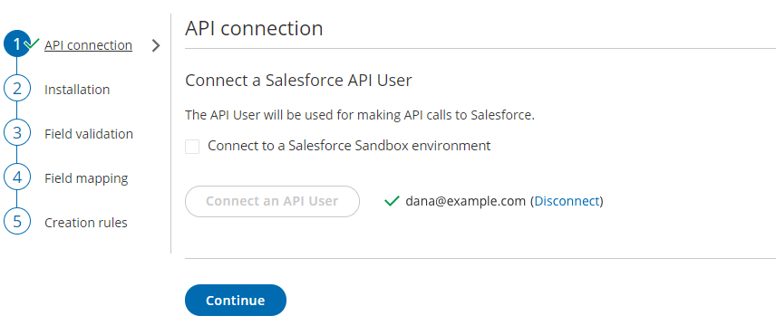

import { Aside } from '@astrojs/starlight/components';

The Salesforce setup process includes 5 phases: API connection, [Installation](/how-to-install-the-scheduleonce-connector-for-salesforce/ "How to install the ScheduleOnce connector for Salesforce"), [Field validation](/handling-required-salesforce-fields-in-the-field-validation-step/ "Handling required Salesforce fields in the Field validation step"), [Field mapping](/mapping-scheduleonce-fields-to-non-mandatory-salesforce-fields/ "Mapping ScheduleOnce fields to non-mandatory Salesforce fields"), and [Creation rules](/salesforce-record-creation-update-and-assignment-rules/ "Salesforce record creation, update, and assignment rules"). 

Since the OnceHub connector can create new standard records when a booking is made, it is critical that the permission to create new records always exists. For this reason, all API calls between OnceHub and Salesforce are made via a special API User that is granted the appropriate Permission Set. This ensures that new records can always be created, and at the same time, the permissions of individual Salesforce users are not altered.

You can also connect the OnceHub connector for Salesforce to a [Salesforce Sandbox environment](https://help.salesforce.com/apex/HTViewHelpDoc?id=create_test_instance.htm) and keep your Salesforce connector setup when switching back to your production environment. [Learn more about connecting to a Salesforce Sandbox environment](/connecting-scheduleonce-to-a-salesforce-sandbox-environment/ "Connecting ScheduleOnce to a Salesforce Sandbox environment")

**Important** The API User does not need to be unique for OnceHub. If you already have an API User that is used to connect to a different third-party application, you can use that API User for the OnceHub connection.

In this article, you will learn how to connect OnceHub to an API User created in your Salesforce production account or in your Salesforce sandbox environment.

```
&lt;script id="snippet-prepend">
$(function()&#123;
  
  /*disable in widget*/
  if($('.w-documentation-article').length === 0)&#123;

     var ToC =
  "&lt;nav role='navigation' class='table-of-contents toc-top'><h4>In this article:" + "<ul>";
     var el,     title, link, header;
      //Define the heading levels you want to use in ascending order. Can add extra or remove unneeded.
     $(".hg-article-body h1, .hg-article-body h2, .hg-article-body h3, .hg-article-body h4").each(function() &#123;
              el = $(this);
              title = el.text();
                 if(title != '')&#123;
                anchorTitle = el.text().replace(/([~!@#$%^&*()_+=`&#123;&#125;\[\]\|\\:;'&lt;>,.\/\? ])+/g, '-').toLowerCase();
                link = "#" + anchorTitle;
                //Set all headers to a 0-nesting level.
                header = 'header-nesting-0';
                //Adjust header-nesting layers so that they point to the correct html tag. header-nesting-1 should match the second .hg-article-body h# listed above; header-nesting-2 should match the third, etc.
                if($(this).is('h2'))&#123;
                    header = 'header-nesting-1';
                &#125;else if($(this).is('h3'))&#123;
                    header = 'header-nesting-2'
                &#125;
                el.html('<a id="'+anchorTitle+'" class="toc-anchor">' + el.html());
                newLine =
      "<li class='"+header+"'>" +
        "<a class='article-anchor' href='" + link + "'>" +
          title +
        "" +
      "";


                ToC += newLine;
              &#125;
              &#125;);
     ToC +=
   "" +
  "";
    $("#snippet-prepend").before(ToC);
  &#125;
&#125;);

&lt;/script>
```

```
&lt;style>
/* CSS to style the TOC as it displays and the auto-created anchors
.toc-top styles the box for the TOC; adjust styles here to tweak look and feel */
  
.toc-top &#123;
  background-color: #FAFAFA; /* set to #fff or delete entirely for no background */
  border: 1px solid #C8C8C8; /* adjust the color hex here to change border color */
  box-shadow: 0 1px 1px rgba(0, 0, 0, 0.05) inset;
  margin-top: 24px;
  margin-bottom: 36px;
  min-height: 20px;
  padding: 13px 20px;
  max-width: 75%;
&#125;
.toc-top h4 &#123;
  font-size: 18px;
  line-height: 26px;
  margin: 0 0 8px;
  font-weight: 400;
&#125;
.toc-top ul &#123;
  padding: 0 0 0 15px !important;
  margin-bottom: 0;	
&#125;
.toc-top > ul &#123;
  margin-bottom: 13px!important;
&#125;
.toc-anchor &#123;
  display: block;
  height: 90px; 
  margin-top: -90px; 
  visibility: hidden;
&#125;

/* Set the indentation for the nesting levels. May need to be edited to match changes above. Increase or decrease the margin-left to get your desired level of indentation. */
.header-nesting-1 &#123;
    margin-left: 14px;
&#125;
.header-nesting-1:before &#123;
	background-image: url(https://dyzz9obi78pm5.cloudfront.net/app/image/id/5d31bcc88e121c9b25ba22c4/n/bulletv2.svg)!important;
&#125;
.header-nesting-2 &#123;
    margin-left: 28px;
&#125;
.header-nesting-2:before &#123;
	background-image: url(https://dyzz9obi78pm5.cloudfront.net/app/image/id/5d31be536e121cf22b0cc6ae/n/bulletv3.svg)!important;
&#125;
&lt;/style>
```

# Requirements

To connect the API User to OnceHub, you must be:

*   A [OnceHub Administrator](/user-type-member-vs-admin-team-manager/ "Differences between Administrator and Member").
*   A Salesforce Administrator for your organization.

You do not need an assigned product license to install and update Salesforce account settings. [Learn more](/common-use-cases-for-users-without-a-scheduleonce-license/)

# The Salesforce API User

To connect to OnceHub, the Salesforce API User must have the following characteristics in your Salesforce account:

*   The **User License** field must be **Salesforce**. The Salesforce User License is designed for Users who require full access to standard CRM and Force.com AppExchange apps. Users with this User License are entitled to access the OnceHub connector for Salesforce managed application.
*   The **Profile** field must be **System Administrator.** The System Administrator profile must include the **API Enabled profile** permission and the **ModifyAllData** permission to ensure the access to the OnceHub connector for Salesforce connected app.

# Connect to a Salesforce API User

**Important** You must sign out of Salesforce before proceeding so that the connection is using the API User created above. This ensures all communication between OnceHub and Salesforce is via the correct User.

1.  ```
    &lt;style type="text/css">
    p.p1 &#123;margin: 0.0px 0.0px 0.0px 0.0px; font: 13.0px 'Helvetica Neue'&#125;
    &lt;/style>
    ```
    
    Click the gear icon located in the top-right corner of the page.
2.  Select **Account Integrations** from the dropdown menu.
3.  Filter for **CRM**.
4.  Click on the **Salesforce (For Booking Pages)** tile.
5.  In the **Salesforce** box, click the **Setup** button (Figure 1).  
    Figure 1: Set up API Connection in OnceHub
6.  On the **API Connection** step, click **Connect an API User** to connect to an API User created in your Salesforce production environment (Figure 2). Figure 2: Connect an API User
7.  If you're testing the connector in your Salesforce sandbox environment, you should check the **Connect to a Salesforce Sandbox environment** checkbox and connect to an API User created in your Salesforce Sandbox environment (Figure 3). Figure 3. Connect to a Salesforce Sandbox environment
8.  On the Salesforce sign-in page, enter the Username and Password of your **API User**.
    
    **Important**If OnceHub automatically logged you to the wrong Salesforce User, you must disconnect and log out of Salesforce before trying to connect to the API User again.
    
9.  On the **Allow Access** page, click **Allow** (Figure 4). 
10.  You are redirected back to OnceHub and the API User is now connected (Figure 5).Figure 5: API User is connected
11.  Click **Continue** to begin the installation.