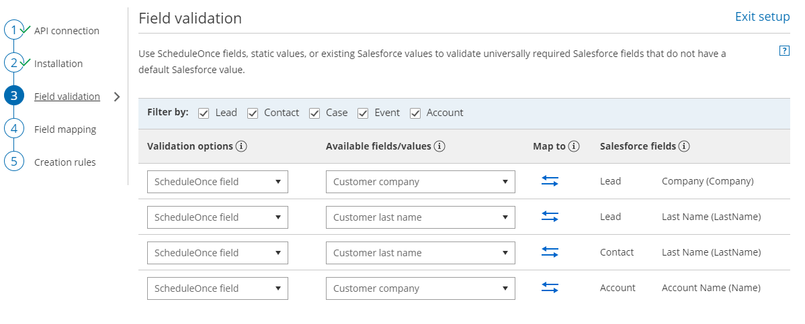

import { Aside } from '@astrojs/starlight/components';

The Field validation mapping step in the Salesforce connector setup process includes all [Salesforce universally required fields](https://help.salesforce.com/articleView?id=fields_about_universally_required_fields.htm&type=5) that do not have a default value for the five standard objects in your Salesforce account: Lead, Contact, Account, Event, and Case.

These fields require a value in order to allow the creation of a new record. The role of the Field validation mapping step is to ensure that the appropriate value is made available for bookings created via the OnceHub Salesforce integration. 

In this article, you'll learn about handing required Salesforce fields in the Field validation step.

```
&lt;script id="snippet-prepend">
$(function()&#123;
  
  /*disable in widget*/
  if($('.w-documentation-article').length === 0)&#123;

     var ToC =
  "&lt;nav role='navigation' class='table-of-contents toc-top'><h4>In this article:" + "<ul>";
     var el,     title, link, header;
      //Define the heading levels you want to use in ascending order. Can add extra or remove unneeded.
     $(".hg-article-body h1, .hg-article-body h2, .hg-article-body h3, .hg-article-body h4").each(function() &#123;
              el = $(this);
              title = el.text();
                 if(title != '')&#123;
                anchorTitle = el.text().replace(/([~!@#$%^&*()_+=`&#123;&#125;\[\]\|\\:;'&lt;>,.\/\? ])+/g, '-').toLowerCase();
                link = "#" + anchorTitle;
                //Set all headers to a 0-nesting level.
                header = 'header-nesting-0';
                //Adjust header-nesting layers so that they point to the correct html tag. header-nesting-1 should match the second .hg-article-body h# listed above; header-nesting-2 should match the third, etc.
                if($(this).is('h2'))&#123;
                    header = 'header-nesting-1';
                &#125;else if($(this).is('h3'))&#123;
                    header = 'header-nesting-2'
                &#125;
                el.html('<a id="'+anchorTitle+'" class="toc-anchor">' + el.html());
                newLine =
      "<li class='"+header+"'>" +
        "<a class='article-anchor' href='" + link + "'>" +
          title +
        "" +
      "";


                ToC += newLine;
              &#125;
              &#125;);
     ToC +=
   "" +
  "";
    $("#snippet-prepend").before(ToC);
  &#125;
&#125;);

&lt;/script>
```

```
&lt;style>
/* CSS to style the TOC as it displays and the auto-created anchors
.toc-top styles the box for the TOC; adjust styles here to tweak look and feel */
  
.toc-top &#123;
  background-color: #FAFAFA; /* set to #fff or delete entirely for no background */
  border: 1px solid #C8C8C8; /* adjust the color hex here to change border color */
  box-shadow: 0 1px 1px rgba(0, 0, 0, 0.05) inset;
  margin-top: 24px;
  margin-bottom: 36px;
  min-height: 20px;
  padding: 13px 20px;
  max-width: 75%;
&#125;
.toc-top h4 &#123;
  font-size: 18px;
  line-height: 26px;
  margin: 0 0 8px;
  font-weight: 400;
&#125;
.toc-top ul &#123;
  padding: 0 0 0 15px !important;
  margin-bottom: 0;	
&#125;
.toc-top > ul &#123;
  margin-bottom: 13px!important;
&#125;
.toc-anchor &#123;
  display: block;
  height: 90px; 
  margin-top: -90px; 
  visibility: hidden;
&#125;

/* Set the indentation for the nesting levels. May need to be edited to match changes above. Increase or decrease the margin-left to get your desired level of indentation. */
.header-nesting-1 &#123;
    margin-left: 14px;
&#125;
.header-nesting-1:before &#123;
	background-image: url(https://dyzz9obi78pm5.cloudfront.net/app/image/id/5d31bcc88e121c9b25ba22c4/n/bulletv2.svg)!important;
&#125;
.header-nesting-2 &#123;
    margin-left: 28px;
&#125;
.header-nesting-2:before &#123;
	background-image: url(https://dyzz9obi78pm5.cloudfront.net/app/image/id/5d31be536e121cf22b0cc6ae/n/bulletv3.svg)!important;
&#125;
&lt;/style>
```

# Default values for universally required fields

We recommend that you always set a default value for universally required fields in your Salesforce organization. Once done, these fields will be removed from the Field validation mapping step of the Salesforce connector setup wizard.

When a booking is made and a required field in Salesforce has not been mapped to a field in OnceHub, a Field validation error will be detected. OnceHub will pass a default value to the field in Salesforce. The default values that will be passed are shown in the table below:

<table><tbody><tr><td><p dir="ltr"><strong>Custom field type</strong></p></td><td><p dir="ltr"><strong>Default value</strong></p></td></tr><tr><td><p dir="ltr">Currency</p></td><td><p dir="ltr">$0.00</p></td></tr><tr><td><p dir="ltr">Date</p></td><td><p dir="ltr">Current date</p></td></tr><tr><td><p dir="ltr">Date/Time</p></td><td><p dir="ltr">Current time</p></td></tr><tr><td><p dir="ltr">Email</p></td><td><p dir="ltr">email@example.com</p></td></tr><tr><td><p dir="ltr">Geolocation</p></td><td><p dir="ltr">0.000000, 0.000000</p></td></tr><tr><td><p dir="ltr">Number</p></td><td><p dir="ltr">0</p></td></tr><tr><td><p dir="ltr">Percent</p></td><td><p dir="ltr">0%</p></td></tr><tr><td><p dir="ltr">Phone</p></td><td><p dir="ltr">1234567890</p></td></tr><tr><td><p dir="ltr">Text, Text area, Text area (Long), Text area (Rich)</p></td><td><p dir="ltr">Unspecified</p></td></tr><tr><td>URL</td><td>http://NA<br /></td></tr></tbody></table>

  

To fix this Field validation error, you should update the Field validation mapping of the Salesforce connector setup wizard. You only need to fix the fields that create validation errors on the affected Booking page.

**Important**It is recommended that you make test bookings when you handle Salesforce universally required fields in the Field validation mapping step to ensure that you have resolved all validation errors affecting your Booking pages. Note that you can do this test after each change you make in the Field validation mapping step. There is no need to complete the setup process.

# Field types in the Field validation mapping step

The Field validation mapping step handles two types of fields: those that are supported by the integration and those that are not supported.

## Supported Salesforce fields

In the Field validation mapping step of the Salesforce connector setup wizard, you will see all universally required fields that require a value. This value can be supplied by either a OnceHub field, a static value, or an existing Salesforce value. This will ensure that a value is always associated with the required field when a new record is created. 

## Non-supported Salesforce fields

In the Field validation mapping step of the Salesforce connector setup wizard, you will see all universally required fields that are not supported by the integration. Since the integration does not support these fields, you have no choice but to make these universally required fields non-mandatory for the affected Booking pages. 

If you still want these fields to be mandatory, you can set them as required on the Page Layout. This will make the fields required for manual entry but not for the API. Once done, they will be removed from the Field validation mapping step of the Salesforce connector setup process.

# Requirements

To handle supported and non-supported Salesforce universally required fields, you will need:

*   A [OnceHub Administrator](/user-type-member-vs-admin-team-manager/ "Differences between Administrator and Member").
*   [An active connection to your Salesforce API User](/connecting-a-salesforce-api-user/ "How to connect a Salesforce API User").
*   A Salesforce Administrator.

# Handling supported Salesforce universally required fields

1.  In the **Salesforce connector** **setup**, go to the **Field validation** tab (Figure 1). Figure 1. Validation field mapping.
2.  In the **Validation options** column, select an option. You have three options that are relevant only for supported Salesforce field types:
    *   **A OnceHub field:** This list includes over 40 System fields and all Custom fields in your OnceHub account.
        
        **Important**OnceHub fields requiring Customer input must be set as mandatory fields on the Booking form. Otherwise, these fields will automatically be added to the Booking form at the time of the booking and you will not have control over the order in which added fields are displayed to the Customer. Especially notable is the **Your company** OnceHub field, which must be added manually to your booking forms in order to map to the **Company** field in Salesforce.  
          
        [Learn more about editing Booking forms](/creating-a-booking-form/)  
          
        [Learn more about adding Custom fields to the Booking form](/creating-and-editing-custom-fields/ "Creating and editing Custom fields")
        
    *   **A Static value:** This option maps a default text or date value to the Salesforce field.
    *   **An existing Salesforce value**: This list retrieves the pick list values from your Salesforce account.
3.  In the **Available fields/values** column, select the relevant OnceHub field, assign an existing Salesforce value, or type a static value.
    
    **Note**There is a two-way mapping between Salesforce and OnceHub. For this reason, you can only map one OnceHub field to one Salesforce field.
    
    **From OnceHub to Salesforce**  
    When a booking is made, all data is mapped from OnceHub to Salesforce.  
      
    **From Salesforce to OnceHub**  
    When scheduling with existing Salesforce records using [Personalized links (Salesforce ID)](/using-personalized-links-salesforce-id/ "Using Personalized links (Salesforce ID)"), Customer data is mapped from Salesforce to OnceHub in order to prepopulate or skip the Booking form. 
    
4.  Click the **Save** button or **Save and Continue** if you have completed mapping all required fields.

# Handling non-supported Salesforce universally required fields

To handle non-supported Salesforce universally required fields, you need to identify which non-supported fields are blocking the integration.

1.  In the **Salesforce connector** **setup**, go to the **Field validation** tab.
2.  Review the list of non-supported Salesforce universally required fields and define which standard Objects Users connected to Salesforce will be creating new records for.
3.  Sign in to Salesforce as an administrator.
4.  In your Salesforce Setup page, go to **Object and Fields -> Object Manager**.
5.  Select the Object that you want to edit. 
6.  Select **Fields & Relationships**.
7.  Select the non-supported Salesforce field you have identified earlier.
8.  Click **Edit**.
9.  Under **General Options**, ensure that is it not set as **Required**.
10.  Return to OnceHub and refresh the page. The **Field validation** tab is now updated and the non-supported field will have disappeared.
     
     **Important**The API User must be connected to OnceHub for the page to refresh correctly.
     

If you still want these fields to be mandatory for manual entry, you can set them as required on the Page Layout. This will make the fields required for manual entry but not for the API.

1.  In Salesforce, go to **Setup**. 
2.  In your Salesforce Setup page, go to **Object and Fields -> Object Manager**.
3.  Select the Object that you want to edit.
4.  Select **Page Layout** page and choose the Page Layout you want to edit.
5.  On the **Page Layout editor**, double click the Custom field and check the checkbox to mark it as **Required**.
6.  Click **OK**.
7.  When you have completed your edits, click the **Save** button.