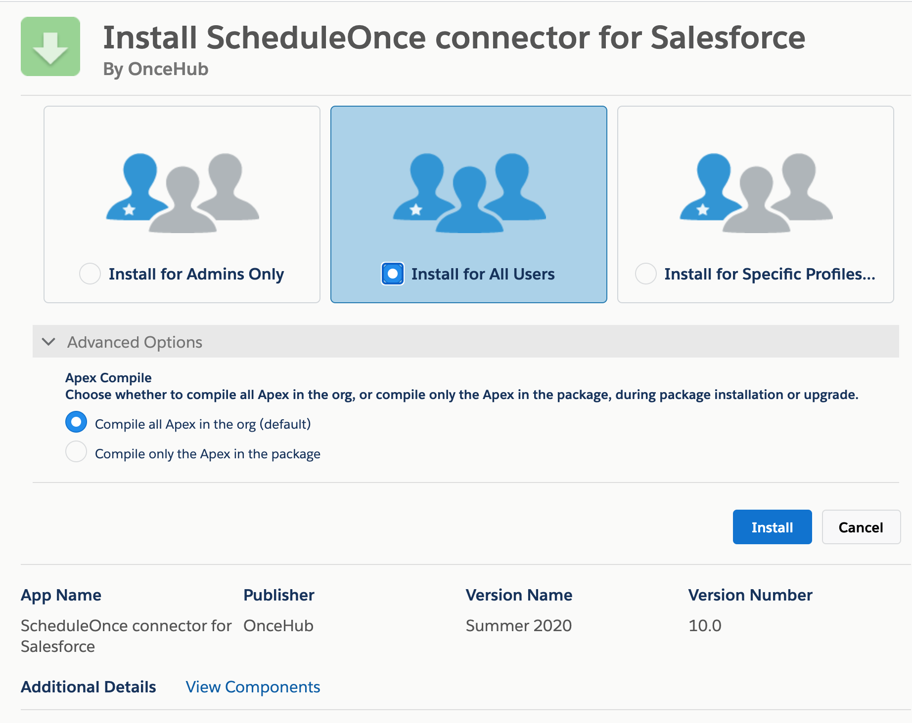

import { Aside } from '@astrojs/starlight/components';

The Salesforce setup process includes 5 phases: [API connection](/connecting-a-salesforce-api-user/ "How to connect a Salesforce API User"), Installation, [Field validation](/handling-required-salesforce-fields-in-the-field-validation-step/ "Handling required Salesforce fields in the Field validation step"), [Field mapping](/mapping-scheduleonce-fields-to-non-mandatory-salesforce-fields/ "Mapping ScheduleOnce fields to non-mandatory Salesforce fields"), and [Creation rules](/salesforce-record-creation-update-and-assignment-rules/ "Salesforce record creation, update, and assignment rules").

Installation is a three step process. In this article, you will learn about the first step: installing the OnceHub connector package in Salesforce.  The OnceHub connector for Salesforce is installed directly from OnceHub.

```
&lt;script id="snippet-prepend">
$(function()&#123;
  
  /*disable in widget*/
  if($('.w-documentation-article').length === 0)&#123;

     var ToC =
  "&lt;nav role='navigation' class='table-of-contents toc-top'><h4>In this article:" + "<ul>";
     var el,     title, link, header;
      //Define the heading levels you want to use in ascending order. Can add extra or remove unneeded.
     $(".hg-article-body h1, .hg-article-body h2, .hg-article-body h3, .hg-article-body h4").each(function() &#123;
              el = $(this);
              title = el.text();
                 if(title != '')&#123;
                anchorTitle = el.text().replace(/([~!@#$%^&*()_+=`&#123;&#125;\[\]\|\\:;'&lt;>,.\/\? ])+/g, '-').toLowerCase();
                link = "#" + anchorTitle;
                //Set all headers to a 0-nesting level.
                header = 'header-nesting-0';
                //Adjust header-nesting layers so that they point to the correct html tag. header-nesting-1 should match the second .hg-article-body h# listed above; header-nesting-2 should match the third, etc.
                if($(this).is('h2'))&#123;
                    header = 'header-nesting-1';
                &#125;else if($(this).is('h3'))&#123;
                    header = 'header-nesting-2'
                &#125;
                el.html('<a id="'+anchorTitle+'" class="toc-anchor">' + el.html());
                newLine =
      "<li class='"+header+"'>" +
        "<a class='article-anchor' href='" + link + "'>" +
          title +
        "" +
      "";


                ToC += newLine;
              &#125;
              &#125;);
     ToC +=
   "" +
  "";
    $("#snippet-prepend").before(ToC);
  &#125;
&#125;);

&lt;/script>
```

```
&lt;style>
/* CSS to style the TOC as it displays and the auto-created anchors
.toc-top styles the box for the TOC; adjust styles here to tweak look and feel */
  
.toc-top &#123;
  background-color: #FAFAFA; /* set to #fff or delete entirely for no background */
  border: 1px solid #C8C8C8; /* adjust the color hex here to change border color */
  box-shadow: 0 1px 1px rgba(0, 0, 0, 0.05) inset;
  margin-top: 24px;
  margin-bottom: 36px;
  min-height: 20px;
  padding: 13px 20px;
  max-width: 75%;
&#125;
.toc-top h4 &#123;
  font-size: 18px;
  line-height: 26px;
  margin: 0 0 8px;
  font-weight: 400;
&#125;
.toc-top ul &#123;
  padding: 0 0 0 15px !important;
  margin-bottom: 0;	
&#125;
.toc-top > ul &#123;
  margin-bottom: 13px!important;
&#125;
.toc-anchor &#123;
  display: block;
  height: 90px; 
  margin-top: -90px; 
  visibility: hidden;
&#125;

/* Set the indentation for the nesting levels. May need to be edited to match changes above. Increase or decrease the margin-left to get your desired level of indentation. */
.header-nesting-1 &#123;
    margin-left: 14px;
&#125;
.header-nesting-1:before &#123;
	background-image: url(https://dyzz9obi78pm5.cloudfront.net/app/image/id/5d31bcc88e121c9b25ba22c4/n/bulletv2.svg)!important;
&#125;
.header-nesting-2 &#123;
    margin-left: 28px;
&#125;
.header-nesting-2:before &#123;
	background-image: url(https://dyzz9obi78pm5.cloudfront.net/app/image/id/5d31be536e121cf22b0cc6ae/n/bulletv3.svg)!important;
&#125;
&lt;/style>
```

# Requirements

To install the connector from OnceHub, you must:

*   Be a [OnceHub Administrator](/user-type-member-vs-admin-team-manager/ "Differences between Administrator and Member").
*   Be a Salesforce Administrator in your organization.
*   Have an [active connection to your Salesforce API User](/connecting-a-salesforce-api-user/ "How to connect a Salesforce API User"). 

You do not need an assigned product license to install and update Salesforce account settings. [Learn more](/common-use-cases-for-users-without-a-scheduleonce-license/)

# Installing the OnceHub connector for Salesforce

1.  ```
    &lt;style type="text/css">
    p.p1 &#123;margin: 0.0px 0.0px 0.0px 0.0px; font: 13.0px 'Helvetica Neue'&#125;
    &lt;/style>
    ```
    
    Click the gear icon located in the top-right corner of the page.
2.  Select **Account Integrations** from the dropdown menu.
3.  Filter for **CRM**.
4.  Click on the **Salesforce (For Booking Pages)** tile.
5.  In the **Salesforce** box, click the **Setup** button (Figure 1).  
    Figure 1: Set up API Connection in OnceHub
6.  On the **Installation** tab, click the **Install connector** button (Figure 2).  
    Figure 2: Install connector
7.  Sign in to Salesforce.
8.  On the **Salesforce** Install Package landing page, select **Install for All Users** and then click the **Install** button (Figure 3).  
    Figure 3: Install for All Users
9.  Once installation is complete, click the **Done** button.
10.  Return to OnceHub and reload the page, then go back to the **Installation** tab. You will see that the connector is now installed (Figure 4).  
     Figure 4: Connector installed

**Note**After the connector is installed, it can take up to 10 minutes before **Connector installed** is shown on the **Installation** tab.

That's it! You've completed **Step 1** of the Installation process. Now you can proceed to **Step 2**, which is described in the [How to assign the OnceHub permission set to the Salesforce API User](/how-to-assign-the-scheduleonce-permission-set-to-the-salesforce-api-user/ "How to assign the ScheduleOnce permission set to the Salesforce API user") article.