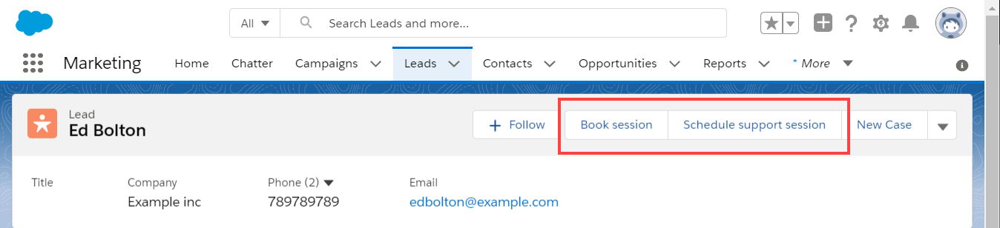

import { Aside } from '@astrojs/starlight/components';

Salesforce scheduling buttons provide a quick method to schedule on behalf of a Customer. Bookings made via these buttons are automatically added to the Salesforce record that the booking is scheduled from. 

Figure 1: Salesforce scheduling buttons

Salesforce scheduling buttons can be configured to [prepopulate the booking form, or skip it altogether](/how-to-prepopulate-or-skip-the-booking-form-step-in-salesforce-integration/ "How to prepopulate or skip the Booking form step in Salesforce integration"). This is enabled by the [optional mapping step in the Salesforce setup wizard](/mapping-scheduleonce-fields-to-non-mandatory-salesforce-fields/ "Mapping ScheduleOnce fields to non-mandatory Salesforce fields"), where you can define the mapping between Salesforce record fields and OnceHub Booking form fields.

# Creating Salesforce scheduling buttons

You can learn more about creating Salesforce scheduling buttons in the following articles:

*   [Salesforce scheduling buttons for Contacts, Leads, and Cases](/salesforce-scheduling-buttons-for-contacts-leads-and-cases/ "Salesforce scheduling buttons for contacts, leads and cases")
*   [Salesforce scheduling buttons for Person Accounts](/salesforce-scheduling-buttons-for-person-accounts/ "Salesforce scheduling buttons for Person accounts")
*   [Salesforce scheduling buttons for Opportunities](/salesforce-scheduling-buttons-for-opportunities/ "Salesforce scheduling buttons for Opportunities")