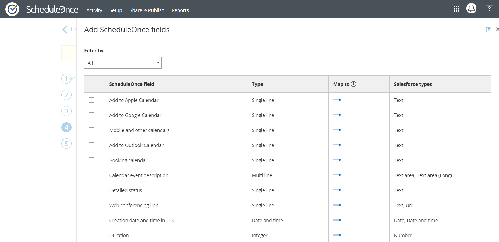

import { Aside } from '@astrojs/starlight/components';

The Salesforce setup process includes 5 phases: [API connection](/connecting-a-salesforce-api-user/ "How to connect a Salesforce API User"), [Installation](/how-to-install-the-scheduleonce-connector-for-salesforce/ "How to install the ScheduleOnce connector for Salesforce"), [Field validation](/handling-required-salesforce-fields-in-the-field-validation-step/ "Handling required Salesforce fields in the Field validation step"), Field mapping, and [Creation rules](/salesforce-record-creation-update-and-assignment-rules/ "Salesforce record creation, update, and assignment rules"). The **Field mapping** step includes a default mapping and the option to map any OnceHub fields to non-mandatory Salesforce fields.

In this article, you will learn how to map OnceHub fields to non-mandatory Salesforce fields.

```
&lt;script id="snippet-prepend">
$(function()&#123;
  
  /*disable in widget*/
  if($('.w-documentation-article').length === 0)&#123;

     var ToC =
  "&lt;nav role='navigation' class='table-of-contents toc-top'><h4>In this article:" + "<ul>";
     var el,     title, link, header;
      //Define the heading levels you want to use in ascending order. Can add extra or remove unneeded.
     $(".hg-article-body h1, .hg-article-body h2, .hg-article-body h3, .hg-article-body h4").each(function() &#123;
              el = $(this);
              title = el.text();
                 if(title != '')&#123;
                anchorTitle = el.text().replace(/([~!@#$%^&*()_+=`&#123;&#125;\[\]\|\\:;'&lt;>,.\/\? ])+/g, '-').toLowerCase();
                link = "#" + anchorTitle;
                //Set all headers to a 0-nesting level.
                header = 'header-nesting-0';
                //Adjust header-nesting layers so that they point to the correct html tag. header-nesting-1 should match the second .hg-article-body h# listed above; header-nesting-2 should match the third, etc.
                if($(this).is('h2'))&#123;
                    header = 'header-nesting-1';
                &#125;else if($(this).is('h3'))&#123;
                    header = 'header-nesting-2'
                &#125;
                el.html('<a id="'+anchorTitle+'" class="toc-anchor">' + el.html());
                newLine =
      "<li class='"+header+"'>" +
        "<a class='article-anchor' href='" + link + "'>" +
          title +
        "" +
      "";


                ToC += newLine;
              &#125;
              &#125;);
     ToC +=
   "" +
  "";
    $("#snippet-prepend").before(ToC);
  &#125;
&#125;);

&lt;/script>
```

```
&lt;style>
/* CSS to style the TOC as it displays and the auto-created anchors
.toc-top styles the box for the TOC; adjust styles here to tweak look and feel */
  
.toc-top &#123;
  background-color: #FAFAFA; /* set to #fff or delete entirely for no background */
  border: 1px solid #C8C8C8; /* adjust the color hex here to change border color */
  box-shadow: 0 1px 1px rgba(0, 0, 0, 0.05) inset;
  margin-top: 24px;
  margin-bottom: 36px;
  min-height: 20px;
  padding: 13px 20px;
  max-width: 75%;
&#125;
.toc-top h4 &#123;
  font-size: 18px;
  line-height: 26px;
  margin: 0 0 8px;
  font-weight: 400;
&#125;
.toc-top ul &#123;
  padding: 0 0 0 15px !important;
  margin-bottom: 0;	
&#125;
.toc-top > ul &#123;
  margin-bottom: 13px!important;
&#125;
.toc-anchor &#123;
  display: block;
  height: 90px; 
  margin-top: -90px; 
  visibility: hidden;
&#125;

/* Set the indentation for the nesting levels. May need to be edited to match changes above. Increase or decrease the margin-left to get your desired level of indentation. */
.header-nesting-1 &#123;
    margin-left: 14px;
&#125;
.header-nesting-1:before &#123;
	background-image: url(https://dyzz9obi78pm5.cloudfront.net/app/image/id/5d31bcc88e121c9b25ba22c4/n/bulletv2.svg)!important;
&#125;
.header-nesting-2 &#123;
    margin-left: 28px;
&#125;
.header-nesting-2:before &#123;
	background-image: url(https://dyzz9obi78pm5.cloudfront.net/app/image/id/5d31be536e121cf22b0cc6ae/n/bulletv3.svg)!important;
&#125;
&lt;/style>
```

# Requirements

To map non-mandatory fields, you must:

*   Be a [OnceHub administrator](/user-type-member-vs-admin-team-manager/ "Differences between Administrator and Member").
*   Have an [active connection to your Salesforce API User](/connecting-a-salesforce-api-user/ "How to connect a Salesforce API User").

# Default mapping

Some OnceHub fields are mapped to non-mandatory Salesforce fields by default. We recommend keeping the mapping as is and not removing mapped data from the integration. This will enable you to gather the basic Customer data and booking data in Salesforce.

Other OnceHub fields can be mapped to additional non-mandatory Salesforce fields. You can remove them from the mapping by unchecking each field.

**Important**The default mapping includes mapping for all objects supported by the Salesforce integration: Lead, Contact, Event, Account, and Cases. However, not all fields will always be in use. This depends on your booking activity and the [Booking pages](/introduction-to-booking-pages/ "Introduction to Booking pages") used.

# Adding new OnceHub fields

You can add OnceHub fields and map them to non-mandatory Salesforce fields. This allows you to map data tracked in OnceHub to Lead, Contact, Case, Account, or Event records.

You cannot map OnceHub fields to Salesforce universally required Custom fields. Required fields must be mapped in the [Field validation mapping step](/handling-required-salesforce-fields-in-the-field-validation-step/ "Handling required Salesforce fields in the Field validation step").

**Important**OnceHub fields requiring Customer input must be added to the Booking form. Otherwise, the field will be automatically added to the Booking form at the time of the booking and you will not have control over its location in the form. [Learn more about adding Custom fields to the Booking form](/creating-a-booking-form/ "Creating a Booking form")

To add a OnceHub field and map to a Salesforce field, follow these steps:

1.  In the **Salesforce connector** **setup**, go to the **Field Mapping** tab.
2.  At the bottom left of the table, click the **Add OnceHub fields** button.
3.  The **Add OnceHub fields** pop-up will open (Figure 2). You can see the list of OnceHub System fields and Custom fields with corresponding field types that can be mapped to Salesforce field types.  
    Figure 1: Add OnceHub fields pop-up
    
    The Salesforce fields include all the fields stored in Salesforce (Custom and Standard fields) that are supported by the mapping for the selected OnceHub field. [Learn more about the supported and non-supported Salesforce field types](/supported-and-non-supported-field-types-in-the-salesforce-integration/ "Supported and non-supported field types in the Salesforce integration").
    
    **Note**There is a two-way mapping between Salesforce and OnceHub. For this reason, you can only map one OnceHub field to one Salesforce field.
    
    **From OnceHub to Salesforce:**  
    When a booking is made, all data is mapped from OnceHub to Salesforce.  
      
    **From Salesforce to OnceHub:**  
    When scheduling with existing Salesforce records using [Personalized links (Salesforce ID)](/using-personalized-links-salesforce-id/ "Using Personalized links (Salesforce ID)"), Customer data is mapped from Salesforce to OnceHub in order to prepopulate or skip the Booking form. 
    
4.  Use the **Filter by** drop-down menu to select a category if required. 
5.  Check the box next to each field you would like to add.
6.  Click **Add fields**.
7.  Click **Save**, or **Save and Continue** if you have completed mapping all fields.

# Deleting a mapped field

1.  In the **OnceHub** **fields** list, click the delete icon beside the added field you want to delete (Figure 3).
2.  In the **Remove OnceHub field** pop-up, click **Yes**.
3.  Click **Save**.