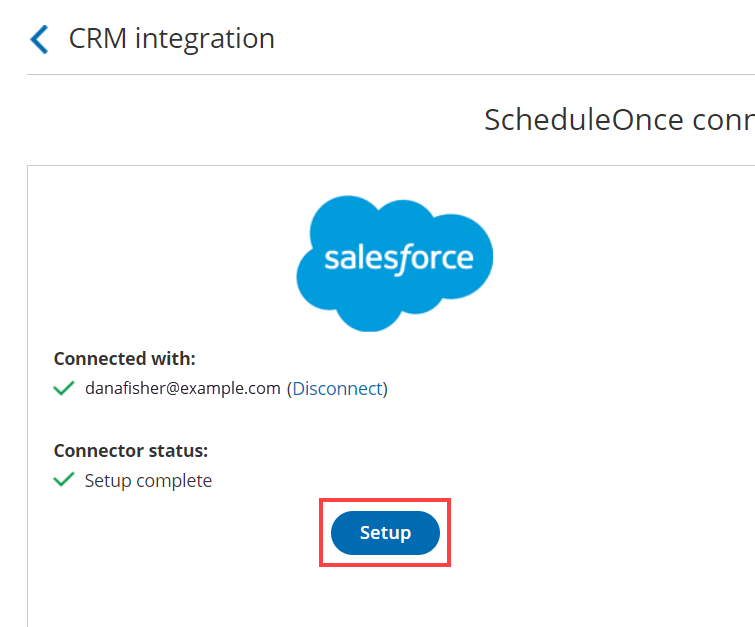
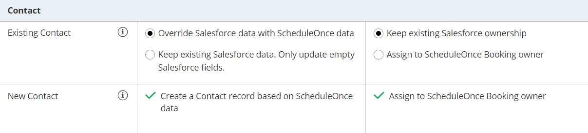
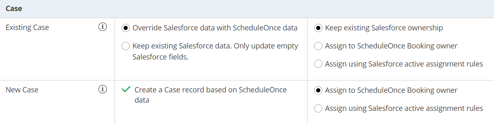

import { Aside } from '@astrojs/starlight/components';

The Salesforce setup process includes 5 steps: [API connection](/connecting-a-salesforce-api-user/ "How to connect a Salesforce API User"), [Installation](/how-to-install-the-scheduleonce-connector-for-salesforce/ "How to install the ScheduleOnce connector for Salesforce"), [Field validation](/handling-required-salesforce-fields-in-the-field-validation-step/ "Handling required Salesforce fields in the Field validation step"), [Field mapping](/mapping-scheduleonce-fields-to-non-mandatory-salesforce-fields/ "Mapping ScheduleOnce fields to non-mandatory Salesforce fields"), and Creation rules.

In this article, you'll learn about how to define the way Leads, Contacts, and Cases will be created, updated, and assigned in Salesforce when a booking is made. 

```
&lt;script id="snippet-prepend">
$(function()&#123;
  
  /*disable in widget*/
  if($('.w-documentation-article').length === 0)&#123;

     var ToC =
  "&lt;nav role='navigation' class='table-of-contents toc-top'><h4>In this article:" + "<ul>";
     var el,     title, link, header;
      //Define the heading levels you want to use in ascending order. Can add extra or remove unneeded.
     $(".hg-article-body h1, .hg-article-body h2, .hg-article-body h3, .hg-article-body h4").each(function() &#123;
              el = $(this);
              title = el.text();
                 if(title != '')&#123;
                anchorTitle = el.text().replace(/([~!@#$%^&*()_+=`&#123;&#125;\[\]\|\\:;'&lt;>,.\/\? ])+/g, '-').toLowerCase();
                link = "#" + anchorTitle;
                //Set all headers to a 0-nesting level.
                header = 'header-nesting-0';
                //Adjust header-nesting layers so that they point to the correct html tag. header-nesting-1 should match the second .hg-article-body h# listed above; header-nesting-2 should match the third, etc.
                if($(this).is('h2'))&#123;
                    header = 'header-nesting-1';
                &#125;else if($(this).is('h3'))&#123;
                    header = 'header-nesting-2'
                &#125;
                el.html('<a id="'+anchorTitle+'" class="toc-anchor">' + el.html());
                newLine =
      "<li class='"+header+"'>" +
        "<a class='article-anchor' href='" + link + "'>" +
          title +
        "" +
      "";


                ToC += newLine;
              &#125;
              &#125;);
     ToC +=
   "" +
  "";
    $("#snippet-prepend").before(ToC);
  &#125;
&#125;);

&lt;/script>
```

```
&lt;style>
/* CSS to style the TOC as it displays and the auto-created anchors
.toc-top styles the box for the TOC; adjust styles here to tweak look and feel */
  
.toc-top &#123;
  background-color: #FAFAFA; /* set to #fff or delete entirely for no background */
  border: 1px solid #C8C8C8; /* adjust the color hex here to change border color */
  box-shadow: 0 1px 1px rgba(0, 0, 0, 0.05) inset;
  margin-top: 24px;
  margin-bottom: 36px;
  min-height: 20px;
  padding: 13px 20px;
  max-width: 75%;
&#125;
.toc-top h4 &#123;
  font-size: 18px;
  line-height: 26px;
  margin: 0 0 8px;
  font-weight: 400;
&#125;
.toc-top ul &#123;
  padding: 0 0 0 15px !important;
  margin-bottom: 0;	
&#125;
.toc-top > ul &#123;
  margin-bottom: 13px!important;
&#125;
.toc-anchor &#123;
  display: block;
  height: 90px; 
  margin-top: -90px; 
  visibility: hidden;
&#125;

/* Set the indentation for the nesting levels. May need to be edited to match changes above. Increase or decrease the margin-left to get your desired level of indentation. */
.header-nesting-1 &#123;
    margin-left: 14px;
&#125;
.header-nesting-1:before &#123;
	background-image: url(https://dyzz9obi78pm5.cloudfront.net/app/image/id/5d31bcc88e121c9b25ba22c4/n/bulletv2.svg)!important;
&#125;
.header-nesting-2 &#123;
    margin-left: 28px;
&#125;
.header-nesting-2:before &#123;
	background-image: url(https://dyzz9obi78pm5.cloudfront.net/app/image/id/5d31be536e121cf22b0cc6ae/n/bulletv3.svg)!important;
&#125;
&lt;/style>
```

# Requirements

To set up the OnceHub connector for Salesforce, you must:

*   Be a [OnceHub Administrator](/user-type-member-vs-admin-team-manager/ "Differences between Administrator and Member").
*   Have an [active connection to your Salesforce API user](/connecting-a-salesforce-api-user/ "How to connect a Salesforce API User").

You do not need an assigned product license to install and update Salesforce account settings. [Learn more](/common-use-cases-for-users-without-a-scheduleonce-license/)

# Accessing the Salesforce connector setup page

```
&lt;style type="text/css">
p.p1 &#123;margin: 0.0px 0.0px 0.0px 0.0px; font: 13.0px 'Helvetica Neue'&#125;
&lt;/style>
```

1.  Click the gear icon located in the top-right corner of the page.
2.  Select **Account Integrations** from the dropdown menu.
3.  Filter for **CRM**.
4.  Click on the **Salesforce (For Booking Pages)** tile.
5.  Click the **Setup** button in the Salesforce box (Figure 1).

Figure 1: Salesforce setup

On the **Salesforce connector setup** page, select **Creation rules** (Figure 2).

Figure 2: Creation rules

# Lead records  
Figure 3: Lead records

## Existing Leads

In this case, the Customer making the booking exists in Salesforce and is recognized based on their Lead Record ID or their email address.

*   If you're scheduling with existing Salesforce Leads only, you should use our [Personalized links (Salesforce ID)](/using-personalized-links-salesforce-id/ "Using Personalized links (Salesforce ID)") in your [Salesforce email templates](https://help.salesforce.com/articleView?id=email_create_a_template.htm&type=5) and [Salesforce emails](https://help.salesforce.com/articleView?id=send_email_directly_from_crm_record.htm&type=5) to automatically recognize the Lead based on their Salesforce Lead record ID. This allows you to [prepopulate the Booking form step with Salesforce data, or skip it altogether](/how-to-prepopulate-or-skip-the-booking-form-step-in-salesforce-integration/ "Prepopulating or skipping the Booking form step in Salesforce integration").
*   If you're not sure that the Customer making the booking already exists in Salesforce, you should use the [General links](/using-general-links/ "Using General links") to recognize the Customer based on their email address. When the Lead or Contact record is identified, it will be updated based on the option you have chosen in the Record creation and update rules.

When a booking is made, the options provided allow you to choose between:

*   Overriding the existing Salesforce data with OnceHub data.
*   Keeping the existing Salesforce data and only update empty fields.

You can also decide whether to keep the Salesforce ownership, assign the record to the OnceHub Booking page owner, or assign the record using [Salesforce active assignment rules](https://help.salesforce.com/articleView?id=creating_assignment_rules.htm&type=5).

## New Leads

In this case, the Customer making the booking does not exist in Salesforce. For this reason, you should use [General links](/using-general-links/ "Using General links") when making bookings with prospects that may or may not exist in your Salesforce database.

When a booking is made, OnceHub creates a new Lead record in Salesforce and adds a new Salesforce Activity Event. You can decide whether to assign the Lead record to the OnceHub Booking page Owner or assign the Lead record using [Salesforce active assignment rules](https://help.salesforce.com/HTViewHelpDoc?id=creating_assignment_rules.htm&language=en_US).

# Contact records

Figure 4: Contact records

## Existing Contacts

In this case, the Customer making the booking exists in Salesforce and is recognized based on the email address or Contact Record ID.

*   If you're scheduling with existing Salesforce Contacts only, you should use our [Personalized links (Salesforce ID)](/using-personalized-links-salesforce-id/ "Using Personalized links (Salesforce ID)") in your [Salesforce email templates](https://help.salesforce.com/articleView?id=email_create_a_template.htm&type=5) and [Salesforce emails](https://help.salesforce.com/articleView?id=send_email_directly_from_crm_record.htm&type=5) to automatically recognize the Contact based on their Salesforce Contact record ID. This allows you to [prepopulate the Booking form step with Salesforce data, or skip it altogether](/how-to-prepopulate-or-skip-the-booking-form-step-in-salesforce-integration/ "Prepopulating or skipping the Booking form step in Salesforce integration").
*   If you're not sure that the Customer making the booking already exists in Salesforce, you should use the [General links](/using-general-links/ "Using General links") to recognize the Customer based on their email address. When the Lead or Contact record is identified, it will be updated based on the option you have chosen in the Record creation and update step.

When a booking is made, the options provided allow you to choose between:

*   Overriding the existing Salesforce data with OnceHub data.
*   Keeping the existing Salesforce data and only update empty fields.

You can also decide whether to keep the Salesforce ownership or assign the record to the OnceHub Booking page owner.

## New Contacts

In this case, the Customer making the booking does not exist in Salesforce and the Account may or may not exist in Salesforce. For this reason, you should use [General links](/using-general-links/ "Using General links") when making bookings with prospects that may or may not exist in your Salesforce database.

When a booking is made, OnceHub creates a new Contact record in Salesforce, assigns the Contact to the OnceHub Booking page Owner, and adds a new Salesforce Activity Event. 

**Note**When an Account does not exist in Salesforce, it is always created based on OnceHub data.

# Case records

Figure 5: Case records

## Existing Cases

In this case, the Case exists in Salesforce and is recognized based on the Salesforce Case Record ID. You should use our [Personalized links (Salesforce ID)](/using-personalized-links-salesforce-id/ "Using Personalized links (Salesforce ID)") in your [Salesforce email templates](https://help.salesforce.com/articleView?id=email_create_a_template.htm&type=5) and [Salesforce emails](https://help.salesforce.com/articleView?id=send_email_directly_from_crm_record.htm&type=5) to automatically recognize the Case based on the Salesforce Case Record ID. This allows you to [prepopulate the booking form step with Salesforce data, or skip it altogether](/how-to-prepopulate-or-skip-the-booking-form-step-in-salesforce-integration/ "Prepopulating or skipping the Booking form step in Salesforce integration").

When a booking is made, the options provided allow you to choose between:

*   Overriding the existing Salesforce data with OnceHub data.
*   Keeping the existing Salesforce data and only update empty fields.

You can also decide whether to keep the Salesforce ownership, assign the record to the OnceHub Booking page owner, or assign the record using [Salesforce active assignment rules](https://help.salesforce.com/articleView?id=creating_assignment_rules.htm&type=5). 

**Note**The Contact is always updated based on the Record creation and update rules.

## New Cases

In this case, the Case doesn’t exist in Salesforce and the Customer making the booking may or may not exist in Salesforce. For this reason, you should use [General links](/using-general-links/ "Using General links") when making bookings with prospects that may or may not exist in your Salesforce database.

When a booking is made, OnceHub creates a new Case record in Salesforce and adds a new Salesforce Event upon booking. You can decide whether to assign the Case record to the OnceHub Booking page Owner or assign the Case record using Salesforce active assignment rules. 

**Note**The Contact is always updated based on the Record creation and update rules.