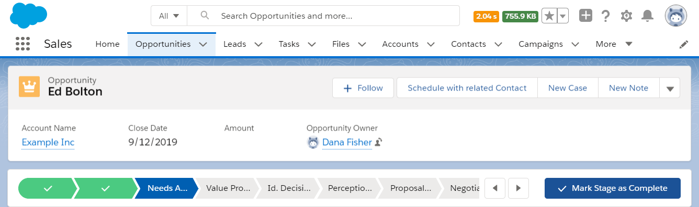
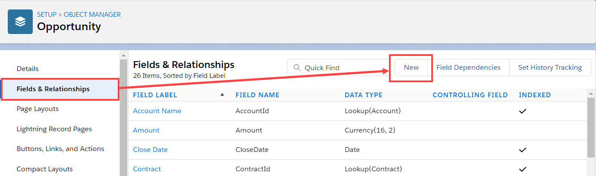
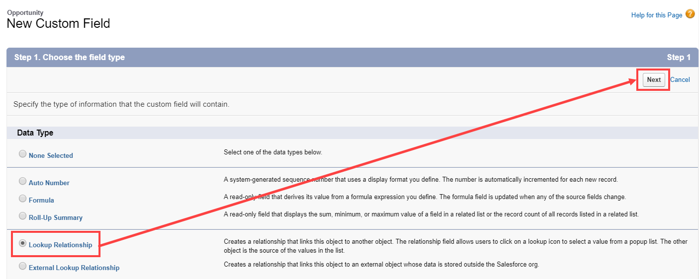
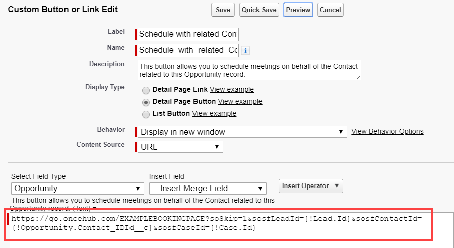
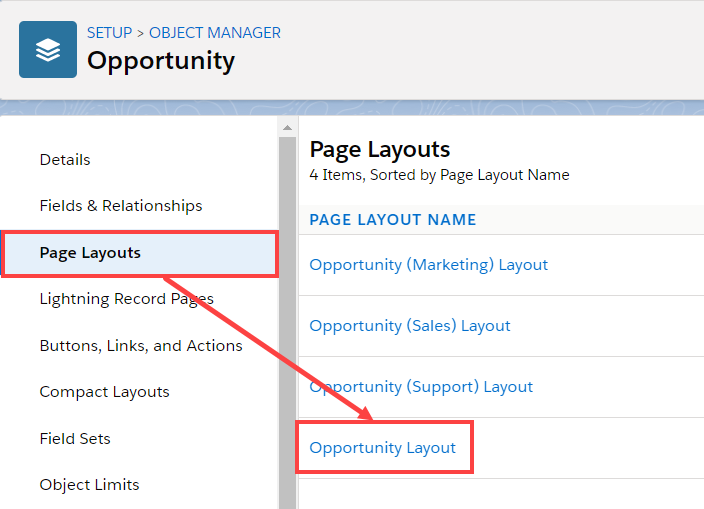
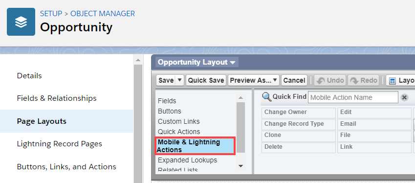
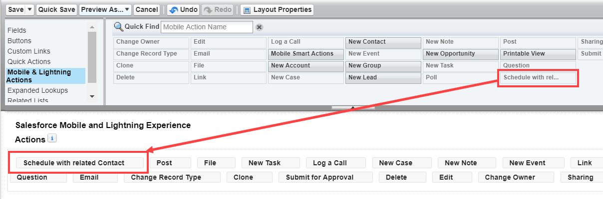

import { Aside } from '@astrojs/starlight/components';

[Salesforce scheduling buttons](/salesforce-scheduling-buttons/ "Salesforce scheduling buttons") provide a quick method to schedule on behalf of a Customer. A schedule button on the Opportunity record allows quick scheduling with the Opportunity’s related Contact record. Bookings made via these buttons are automatically added to the Salesforce record that the booking is scheduled from. 

Salesforce scheduling buttons can be configured to [prepopulate the booking form, or skip it altogether](/how-to-prepopulate-or-skip-the-booking-form-step-in-salesforce-integration/ "Prepopulating or skipping the Booking form step in Salesforce integration"). This is enabled by the [optional mapping step in the Salesforce setup wizard](/mapping-scheduleonce-fields-to-non-mandatory-salesforce-fields/ "Mapping ScheduleOnce fields to non-mandatory Salesforce fields"), where you can define the mapping between Salesforce record fields and OnceHub Booking form fields.

Figure 1: Schedule with related Contact button

In this article, you'll learn how to add the **Schedule with related Contact** button to the Opportunity record Page Layouts in Salesforce.

```
&lt;script id="snippet-prepend">
$(function()&#123;
  
  /*disable in widget*/
  if($('.w-documentation-article').length === 0)&#123;

     var ToC =
  "&lt;nav role='navigation' class='table-of-contents toc-top'><h4>In this article:" + "<ul>";
     var el,     title, link, header;
      //Define the heading levels you want to use in ascending order. Can add extra or remove unneeded.
     $(".hg-article-body h1, .hg-article-body h2, .hg-article-body h3, .hg-article-body h4").each(function() &#123;
              el = $(this);
              title = el.text();
                 if(title != '')&#123;
                anchorTitle = el.text().replace(/([~!@#$%^&*()_+=`&#123;&#125;\[\]\|\\:;'&lt;>,.\/\? ])+/g, '-').toLowerCase();
                link = "#" + anchorTitle;
                //Set all headers to a 0-nesting level.
                header = 'header-nesting-0';
                //Adjust header-nesting layers so that they point to the correct html tag. header-nesting-1 should match the second .hg-article-body h# listed above; header-nesting-2 should match the third, etc.
                if($(this).is('h2'))&#123;
                    header = 'header-nesting-1';
                &#125;else if($(this).is('h3'))&#123;
                    header = 'header-nesting-2'
                &#125;
                el.html('<a id="'+anchorTitle+'" class="toc-anchor">' + el.html());
                newLine =
      "<li class='"+header+"'>" +
        "<a class='article-anchor' href='" + link + "'>" +
          title +
        "" +
      "";


                ToC += newLine;
              &#125;
              &#125;);
     ToC +=
   "" +
  "";
    $("#snippet-prepend").before(ToC);
  &#125;
&#125;);

&lt;/script>
```

```
&lt;style>
/* CSS to style the TOC as it displays and the auto-created anchors
.toc-top styles the box for the TOC; adjust styles here to tweak look and feel */
  
.toc-top &#123;
  background-color: #FAFAFA; /* set to #fff or delete entirely for no background */
  border: 1px solid #C8C8C8; /* adjust the color hex here to change border color */
  box-shadow: 0 1px 1px rgba(0, 0, 0, 0.05) inset;
  margin-top: 24px;
  margin-bottom: 36px;
  min-height: 20px;
  padding: 13px 20px;
  max-width: 75%;
&#125;
.toc-top h4 &#123;
  font-size: 18px;
  line-height: 26px;
  margin: 0 0 8px;
  font-weight: 400;
&#125;
.toc-top ul &#123;
  padding: 0 0 0 15px !important;
  margin-bottom: 0;	
&#125;
.toc-top > ul &#123;
  margin-bottom: 13px!important;
&#125;
.toc-anchor &#123;
  display: block;
  height: 90px; 
  margin-top: -90px; 
  visibility: hidden;
&#125;

/* Set the indentation for the nesting levels. May need to be edited to match changes above. Increase or decrease the margin-left to get your desired level of indentation. */
.header-nesting-1 &#123;
    margin-left: 14px;
&#125;
.header-nesting-1:before &#123;
	background-image: url(https://dyzz9obi78pm5.cloudfront.net/app/image/id/5d31bcc88e121c9b25ba22c4/n/bulletv2.svg)!important;
&#125;
.header-nesting-2 &#123;
    margin-left: 28px;
&#125;
.header-nesting-2:before &#123;
	background-image: url(https://dyzz9obi78pm5.cloudfront.net/app/image/id/5d31be536e121cf22b0cc6ae/n/bulletv3.svg)!important;
&#125;
&lt;/style>
```

# Requirements

To add the **Schedule with related Contact** button to the Opportunity Page layouts in Salesforce, you will need:

*   A Salesforce Administrator for your organization. 
*   [A completed Salesforce connector setup in OnceHub](/connecting-a-salesforce-api-user/ "How to connect a Salesforce API User").
*   [A OnceHub User connected to Salesforce](/connecting-to-salesforce/ "Connecting to Salesforce").

# Creating a Contact Lookup field

First, we will add a Lookup custom field to the Opportunity record.

1.  Sign in to Salesforce as your [API User](/connecting-a-salesforce-api-user/ "How to connect a Salesforce API User").
2.  Go to the **Setup** page. 
3.  In the **Platform Tools** section, go to **Objects and Fields -> Object Manager** (Figure 2).  
    Figure 2: Object Manager in the Objects and Fields menu
4.  In the **Object Manager** list, select the **Opportunity** object (Figure 3).  
    Figure 3: Opportunity in the Object Manager list
5.  Select **Field & Relationships -> New** (Figure 4).  
    Figure 4: Fields & Relationships
6.  In the **New** **Custom Field** pane, select **Lookup Relationship** and **Next** (Figure 5).  
    Figure 5: New Custom Field—Step 1
7.  In the **Related to** drop-down menu, select **Contact**. 
8.  Click **Next**.
9.  Enter a label and name for the Lookup field, then click **Next** (Figure 6).
    *   Field Label: **Contact**
    *   Field Name: **Contact_ID**  
        **Figure 6: New Relationship**
10.  In Step 4 and Step 5, click **Next**. 
11.  In Step 6, click **Save**.

# Creating a button in Salesforce

Now you can create the button to add to the Opportunity Page Layout. The button will retrieve the Contact ID from the custom Contact Lookup field. When clicked, you will be able to make a booking on behalf of the Contact added to that Opportunity.

**Note** You can also follow the steps below for Custom objects. In this case, the button and the custom Lookup field should be added to a Custom object instead of the Opportunity Page Layout.

1.  Go to the **Setup** page.
2.  In the **Platform Tools** section, go to **Objects and Fields -> Object Manager**.
3.  Select the **Opportunity** object. 
4.  Select **Buttons, Links, and Actions -> New Button or Link** (Figure 7).  
    Figure 7: New Button or Link
5.  In the **New Button or Link** pane, enter the following information:
    *   Label: **Schedule with related Contact**
    *   Name: **Schedule_with_related_Contact**
    *   Description: **This button allows you to schedule meetings on behalf of the Contact related to this Opportunity record.**
    *   Display Type: **Detail Page Button** 
    *   Behavior: **Display in new window**
    *   Content Source: **URL**
6.  Copy the following link and paste it in the large text box (Figure 8).
    
    ```
    https://go.oncehub.com/EXAMPLEBOOKINGPAGE?so&Skip=1&sfLeadId=&#123;!Lead.Id&#125;&sfContactId=&#123;!Opportunity.Contact_IDid__c&#125;&sfCaseId=&#123;!Case.Id&#125;
    ```
    
    Figure 8: Paste link in the large text box
    
7.  Replace the placeholder URL (Figure 9) with the [Public link](/using-general-links/ "Using General links") of the Booking page or Master page that you want to use for the new button. You can find the Public link in the [Booking page Overview section](/booking-page-overview-section/ "Booking page: Overview section") or [Master page Overview section](/master-page-overview-section/ "Master page: Overview section").  
    Figure 9: Placeholder URL text For example, if you want to create a button for a Booking page with the Public link _https://go.oncehub.com/danafisher_, your finished link would be:   
      
    _https://go.oncehub.com/danafisher?soSkip=1&sosfLeadId=&#123;!Lead.Id&#125;&sosfContactId=&#123;!Opportunity.Contact_IDid__c&#125;&sosfCaseId=&#123;!Case.Id&#125;_
    
8.  Click **Save.**

# Adding a button to Salesforce Page Layouts

The next step is to add the new button you've created [](https://help.salesforce.com/articleView?id=customize_layout.htm&type=5)to the relevant Salesforce Opportunity Page Layouts.

**Note**Page Layouts control which buttons are visible. If you want to display the buttons only to specific Salesforce Users, you can assign your Page Layouts to specific Users. [Learn more about assigning Page Layouts to Profiles](https://help.salesforce.com/articleView?id=customize_layoutassign.htm&type=5)

1.  In **Opportunities**, click **Page Layouts** and then select the Layout you want to add a button to (Figure 10).  
    Figure 10: Page Layouts
2.  In the Opportunity Layout editor, select **Mobile & Lightning Actions** (Figure 11).  
    Figure 11: Mobile & Lightning Actions
3.  Click and drag the **Schedule with related Contact** button to the **Salesforce Mobile and Lightning Experience Actions** section (Figure 12).  
    Figure 12:  Add button to Salesforce Mobile and Lightning Experience Actions section
4.  Click **Save**.

You're all set! Your button is now ready to use on your Opportunity pages.