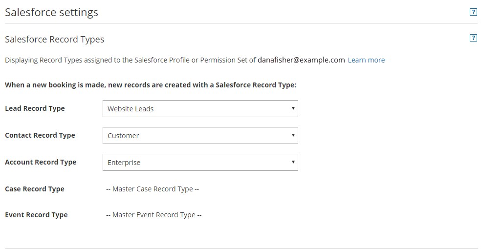
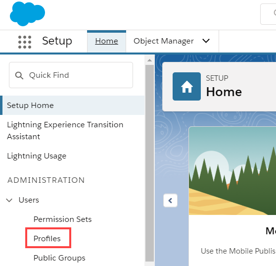

import { Aside } from '@astrojs/starlight/components';

Record Types allow the Salesforce Administrator to [manage multiple business processes](https://help.salesforce.com/htviewhelpdoc?err=1&id=customize_processes.htm&siteLang=en_US), show different picklist values, and Page Layouts to different Salesforce Users. [Learn more about creating Record Types](https://help.salesforce.com/apex/HTViewHelpDoc?id=creating_record_types.htm&language=en_US)

Record Types can be used in various ways, for example:

*   Create Record Types for Leads to differentiate your regular sales deals from your Partner’s generated leads, and offer different picklist values for each.
*   Create Record Types for Cases to display different Page Layouts for Customer support cases versus billing cases.
*   Create Record Types for Activity Events to differentiate scheduled events via OnceHub from scheduled events via direct sales calls by using different picklist values.

When Salesforce Record Types for Activity Events, Leads, Contacts, Accounts, and Case records are [configured on your Booking page](/configuring-salesforce-connector-settings-on-the-booking-page/ "Configuring Salesforce connector settings on the Booking page"), the OnceHub connector for Salesforce will create a new record according your settings. This means that when a booking is made, new records are created with an associated Record Type in your Salesforce organization.

**Important** When you use Record types with Lead or Case processes, OnceHub uses the default values set under the Lead process or Case process for the Lead status or Case status standard fields. This is set automatically in the [Field validation step](/handling-required-salesforce-fields-in-the-field-validation-step/ "Handling required Salesforce fields in the Field validation step") of the Salesforce connector setup process. 

In this article, you'll learn how to configure Salesforce Record Types for Booking pages you own or edit and how to assign the Record Type to the Salesforce User's Profile.

```
&lt;script id="snippet-prepend">
$(function()&#123;
  
  /*disable in widget*/
  if($('.w-documentation-article').length === 0)&#123;

     var ToC =
  "&lt;nav role='navigation' class='table-of-contents toc-top'><h4>In this article:" + "<ul>";
     var el,     title, link, header;
      //Define the heading levels you want to use in ascending order. Can add extra or remove unneeded.
     $(".hg-article-body h1, .hg-article-body h2, .hg-article-body h3, .hg-article-body h4").each(function() &#123;
              el = $(this);
              title = el.text();
                 if(title != '')&#123;
                anchorTitle = el.text().replace(/([~!@#$%^&*()_+=`&#123;&#125;\[\]\|\\:;'&lt;>,.\/\? ])+/g, '-').toLowerCase();
                link = "#" + anchorTitle;
                //Set all headers to a 0-nesting level.
                header = 'header-nesting-0';
                //Adjust header-nesting layers so that they point to the correct html tag. header-nesting-1 should match the second .hg-article-body h# listed above; header-nesting-2 should match the third, etc.
                if($(this).is('h2'))&#123;
                    header = 'header-nesting-1';
                &#125;else if($(this).is('h3'))&#123;
                    header = 'header-nesting-2'
                &#125;
                el.html('<a id="'+anchorTitle+'" class="toc-anchor">' + el.html());
                newLine =
      "<li class='"+header+"'>" +
        "<a class='article-anchor' href='" + link + "'>" +
          title +
        "" +
      "";


                ToC += newLine;
              &#125;
              &#125;);
     ToC +=
   "" +
  "";
    $("#snippet-prepend").before(ToC);
  &#125;
&#125;);

&lt;/script>
```

```
&lt;style>
/* CSS to style the TOC as it displays and the auto-created anchors
.toc-top styles the box for the TOC; adjust styles here to tweak look and feel */
  
.toc-top &#123;
  background-color: #FAFAFA; /* set to #fff or delete entirely for no background */
  border: 1px solid #C8C8C8; /* adjust the color hex here to change border color */
  box-shadow: 0 1px 1px rgba(0, 0, 0, 0.05) inset;
  margin-top: 24px;
  margin-bottom: 36px;
  min-height: 20px;
  padding: 13px 20px;
  max-width: 75%;
&#125;
.toc-top h4 &#123;
  font-size: 18px;
  line-height: 26px;
  margin: 0 0 8px;
  font-weight: 400;
&#125;
.toc-top ul &#123;
  padding: 0 0 0 15px !important;
  margin-bottom: 0;	
&#125;
.toc-top > ul &#123;
  margin-bottom: 13px!important;
&#125;
.toc-anchor &#123;
  display: block;
  height: 90px; 
  margin-top: -90px; 
  visibility: hidden;
&#125;

/* Set the indentation for the nesting levels. May need to be edited to match changes above. Increase or decrease the margin-left to get your desired level of indentation. */
.header-nesting-1 &#123;
    margin-left: 14px;
&#125;
.header-nesting-1:before &#123;
	background-image: url(https://dyzz9obi78pm5.cloudfront.net/app/image/id/5d31bcc88e121c9b25ba22c4/n/bulletv2.svg)!important;
&#125;
.header-nesting-2 &#123;
    margin-left: 28px;
&#125;
.header-nesting-2:before &#123;
	background-image: url(https://dyzz9obi78pm5.cloudfront.net/app/image/id/5d31be536e121cf22b0cc6ae/n/bulletv3.svg)!important;
&#125;
&lt;/style>
```

# Requirements

To configure the Salesforce Record Types for your Booking pages, you must:

*   [Be connected to Salesforce](/connecting-to-salesforce/ "Connecting to Salesforce").
*   [Be the Owner or an Editor of the Booking page](/booking-page-access-permissions/ "Booking page access permissions").

In addition, to assign Salesforce Record Types to the Salesforce User's Profile, you must be a Salesforce Administrator.

# Configuring Salesforce Record Types

You should ensure that OnceHub Users connected to Salesforce are associated with the correct Record Types in your Salesforce organization. Salesforce Record Types are available for a specific Salesforce User when they are assigned to them in their Profile or Permission Set.

1.  ```
    &lt;style type="text/css">
    p.p1 &#123;margin: 0.0px 0.0px 0.0px 0.0px; font: 13.0px 'Helvetica Neue'&#125;
    &lt;/style>
    ```
    
    Hover over the lefthand menu and go to the Booking pages icon → Booking pages → your Booking page → **Salesforce settings** (Figure 1).  
    Figure 1: Salesforce settings on a Booking page
2.  Select the Record Type that should be assigned to the Lead, Account, Contact, Event, and Case objects (Figure 2).  
    Figure 2: Salesforce Record Types settings

[Learn more about configuring Salesforce connector settings on a Booking page](/configuring-salesforce-connector-settings-on-the-booking-page/ "Configuring Salesforce connector settings on a Booking page")

# Assigning Salesforce Record Types to the Salesforce User's Profile

1.  Sign in to Salesforce as an Administrator.
2.  Go to the **Setup** page. 
3.  In the **Administration** section, go to **Users -> Profiles** (Figure 3).  
    Figure 3: Profiles in the Users section
4.  Select the **Profile** that is assigned to the Salesforce User connected to OnceHub.
5.  From the **Record Type Settings** section, click **Edit** next to the Object that you want to modify.
6.  From the **Record Type Settings Edit** for the Object, select the **Record Type** that you want to make available in OnceHub.