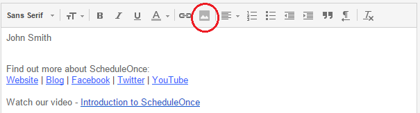

import { Aside } from '@astrojs/starlight/components';

A schedule button in your email is a great call-to-action, whether in your daily interactions with Customers or when running email campaigns. [See our full Email button gallery](/scheduling-buttons-gallery/ "Scheduling Buttons Gallery")

In this article, you'll learn the two ways to insert a button into your email signature. The method you choose will depend on your settings.

```
&lt;script id="snippet-prepend">
$(function()&#123;
  
  /*disable in widget*/
  if($('.w-documentation-article').length === 0)&#123;

     var ToC =
  "&lt;nav role='navigation' class='table-of-contents toc-top'><h4>In this article:" + "<ul>";
     var el,     title, link, header;
      //Define the heading levels you want to use in ascending order. Can add extra or remove unneeded.
     $(".hg-article-body h1, .hg-article-body h2, .hg-article-body h3, .hg-article-body h4").each(function() &#123;
              el = $(this);
              title = el.text();
                 if(title != '')&#123;
                anchorTitle = el.text().replace(/([~!@#$%^&*()_+=`&#123;&#125;\[\]\|\\:;'&lt;>,.\/\? ])+/g, '-').toLowerCase();
                link = "#" + anchorTitle;
                //Set all headers to a 0-nesting level.
                header = 'header-nesting-0';
                //Adjust header-nesting layers so that they point to the correct html tag. header-nesting-1 should match the second .hg-article-body h# listed above; header-nesting-2 should match the third, etc.
                if($(this).is('h2'))&#123;
                    header = 'header-nesting-1';
                &#125;else if($(this).is('h3'))&#123;
                    header = 'header-nesting-2'
                &#125;
                el.html('<a id="'+anchorTitle+'" class="toc-anchor">' + el.html());
                newLine =
      "<li class='"+header+"'>" +
        "<a class='article-anchor' href='" + link + "'>" +
          title +
        "" +
      "";


                ToC += newLine;
              &#125;
              &#125;);
     ToC +=
   "" +
  "";
    $("#snippet-prepend").before(ToC);
  &#125;
&#125;);

&lt;/script>
```

```
&lt;style>
/* CSS to style the TOC as it displays and the auto-created anchors
.toc-top styles the box for the TOC; adjust styles here to tweak look and feel */
  
.toc-top &#123;
  background-color: #FAFAFA; /* set to #fff or delete entirely for no background */
  border: 1px solid #C8C8C8; /* adjust the color hex here to change border color */
  box-shadow: 0 1px 1px rgba(0, 0, 0, 0.05) inset;
  margin-top: 24px;
  margin-bottom: 36px;
  min-height: 20px;
  padding: 13px 20px;
  max-width: 75%;
&#125;
.toc-top h4 &#123;
  font-size: 18px;
  line-height: 26px;
  margin: 0 0 8px;
  font-weight: 400;
&#125;
.toc-top ul &#123;
  padding: 0 0 0 15px !important;
  margin-bottom: 0;	
&#125;
.toc-top > ul &#123;
  margin-bottom: 13px!important;
&#125;
.toc-anchor &#123;
  display: block;
  height: 90px; 
  margin-top: -90px; 
  visibility: hidden;
&#125;

/* Set the indentation for the nesting levels. May need to be edited to match changes above. Increase or decrease the margin-left to get your desired level of indentation. */
.header-nesting-1 &#123;
    margin-left: 14px;
&#125;
.header-nesting-1:before &#123;
	background-image: url(https://dyzz9obi78pm5.cloudfront.net/app/image/id/5d31bcc88e121c9b25ba22c4/n/bulletv2.svg)!important;
&#125;
.header-nesting-2 &#123;
    margin-left: 28px;
&#125;
.header-nesting-2:before &#123;
	background-image: url(https://dyzz9obi78pm5.cloudfront.net/app/image/id/5d31be536e121cf22b0cc6ae/n/bulletv3.svg)!important;
&#125;
&lt;/style>
```

# Insert via URL

You can insert a button without downloading the image to your computer. Most web-based email programs allow you to do this, including Gmail.

1.  Review the buttons in our [scheduling buttons gallery](/scheduling-buttons-gallery/ "Scheduling buttons gallery").
2.  Copy one of the button links on the right. 
3.  In your email signature editor, click the insert picture icon (Figure 1) and paste the link in the URL field. Figure 1: Picture icon in email signature editor
4.  In the editor pane, select the newly-added button image to highlight it.
5.  Click the Add link icon and add your Booking page link (Figure 2). Figure 2: Add a link to your button

# Insert by uploading a button image

You can also insert a button by downloading the image to your computer and then uploading it to your email program. Follow these steps if you use Outlook or another desktop email program.

1.  Review the buttons in our [scheduling buttons gallery](/scheduling-buttons-gallery/ "Scheduling buttons gallery").
2.  Select the one you want
3.  Save the button to your computer by right-clicking on the button and selecting **Save image as...**
4.  In the email signature editor, click the Upload image icon (Figure 3) and select the file you've just saved. Figure 3: Upload image icon
5.  In the editor pane, select the newly-added button image to highlight it.
6.  Click the Add link icon (Figure 4) to add your Booking page link to the image.Figure 4: Add link icon

**Note**Every email program is different and the images used in this article may not match your email client’s interface exactly.

[See our full Email button gallery](/scheduling-buttons-gallery/ "Scheduling Buttons Gallery")