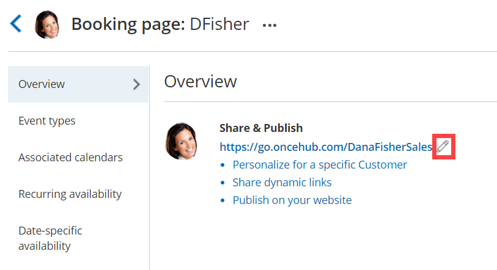
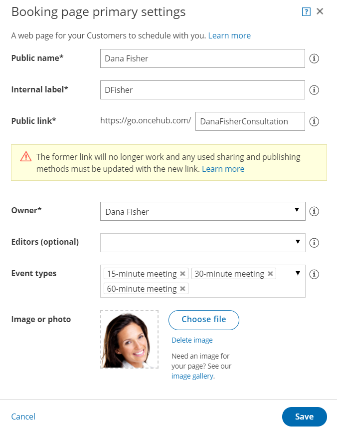

import { Aside } from '@astrojs/starlight/components';

[Booking page](/introduction-to-booking-pages/ "Introduction to Booking pages") links and [Master page](/introduction-to-master-pages/ "Introduction to Master pages") links are used in all of OnceHub's [Share & Publish](/share-publish/ "Share & Publish") options. In some cases, you may want to change the link that Customers use, such as when a Booking page is [reassigned to a different User](/booking-page-ownership/ "Booking page ownership"). 

In this article, you'll learn how to change a Booking page or Master page link.

```
&lt;script id="snippet-prepend">
$(function()&#123;
  
  /*disable in widget*/
  if($('.w-documentation-article').length === 0)&#123;

     var ToC =
  "&lt;nav role='navigation' class='table-of-contents toc-top'><h4>In this article:" + "<ul>";
     var el,     title, link, header;
      //Define the heading levels you want to use in ascending order. Can add extra or remove unneeded.
     $(".hg-article-body h1, .hg-article-body h2, .hg-article-body h3, .hg-article-body h4").each(function() &#123;
              el = $(this);
              title = el.text();
                 if(title != '')&#123;
                anchorTitle = el.text().replace(/([~!@#$%^&*()_+=`&#123;&#125;\[\]\|\\:;'&lt;>,.\/\? ])+/g, '-').toLowerCase();
                link = "#" + anchorTitle;
                //Set all headers to a 0-nesting level.
                header = 'header-nesting-0';
                //Adjust header-nesting layers so that they point to the correct html tag. header-nesting-1 should match the second .hg-article-body h# listed above; header-nesting-2 should match the third, etc.
                if($(this).is('h2'))&#123;
                    header = 'header-nesting-1';
                &#125;else if($(this).is('h3'))&#123;
                    header = 'header-nesting-2'
                &#125;
                el.html('<a id="'+anchorTitle+'" class="toc-anchor">' + el.html());
                newLine =
      "<li class='"+header+"'>" +
        "<a class='article-anchor' href='" + link + "'>" +
          title +
        "" +
      "";


                ToC += newLine;
              &#125;
              &#125;);
     ToC +=
   "" +
  "";
    $("#snippet-prepend").before(ToC);
  &#125;
&#125;);

&lt;/script>
```

```
&lt;style>
/* CSS to style the TOC as it displays and the auto-created anchors
.toc-top styles the box for the TOC; adjust styles here to tweak look and feel */
  
.toc-top &#123;
  background-color: #FAFAFA; /* set to #fff or delete entirely for no background */
  border: 1px solid #C8C8C8; /* adjust the color hex here to change border color */
  box-shadow: 0 1px 1px rgba(0, 0, 0, 0.05) inset;
  margin-top: 24px;
  margin-bottom: 36px;
  min-height: 20px;
  padding: 13px 20px;
  max-width: 75%;
&#125;
.toc-top h4 &#123;
  font-size: 18px;
  line-height: 26px;
  margin: 0 0 8px;
  font-weight: 400;
&#125;
.toc-top ul &#123;
  padding: 0 0 0 15px !important;
  margin-bottom: 0;	
&#125;
.toc-top > ul &#123;
  margin-bottom: 13px!important;
&#125;
.toc-anchor &#123;
  display: block;
  height: 90px; 
  margin-top: -90px; 
  visibility: hidden;
&#125;

/* Set the indentation for the nesting levels. May need to be edited to match changes above. Increase or decrease the margin-left to get your desired level of indentation. */
.header-nesting-1 &#123;
    margin-left: 14px;
&#125;
.header-nesting-1:before &#123;
	background-image: url(https://dyzz9obi78pm5.cloudfront.net/app/image/id/5d31bcc88e121c9b25ba22c4/n/bulletv2.svg)!important;
&#125;
.header-nesting-2 &#123;
    margin-left: 28px;
&#125;
.header-nesting-2:before &#123;
	background-image: url(https://dyzz9obi78pm5.cloudfront.net/app/image/id/5d31be536e121cf22b0cc6ae/n/bulletv3.svg)!important;
&#125;
&lt;/style>
```

# What happens when you change your link?

When you change the link, the former link will no longer work. Any sharing and publishing options that you used will need to be updated with the new link. Customers will not be able to cancel or reschedule any bookings that they made using the former link.

# Requirements

To change the link, you must meet the following requirements:

*   Be [an Owner or an Editor](/booking-page-access-permissions/ "Booking page access permissions") of the page.
*   Have the permission to edit the Overview section. 

[Learn more about Booking page access permissions](/booking-page-access-permissions/ "Booking page access permissions")

# Changing your link

1.  Go to **Booking pages** in the bar on the left.
2.  Select the Booking page or Master page that you would like to edit.
3.  In the [Overview section](/booking-page-overview-section/ "Booking page: Overview section"), click the **Edit** icon next to the link (Figure 1). Figure 1: Booking link edit icon
4.  The Booking page or Master page **Primary settings** pop-up will open (Figure 2). Figure 2: Booking page primary settings pop-up
5.  Change the **Public link** to the new link that you need.
    
    **Note** The former link will no longer work, and any sharing and publishing methods that you previously used must be updated with the new link.
    
6.  Click **Save**.