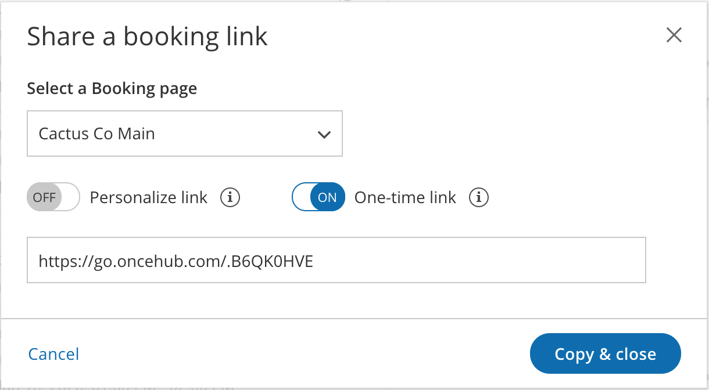
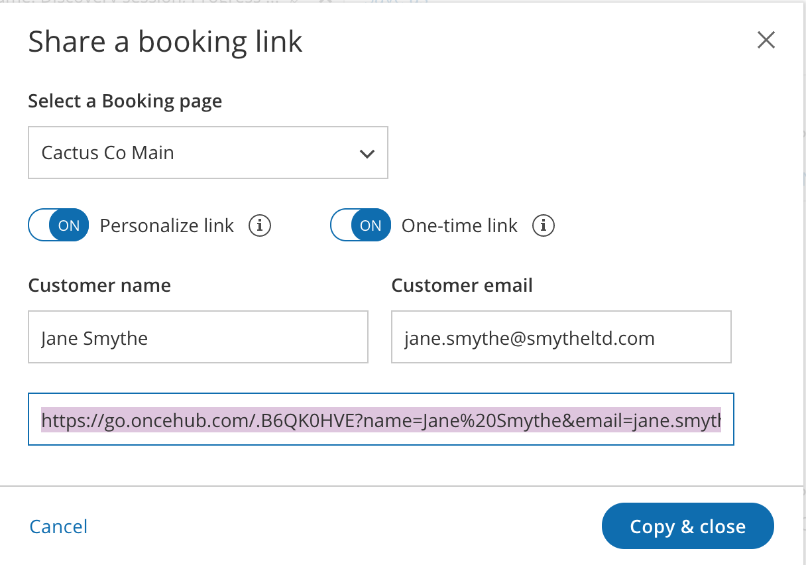

import { Aside } from '@astrojs/starlight/components';

**Note**One-time links are only available for [Master pages](/introduction-to-master-pages/ "Introduction to Master pages") using [Rule-based assignment](/rule-based-assignment/ "Master page scenario: Rule-based assignment") with [Dynamic rules](/rule-based-assignment-dynamic-rules/ "Rule-based assignment: Dynamic rules").

[](https://oncehub.knowledgeowl.com/help/assignment-with-team-or-panel-pages "Rule-based assignment: Dynamic rules")

With OnceHub, you can generate one-time links which are good for one booking only, eliminating any chance of unwanted repeat bookings. A Customer who receives the link will only be able to use it for the intended booking and will not have access to your underlying [Booking page](/introduction-to-booking-pages/ "Introduction to Booking pages"). 

When you create a one-time link, it's automatically copied to your clipboard with one click, allowing you to quickly generate multiple one-time links that can be sent to different Customers. One-time links [can be personalized](/using-personalized-links/ "Using Personalized links"), allowing the Customer to pick a time and schedule without having to fill out the [Booking form](/booking-form/ "Collecting Customer data with Booking forms").

**Tip**You can use the [OnceHub for Gmail extension](/integrations/browser-extension/introduction-to-oncehub-for-gmail/ "Introduction to OnceHub for Gmail") to schedule with general links directly from your Gmail account. You can generate links, copy them in a single click, and send them in an email. 

[Learn more about OnceHub for Gmail](/integrations/browser-extension/introduction-to-oncehub-for-gmail/ "Introduction to OnceHub for Gmail")

Customers can make bookings as normal using the one-time link, and Users and Customers can [cancel and reschedule](/reschedule/ "Cancel or Reschedule") as usual based on your [Cancel/reschedule policy](/the-customer-cancelreschedule-policy/ "The Customer Cancel/reschedule policy"). Bookings made using one-time links will also appear as normal bookings in your [Activity stream](/introduction-to-the-activity-stream/ "Introduction to the ScheduleOnce Activity stream") and [reports](/introduction-to-scheduleonce-reports/ "Introduction to ScheduleOnce reports"). 

In this article, you'll learn how to generate a one-time link.

```
&lt;script id="snippet-prepend">
$(function()&#123;
  
  /*disable in widget*/
  if($('.w-documentation-article').length === 0)&#123;

     var ToC =
  "&lt;nav role='navigation' class='table-of-contents toc-top'><h4>In this article:" + "<ul>";
     var el,     title, link, header;
      //Define the heading levels you want to use in ascending order. Can add extra or remove unneeded.
     $(".hg-article-body h1, .hg-article-body h2, .hg-article-body h3, .hg-article-body h4").each(function() &#123;
              el = $(this);
              title = el.text();
                 if(title != '')&#123;
                anchorTitle = el.text().replace(/([~!@#$%^&*()_+=`&#123;&#125;\[\]\|\\:;'&lt;>,.\/\? ])+/g, '-').toLowerCase();
                link = "#" + anchorTitle;
                //Set all headers to a 0-nesting level.
                header = 'header-nesting-0';
                //Adjust header-nesting layers so that they point to the correct html tag. header-nesting-1 should match the second .hg-article-body h# listed above; header-nesting-2 should match the third, etc.
                if($(this).is('h2'))&#123;
                    header = 'header-nesting-1';
                &#125;else if($(this).is('h3'))&#123;
                    header = 'header-nesting-2'
                &#125;
                el.html('<a id="'+anchorTitle+'" class="toc-anchor">' + el.html());
                newLine =
      "<li class='"+header+"'>" +
        "<a class='article-anchor' href='" + link + "'>" +
          title +
        "" +
      "";


                ToC += newLine;
              &#125;
              &#125;);
     ToC +=
   "" +
  "";
    $("#snippet-prepend").before(ToC);
  &#125;
&#125;);

&lt;/script>
```

```
&lt;style>
/* CSS to style the TOC as it displays and the auto-created anchors
.toc-top styles the box for the TOC; adjust styles here to tweak look and feel */
  
.toc-top &#123;
  background-color: #FAFAFA; /* set to #fff or delete entirely for no background */
  border: 1px solid #C8C8C8; /* adjust the color hex here to change border color */
  box-shadow: 0 1px 1px rgba(0, 0, 0, 0.05) inset;
  margin-top: 24px;
  margin-bottom: 36px;
  min-height: 20px;
  padding: 13px 20px;
  max-width: 75%;
&#125;
.toc-top h4 &#123;
  font-size: 18px;
  line-height: 26px;
  margin: 0 0 8px;
  font-weight: 400;
&#125;
.toc-top ul &#123;
  padding: 0 0 0 15px !important;
  margin-bottom: 0;	
&#125;
.toc-top > ul &#123;
  margin-bottom: 13px!important;
&#125;
.toc-anchor &#123;
  display: block;
  height: 90px; 
  margin-top: -90px; 
  visibility: hidden;
&#125;

/* Set the indentation for the nesting levels. May need to be edited to match changes above. Increase or decrease the margin-left to get your desired level of indentation. */
.header-nesting-1 &#123;
    margin-left: 14px;
&#125;
.header-nesting-1:before &#123;
	background-image: url(https://dyzz9obi78pm5.cloudfront.net/app/image/id/5d31bcc88e121c9b25ba22c4/n/bulletv2.svg)!important;
&#125;
.header-nesting-2 &#123;
    margin-left: 28px;
&#125;
.header-nesting-2:before &#123;
	background-image: url(https://dyzz9obi78pm5.cloudfront.net/app/image/id/5d31be536e121cf22b0cc6ae/n/bulletv3.svg)!important;
&#125;
&lt;/style>
```

# Requirements

To create a Rule-based assignment Master page with Dynamic rules, you must be a [OnceHub Administrator](/user-type-member-vs-admin-team-manager/ "Differences between Administrator and Member"). 

# Generating a one-time link

You generate a one-time link for your booking links by following the steps below:

1.  Click on **Booking Pages** in the left-hand menu.
2.  Click on **Share** near the top-right.
3.  Select the Booking page or Master page you want to share from the dropdown menu.
4.  Toggle the **One-time link** option to ON
5.  Click on **Copy & close** to save it to you clipboard.

You can also generate a one-time link in the **Overview** section of the relevant Master page:

1.  Go to **Setup** in the top navigation bar.
2.  Select the relevant Master page that you would like to generate a one-time link for.
3.  In the [Master page Overview](/master-page-overview-section/ "Master page: Overview section") section, click **Generate a one-time link** in the **Share & Publish** section (Figure 1).  
    Figure 1: Generating a one-time link in the Master page Share & Publish section
4.  The **One-time link** pop-up will appear (Figure 2).  
    Figure 2: One-time link pop-up 
5.  Toggle **Personalize link** to ON if you would like to personalize the one-time link for a Customer (Figure 3). Enter a **Customer name** and **Customer email**.  
    Figure 3: Personalize link enabled
    
    **Note** When you personalize a one-time link, the [Booking form](/booking-form/ "Collecting Customer data with Booking forms") step will be skipped. Skipping the Booking form step allows for a quicker booking process for your Customers.  
      
    You can choose to show the Booking form by changing the **Skip** URL parameter to "&skip=0". [Learn more about using OnceHub URL parameters](/scheduleonce-url-parameters-and-processing-rules/ "OnceHub URL parameters and processing rules")
    
6.  Click **Copy & close** to copy the one-time link to your clipboard and close the pop-up. You can then paste the one-time link into an email or instant message and send it to your Customer. 

You can also generate a one-time link from the **Booking page scheduling setup** (Figure 4). Click the action menu (three dots) next to the Master page that you would like to generate a one-time link for. Then, select **One-time link**. 

**Note**One-time links are only available for [Rule-based assignment](/team-or-panel-page/ "Master page scenario: Rule-based assignment") Master pages with [Dynamic rules](/assignment-with-team-or-panel-pages/ "Rule-based assignment: Dynamic rules").

Figure 4: Generating a one-time link from the Booking page scheduling setup

**Tip**You can generate a one-time link for an individual Booking page by creating a new Master page with Dynamic rules and selecting this Booking page as the [Primary team member](/booking-owners/ "Primary team members") for every Event-based rule you add.  
  
[Learn more about generating a one-time link for an individual Booking page](/scheduling-one-off-meetings-with-one-time-links/ "Scheduling one-off meetings using one-time links")

# Changing the Master page Rule type

If you change the Rule type of your Master page from Dynamic to Static, Customers will not be able to use any one-time link that you previously generated. 

If a Customer used the one-time link to make a booking **before** you changed the Rule type from Dynamic to Static, that booking can be cancelled but not rescheduled.