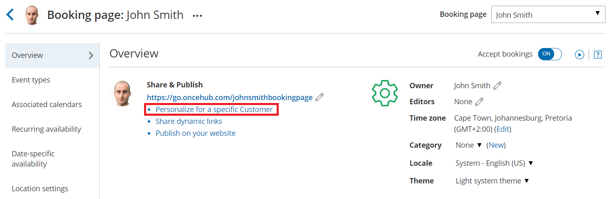

import { Aside } from '@astrojs/starlight/components';

After setting up your [Booking pages](/introduction-to-booking-pages/ "Introduction to Booking pages") or [Master pages](/introduction-to-master-pages/ "Introduction to Master pages"), you'll need to share them with your prospects and Customers.  In this section, you will learn how to Personalize links with static parameters.

```
&lt;script id="snippet-prepend">
$(function()&#123;
  
  /*disable in widget*/
  if($('.w-documentation-article').length === 0)&#123;

     var ToC =
  "&lt;nav role='navigation' class='table-of-contents toc-top'><h4>In this article:" + "<ul>";
     var el,     title, link, header;
      //Define the heading levels you want to use in ascending order. Can add extra or remove unneeded.
     $(".hg-article-body h1, .hg-article-body h2, .hg-article-body h3, .hg-article-body h4").each(function() &#123;
              el = $(this);
              title = el.text();
                 if(title != '')&#123;
                anchorTitle = el.text().replace(/([~!@#$%^&*()_+=`&#123;&#125;\[\]\|\\:;'&lt;>,.\/\? ])+/g, '-').toLowerCase();
                link = "#" + anchorTitle;
                //Set all headers to a 0-nesting level.
                header = 'header-nesting-0';
                //Adjust header-nesting layers so that they point to the correct html tag. header-nesting-1 should match the second .hg-article-body h# listed above; header-nesting-2 should match the third, etc.
                if($(this).is('h2'))&#123;
                    header = 'header-nesting-1';
                &#125;else if($(this).is('h3'))&#123;
                    header = 'header-nesting-2'
                &#125;
                el.html('<a id="'+anchorTitle+'" class="toc-anchor">' + el.html());
                newLine =
      "<li class='"+header+"'>" +
        "<a class='article-anchor' href='" + link + "'>" +
          title +
        "" +
      "";


                ToC += newLine;
              &#125;
              &#125;);
     ToC +=
   "" +
  "";
    $("#snippet-prepend").before(ToC);
  &#125;
&#125;);

&lt;/script>
```

```
&lt;style>
/* CSS to style the TOC as it displays and the auto-created anchors
.toc-top styles the box for the TOC; adjust styles here to tweak look and feel */
  
.toc-top &#123;
  background-color: #FAFAFA; /* set to #fff or delete entirely for no background */
  border: 1px solid #C8C8C8; /* adjust the color hex here to change border color */
  box-shadow: 0 1px 1px rgba(0, 0, 0, 0.05) inset;
  margin-top: 24px;
  margin-bottom: 36px;
  min-height: 20px;
  padding: 13px 20px;
  max-width: 75%;
&#125;
.toc-top h4 &#123;
  font-size: 18px;
  line-height: 26px;
  margin: 0 0 8px;
  font-weight: 400;
&#125;
.toc-top ul &#123;
  padding: 0 0 0 15px !important;
  margin-bottom: 0;	
&#125;
.toc-top > ul &#123;
  margin-bottom: 13px!important;
&#125;
.toc-anchor &#123;
  display: block;
  height: 90px; 
  margin-top: -90px; 
  visibility: hidden;
&#125;

/* Set the indentation for the nesting levels. May need to be edited to match changes above. Increase or decrease the margin-left to get your desired level of indentation. */
.header-nesting-1 &#123;
    margin-left: 14px;
&#125;
.header-nesting-1:before &#123;
	background-image: url(https://dyzz9obi78pm5.cloudfront.net/app/image/id/5d31bcc88e121c9b25ba22c4/n/bulletv2.svg)!important;
&#125;
.header-nesting-2 &#123;
    margin-left: 28px;
&#125;
.header-nesting-2:before &#123;
	background-image: url(https://dyzz9obi78pm5.cloudfront.net/app/image/id/5d31be536e121cf22b0cc6ae/n/bulletv3.svg)!important;
&#125;
&lt;/style>
```

# Options for sharing your booking links in email and other apps

Booking pages can be shared using a **General link,** a **Personalized link (URL parameters)**, a **Personalized link (Salesforce ID)**, or a **Personalized link (Infusionsoft ID)**.

To access the links available to you, go the **Share icon** in the top navigation bar and select **Share a booking link**. From there, you can select the relevant Booking page or Master page. 

[Learn more about sharing your booking links in email and other apps](/how-to-share-links-in-emails-and-other-apps/ "Sharing your booking links in email and other apps")

# Using Personalized links

Each Booking page and Master page has its own unique Public link that can be shared with your prospects and Customers. The links that you share can be personalized to improve the experience for prospects and Customers.

You can personalize booking links in several ways:

*   Using static variables
*   Using specific Customers details
*   Using dynamic variables
*   Using dynamic URL parameters
*   Using CRM record IDs
*   Pre-populating information from a booking form

[Learn more about using Personalized links](/using-personalized-links/ "Using Personalized links")

# OnceHub URL parameters and processing rules

You can share your [Booking page](/introduction-to-booking-pages/ "Introduction to Booking pages") or [Master page](/introduction-to-master-pages/ "Introduction to Master pages") using [Personalized links (URL parameters)](/using-personalized-links-url-parameters-in-email-marketing-apps/ "Using Personalized links (URL parameters) in email marketing apps"), or publish them on your website using [Web form integration](/introduction-to-webform-integration/ "Introduction to Webform Integration"). If required, you can replace the OnceHub placeholder parameters with your own parameters.

[Learn more about OnceHub URL parameters and processing rules](/scheduleonce-url-parameters-and-processing-rules/ "OnceHub URL parameters and processing rules")

# Creating a Personalized link for a specific Customer

You can create a static [Personalized link](/using-personalized-links/ "Using Personalized links") using a Customer's personal details. The easiest way to do this is by selecting the  **Share icon** in your top navigation bar:

1.  Click on **Booking Pages** in the left-hand menu.
2.  Click on **Share** near the top-right.
3.  Select the Booking page or Master page you want to share from the dropdown menu.
4.  Toggle the **Personalize link** option to ON.
5.  Enter the customer's name and email address.
6.  Click on **Copy & close** to save it to you clipboard.

You can also navigate to the [Overview section](/booking-page-overview-section/ "Booking page: Overview section") of the selected page, and click **Personalize for a specific Customer** (Figure 1).



_Figure 1: Booking page Overview section_

[Learn more about Creating a Personalized link for a specific Customer](/creating-a-personalized-link-for-a-specific-customer/ "Creating a Personalized link for a specific Customer")