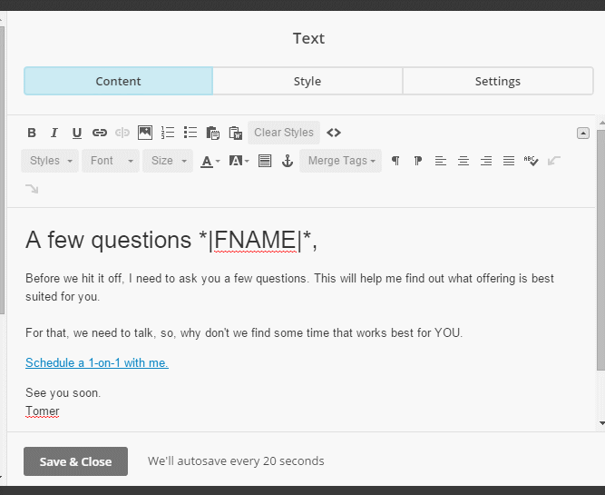
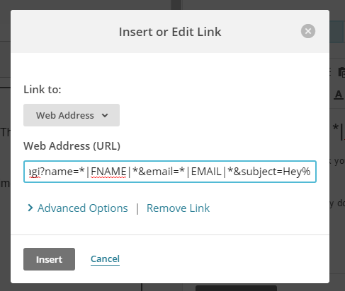

import { Aside } from '@astrojs/starlight/components';

**Personalized links (URL parameters)** are personalized links that include both OnceHub fields and app-specific merge fields. The OnceHub fields are based on [URL parameters](/scheduleonce-url-parameters-and-processing-rules/ "ScheduleOnce URL parameters and processing rules") and the merge fields are replaced with actual Customer data during a marketing campaign such as an email broadcast. These links are different from [static Personalized links](/creating-a-personalized-link-for-a-specific-customer/ "Creating a Personalized link for a specific Customer"), which contain an individual's personal details.

In this article, you'll learn about using Personalized links (URL parameters) in email marketing apps. 

```
&lt;script id="snippet-prepend">
$(function()&#123;
  
  /*disable in widget*/
  if($('.w-documentation-article').length === 0)&#123;

     var ToC =
  "&lt;nav role='navigation' class='table-of-contents toc-top'><h4>In this article:" + "<ul>";
     var el,     title, link, header;
      //Define the heading levels you want to use in ascending order. Can add extra or remove unneeded.
     $(".hg-article-body h1, .hg-article-body h2, .hg-article-body h3, .hg-article-body h4").each(function() &#123;
              el = $(this);
              title = el.text();
                 if(title != '')&#123;
                anchorTitle = el.text().replace(/([~!@#$%^&*()_+=`&#123;&#125;\[\]\|\\:;'&lt;>,.\/\? ])+/g, '-').toLowerCase();
                link = "#" + anchorTitle;
                //Set all headers to a 0-nesting level.
                header = 'header-nesting-0';
                //Adjust header-nesting layers so that they point to the correct html tag. header-nesting-1 should match the second .hg-article-body h# listed above; header-nesting-2 should match the third, etc.
                if($(this).is('h2'))&#123;
                    header = 'header-nesting-1';
                &#125;else if($(this).is('h3'))&#123;
                    header = 'header-nesting-2'
                &#125;
                el.html('<a id="'+anchorTitle+'" class="toc-anchor">' + el.html());
                newLine =
      "<li class='"+header+"'>" +
        "<a class='article-anchor' href='" + link + "'>" +
          title +
        "" +
      "";


                ToC += newLine;
              &#125;
              &#125;);
     ToC +=
   "" +
  "";
    $("#snippet-prepend").before(ToC);
  &#125;
&#125;);

&lt;/script>
```

```
&lt;style>
/* CSS to style the TOC as it displays and the auto-created anchors
.toc-top styles the box for the TOC; adjust styles here to tweak look and feel */
  
.toc-top &#123;
  background-color: #FAFAFA; /* set to #fff or delete entirely for no background */
  border: 1px solid #C8C8C8; /* adjust the color hex here to change border color */
  box-shadow: 0 1px 1px rgba(0, 0, 0, 0.05) inset;
  margin-top: 24px;
  margin-bottom: 36px;
  min-height: 20px;
  padding: 13px 20px;
  max-width: 75%;
&#125;
.toc-top h4 &#123;
  font-size: 18px;
  line-height: 26px;
  margin: 0 0 8px;
  font-weight: 400;
&#125;
.toc-top ul &#123;
  padding: 0 0 0 15px !important;
  margin-bottom: 0;	
&#125;
.toc-top > ul &#123;
  margin-bottom: 13px!important;
&#125;
.toc-anchor &#123;
  display: block;
  height: 90px; 
  margin-top: -90px; 
  visibility: hidden;
&#125;

/* Set the indentation for the nesting levels. May need to be edited to match changes above. Increase or decrease the margin-left to get your desired level of indentation. */
.header-nesting-1 &#123;
    margin-left: 14px;
&#125;
.header-nesting-1:before &#123;
	background-image: url(https://dyzz9obi78pm5.cloudfront.net/app/image/id/5d31bcc88e121c9b25ba22c4/n/bulletv2.svg)!important;
&#125;
.header-nesting-2 &#123;
    margin-left: 28px;
&#125;
.header-nesting-2:before &#123;
	background-image: url(https://dyzz9obi78pm5.cloudfront.net/app/image/id/5d31be536e121cf22b0cc6ae/n/bulletv3.svg)!important;
&#125;
&lt;/style>
```

# Using personalized links in email marketing apps

You can use dynamic personalized links in any email marketing app that supports merge fields. In this article, we'll use [Mailchimp](http://mailchimp.com/) as our email marketing app. 

The use case we'll discuss is sending an email broadcast to all of your Leads inviting them to book a discovery call with you. To do this, you'll [create a Personalized link (URL parameters)](/how-to-create-a-personalized-link-url-parameters/ "How to create a Personalized link (URL parameters)") and place it in your email template. 

The link might look like this: _https://secure.OnceHub.com/dana?name=\*|NAME|\*&email=\*|EMAIL|\*_. 

In this example, the **\*|NAME|\*** and **\*|EMAIL|\*** fields are merge fields which are replaced with a single Customer name and email respectively during the email campaign, creating a personalized email for each Lead in our list.

Below is a screenshot from MailChimp's email template editor (Figure 1) showing an email that invites an unqualified Lead to book a phone meeting with a sales representative. The **Schedule a 1-on-1 with me** link is in the body of the email.

Figure 1: Mailchimp email editor

If we click to edit the link (Figure 2), we will see the dynamic Personalized link with the Mailchimp-specific merge fields, name, email, and subject.

Figure 2: Insert or Edit Link

# Optimizing your booking rates

When used in email campaigns, Personalized links are a great tool for increasing your phone contact rates during your [Lead qualification](/scheduleonce-solution-for-lead-qualification/ "ScheduleOnce solution for lead qualification") process. They provide your Leads with the ability to book a discovery call at a time that's convenient for them. But what happens to Leads who don't respond to the booking invitation? 

Instead of losing these Leads, we've developed a [retargeting missed bookings](/maximizing-booking-rates-in-marketing-campaigns/ "Maximizing booking rates in marketing campaigns") process, which generates more bookings and increases the campaign's overall booking rates. 

[Learn more about maximizing booking rates in marketing campaigns](/maximizing-booking-rates-in-marketing-campaigns/ "Maximizing booking rates in marketing campaigns")

# Integrating Personalized links with email apps

Email add-ons integrate your email with email marketing apps or CRMs. One of the key features these add-ons provide is called **Email templates**. These templates include dynamic fields that are replaced with actual Lead and Customer information each time an email is sent out. 

By embedding OnceHub's dynamic Personalized links in these templates, you can ensure that each Lead or Customer gets a personalized booking link. You can also add [source tracking](/using-oncehub-with-source-tracking-utm-tags/ "Using ScheduleOnce with source tracking (UTM tags)") tags to personalized Booking page links, letting you analyze where your bookings come from. [Yesware](http://www.yesware.com/) and its [Dynamic templates](https://help.yesware.com/entries/86034428-What-information-populates-dynamic-templates-) functionality is an example of how Dynamic personalized links can work in tandem with an email add-on.