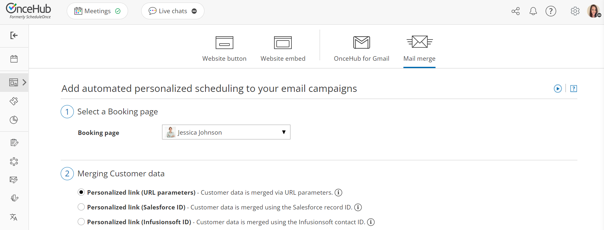
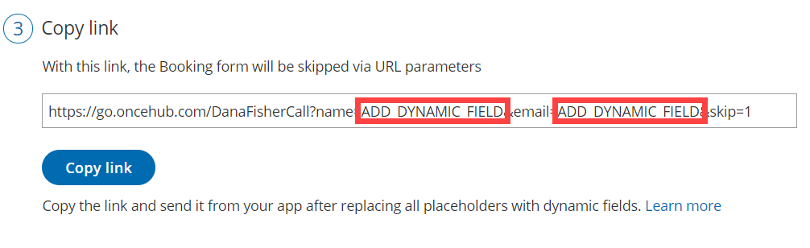

import { Aside } from '@astrojs/starlight/components';

Personalized links using [URL parameters](/scheduleonce-url-parameters-and-processing-rules/ "ScheduleOnce URL parameters and processing rules") are [Booking page](/introduction-to-booking-pages/ "Introduction to Booking pages") links that contain Customer information and [Booking form](/introduction-to-the-booking-forms-editor/ "Introduction to the Booking forms editor") data. With **Personalized links (URL parameters)**, prospects and Customers click on your Booking page link and pick a time, without having to provide any information that is already known to you. 

The Booking form can either be [prepopulated with their details](/prepopulated-booking-forms/ "Prepopulated Booking forms") or skipped altogether. You can also add [source tracking](/using-oncehub-with-source-tracking-utm-tags/ "Using ScheduleOnce with source tracking (UTM tags)") tags to personalized Booking page links, letting you analyze where your bookings come from.

**Note** When you use Personalized links with Booking pages that are [not associated with any Event types](/adding-event-types-to-booking-pages/ "Adding Event types to Booking pages"), it is highly recommended you provide the **Subject** field of your Booking form. 

You can do this by going to **Booking pages** on the left **→** Relevant Booking page**→** **Booking form and redirect**. In the **Meeting subject** section, select **Meeting subject is set by the Owner (you)**. You can then enter a meeting subject for your specific business case. 

[Learn more about the Subject field](/introduction-to-the-booking-form-redirect-section/ "Introduction to the Booking form and redirect section")

```
&lt;script id="snippet-prepend">
$(function()&#123;
  
  /*disable in widget*/
  if($('.w-documentation-article').length === 0)&#123;

     var ToC =
  "&lt;nav role='navigation' class='table-of-contents toc-top'><h4>In this article:" + "<ul>";
     var el,     title, link, header;
      //Define the heading levels you want to use in ascending order. Can add extra or remove unneeded.
     $(".hg-article-body h1, .hg-article-body h2, .hg-article-body h3, .hg-article-body h4").each(function() &#123;
              el = $(this);
              title = el.text();
                 if(title != '')&#123;
                anchorTitle = el.text().replace(/([~!@#$%^&*()_+=`&#123;&#125;\[\]\|\\:;'&lt;>,.\/\? ])+/g, '-').toLowerCase();
                link = "#" + anchorTitle;
                //Set all headers to a 0-nesting level.
                header = 'header-nesting-0';
                //Adjust header-nesting layers so that they point to the correct html tag. header-nesting-1 should match the second .hg-article-body h# listed above; header-nesting-2 should match the third, etc.
                if($(this).is('h2'))&#123;
                    header = 'header-nesting-1';
                &#125;else if($(this).is('h3'))&#123;
                    header = 'header-nesting-2'
                &#125;
                el.html('<a id="'+anchorTitle+'" class="toc-anchor">' + el.html());
                newLine =
      "<li class='"+header+"'>" +
        "<a class='article-anchor' href='" + link + "'>" +
          title +
        "" +
      "";


                ToC += newLine;
              &#125;
              &#125;);
     ToC +=
   "" +
  "";
    $("#snippet-prepend").before(ToC);
  &#125;
&#125;);

&lt;/script>
```

```
&lt;style>
/* CSS to style the TOC as it displays and the auto-created anchors
.toc-top styles the box for the TOC; adjust styles here to tweak look and feel */
  
.toc-top &#123;
  background-color: #FAFAFA; /* set to #fff or delete entirely for no background */
  border: 1px solid #C8C8C8; /* adjust the color hex here to change border color */
  box-shadow: 0 1px 1px rgba(0, 0, 0, 0.05) inset;
  margin-top: 24px;
  margin-bottom: 36px;
  min-height: 20px;
  padding: 13px 20px;
  max-width: 75%;
&#125;
.toc-top h4 &#123;
  font-size: 18px;
  line-height: 26px;
  margin: 0 0 8px;
  font-weight: 400;
&#125;
.toc-top ul &#123;
  padding: 0 0 0 15px !important;
  margin-bottom: 0;	
&#125;
.toc-top > ul &#123;
  margin-bottom: 13px!important;
&#125;
.toc-anchor &#123;
  display: block;
  height: 90px; 
  margin-top: -90px; 
  visibility: hidden;
&#125;

/* Set the indentation for the nesting levels. May need to be edited to match changes above. Increase or decrease the margin-left to get your desired level of indentation. */
.header-nesting-1 &#123;
    margin-left: 14px;
&#125;
.header-nesting-1:before &#123;
	background-image: url(https://dyzz9obi78pm5.cloudfront.net/app/image/id/5d31bcc88e121c9b25ba22c4/n/bulletv2.svg)!important;
&#125;
.header-nesting-2 &#123;
    margin-left: 28px;
&#125;
.header-nesting-2:before &#123;
	background-image: url(https://dyzz9obi78pm5.cloudfront.net/app/image/id/5d31be536e121cf22b0cc6ae/n/bulletv3.svg)!important;
&#125;
&lt;/style>
```

# Creating a Personalized link (URL parameters)

1.  Go to **Booking** **pages** in the bar on the left → **Booking page → Share & Publish**.
2.  Select the **Mail merge** tab.
3.  Select the relevant Booking page in the drop-down menu (Figure 1). 
    
    Figure 1: Select a Booking page drop-down menu
    
4.  In the **Customer data** step (Figure 2), select **Personalized link (URL parameters)**. 
    
    Figure 2: Customer data step
    
5.  In the **Booking form** **step**, you can select one of the two options below:
    *   **Skip the Booking form:** Skipping the Booking form helps you maximize your booking conversions and provides your Customers with a quicker booking process.
    *   **Prepopulate the Booking form:** If you select this option, the booking data is visible in the Booking form and can be edited by the Customer before submission. [Learn more about prepopulated Booking forms](/prepopulated-booking-forms/ "Prepopulated Booking forms")
6.  In the **Copy link** step, click **Copy link** to copy the Personalized link to your clipboard (Figure 3).  
    Figure 3: Copy link step

# Adding your own URL parameters

If you need to replace the **ADD_DYNAMIC_FIELD** placeholders (Figure 4) with your own parameters, you can copy the link to a notepad. [Learn more about supported OnceHub URL parameters](/scheduleonce-url-parameters-and-processing-rules/ "OnceHub URL parameters and processing rules")

Merged values must be properly encoded in order to be passed in the URL. Some characters like at (@), period (.), dash (-) and underscore (_) are OK, but all URL invalid characters like plus (+) or space ( ) must be URL encoded.

Figure 4: ADD_DYNAMIC_FIELD placeholders

For example, if you use [MailChimp](/using-personalized-links-url-parameters-in-email-marketing-apps/ "Using Personalized links (URL parameters) in email marketing apps"), the link might look like this: 

_https://go.oncehub.com/dana?name=\*|NAME|\*&email=\*|EMAIL|\*_

In this example, the **\*|NAME|\*** and **\*|EMAIL|\*** fields are merge fields which are replaced with a single Customer name and email respectively during the email campaign, creating a personalized email for each lead in your list.