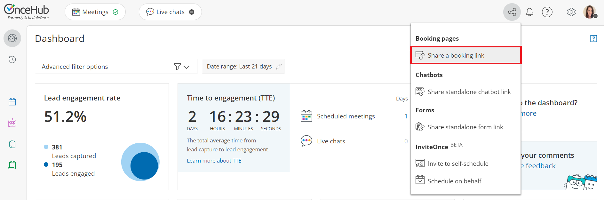

import { Aside } from '@astrojs/starlight/components';

After setting up your [Booking pages](/introduction-to-booking-pages/ "Introduction to Booking pages") or [Master pages](/introduction-to-master-pages/ "Introduction to Master pages"), you'll need to share them with your prospects and Customers. To access the links available to you, go to the  **Share icon** in your top navigation bar (Figure 1) and select **Share a booking link**.

Figure 1: Schedule button

From there, you can grab a [Generic link](/using-general-links/), [Personalized link](/using-personalized-links//), and/or [One-time link](/one-time-links//). 

If you'd like to personalize the link further by adding other URL parameters, go to **Booking** **pages** in the bar on the left → **Booking page → Share & Publish**. Select the **Mail merge** tab. (Figure 2). 

Figure 2: Links on the Mail merge tab 

Booking pages can be shared using a **Personalized link (URL parameters)**, a **Personalized link (Salesforce ID)**, or a **Personalized link (Infusionsoft ID)**.

# Personalized link (URL parameters)

With [Personalized links (URL parameters)](/how-to-create-a-personalized-link-url-parameters/ "How to create a Personalized Link (URL parameters)"), prospects and Customers click on your Booking page link and pick a time, without having to provide any information that is already known to you. The Booking form can either be [prepopulated with their details](/prepopulated-booking-forms/ "Prepopulated Booking forms") or skipped altogether. Personalized links using URL parameters can be sent through any email marketing app that supports merge fields.

When you use this link, you can pass dynamic data via the URL or define a [static link specific to a Customer](/creating-a-personalized-link-for-a-specific-customer/ "Creating a Personalized link for a specific Customer"). 

[Learn more about using Personalized links using URL parameters](/how-to-create-a-personalized-link-url-parameters/ "How to create a Personalized link (URL parameters)")

**Tip**You can use the [OnceHub for Gmail extension](/integrations/browser-extension/introduction-to-oncehub-for-gmail/ "Introduction to OnceHub for Gmail") to schedule with Personalized links directly from your Gmail account. You can generate Personalized links, copy them in a single click, and send them in an email. 

[Learn more about OnceHub for Gmail](/integrations/browser-extension/introduction-to-oncehub-for-gmail/ "Introduction to OnceHub for Gmail")

# Personalized link (Salesforce ID)

When you schedule with existing Salesforce Leads, Contacts, Person Accounts, or Case records, you can use our [Personalized links (Salesforce ID)](/using-personalized-links-salesforce-id/ "Using personalized links (Salesforce ID)") in your [Salesforce buttons](/salesforce-scheduling-buttons/ "Salesforce scheduling buttons"), [Salesforce email templates](https://help.salesforce.com/apex/HTViewHelpDoc?id=creating_html_email_templates.htm&language=en_US), or [email form](https://help.salesforce.com/HTViewHelpDoc?id=email_send.htm&language=en_US) to automatically recognize Customers based on their Salesforce Record ID.

[Learn more about using Personalized links using Salesforce IDs](/using-personalized-links-salesforce-id/ "Using Personalized links (Salesforce ID)")

# Personalized link (Infusionsoft ID)

When scheduling with your existing Infusionsoft Contact base, you can use our [Personalized links (Infusionsoft ID)](/using-personalized-links-infusionsoft-id/ "Using Personalized links (Infusionsoft ID)") in your [Infusionsoft email and broadcasts](https://help.infusionsoft.com/help/send-or-schedule-an-email-broadcast) to automatically recognize the Contact based on their Infusionsoft record ID. 

[Learn more about using Personalized links with Infusionsoft IDs](/using-personalized-links-infusionsoft-id/ "Using Personalized links (Infusionsoft ID)")