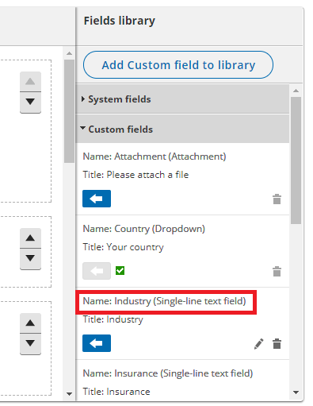

import { Aside } from '@astrojs/starlight/components';

When you pass Customer data via URL parameters, you can share your [Booking page](/introduction-to-booking-pages/ "Introduction to Booking pages") or [Master page](/introduction-to-master-pages/ "Introduction to Master pages") using [Personalized links (URL parameters)](/using-personalized-links-url-parameters-in-email-marketing-apps/ "Using Personalized links (URL parameters) in email marketing apps"), or publish them on your website using [Web form integration](/introduction-to-webform-integration/ "Introduction to Webform Integration"). If required, you can replace the OnceHub placeholder parameters with your own parameters.

In this article, you'll learn about the supported OnceHub URL parameters and processing rules.

```
&lt;script id="snippet-prepend">
$(function()&#123;
  
  /*disable in widget*/
  if($('.w-documentation-article').length === 0)&#123;

     var ToC =
  "&lt;nav role='navigation' class='table-of-contents toc-top'><h4>In this article:" + "<ul>";
     var el,     title, link, header;
      //Define the heading levels you want to use in ascending order. Can add extra or remove unneeded.
     $(".hg-article-body h1, .hg-article-body h2, .hg-article-body h3, .hg-article-body h4").each(function() &#123;
              el = $(this);
              title = el.text();
                 if(title != '')&#123;
                anchorTitle = el.text().replace(/([~!@#$%^&*()_+=`&#123;&#125;\[\]\|\\:;'&lt;>,.\/\? ])+/g, '-').toLowerCase();
                link = "#" + anchorTitle;
                //Set all headers to a 0-nesting level.
                header = 'header-nesting-0';
                //Adjust header-nesting layers so that they point to the correct html tag. header-nesting-1 should match the second .hg-article-body h# listed above; header-nesting-2 should match the third, etc.
                if($(this).is('h2'))&#123;
                    header = 'header-nesting-1';
                &#125;else if($(this).is('h3'))&#123;
                    header = 'header-nesting-2'
                &#125;
                el.html('<a id="'+anchorTitle+'" class="toc-anchor">' + el.html());
                newLine =
      "<li class='"+header+"'>" +
        "<a class='article-anchor' href='" + link + "'>" +
          title +
        "" +
      "";


                ToC += newLine;
              &#125;
              &#125;);
     ToC +=
   "" +
  "";
    $("#snippet-prepend").before(ToC);
  &#125;
&#125;);

&lt;/script>
```

```
&lt;style>
/* CSS to style the TOC as it displays and the auto-created anchors
.toc-top styles the box for the TOC; adjust styles here to tweak look and feel */
  
.toc-top &#123;
  background-color: #FAFAFA; /* set to #fff or delete entirely for no background */
  border: 1px solid #C8C8C8; /* adjust the color hex here to change border color */
  box-shadow: 0 1px 1px rgba(0, 0, 0, 0.05) inset;
  margin-top: 24px;
  margin-bottom: 36px;
  min-height: 20px;
  padding: 13px 20px;
  max-width: 75%;
&#125;
.toc-top h4 &#123;
  font-size: 18px;
  line-height: 26px;
  margin: 0 0 8px;
  font-weight: 400;
&#125;
.toc-top ul &#123;
  padding: 0 0 0 15px !important;
  margin-bottom: 0;	
&#125;
.toc-top > ul &#123;
  margin-bottom: 13px!important;
&#125;
.toc-anchor &#123;
  display: block;
  height: 90px; 
  margin-top: -90px; 
  visibility: hidden;
&#125;

/* Set the indentation for the nesting levels. May need to be edited to match changes above. Increase or decrease the margin-left to get your desired level of indentation. */
.header-nesting-1 &#123;
    margin-left: 14px;
&#125;
.header-nesting-1:before &#123;
	background-image: url(https://dyzz9obi78pm5.cloudfront.net/app/image/id/5d31bcc88e121c9b25ba22c4/n/bulletv2.svg)!important;
&#125;
.header-nesting-2 &#123;
    margin-left: 28px;
&#125;
.header-nesting-2:before &#123;
	background-image: url(https://dyzz9obi78pm5.cloudfront.net/app/image/id/5d31be536e121cf22b0cc6ae/n/bulletv3.svg)!important;
&#125;
&lt;/style>
```

# OnceHub URL structure

Your URL structure must always follow these guidelines:

*   If there are no parameters specified, your Booking page or Master page link is structured like this: **https://go.oncehub.com/PageLink**. Your booking link can be found in the **Overview** section of any [Booking page](/booking-page-overview-section/ "Booking page: Overview section") or [Master page](/master-page-overview-section/ "Master Page: Overview section").
*   The first URL parameter can be appended by adding one "?" (question mark) after the page link, followed by "fieldName=value".  
    For example: **https://go.oncehub.com/PageLink?name=John**
*   All subsequent URL parameters are added by adding one "&" (ampersand), followed by "fieldName=value".  
    For example: **https://go.oncehub.com/PageLink?name=John&email=john@example.com&company=Example**

# OnceHub System fields

The following table lists all the supported OnceHub URL parameters (System fields, Custom fields and Booking form instructions) and the recommended character limit for each one.

<table border="1" cellpadding="0" cellspacing="0" width="624"><tbody><tr><td><strong><em>Field name</em></strong></td><td><em><strong>URL syntax&#42;</strong></em></td><td><strong><em>Description</em></strong></td><td><strong><em>Recommended character limit</em></strong></td></tr><tr><td>Name</td><td>&amp;name=</td><td>The Customer’s name</td><td>100</td></tr><tr><td>Email</td><td>&amp;email=</td><td>The Customer’s email</td><td>100</td></tr><tr><td>Company</td><td>&amp;company=</td><td>The Customer’s company name</td><td>100</td></tr><tr><td>Mobile&#42;&#42;</td><td>&amp;mobile=</td><td>The Customer’s mobile number</td><td>20</td></tr><tr><td>Phone</td><td>&amp;phone=</td><td>The Customer’s phone number</td><td>100</td></tr><tr><td>Location</td><td>&amp;location=</td><td>The location of the meeting</td><td>100</td></tr><tr><td>Subject&#42;&#42;&#42;</td><td>&amp;subject=</td><td>The meeting’s subject</td><td>200</td></tr><tr><td>Note</td><td>&amp;note=</td><td>A booking note</td><td>200</td></tr><tr><td>Customer guests</td><td>&amp;customerGuests=</td><td>Up to 10 email addresses of <a href="https://oncehub.knowledgeowl.com/help/multiple-attendee-scenario-can-customers-invite-guests-to-a-booking" title="Can Customers Invite Guests to a Booking?">Customer guests</a></td><td>200</td></tr><tr><td>Subject </td><td>&amp;subject= </td><td>The meeting’s subject </td><td>200 </td></tr><tr><td>Booking page </td><td>&amp;bookingPageName= </td><td>The Booking page public name</td><td>100</td></tr><tr><td>Creation time</td><td>&amp;creationTime=</td><td>Creation time in UTC - JSON format</td><td>50</td></tr><tr><td>Meeting time</td><td>&amp;meetingTime=</td><td>Starting date time in UTC - JSON format</td><td>50</td></tr><tr><td>UTC offset</td><td>&amp;utcOffset=</td><td>UTC offset in integer</td><td>10</td></tr><tr><td>&#123;Single-line text field&#125;&#42;&#42;&#42;&#42;</td><td>&amp;&#123;field name&#125;=</td><td>A 'Single-line text field' custom field</td><td>200</td></tr><tr><td>&#123;Multi-line text field&#125;&#42;&#42;&#42;&#42;</td><td>&amp;&#123;field name&#125;=</td><td>A 'Multi-line text field' custom field</td><td>200</td></tr><tr><td>&#123;Dropdown&#125;&#42;&#42;&#42;&#42;</td><td>&amp;&#123;field name&#125;=</td><td><p>A 'Dropdown' custom field.</p><p>Dropdown values are not case-sensitive.</p></td><td>200</td></tr><tr><td>Skip&#42;&#42;&#42;&#42;&#42;</td><td>&amp;skip=</td><td>A Booking form skipping instruction.<br /><br />This field can take a value of 1 or 0, where 1 means YES and 0 means NO.</td><td> </td></tr></tbody></table>

\*    Field names are not case-sensitive, and you can use any case that will work well with your environment. Spaces must be encoded as "%20"—[see encoding below](#encoding).

\*\* For the **Mobile phone** system field specifically, you cannot include a + symbol, either in encoded or regular form. The mobile phone number **+1-515-276-1565** is encoded as **&mobile=15152761565**. You should not include the + symbol, either in encoded or regular form.

\*\*\* The Subject field controls the subject displayed in the Activity stream and on the Calendar event. 

\*\*\*\*  Custom fields

\*\*\*\*\* [See URL parameters processing rules below](#parameters)

**Note** URLs have different character limits depending on the browser, so you need to make sure you include the most important Custom fields and keep to the recommended character limits described in the table above. 

You need to pay special attention to the **Note** and **Multi-line text field** Custom fields, as these fields can easily become large.

# OnceHub Custom fields

URL parameters also support Custom fields. You can pass multiple **Custom fields** as URL parameters. To find the field name of your Custom fields,

1.  Go to **Setup -> OnceHub setup** in the top navigation bar.
2.  Open the lefthand sidebar and open the [Booking forms editor](/introduction-to-the-booking-forms-editor/ "Introduction to the Booking forms editor").
3.  Choose your **Booking form** in the left panel.
4.  Expand the **Custom fields** panel in the right panel and locate your Custom field. The URL parameter is shown as the **Name** (Figure 1).  
    Figure 1: Custom field in the Booking forms editor
5.  Add the **Name** to your URL: _“&&#123;OnceHub Custom field Name&#125;=&#123;Value&#125;”_ .  
    For example, a **static** link with a "hobby" custom attribute might look like this: _“&hobby=Basketball”._   
    A **dynamic** link might look like this: _“&hobby=\*|Hobby|\*”_ .
6.  If you choose to add a **Custom field Name** that contains spaces, you will need to encode the spaces with "%20".

**Note**Only **Single-line** **text fields**, **Multi-line** **text fields**, and **Dropdown** fields are supported. Checkboxes and attachments are not supported.

# URL parameters processing rules

## General rules

*   URL parameters that are not supported will be ignored.
*   Field names are **not case-sensitive**, i.e. “Skip” will be treated the same as “skip”.  
    For example, "name" is a reserved word in Wordpress, so you can use Name or NAME instead. Both will work equally in OnceHub.
*   Field values are **case-sensitive**, i.e. “John” is different from “john”. The exception to this is for **Dropdown** fields, where values are not case-sensitive.
*   The order of the URL parameters is not relevant. For example:  
    "_?name=John&email=john@example.com"_ is the same as "?_email=john@example.com&name=John"_
*   Using the "skip=0" parameter (or not using the parameter at all) will mean the Booking form is always displayed.
*   When the "skip" parameter is used and the Booking form contains the Mobile phone field with a checked "Enable SMS" checkbox, the SMS notification opt-in option will be displayed when the Customer chooses a time for the booking.  
    Booking form skipping can be used with [Personalized links](/using-personalized-links/ "Using Personalized links"), [web form integration](/introduction-to-webform-integration/ "Introduction to Webform Integration"), and [login integration](/login-integration/ "Login Integration").  
    [Learn more about SMS notifications](/sending-sms-notifications-to-customers/ "Sending SMS notifications to Customers")

## Skipping validation

*   OnceHub will check if both the **Name** and **Email** fields were populated using the information provided in the URL.
*   OnceHub will check if the **Email** value is a valid email format. If it isn't, the Booking form will be displayed with the pre-populated data and show an email format error message.
*   If these validations don't pass, the Booking form will still be displayed with the relevant fields pre-populated. No error messages will appear on the screen except for the email format error message.

## Email confirmation field

*   The **Confirm your email** field will **not** be displayed when the Booking form is skipped or pre-populated.
*   The **Confirm your email** will **not** be displayed when the Booking form was meant to be skipped, but is displayed and pre-populated due to missing required fields.
*   You can choose whether to [show or hide the Confirm your email field](/editing-system-fields/ "Editing System Fields") in the [Booking forms editor](/introduction-to-the-booking-forms-editor/ "Introduction to the Booking forms editor").

## Subject field

*   It is highly recommended that you customize the **Subject** field or use the default values provided rather than allowing it to be set by the Customer.
*   If the **Skip** flag is on and the **Subject** field is not populated, but both the **Name** and **Email** fields are, the Booking form will skip and populate the **Subject** field with a default value:
    *   Booking with approval: _Personal meeting_
    *   Single session with automatic booking: _Personal meeting_
    *   Session packages: _&#123;# of sessions&#125; sessions scheduled_

# URL character encoding

URLs can only be sent over the Internet using the [ASCII character-set](http://www.w3schools.com/charsets/ref_html_ascii.asp). Since URLs often contain characters outside the ASCII set, the URL has to be converted into a valid ASCII format. 

URL encoding replaces unsafe ASCII characters with a "%" followed by two hexadecimal digits. Some characters, such as "at" (@), period (.), dash (-) and underscore (_) are OK, but all URL invalid characters like plus (+) or space ( ) must be URL encoded.

**Example 1:** All spaces in field names and in field values must be replaced with **%20**.

**Example 2:** An email with a + in it, like **john+schedule@example.com**, may be shown as **&email=john%2Bschedule%40example.com** in the URL.

A detailed explanation on URL encoding which includes a tool for encoding any text can be found at [W3SCHOOL](http://www.w3schools.com/tags/ref_urlencode.asp).