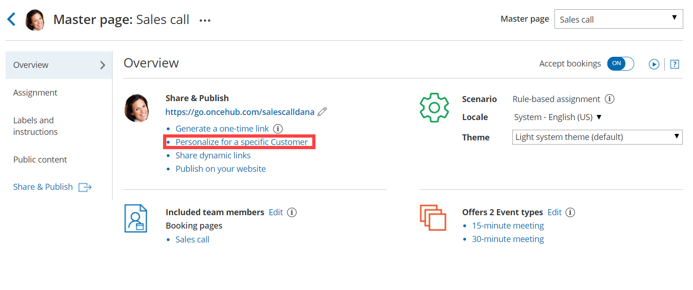
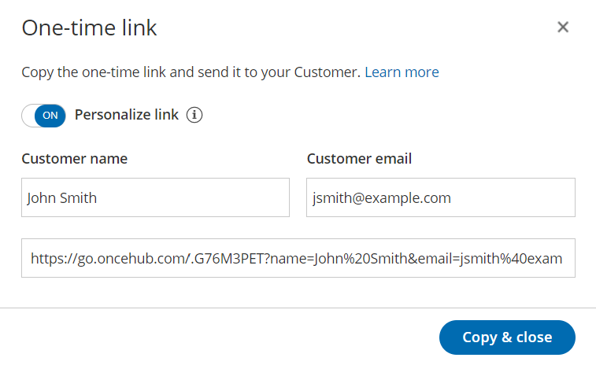

import { Aside } from '@astrojs/starlight/components';

Each Booking page and Master page has its own unique Public link that can be shared with your prospects and Customers. The links that you share can either be [general](/using-general-links/ "Using General links") or personalized. 

In this article, you'll learn about the different types of Personalized links and how to use them.

```
&lt;script id="snippet-prepend">
$(function()&#123;
  
  /*disable in widget*/
  if($('.w-documentation-article').length === 0)&#123;

     var ToC =
  "&lt;nav role='navigation' class='table-of-contents toc-top'><h4>In this article:" + "<ul>";
     var el,     title, link, header;
      //Define the heading levels you want to use in ascending order. Can add extra or remove unneeded.
     $(".hg-article-body h1, .hg-article-body h2, .hg-article-body h3, .hg-article-body h4").each(function() &#123;
              el = $(this);
              title = el.text();
                 if(title != '')&#123;
                anchorTitle = el.text().replace(/([~!@#$%^&*()_+=`&#123;&#125;\[\]\|\\:;'&lt;>,.\/\? ])+/g, '-').toLowerCase();
                link = "#" + anchorTitle;
                //Set all headers to a 0-nesting level.
                header = 'header-nesting-0';
                //Adjust header-nesting layers so that they point to the correct html tag. header-nesting-1 should match the second .hg-article-body h# listed above; header-nesting-2 should match the third, etc.
                if($(this).is('h2'))&#123;
                    header = 'header-nesting-1';
                &#125;else if($(this).is('h3'))&#123;
                    header = 'header-nesting-2'
                &#125;
                el.html('<a id="'+anchorTitle+'" class="toc-anchor">' + el.html());
                newLine =
      "<li class='"+header+"'>" +
        "<a class='article-anchor' href='" + link + "'>" +
          title +
        "" +
      "";


                ToC += newLine;
              &#125;
              &#125;);
     ToC +=
   "" +
  "";
    $("#snippet-prepend").before(ToC);
  &#125;
&#125;);

&lt;/script>
```

```
&lt;style>
/* CSS to style the TOC as it displays and the auto-created anchors
.toc-top styles the box for the TOC; adjust styles here to tweak look and feel */
  
.toc-top &#123;
  background-color: #FAFAFA; /* set to #fff or delete entirely for no background */
  border: 1px solid #C8C8C8; /* adjust the color hex here to change border color */
  box-shadow: 0 1px 1px rgba(0, 0, 0, 0.05) inset;
  margin-top: 24px;
  margin-bottom: 36px;
  min-height: 20px;
  padding: 13px 20px;
  max-width: 75%;
&#125;
.toc-top h4 &#123;
  font-size: 18px;
  line-height: 26px;
  margin: 0 0 8px;
  font-weight: 400;
&#125;
.toc-top ul &#123;
  padding: 0 0 0 15px !important;
  margin-bottom: 0;	
&#125;
.toc-top > ul &#123;
  margin-bottom: 13px!important;
&#125;
.toc-anchor &#123;
  display: block;
  height: 90px; 
  margin-top: -90px; 
  visibility: hidden;
&#125;

/* Set the indentation for the nesting levels. May need to be edited to match changes above. Increase or decrease the margin-left to get your desired level of indentation. */
.header-nesting-1 &#123;
    margin-left: 14px;
&#125;
.header-nesting-1:before &#123;
	background-image: url(https://dyzz9obi78pm5.cloudfront.net/app/image/id/5d31bcc88e121c9b25ba22c4/n/bulletv2.svg)!important;
&#125;
.header-nesting-2 &#123;
    margin-left: 28px;
&#125;
.header-nesting-2:before &#123;
	background-image: url(https://dyzz9obi78pm5.cloudfront.net/app/image/id/5d31be536e121cf22b0cc6ae/n/bulletv3.svg)!important;
&#125;
&lt;/style>
```

# Understanding Personalized links

You can use Personalized links to personalize the scheduling experience for prospects and Customers. When you send a Customer a Personalized link, they will pick a time to schedule the meeting without having to provide any information that is already known to you. Personalized links can be static or dynamic. Whether a link is static or dynamic is based on how Customer data is passed.

# Personalized links with static variables

Static Personalized links are links that are uniquely personalized for a specific Customer and contain the Customer's personal details. For example, the Personalized link could contain the Customer's name and email address. 

The following link is an example of a static Personalized link containing the personal details of a Customer called "John":   
[https://go.oncehub.com/dana?name=John&email=john@example.com&skip=1](https://go.oncehub.com/dana?name=John&email=john@example.com&skip=1).

[Personalized links with static variables](/introduction-to-personalizing-links-with-static-parameters/)

## Personalized links for specific Customers

You can create a static Personalized link for a specific Customer by selecting the **Share icon** in your top navigation bar:

1.  Click on **Booking Pages** in the left-hand menu.
2.  Click on **Share** near the top-right.
3.  Select the Booking page or Master page you want to share from the dropdown menu.
4.  Toggle the **Personalize link** option to ON.
5.  Enter the customer's name and email address.
6.  Click on **Copy & close** to save it to you clipboard.

You can also create this type of Personalized link by going to the Overview section of a [Booking page](/booking-page-overview-section/ "Booking page: Overview section") or [Master page](/master-page-overview-section/ "Master page: Overview section") and clicking **Personalize for a specific Customer** (Figure 1). 

Figure 1: Personalize for a specific Customer

[Learn more about creating a Personalized link for a specific Customer](/creating-a-personalized-link-for-a-specific-customer/ "Creating a Personalized link for a specific Customer")

## Personalized one-time links

You can also [use one-time links](/one-time-links/ "Using one-time links with your Master page") to create a static Personalized link for a specific Customer. One-time links are good for one booking only, eliminating any chance of unwanted repeat bookings. A Customer who receives the link will only be able to use it for the intended booking and will not have access to your underlying [Booking page](/introduction-to-booking-pages/ "Introduction to Booking pages"). 

**Note**One-time links are only available for [Master pages](/introduction-to-master-pages/ "Introduction to Master pages") using [Rule-based assignment](/team-or-panel-page/ "Master page scenario: Rule-based assignment") with [Dynamic rules](/assignment-with-team-or-panel-pages/ "Rule-based assignment: Dynamic rules").

To create a Personalized one-time link, go to the **Schedule button** in your top navigation bar, select **Share a booking link**, and and toggle both the **Personalize link** and **One-time link** options to ON.

You can also go to the Overview section of your Master page and click **Generate a one-time link**. Then, in the **One-time link** pop-up, toggle **Personalize link** to ON (Figure 2). 

When you personalize a one-time link, the Booking form step is skipped by default. You can choose to show the Booking form by changing the **Skip** URL parameter to "&skip=0". [Learn more about using OnceHub URL parameters](/scheduleonce-url-parameters-and-processing-rules/ "OnceHub URL parameters and processing rules")

Figure 2: Personalizing a one-time link 

[Learn more about using one-time links](/one-time-links/ "Using one-time links with your Master page")

# Personalized links with dynamic variables

Dynamic Personalized links are links that contain field mapping information, i.e. names of fields that exist in a CRM record ID or in a third-party marketing app such as [MailChimp](http://mailchimp.com/).

For example, the following dynamic link contains MailChimp fields, which are automatically replaced with subscriber information during an email campaign: _https://go.oncehub.com/dana?name=\*|NAME|\*&email=\*|EMAIL|\*_.

If you need to replace the **ADD_DYNAMIC_FIELD** placeholders (Figure 4) with your own parameters, you can copy the link to a notepad. [Learn more about supported OnceHub URL parameters](/scheduleonce-url-parameters-and-processing-rules/ "OnceHub URL parameters and processing rules")

When you create a dynamic Personalized link, you can also choose to [prepopulate the Booking with the Customer's details](/prepopulated-booking-forms/ "Prepopulated Booking forms") or skip the Booking form step altogether.

[Learn more about Personalized links with dynamic variables](/introduction-to-personalizing-links-with-dynamic-parameters/ "Personalized links with dynamic variables")

## Using dynamic URL parameters

You can pass Customer information using [parameters passed in the URL](/how-to-create-a-personalized-link-url-parameters/ "How to create a Personalized Link (URL parameters)") (such as the Customer's name, email, or phone number). These links can be personalized for each recipient receiving the link in a [mass email campaign](/scheduleonce-solution-for-lead-qualification/ "ScheduleOnce solution for lead qualification"). These links must be sent through a email marketing app that supports merge fields.

[Learn more about Personalized links using URL parameters](/how-to-create-a-personalized-link-url-parameters/ "Creating a Personalized link using URL parameters")

## Using CRM record IDs

You can also pass Customer information using data that's stored in a database such as your [Infusionsoft CRM](/using-personalized-links-infusionsoft-id/ "Using Personalized links (Infusionsoft ID)"), [Salesforce CRM](/using-personalized-links-salesforce-id/ "Using Personalized links (Salesforce ID)"), or your OnceHub account.

*   [Personalized links (Salesforce ID)](/using-personalized-links-salesforce-id/ "Using Personalized links (Salesforce ID)"): If you're using our [native Salesforce integration](/the-scheduleonce-connector-for-salesforce/ "The ScheduleOnce connector for Salesforce"), your links can be automatically personalized for each recipient receiving the link in a [mass email campaign](/scheduleonce-solution-for-lead-qualification/ "ScheduleOnce solution for lead qualification"). These links must be sent from Salesforce or a Salesforce-integrated app. 
*   [Personalized links (Infusionsoft ID)](/using-personalized-links-infusionsoft-id/ "Using Personalized links (Infusionsoft ID)"): If you're using our [native Infusionsoft integration](/connecting-to-infusionsoft/ "Connecting to Infusionsoft"), your links can be automatically personalized for each recipient receiving the link in a [mass email campaign](/scheduleonce-solution-for-lead-qualification/ "ScheduleOnce solution for lead qualification"). These links must be sent from Infusionsoft or an Infusionsoft-integrated app.

[Learn more about personalized links using CRM record IDs](/personalized-links-using-crm-record-ids/ "Personalized links using CRM record IDs")

# Booking form prepopulation and skipping

When you create a Personalized link, you can choose to prepopulate the [Booking with the Customer's details](/prepopulated-booking-forms/ "Prepopulated Booking forms") or skip the Booking form step altogether. 

## Prepopulating the Booking form

If you already have some of your Customer's information and want to collect additional information, or you want to make sure the information is up-to-date, you can **prepopulate** the Booking form with your current Customer information.

When the Booking form is prepopulated, it can operate in two modes: private or public. The mode of the Booking form depends on the source of the prepopulation data. Prepopulation data can originate from two sources:

*   Parameters passed in the URL to the Booking page.
*   Customer information stored in a Database such as your CRM or OnceHub account.

[Learn more about prepopulated Booking forms](/prepopulated-booking-forms/ "Prepopulated Booking forms")

## Skipping the Booking form

This option skips the Booking form step entirely and means your Customers only needs to choose a time to complete the booking. Skipping the Booking form provides a quicker booking process to your existing leads or Customers.

This functionality only works if the skipping rules apply. For example, both the Name and Email system fields must be provided in the URL because they are mandatory fields in OnceHub. The Booking form will not be skipped if these fields are empty, and a prepopulated Booking form will be shown instead to give the Customer an opportunity to fill out these fields.

[Learn more about OnceHub URL parameters and processing rules](/scheduleonce-url-parameters-and-processing-rules/ "OnceHub URL parameters and processing rules")