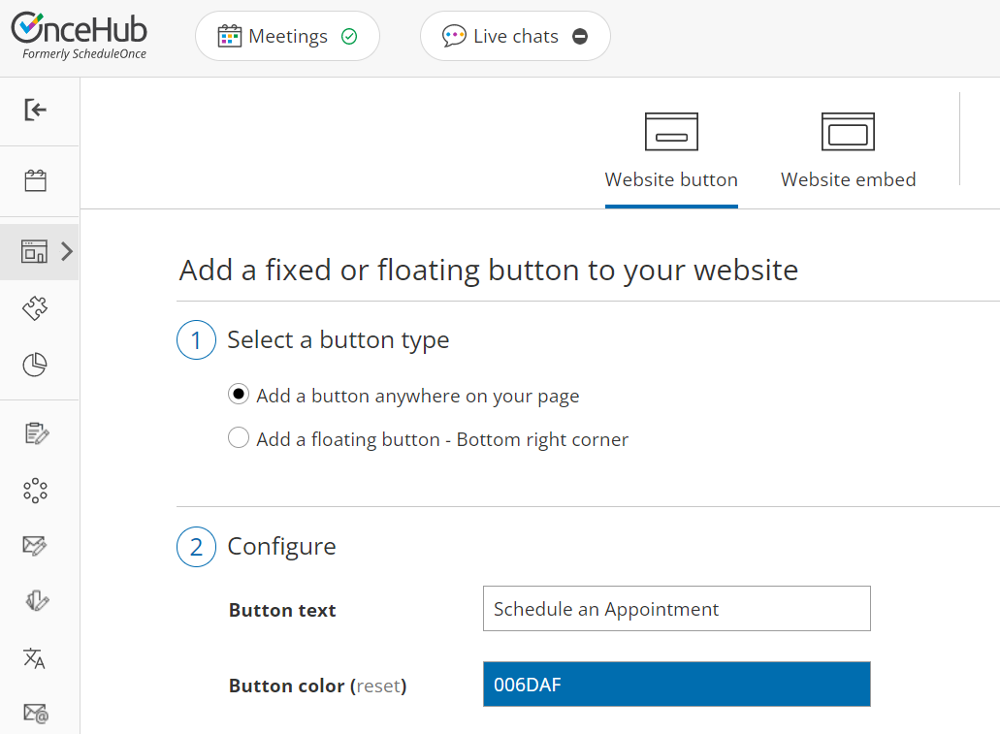

import { Aside } from '@astrojs/starlight/components';

Adding a Website button to your Wordpress blog allows your Customers to schedule an appointment with you without leaving your blog.

In this article, you'll learn how to add a Website button to your [Wordpress.org](https://Wordpress.org) site. 

# Adding a button to Wordpress

**Note**Some WordPress themes do not support Javascript and therefore cannot support our website integration, which requires Javascript. This is true of all Wordpress.com sites.

Other WordPress themes, depending on how the theme was coded by the individual theme creator, might encounter other issues with the website integration. However, the vast majority work smoothly if the above guidelines are followed.

1.  Go to **Booking** **pages** in the bar on the left → **Booking page → Share & Publish**.
2.  Select the **Website button** tab (Figure 1).  
    Figure 1: Website button tab
3.  In the **Select a button type** step, select whether you want to **Add a button anywhere on your page** or **Add a floating button**.
4.  In the **Configure** step, you can edit the **Button text** and select the **Button color**.
5.  In the **Select a Booking page** step, select the [Booking page](/introduction-to-booking-pages/ "Introduction to Booking pages") or [Master page](/introduction-to-master-pages/ "Introduction to Master pages") you want to create the website button for.
6.  In the **Customer data** step, select to have Customers fill out the Booking form, or select a [Web form integration](/introduction-to-webform-integration/ "Introduction to Webform Integration") option.
7.  From the **Button code** step, choose the **Display type**.
8.  Click the **Copy** button to the copy the code to your clipboard.
9.  Next, go to your [Wordpress Administration page](https://wordpress.org/support/article/administration-screens/).
10.  In the left sidebar, select **Appearance**.
11.  Select **Widgets**. 
12.  Select the **Custom HTML** widget. 
13.  Next, choose whether you want to add it to your **Blog Sidebar** or **Footer**.
14.  Click **Add Widget**.
15.  In the **Custom HTML** pop-up, paste the button code from OnceHub.
16.  Click **Done**.
17.  Test the button on your blog and make any adjustments.