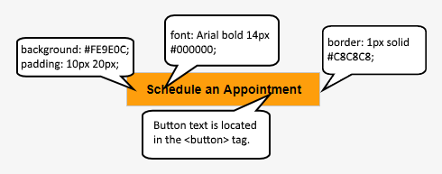

import { Aside } from '@astrojs/starlight/components';

The  Website button publishing options can be added to any page on your website, allowing your Customers to schedule without leaving your website. This scheduling method creates an effective call to action, motivating your leads and prospects to schedule with you.

The code provided by OnceHub creates two elements on your page: the button and the lightbox that shows the scheduling pane. The design and layout of the call-to-action button and the scheduling lightbox can be customized. Many button settings [can be customized](/website-button/ "Website button") on the **Share & Publish** page. For more customization, you can add CSS properties to the code.

In this article, you'll learn about customizing the Website button publishing option. 

**Note**This article describes customizing button design and size of the Website button. The design of the scheduling process itself is determined by the [Theme](/the-theme-designer/ "The Theme Designer") applied on the Overview section of the embedded [Booking page](/booking-page-overview-section/ "Booking page: Overview section") or [Master page](/master-page-overview-section/ "Master Page: Overview section").

```
&lt;script id="snippet-prepend">
$(function()&#123;
  
  /*disable in widget*/
  if($('.w-documentation-article').length === 0)&#123;

     var ToC =
  "&lt;nav role='navigation' class='table-of-contents toc-top'><h4>In this article:" + "<ul>";
     var el,     title, link, header;
      //Define the heading levels you want to use in ascending order. Can add extra or remove unneeded.
     $(".hg-article-body h1, .hg-article-body h2, .hg-article-body h3, .hg-article-body h4").each(function() &#123;
              el = $(this);
              title = el.text();
                 if(title != '')&#123;
                anchorTitle = el.text().replace(/([~!@#$%^&*()_+=`&#123;&#125;\[\]\|\\:;'&lt;>,.\/\? ])+/g, '-').toLowerCase();
                link = "#" + anchorTitle;
                //Set all headers to a 0-nesting level.
                header = 'header-nesting-0';
                //Adjust header-nesting layers so that they point to the correct html tag. header-nesting-1 should match the second .hg-article-body h# listed above; header-nesting-2 should match the third, etc.
                if($(this).is('h2'))&#123;
                    header = 'header-nesting-1';
                &#125;else if($(this).is('h3'))&#123;
                    header = 'header-nesting-2'
                &#125;
                el.html('<a id="'+anchorTitle+'" class="toc-anchor">' + el.html());
                newLine =
      "<li class='"+header+"'>" +
        "<a class='article-anchor' href='" + link + "'>" +
          title +
        "" +
      "";


                ToC += newLine;
              &#125;
              &#125;);
     ToC +=
   "" +
  "";
    $("#snippet-prepend").before(ToC);
  &#125;
&#125;);

&lt;/script>
```

```
&lt;style>
/* CSS to style the TOC as it displays and the auto-created anchors
.toc-top styles the box for the TOC; adjust styles here to tweak look and feel */
  
.toc-top &#123;
  background-color: #FAFAFA; /* set to #fff or delete entirely for no background */
  border: 1px solid #C8C8C8; /* adjust the color hex here to change border color */
  box-shadow: 0 1px 1px rgba(0, 0, 0, 0.05) inset;
  margin-top: 24px;
  margin-bottom: 36px;
  min-height: 20px;
  padding: 13px 20px;
  max-width: 75%;
&#125;
.toc-top h4 &#123;
  font-size: 18px;
  line-height: 26px;
  margin: 0 0 8px;
  font-weight: 400;
&#125;
.toc-top ul &#123;
  padding: 0 0 0 15px !important;
  margin-bottom: 0;	
&#125;
.toc-top > ul &#123;
  margin-bottom: 13px!important;
&#125;
.toc-anchor &#123;
  display: block;
  height: 90px; 
  margin-top: -90px; 
  visibility: hidden;
&#125;

/* Set the indentation for the nesting levels. May need to be edited to match changes above. Increase or decrease the margin-left to get your desired level of indentation. */
.header-nesting-1 &#123;
    margin-left: 14px;
&#125;
.header-nesting-1:before &#123;
	background-image: url(https://dyzz9obi78pm5.cloudfront.net/app/image/id/5d31bcc88e121c9b25ba22c4/n/bulletv2.svg)!important;
&#125;
.header-nesting-2 &#123;
    margin-left: 28px;
&#125;
.header-nesting-2:before &#123;
	background-image: url(https://dyzz9obi78pm5.cloudfront.net/app/image/id/5d31be536e121cf22b0cc6ae/n/bulletv3.svg)!important;
&#125;
&lt;/style>
```

# Requirements

To embed a scheduling pane on your website, you must be a webmaster for your company's website, or have direct access to your company website’s admin area.

# Customization steps

1.  Go to **Booking** **pages** in the bar on the left → **Booking page → Share & Publish**.
2.  Select the **Website button** tab (Figure 1).  
    Figure 1: Website button tab
3.  In the **Select a button type** step, select whether you want to **Add a button anywhere on your page** or **Add a floating button**.
4.  In the **Configure** step, you can edit the **Button text** and select the **Button color**.
5.  In the **Select a Booking page** step, select the [Booking page](/introduction-to-booking-pages/ "Introduction to Booking pages") or [Master page](/introduction-to-master-pages/ "Introduction to Master pages") you want to create the website button for.
6.  In the **Customer data** step, select to have Customers fill out the Booking form, or select a [web form integration](/introduction-to-webform-integration/ "Introduction to Webform Integration") option.
7.  From the **Button code** step, choose the **Display type**.
8.  Click the **Copy** button to the copy the code to your clipboard.
9.  Paste the code into the relevant location on your website.

After you've pasted the code, you can follow the steps below to customize the button design and lightbox layout.

# Customizing the button design

You can modify, add, or remove CSS properties in the code to achieve the most effective design for your website visitors. The text on the button can also be modified. The text on the button appears in the code just before the closing &lt;/button> tag.


&lt;button id="SOIBTN_BookingPageLink" style="background: #FE9E0C; color: #000000; padding: 10px 20px; border: 1px solid #c8c8c8; font: bold 14px Arial; cursor: pointer;" data-height="580"  data-psz="00" data-so-page="BookingPageLink" data-delay="1">Schedule an Appointment&lt;/button>

&lt;script type="text/javascript" src="https://cdn.oncehub.com/mergedjs/so.js">&lt;/script>


The following properties can be modified, among others: 

*   Background color 
*   Padding (the spacing between and the text and the border) 
*   Border thickness and color
*   Font family, style and color 

Figure 2: Modifiable button properties

# Customizing the lightbox layout

When you use a Website button, the Booking page can either open in a new browser tab or a lightbox. You should choose which option you prefer before copying the code from the **Share & Publish** page. In either case, the design of the scheduling process itself is [determined by the Theme](/the-theme-designer/ "Introduction to the ScheduleOnce Theme designer") applied in the Overview section of the [Booking page](/booking-page-overview-section/ "Booking page: Overview section") or [Master page](/master-page-overview-section/ "Master Page: Overview section") you selected in the **Select a Booking page** step.

**Note**On mobile devices, the scheduling pane will always open in a new page, even if you selected the lightbox option.

## Open in a lightbox

The **Open in a lightbox** option opens the Booking page or Master page in a lightbox. This option is instant and brandless, allowing your customers to schedule without ever leaving your website. 

The lightbox width is a fixed to 796 pixels and cannot be modified. Due to width limitations, on mobile devices the scheduling pane will always open in a new page, even if you selected to open your page in a lightbox. 

OnceHub handles the **lightbox height** in two ways:

*   **Fixed height**: By default, the height is set to 580 pixels. You can change the default height to any number you want by changing the height property in the code. When the content is longer than the lightbox height, a vertical scroll bar will be added automatically.
*   **Responsive height**: This will automatically adjust the height to the frame content. To use this method, you must delete the height property in the code. In this case, the height will adapt to the content of each step in the scheduling process. 


&lt;button id="SOIBTN_BookingPageLink" style="background: #FE9E0C; border: 1px solid #C8C8C8; padding: 10px 20px; font: Arial bold 14px #000000;" data-height="580"  data-psz="00" data-so-page="BookingPageLink" data-delay="1">Schedule an Appointment&lt;/button>

&lt;script type="text/javascript" src="https://cdn.oncehub.com/mergedjs/so.js">&lt;/script>


## Lightbox height recommendations

*   For most cases, the default height is the recommended option.
*   Modify the lightbox height if the content of the steps in your scheduling process is consistently shorter or longer than the default height.
*   Remove the lightbox height attribute completely if you want your Customers to scroll using the external browser scroll bar, rather than the internal lightbox scroll bar.

## Open in a new page

The **Open in a new page** option opens your Booking page or Master page as a full page. This is similar to opening your Booking page from a link in an email.