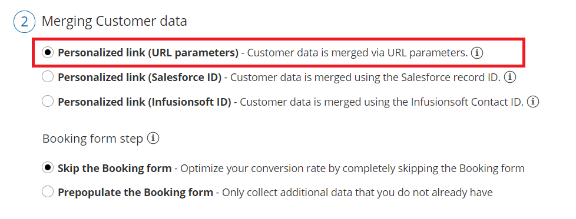
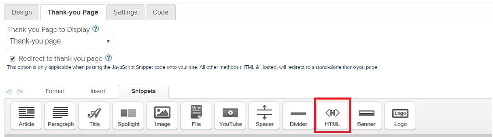

import { Aside } from '@astrojs/starlight/components';

When your Infusionsoft web form is integrated with OnceHub, your Customers will be able to schedule meetings immediately after submitting the form. They are redirected to a Booking page or Thank you page. The Customer can then pick a time to schedule the booking without having to provide any additional information. The appointment is then scheduled and added to the Infusionsoft Contact.

In this article, you'll learn about integrating OnceHub with Infusionsoft web forms. 

```
&lt;script id="snippet-prepend">
$(function()&#123;
  
  /*disable in widget*/
  if($('.w-documentation-article').length === 0)&#123;

     var ToC =
  "&lt;nav role='navigation' class='table-of-contents toc-top'><h4>In this article:" + "<ul>";
     var el,     title, link, header;
      //Define the heading levels you want to use in ascending order. Can add extra or remove unneeded.
     $(".hg-article-body h1, .hg-article-body h2, .hg-article-body h3, .hg-article-body h4").each(function() &#123;
              el = $(this);
              title = el.text();
                 if(title != '')&#123;
                anchorTitle = el.text().replace(/([~!@#$%^&*()_+=`&#123;&#125;\[\]\|\\:;'&lt;>,.\/\? ])+/g, '-').toLowerCase();
                link = "#" + anchorTitle;
                //Set all headers to a 0-nesting level.
                header = 'header-nesting-0';
                //Adjust header-nesting layers so that they point to the correct html tag. header-nesting-1 should match the second .hg-article-body h# listed above; header-nesting-2 should match the third, etc.
                if($(this).is('h2'))&#123;
                    header = 'header-nesting-1';
                &#125;else if($(this).is('h3'))&#123;
                    header = 'header-nesting-2'
                &#125;
                el.html('<a id="'+anchorTitle+'" class="toc-anchor">' + el.html());
                newLine =
      "<li class='"+header+"'>" +
        "<a class='article-anchor' href='" + link + "'>" +
          title +
        "" +
      "";


                ToC += newLine;
              &#125;
              &#125;);
     ToC +=
   "" +
  "";
    $("#snippet-prepend").before(ToC);
  &#125;
&#125;);

&lt;/script>
```

```
&lt;style>
/* CSS to style the TOC as it displays and the auto-created anchors
.toc-top styles the box for the TOC; adjust styles here to tweak look and feel */
  
.toc-top &#123;
  background-color: #FAFAFA; /* set to #fff or delete entirely for no background */
  border: 1px solid #C8C8C8; /* adjust the color hex here to change border color */
  box-shadow: 0 1px 1px rgba(0, 0, 0, 0.05) inset;
  margin-top: 24px;
  margin-bottom: 36px;
  min-height: 20px;
  padding: 13px 20px;
  max-width: 75%;
&#125;
.toc-top h4 &#123;
  font-size: 18px;
  line-height: 26px;
  margin: 0 0 8px;
  font-weight: 400;
&#125;
.toc-top ul &#123;
  padding: 0 0 0 15px !important;
  margin-bottom: 0;	
&#125;
.toc-top > ul &#123;
  margin-bottom: 13px!important;
&#125;
.toc-anchor &#123;
  display: block;
  height: 90px; 
  margin-top: -90px; 
  visibility: hidden;
&#125;

/* Set the indentation for the nesting levels. May need to be edited to match changes above. Increase or decrease the margin-left to get your desired level of indentation. */
.header-nesting-1 &#123;
    margin-left: 14px;
&#125;
.header-nesting-1:before &#123;
	background-image: url(https://dyzz9obi78pm5.cloudfront.net/app/image/id/5d31bcc88e121c9b25ba22c4/n/bulletv2.svg)!important;
&#125;
.header-nesting-2 &#123;
    margin-left: 28px;
&#125;
.header-nesting-2:before &#123;
	background-image: url(https://dyzz9obi78pm5.cloudfront.net/app/image/id/5d31be536e121cf22b0cc6ae/n/bulletv3.svg)!important;
&#125;
&lt;/style>
```

# Benefits of integrating OnceHub with Infusionsoft web forms 

When you create an Infusionsoft Campaign, you can define goals for your Infusionsoft Contacts. A goal can be achieved when an Infusionsoft Contact submits a web form.

After the form is submitted, Infusionsoft can automatically pass the Contact ID to a redirect page. Recognizing the Customer by the Infusionsoft Contact ID provides two key benefits:

*   On the User side, it eliminates any chances of updating the wrong record. 
*   On the Customer side, it allows you to [prepopulate the Booking form step with Infusionsoft record data or completely skip the Booking form step](/how-to-prepopulate-or-skip-the-booking-form-step-in-infusionsoft-integration/ "How to prepopulate or skip the Booking form step in Infusionsoft integration"). This eliminates the need to ask Customers for information you already have, improving conversion rates and moving leads through the funnel with speed and efficiency.

# Redirecting options

Contacts can be automatically redirected to a [Booking page link](/how-to-share-links-in-emails-and-other-apps/ "How to share links in emails and other apps"), an [Infusionsoft thank you page](https://help.infusionsoft.com/help/landing-pages-choosing-a-template), or a [custom landing page](/using-infusionsoft-contact-id-to-personalize-scheduling-in-landing-pages/ "Using InfusionSoft Contact ID to personalize scheduling in landing pages"). In all cases, your Customer will be able to pick a time to schedule the booking without having to provide any additional information. The appointment is then scheduled and added to the Infusionsoft Contact.

**Note**For security and privacy reasons, using CRM record IDs to skip or pre-populate the Booking form is not compatible with [collecting data from an embedded Booking page](https://developers.oncehub.com/docs/client-side-api/collecting-data-from-embedded-booking-page/) or [redirecting booking confirmation data](https://developers.oncehub.com/docs/client-side-api/redirecting-booking-confirmation-data/).

## Redirecting to a Booking page

1.  Go to **Booking** **pages** in the bar on the left → **Booking page → Share & Publish**.
2.  In the **Mail Merge** section, use the drop-down menu to select the Booking page or Master page that you want to create a link for (Figure 1).Figure 1: Select Booking page
3.  In the **Customer data** step, select **Personalized** **link** (Figure 2). Figure 2: Customer data step
4.  Click the **Copy link** button to copy the link to your clipboard. If you want to skip the Booking form step, when you paste the link you should add the soskip parameter to the link: http:// go.oncehub.com/johnsmith?soskip=1.Figure 3: Copy link
5.  In Infusionsoft, go to **Marketing → Campaign builder**. 
6.  Open an existing campaign or create a new one. 
7.  In the campaign builder, click and drag the **Web form submitted** goal onto the campaign canvas. Figure 4: Infusionsoft campaign builder canvas
8.  Double-click the **Web form submitted** goal to configure the web form.
9.  In the **Thank-you page** tab, select **Web address** from the drop-down menu.
10.  Copy and paste the Booking page link into the **URL field** (Figure 5).Figure 5: Thank-you page tab
11.  Check the **Pass contact's information to the thank-you page** check box to automatically pass the Contact ID to the Booking page.
12.  Click the Back arrow to return to the Campaign Builder. 

**Note**You can also create [Personalized links (Infusionsoft ID)](/using-personalized-links-infusionsoft-id/ "Using Personalized links (Infusionsoft ID)") to send to specific Customers. 

## Redirect to an Infusionsoft Thank you page

When you redirect to an Infusionsoft Thank you page, the Infusionsoft Contact ID is passed automatically to the [Website embed](/website-embed/ "Website Embed") or [Website button](/website-button/ "Website Button") placed on your landing page.

1.  Go to **Booking** **pages** in the bar on the left → **Booking page → Share & Publish**.
2.  In the **Website embed** tab, select the [Booking page](/introduction-to-booking-pages/ "Introduction to Booking pages") or [Master page](/introduction-to-master-pages/ "Introduction to Master pages") you want to embed on your website (Figure 6). Figure 6: Select a Booking page step
3.  Use the **Width** drop-down menu to select the width of the Scheduling pane outer border. 
4.  Use the **Color** option to change the color of the border.
5.  In the **Customer data** step, select to have Customers fill out the Booking form, or select a [web form integration](/introduction-to-webform-integration/ "Introduction to web form integration") option. 
6.  Select whether you want to **Skip the Booking form** or **Prepopulate the Booking form**.
7.  Click the **Copy** button to the copy the code to your clipboard.
8.  In Infusionsoft, go to **Marketing → Campaign** **builder**. 
9.  Open an existing campaign or create a new one. 
10.  In the Campaign builder, click and drag the **Web form submitted** goal onto the campaign canvas.
11.  Double-click the **Web form submitted** goal to configure the web form.
12.  In the **Thank-you page** tab, select **Thank-you page** from the drop-down menu.
13.  In the **Snippets** snippets tab (Figure 7), click and drag the HTML snippet onto the Thank-you page**.Figure 7: Thank-page Snippets tab**
14.  Add the Website embed code to the snippet. If the Infusionsoft HTML snippet reformats the embed code, you will need to add the code below to display the embed correctly. In the code below, replace the following information:
     *   Replace BOOKING_PAGE_LINK with your Booking page link or Master page link, without the domain. Example: use just "TestPage" if your full link is https://go.oncehub.com/TestPage.
     *   To skip the Booking form, add the OnceHub parameter soSkip=1
     *   To pass the Infusionsoft contact ID, add the OnceHub parameter soisContactID=~Contact.Id~ 
         
         
         
         <div id ="SOIDIV_test" data-so-page="BOOKING_PAGE_LINK&soSkip=1&soisContactID=~Contact.Id~&em=1" data-height="550" data-style="border:1px solid #d8d8d8; min-width: 290px; max-width:900px;" data-psz="01"></div>
         
         &lt;script type="text/javascript" src="https://cdn.oncehub.com/mergedjs/so.js">&lt;/script>
         
         
         
15.  Then, click **Save**. 

To test your Thank-you page, click the **Test** button.

## Redirect to a custom landing page

The Infusionsoft Contact ID is passed automatically to a [Website embed](/website-embed/ "Website Embed") or [Website button](/website-button/ "Website Button") placed on your landing page. If you want to [pass the OnceHub parameter soSkip](/using-infusionsoft-contact-id-to-identify-customers-during-the-booking-process/ "Using Infusionsoft Contact IDs to identify Customers during the booking process"), you can add ?_soSkip=1_ to your landing page link.

1.  In the **Thank-you page** tab, select **Web address** from the **Thank you page to display** drop-down list.
2.  Copy and paste your Landing page link into the **URL field**.
3.  Add ?soSkip=1 to your landing page link. Your link will look like this: http://www.example.com?soSkip=1
4.  Check the **Pass contact's information to the thank-you page** check box to automatically pass the Contact ID to the Booking page.

**Important**If the [Website embed](/website-embed/ "Website embed") or [Website button](/website-button/ "Website button") code was placed on your webpage was added prior to November 7, 2015, you will need to replace it with the updated OnceHub code. 

Sign in to your OnceHub account,

*   Go to **Booking** **pages** in the bar on the left → **Booking page → Share & Publish**. Select the **Website embed** or **Website button tab**. In the **Customer data** step, select **Customer data is passed using the Infusionsoft Contact ID** (web form integration). Then, copy and paste the embed or button code in your landing page.