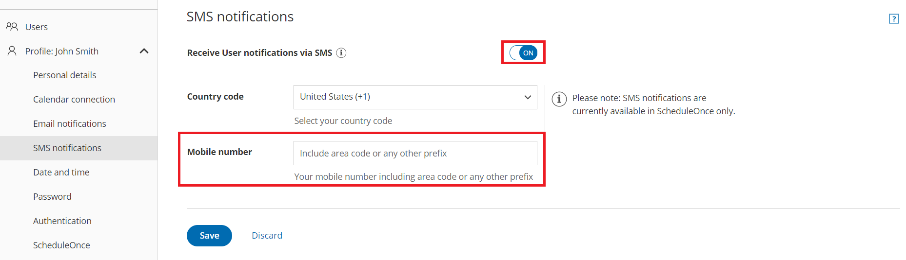
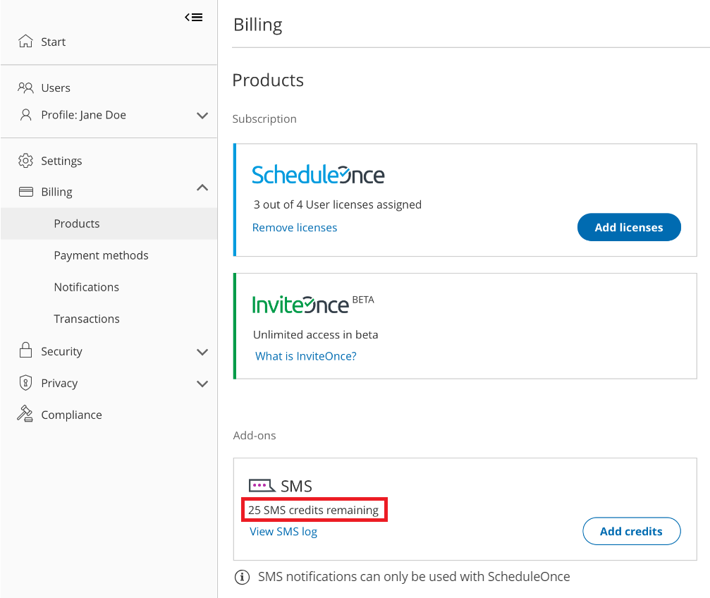

import { Aside } from '@astrojs/starlight/components';

There can be a number of reasons why a User is not receiving [SMS notifications](/getting-started-with-oncehub/introduction-to-oncehub/introduction-to-sms-notifications/ "Introduction to SMS notifications"). This article is relevant to Users who have never received User SMS notifications and to Users who were receiving them but suddenly are no longer receiving them.

```
&lt;script id="snippet-prepend">
$(function()&#123;
  
  /*disable in widget*/
  if($('.w-documentation-article').length === 0)&#123;

     var ToC =
  "&lt;nav role='navigation' class='table-of-contents toc-top'><h4>In this article:" + "<ul>";
     var el,     title, link, header;
      //Define the heading levels you want to use in ascending order. Can add extra or remove unneeded.
     $(".hg-article-body h1, .hg-article-body h2, .hg-article-body h3, .hg-article-body h4").each(function() &#123;
              el = $(this);
              title = el.text();
                 if(title != '')&#123;
                anchorTitle = el.text().replace(/([~!@#$%^&*()_+=`&#123;&#125;\[\]\|\\:;'&lt;>,.\/\? ])+/g, '-').toLowerCase();
                link = "#" + anchorTitle;
                //Set all headers to a 0-nesting level.
                header = 'header-nesting-0';
                //Adjust header-nesting layers so that they point to the correct html tag. header-nesting-1 should match the second .hg-article-body h# listed above; header-nesting-2 should match the third, etc.
                if($(this).is('h2'))&#123;
                    header = 'header-nesting-1';
                &#125;else if($(this).is('h3'))&#123;
                    header = 'header-nesting-2'
                &#125;
                el.html('<a id="'+anchorTitle+'" class="toc-anchor">' + el.html());
                newLine =
      "<li class='"+header+"'>" +
        "<a class='article-anchor' href='" + link + "'>" +
          title +
        "" +
      "";


                ToC += newLine;
              &#125;
              &#125;);
     ToC +=
   "" +
  "";
    $("#snippet-prepend").before(ToC);
  &#125;
&#125;);

&lt;/script>
```

```
&lt;style>
/* CSS to style the TOC as it displays and the auto-created anchors
.toc-top styles the box for the TOC; adjust styles here to tweak look and feel */
  
.toc-top &#123;
  background-color: #FAFAFA; /* set to #fff or delete entirely for no background */
  border: 1px solid #C8C8C8; /* adjust the color hex here to change border color */
  box-shadow: 0 1px 1px rgba(0, 0, 0, 0.05) inset;
  margin-top: 24px;
  margin-bottom: 36px;
  min-height: 20px;
  padding: 13px 20px;
  max-width: 75%;
&#125;
.toc-top h4 &#123;
  font-size: 18px;
  line-height: 26px;
  margin: 0 0 8px;
  font-weight: 400;
&#125;
.toc-top ul &#123;
  padding: 0 0 0 15px !important;
  margin-bottom: 0;	
&#125;
.toc-top > ul &#123;
  margin-bottom: 13px!important;
&#125;
.toc-anchor &#123;
  display: block;
  height: 90px; 
  margin-top: -90px; 
  visibility: hidden;
&#125;

/* Set the indentation for the nesting levels. May need to be edited to match changes above. Increase or decrease the margin-left to get your desired level of indentation. */
.header-nesting-1 &#123;
    margin-left: 14px;
&#125;
.header-nesting-1:before &#123;
	background-image: url(https://dyzz9obi78pm5.cloudfront.net/app/image/id/5d31bcc88e121c9b25ba22c4/n/bulletv2.svg)!important;
&#125;
.header-nesting-2 &#123;
    margin-left: 28px;
&#125;
.header-nesting-2:before &#123;
	background-image: url(https://dyzz9obi78pm5.cloudfront.net/app/image/id/5d31be536e121cf22b0cc6ae/n/bulletv3.svg)!important;
&#125;
&lt;/style>
```

# Check that SMS notifications are enabled and that your mobile number is correct in your profile

1.  ```
    &lt;style type="text/css">
    p.p1 &#123;margin: 0.0px 0.0px 0.0px 0.0px; font: 13.0px 'Helvetica Neue'&#125;
    &lt;/style>
    ```
    
    Select your profile picture or initials in the top right-hand corner → Profile settings → **SMS notifications**. 
2.  Ensure that **Receive User notifications via SMS** is toggled **ON**. Figure 3: SMS notifications section
3.  Ensure that the number entered in the **Mobile numbe**r field is correct. Additionally, ensure that the number entered is a mobile number and not a landline number.

[Learn more about the SMS notifications section](/sending-sms-notifications-to-users/ "Profile: SMS notifications section")

# Check the User notification settings

In order to receive notifications about bookings made on a specific Booking page, the User must either be the Owner or an Editor of the Booking page. [Learn more about adding Editors to a Booking page](/booking-page-access-permissions/ "Booking page access permissions")

1.  ```
    &lt;style type="text/css">
    p.p1 &#123;margin: 0.0px 0.0px 0.0px 0.0px; font: 13.0px 'Helvetica Neue'&#125;
    &lt;/style>
    ```
    
    Hover over the lefthand menu and go to the Booking pages icon → Booking pages → your Booking page → [**User notifications**](/introduction-to-user-notifications/ "Introduction to User notifications section").
2.  Ensure that SMS notifications are enabled for the [Notification scenarios](/user-notification-scenarios/ "User notification scenarios") each User should receive SMS notifications for. Figure 2: User notifications section

[Learn more about the User notifications section](/introduction-to-user-notifications/ "Introduction to User notifications section")

# Make sure you have SMS credits available

1.  ```
    &lt;style type="text/css">
    p.p1 &#123;margin: 0.0px 0.0px 0.0px 0.0px; font: 13.0px 'Helvetica Neue'&#125;
    &lt;/style>
    ```
    
    Select your profile picture or initials in the top right-hand corner → **Profile settings** → **Billing → Licenses**. You can see the number of remaining SMS credits in the **SMS** box (Figure 1).Figure 1: SMS credits

If your SMS credit balance is zero, click the **Add credits** button to purchase more SMS credits. 

[Learn more about SMS pricing and purchasing SMS credits](/sms-pricing/ "SMS pricing and purchasing SMS credits")

# Check the SMS log

1.  Go to your OnceHub Account. 
2.  Select your profile picture or initials in the top right-hand corner → **Profile settings** → **Billing → Licenses **→ SMS **→** **[View SMS log](/sms-log-data/ "SMS log data")**.
3.  Check the status of the SMS. [Learn more about SMS delivery statuses](/user-account-management/account-management/account-management/understanding-sms-delivery-statuses/ "Understanding SMS delivery statuses")
4.  If the SMS shows a status of Delivered but the User did not receive it, [check that the User's mobile number is correct](#correctmobilenumber).

[Learn more about the SMS log](/sms-log-data/ "Tracking SMS usage")

# Send yourself a test SMS to see if it is received

1.  Go to the relevant Booking page [Overview section](/booking-page-overview-section/ "Booking page: Overview section").
2.  In the **Share & Publish** section, use the Public link to make a test booking.
3.  Open the SMS log and check the status of the SMS. 

If the SMS shows a status of Delivered but the User did not receive it, [check that the User's mobile number is correct](#CheckSMSnotificationsandmobilenumber).

If the SMS is not Delivered, or an SMS is not sent, you can:

*   Check that [SMS notifications are enabled in your Profile](#CheckSMSnotificationsandmobilenumber).
*   Check the [User notification settings](#notificationsettings). 
*   Make sure that you have [SMS credits available](#smscredits).