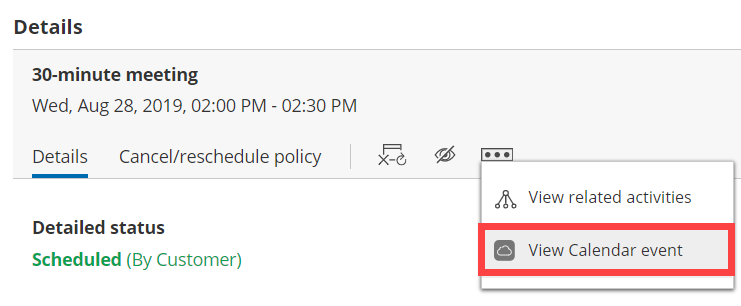

import { Aside } from '@astrojs/starlight/components';

This article describes potential issues with [iCloud Calendar](/connect-your-icloud-calendar/ "Introduction to iCloud Calendar connection") integration and how these issues can be fixed.  If you’re still having problems, please [contact us](/contact-us/) and we will be happy to assist you.

```
&lt;script id="snippet-prepend">
$(function()&#123;
  
  /*disable in widget*/
  if($('.w-documentation-article').length === 0)&#123;

     var ToC =
  "&lt;nav role='navigation' class='table-of-contents toc-top'><h4>In this article:" + "<ul>";
     var el,     title, link, header;
      //Define the heading levels you want to use in ascending order. Can add extra or remove unneeded.
     $(".hg-article-body h1, .hg-article-body h2, .hg-article-body h3, .hg-article-body h4").each(function() &#123;
              el = $(this);
              title = el.text();
                 if(title != '')&#123;
                anchorTitle = el.text().replace(/([~!@#$%^&*()_+=`&#123;&#125;\[\]\|\\:;'&lt;>,.\/\? ])+/g, '-').toLowerCase();
                link = "#" + anchorTitle;
                //Set all headers to a 0-nesting level.
                header = 'header-nesting-0';
                //Adjust header-nesting layers so that they point to the correct html tag. header-nesting-1 should match the second .hg-article-body h# listed above; header-nesting-2 should match the third, etc.
                if($(this).is('h2'))&#123;
                    header = 'header-nesting-1';
                &#125;else if($(this).is('h3'))&#123;
                    header = 'header-nesting-2'
                &#125;
                el.html('<a id="'+anchorTitle+'" class="toc-anchor">' + el.html());
                newLine =
      "<li class='"+header+"'>" +
        "<a class='article-anchor' href='" + link + "'>" +
          title +
        "" +
      "";


                ToC += newLine;
              &#125;
              &#125;);
     ToC +=
   "" +
  "";
    $("#snippet-prepend").before(ToC);
  &#125;
&#125;);

&lt;/script>
```

```
&lt;style>
/* CSS to style the TOC as it displays and the auto-created anchors
.toc-top styles the box for the TOC; adjust styles here to tweak look and feel */
  
.toc-top &#123;
  background-color: #FAFAFA; /* set to #fff or delete entirely for no background */
  border: 1px solid #C8C8C8; /* adjust the color hex here to change border color */
  box-shadow: 0 1px 1px rgba(0, 0, 0, 0.05) inset;
  margin-top: 24px;
  margin-bottom: 36px;
  min-height: 20px;
  padding: 13px 20px;
  max-width: 75%;
&#125;
.toc-top h4 &#123;
  font-size: 18px;
  line-height: 26px;
  margin: 0 0 8px;
  font-weight: 400;
&#125;
.toc-top ul &#123;
  padding: 0 0 0 15px !important;
  margin-bottom: 0;	
&#125;
.toc-top > ul &#123;
  margin-bottom: 13px!important;
&#125;
.toc-anchor &#123;
  display: block;
  height: 90px; 
  margin-top: -90px; 
  visibility: hidden;
&#125;

/* Set the indentation for the nesting levels. May need to be edited to match changes above. Increase or decrease the margin-left to get your desired level of indentation. */
.header-nesting-1 &#123;
    margin-left: 14px;
&#125;
.header-nesting-1:before &#123;
	background-image: url(https://dyzz9obi78pm5.cloudfront.net/app/image/id/5d31bcc88e121c9b25ba22c4/n/bulletv2.svg)!important;
&#125;
.header-nesting-2 &#123;
    margin-left: 28px;
&#125;
.header-nesting-2:before &#123;
	background-image: url(https://dyzz9obi78pm5.cloudfront.net/app/image/id/5d31be536e121cf22b0cc6ae/n/bulletv3.svg)!important;
&#125;
&lt;/style>
```

# I cannot connect. What should I do?

This may be due to temporary communication problems with the iCloud API. Please try the following:

1.  Make sure you are using an [iCloud app-specific password](https://support.apple.com/en-us/102654 "iCloud app-specific passwords").
2.  Make sure cookies are enabled on your browser.
3.  Verify that you can log into your iCloud account.
4.  Try to connect again from OnceHub.

If you’re still having problems, please [contact us](/contact-us/) and we will be happy to assist you.

# Connection error after a successful connection

**Important**During a connection failure, **OnceHub** **Booking pages cannot accept bookings**. This measure is taken to prevent the possibility of double bookings. 

Once a successful connection is established, it may fail due to a number of reasons. For example, If you change your primary Apple ID password, all your existing [iCloud app-specific passwords](https://support.apple.com/en-us/102654 "iCloud app-specific passwords") are automatically revoked and must be generated again. In this case, your OnceHub Account must be reconnected with a new app-specific password.

To reconnect your iCloud calendar, sign in to your OnceHub Account, go to the left sidebar and click **Profile** **\->** Calendar connection. Then click the **Reconnect your iCloud Calendar** button. You will need to reconnect your OnceHub account using an app-specific password. [Learn more about iCloud app-specific passwords](https://support.apple.com/en-us/102654 "iCloud app-specific passwords")

# Configuration issues in OnceHub

## Busy time in iCloud Calendar is not blocking my availability in OnceHub

If busy time is not blocking your availability, you can check the following settings:

*   On the relevant Booking page **-> Associated calendars**: Make sure that you're retrieving busy time from this calendar. [Learn more about the Associated calendars section](/booking-page-associated-calendars-section/ "Booking page: Associated calendars section")
*   On the relevant Booking page **-> Scheduling options -> One-on-one or Group sessions**: Make sure you haven't set the option to [Group sessions with multiple or unlimited bookings per slot](/one-on-one-or-group-session/ "One-on-One or Group session").
    
    **Note**If you're using [Event types](/introduction-to-event-types/ "Introduction to Event types"), the [Scheduling options section](/location-of-the-scheduling-options-section/ "Location of the Scheduling options section") is located on the Event type. In this case, you will need to review the **One-on-one or Group sessions** setting in all Event types.
    
*   If you are working in [Booking with approval mode](/automatic-booking-or-booking-with-approval/ "Automatic booking or Booking with approval"), make sure that you did not approve two separate bookings in the same time slot.
*   In your connected calendar, open the event that is not blocking your availability and check that the status of the event is not set to "Free". Only events with a status of "Busy" block your availability.

## New bookings are not added to my iCloud Calendar

1.  On the relevant Booking page **->** **Associated calendars**.
2.  Make sure your calendar is marked as the **Main booking calendar** or an **Additional booking calendar**.  
    [Learn more about the Associated calendars section](/booking-page-associated-calendars-section/ "Booking page: Associated calendars section")

## I cannot see my scheduled booking in my iCloud Calendar

In your iCloud Calendar, make sure that you've selected the calendar that your meeting was scheduled in. Find it in the calendar list in the left bar and click it to select it. 

In OnceHub, you can also select the activity in the [Activity stream](/introduction-to-the-activity-stream/ "Introduction to the ScheduleOnce Activity stream"), then click the action menu (three dots) in the right-hand pane and select **View Calendar event** (Figure 1).

Figure 1: View Calendar event