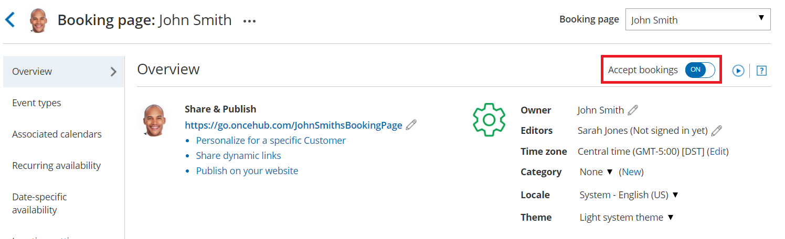

import { Aside } from '@astrojs/starlight/components';

There are a number of reasons why your [Booking page](/introduction-to-booking-pages/ "Introduction to Booking pages") or [Master Page](/introduction-to-master-pages/ "Introduction to Master pages") might display the message: "No times are currently available. Please contact the person you would like to schedule with." 

In this article, you'll learn about some of the most common issues and how to resolve them.

```
&lt;script id="snippet-prepend">
$(function()&#123;
  
  /*disable in widget*/
  if($('.w-documentation-article').length === 0)&#123;

     var ToC =
  "&lt;nav role='navigation' class='table-of-contents toc-top'><h4>In this article:" + "<ul>";
     var el,     title, link, header;
      //Define the heading levels you want to use in ascending order. Can add extra or remove unneeded.
     $(".hg-article-body h1, .hg-article-body h2, .hg-article-body h3, .hg-article-body h4").each(function() &#123;
              el = $(this);
              title = el.text();
                 if(title != '')&#123;
                anchorTitle = el.text().replace(/([~!@#$%^&*()_+=`&#123;&#125;\[\]\|\\:;'&lt;>,.\/\? ])+/g, '-').toLowerCase();
                link = "#" + anchorTitle;
                //Set all headers to a 0-nesting level.
                header = 'header-nesting-0';
                //Adjust header-nesting layers so that they point to the correct html tag. header-nesting-1 should match the second .hg-article-body h# listed above; header-nesting-2 should match the third, etc.
                if($(this).is('h2'))&#123;
                    header = 'header-nesting-1';
                &#125;else if($(this).is('h3'))&#123;
                    header = 'header-nesting-2'
                &#125;
                el.html('<a id="'+anchorTitle+'" class="toc-anchor">' + el.html());
                newLine =
      "<li class='"+header+"'>" +
        "<a class='article-anchor' href='" + link + "'>" +
          title +
        "" +
      "";


                ToC += newLine;
              &#125;
              &#125;);
     ToC +=
   "" +
  "";
    $("#snippet-prepend").before(ToC);
  &#125;
&#125;);

&lt;/script>
```

```
&lt;style>
/* CSS to style the TOC as it displays and the auto-created anchors
.toc-top styles the box for the TOC; adjust styles here to tweak look and feel */
  
.toc-top &#123;
  background-color: #FAFAFA; /* set to #fff or delete entirely for no background */
  border: 1px solid #C8C8C8; /* adjust the color hex here to change border color */
  box-shadow: 0 1px 1px rgba(0, 0, 0, 0.05) inset;
  margin-top: 24px;
  margin-bottom: 36px;
  min-height: 20px;
  padding: 13px 20px;
  max-width: 75%;
&#125;
.toc-top h4 &#123;
  font-size: 18px;
  line-height: 26px;
  margin: 0 0 8px;
  font-weight: 400;
&#125;
.toc-top ul &#123;
  padding: 0 0 0 15px !important;
  margin-bottom: 0;	
&#125;
.toc-top > ul &#123;
  margin-bottom: 13px!important;
&#125;
.toc-anchor &#123;
  display: block;
  height: 90px; 
  margin-top: -90px; 
  visibility: hidden;
&#125;

/* Set the indentation for the nesting levels. May need to be edited to match changes above. Increase or decrease the margin-left to get your desired level of indentation. */
.header-nesting-1 &#123;
    margin-left: 14px;
&#125;
.header-nesting-1:before &#123;
	background-image: url(https://dyzz9obi78pm5.cloudfront.net/app/image/id/5d31bcc88e121c9b25ba22c4/n/bulletv2.svg)!important;
&#125;
.header-nesting-2 &#123;
    margin-left: 28px;
&#125;
.header-nesting-2:before &#123;
	background-image: url(https://dyzz9obi78pm5.cloudfront.net/app/image/id/5d31be536e121cf22b0cc6ae/n/bulletv3.svg)!important;
&#125;
&lt;/style>
```

# Your Booking page or Master page is disabled

You may have [disabled your Booking page](/disabling-your-booking-page/ "Disabling your Booking page") or [disabled your Master page](/disabling-your-master-page/ "Disabling your Master page"). To enable your Booking page or Master page follow the steps below:

1.  ```
    &lt;style type="text/css">
    p.p1 &#123;margin: 0.0px 0.0px 0.0px 0.0px; font: 13.0px 'Helvetica Neue'&#125;
    &lt;/style>
    ```
    
    Hover over the lefthand menu and go to the Booking pages icon → Booking pages → your Booking page or Master page.
2.  In the **Overview** section, ensure that the **Accept bookings** field is toggled **ON** (Figure 1).Figure 1: Booking page Overview section

# OnceHub was unable to process your payment

If OnceHub was [unable to process your payment](/payment-hold/ "Payment hold"), you will have a 7-day grace period to update your payment method. During this time, you can continue to use OnceHub as normal and Customers can still make bookings with you. 

If you do not renew your payment after 7 days, your account will move to payment failure status. This means you will not have access to OnceHub and Customers will not be able to make bookings. However, your scheduling configuration is kept intact and you can still sign in to your OnceHub Account and access the billing section to update your payment method.

To resume payment, follow the steps below:

1.  Sign in to your OnceHub Account. 
2.  In the banner below the top navigation bar, click the **Proceed to payment** link (Figure 2).Figure 2: Payment failure notice
3.  You will be prompted to establish a new recurring payment method for your account. 
4.  Enter your payment details and click **Submit payment**.

[Learn more about recovering from a failed recurring payment](/payment-hold/ "Recovering from a failed recurring payment")

# "No times are currently available" when connected to Outlook calendar

If you are [connected to the PC connector for Outlook](/non-visible-articles/pc-connector-for-outlook/introduction-to-the-pc-connector-for-outlook/ "Introduction to the PC connector for Outlook"), you might have not yet performed the first sync. To enable the Booking page, you can either perform the first sync, or cancel the connection to Outlook. 

*   To complete the setup and perform the sync, [install the connector](/non-visible-articles/pc-connector-for-outlook/installing-the-pc-connector-for-outlook/ "Installing the PC Connector for Outlook") and the click the **Settings** button to [connect and configure the connector](/connecting-and-configuring-the-scheduleonce-connector-for-outlook/ "Connecting and configuring the ScheduleOnce connector for Outlook").
*   To cancel the connection, select your profile picture or initials in the top right-hand corner → **Profile settings** → **Calendar connection**. Then, click **Cancel my connection to Outlook**.

# "No times are currently available" when connected to Google calendar

If you are [connected to Google Calendar](/getting-started-with-oncehub/google-calendar-connection/managing-your-oncehub-integration-with-google-workspace-classic/ "Introduction to Google Calendar connection"), the "No times are currently available" might be caused by the following:

*   You have revoked the Google permissions for OnceHub. To renew your OnceHub connection to your Google Calendar, select your profile picture or initials in the top right-hand corner → **Profile settings** → **Calendar connection**. Then click the **Reconnect your Google Calendar** button.
*   If you have been receiving a large quantity of bookings in a short window of time, you might have reached the [Google Calendar quota](/getting-started-with-oncehub/google-calendar-connection/how-to-workaround-the-google-calendar-quota-classic/ "Google Calendar Quota"), administered by Google.

# Settings configuration issues

The "No times are currently available" might be caused by one of the following configuration error in your settings. 

## Availability is not defined or is shorter than time slot duration

To fix this, define your availability, increase your availability, or reduce the time slot duration.

*   To define availability, select your profile picture or initials in the top right-hand corner → **Profile settings** → **Availability** → **Scheduled meetings**. Then, add or remove availability. 
*   If you define your availability on individual Booking pages instead of in your User profile settings, hover over the lefthand menu and go to the Booking pages icon → Booking pages → your Booking page → **Recurring availability** or **Date-specific availability**. 

## Busy time from your calendar is completely blocking out your availability

To check if busy time from your calendar is completely blocking out your availability, compare your connected calendar's events to your defined availability in OnceHub. You may need to create more availability, remove an event on your calendar, or change the status of your events in your calendar from Busy to Free status.

## Starting times at a time in which you have no availability

The **Starting times** setting in the [Time slot display](/time-slot-display/ "Time slot display") is set to start at a start time for which you have no availability. For example, your availability is for 30 minutes and starts on the hour and the "Starting times" setting starts at 45 minutes only. 

[Learn more about setting Starting times in the Time slot display settings](/time-slot-display/ "Time slot display")

## Timeframe rules are hiding your availability

The **Before the event** and **Into the future** settings under the [Timeframe rules](/timeframe-rules/ "Timeframe rules") in the Time slot settings are hiding your availability.

[Learn more about Timeframe rules](/timeframe-rules/ "Timeframe rules")

## The buffer between OnceHub bookings and busy time is too big

The **Buffer before and after the meeting** setting in the [Workload rules](/workload-rules/ "Workload rules") section of the [Time slot settings](/introduction-to-time-slot-settings/ "Introduction to Time slot settings") is too big.

[Learn more about Workload rules](/workload-rules/ "Workload rules")

## No Booking pages have been included in your Master page

You have not included any Booking pages in the Master page. To include a Booking page in your Master page, select the relevant Master page →  **Assignment.**  Then, add Booking pages.

**Important**If any of the Booking pages that have been added to your Master page are affected by one of the configuration issues described above, the "No times are currently available" message will be displayed.