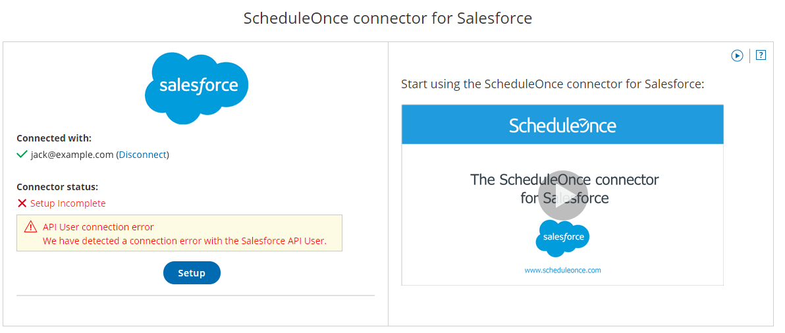
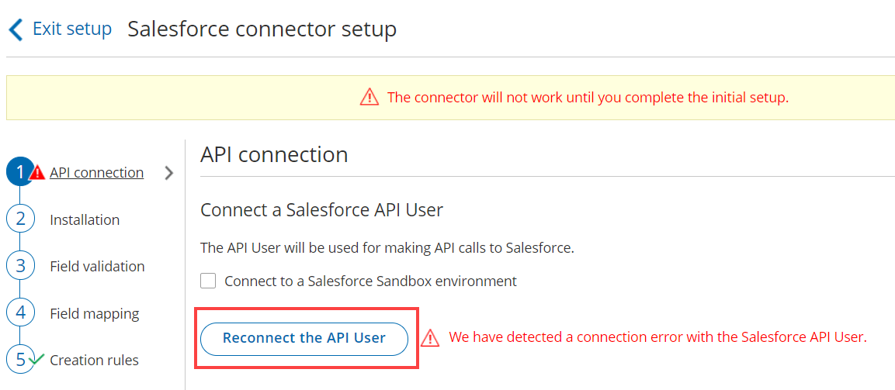

import { Aside } from '@astrojs/starlight/components';

This article describes potential issues with the [Salesforce integration](/the-scheduleonce-connector-for-salesforce/ "The ScheduleOnce connector for Salesforce") and how these issues can be fixed. If you’re still having problems, please [contact us](/contact-us/) and we will be happy to assist you.

If Users connected to Salesforce cannot accept bookings, there could be a number of different causes for this. To identify the root cause, you need to determine whether the issue affects all Users connected to Salesforce, or if it affects individual Users only.

```
&lt;script id="snippet-prepend">
$(function()&#123;
  
  /*disable in widget*/
  if($('.w-documentation-article').length === 0)&#123;

     var ToC =
  "&lt;nav role='navigation' class='table-of-contents toc-top'><h4>In this article:" + "<ul>";
     var el,     title, link, header;
      //Define the heading levels you want to use in ascending order. Can add extra or remove unneeded.
     $(".hg-article-body h1, .hg-article-body h2, .hg-article-body h3, .hg-article-body h4").each(function() &#123;
              el = $(this);
              title = el.text();
                 if(title != '')&#123;
                anchorTitle = el.text().replace(/([~!@#$%^&*()_+=`&#123;&#125;\[\]\|\\:;'&lt;>,.\/\? ])+/g, '-').toLowerCase();
                link = "#" + anchorTitle;
                //Set all headers to a 0-nesting level.
                header = 'header-nesting-0';
                //Adjust header-nesting layers so that they point to the correct html tag. header-nesting-1 should match the second .hg-article-body h# listed above; header-nesting-2 should match the third, etc.
                if($(this).is('h2'))&#123;
                    header = 'header-nesting-1';
                &#125;else if($(this).is('h3'))&#123;
                    header = 'header-nesting-2'
                &#125;
                el.html('<a id="'+anchorTitle+'" class="toc-anchor">' + el.html());
                newLine =
      "<li class='"+header+"'>" +
        "<a class='article-anchor' href='" + link + "'>" +
          title +
        "" +
      "";


                ToC += newLine;
              &#125;
              &#125;);
     ToC +=
   "" +
  "";
    $("#snippet-prepend").before(ToC);
  &#125;
&#125;);

&lt;/script>
```

```
&lt;style>
/* CSS to style the TOC as it displays and the auto-created anchors
.toc-top styles the box for the TOC; adjust styles here to tweak look and feel */
  
.toc-top &#123;
  background-color: #FAFAFA; /* set to #fff or delete entirely for no background */
  border: 1px solid #C8C8C8; /* adjust the color hex here to change border color */
  box-shadow: 0 1px 1px rgba(0, 0, 0, 0.05) inset;
  margin-top: 24px;
  margin-bottom: 36px;
  min-height: 20px;
  padding: 13px 20px;
  max-width: 75%;
&#125;
.toc-top h4 &#123;
  font-size: 18px;
  line-height: 26px;
  margin: 0 0 8px;
  font-weight: 400;
&#125;
.toc-top ul &#123;
  padding: 0 0 0 15px !important;
  margin-bottom: 0;	
&#125;
.toc-top > ul &#123;
  margin-bottom: 13px!important;
&#125;
.toc-anchor &#123;
  display: block;
  height: 90px; 
  margin-top: -90px; 
  visibility: hidden;
&#125;

/* Set the indentation for the nesting levels. May need to be edited to match changes above. Increase or decrease the margin-left to get your desired level of indentation. */
.header-nesting-1 &#123;
    margin-left: 14px;
&#125;
.header-nesting-1:before &#123;
	background-image: url(https://dyzz9obi78pm5.cloudfront.net/app/image/id/5d31bcc88e121c9b25ba22c4/n/bulletv2.svg)!important;
&#125;
.header-nesting-2 &#123;
    margin-left: 28px;
&#125;
.header-nesting-2:before &#123;
	background-image: url(https://dyzz9obi78pm5.cloudfront.net/app/image/id/5d31be536e121cf22b0cc6ae/n/bulletv3.svg)!important;
&#125;
&lt;/style>
```

# Issues affecting all Users connected to Salesforce

In this case, you should first check errors related to the [Salesforce API User](/connecting-a-salesforce-api-user/ "How to connect a Salesforce API User"). Then, you should check the status of the Salesforce API call usage in your Salesforce account.

## Checking the Salesforce API User

**The Salesforce API User connection in your OnceHub account**

If we have detected a problem with the API User connection, the API User will be disconnected from your OnceHub account. In this case, you must reconnect the Salesforce API User. 

This typically happens for the following reasons:

*   The API User credentials are no longer valid. The [Salesforce password](https://help.salesforce.com/articleView?id=security_overview_passwords.htm&type=5) may have been reset and the [security token](https://help.salesforce.com/articleView?id=user_security_token.htm&type=5) may have changed. OnceHub uses these credentials to validate the API User connection, so they must be up to date.
    
*   The OnceHub connector for Salesforce managed package was uninstalled and then reinstalled in your Salesforce organization. When this occurs, the Salesforce API token expires.
    

To resolve this issue, follow the steps below:

1.  ```
    &lt;style type="text/css">
    p.p1 &#123;margin: 0.0px 0.0px 0.0px 0.0px; font: 13.0px 'Helvetica Neue'&#125;
    &lt;/style>
    ```
    
    Hover over the lefthand menu and go to the Booking pages icon → open the lefthand sidebar, then select **Integrations ->** **CRM**. In the **Salesforce** box, click **Setup** (Figure 1).  
    Figure 1: Salesforce API User Disconnected
2.  Click the **Reconnect the API User** button (Figure 2).  
    Figure 2: Reconnect the API User

**Check the Salesforce API User settings in your Salesforce account**

The [Salesforce API User](/connecting-a-salesforce-api-user/ "How to connect a Salesforce API User") is used as a funnel for transferring data between OnceHub and Salesforce. If the API user is properly connected and a global connection problem still exists, it may be the case that changes have been made to the Salesforce API User license, a System Administrator profile, and the OnceHub permission set.

## Check the API Usage limit in the past 24 hours

Each Salesforce organization has a limited number of API calls. Each Salesforce organization can be integrated with several applications at a time—OnceHub may just be one of many applications talking with your Salesforce account. This [limited number of API calls per Salesforce organization](https://help.salesforce.com/articleView?id=000003706&type=1) is made available every 24 hours. The number of API calls depends on your contract with Salesforce.

If you have exceeded the API call limit for your Salesforce account, the OnceHub connector for Salesforce will not be able to make API calls to your Salesforce account and [connected Users](/connecting-to-salesforce/ "Connecting to Salesforce") will not be able to accept bookings.

In your Salesforce account, you should check the API Usage limit across your third-party applications and adjust your settings. Go to the **Setup** page, then select **Platform tools -> Environments -> System Overview**. [Learn more about System Overview: API Usage](https://help.salesforce.com/articleView?id=dev_force_com_system_overview_api.htm&type=5)

# Issues affecting only single Users connected to Salesforce

There are many ways in which OnceHub bookings can update Salesforce. For example, some bookings may be made with existing Salesforce contacts and not create new records, while others can be made with Leads and create new Lead records in Salesforce. Since most Salesforce organizations have a wide range of required fields and validation rules, these rules may block specific booking scenarios and not allow creation of new records in Salesforce.

When validation errors are encountered, you need to pinpoint the validation problem by identifying the Booking pages and Salesforce standard objects that are affected. In this case, you should first check the [Field validation step](/handling-required-salesforce-fields-in-the-field-validation-step/ "Handling required Salesforce fields in the Field validation step") of the Salesforce connector setup process. Then you should check if you have [custom fields that are universally required in Salesforce and not supported by the integration](/supported-and-non-supported-field-types-in-the-salesforce-integration/ "Supported and non-supported field types in the Salesforce integration").

## Check the Field validation step of the Salesforce connector setup process

You might have recently added [universally required custom fields](https://help.salesforce.com/articleView?id=fields_about_universally_required_fields.htm&type=5) to the affected Salesforce object. When these fields are supported field types in the Salesforce integration and do not have a Salesforce default value, they will appear in the Field validation step of the Salesforce connector setup process.

When a booking is made and a required field in Salesforce has not been mapped to a field in OnceHub, a Field validation error will be detected. OnceHub will pass a default value to the field in Salesforce. [Learn more about default values for universally required fields](/handling-required-salesforce-fields-in-the-field-validation-step/ "Handling required Salesforce fields in the Field validation step")

## Check for non-supported universally required custom fields

You might have recently added universally required custom fields to the affected Salesforce object. When these [fields are non-supported field types in the Salesforce integration](/supported-and-non-supported-field-types-in-the-salesforce-integration/ "Supported and non-supported field types in the Salesforce integration") and do not have a Salesforce default value, they will be indicated in the [Field validation step](/handling-required-salesforce-fields-in-the-field-validation-step/ "Handling required Salesforce fields in the Field validation step") of the Salesforce connector setup process and will not be able to accept a value from OnceHub.  
  
The only solution to this is to set these fields as non-mandatory for the affected Salesforce object, or to set a default value in Salesforce. If you cannot associate a default value for these fields in Salesforce and still want these fields to be required fields for manual entry, you can make these fields required on the Page Layout of the object. [Learn more about Page Layouts](https://help.salesforce.com/articleView?id=customize_layoutoverview.htm&type=5)

# Other issues

If you’re still seeing issues, please [contact us](/contact-us/) and we'll be happy to assist you.