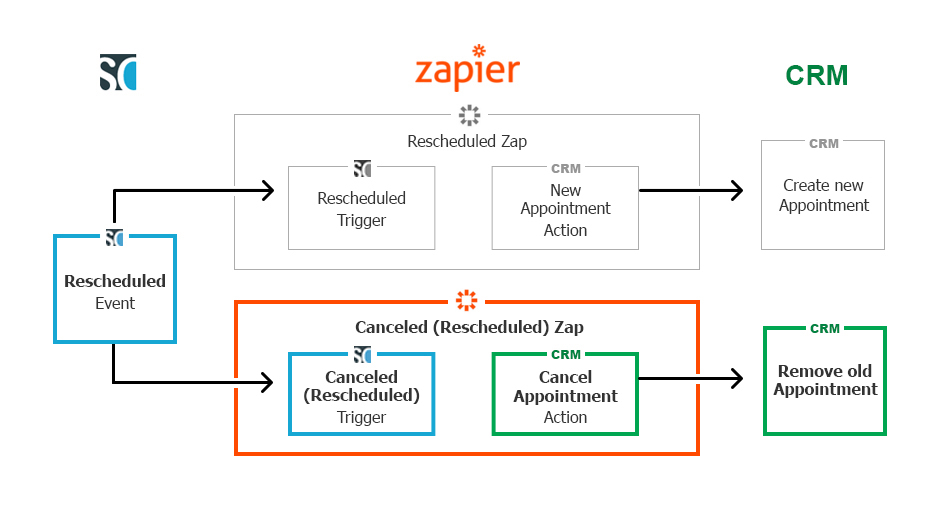
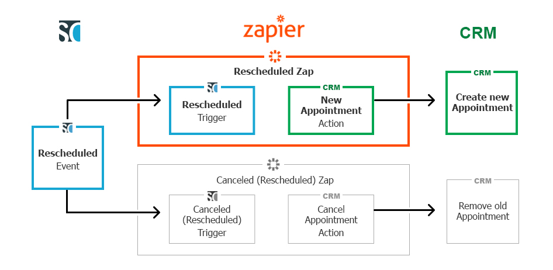

import { Aside } from '@astrojs/starlight/components';

This article lists all fields and triggers for OnceHub that are available via Zapier. Any of these fields can be used to integrate with a third-party app. 

## Booking page information and interaction history

This section contains the data fields relevant to the booking page in question, and the history of the interactions with customers and the relevant booking page.  

## Booking data

This section includes the data directly related to the booked appointment.

<table cellspacing="0" width="660"><tbody><tr><td><strong>Field</strong></td><td><strong>Description</strong></td></tr><tr><td>Booking - Attachment</td><td>A link to the file attached by your Customer in the Booking form</td></tr><tr><td>Booking - Creation date</td><td>The time and date when the booking was created, e.g. Mon, Mar 23, 2015, 11:00 AM</td></tr><tr><td>Booking - Duration in minutes</td><td>The length of the meeting in minutes</td></tr><tr><td>Booking - Duration in seconds</td><td>The length of the meeting in seconds</td></tr><tr><td>Booking - Invoice line item&#42;</td><td>Subject, Meeting time in Customer's time zone, Duration, Booking page Owner</td></tr><tr><td>Booking - Last updated</td><td>The last time any booking details were changed</td></tr><tr><td>Booking - Meeting time in Customer's time zone</td><td>The time the meeting will start in the Customer's time zone, e.g. Mon, Mar 23, 2015, 10:30 AM - 10:45 AM</td></tr><tr><td>Booking - Meeting time in UTC</td><td>Starting time in UTC time zone. e.g. Mon, Mar 23, 2015, 10:30 AM</td></tr><tr><td>Booking - Meeting time in Owner's time zone</td><td>The time the meeting will start in the Owner's time zone, e.g. Mon, Mar 23, 2015, 10:30 AM - 10:45 AM</td></tr><tr><td>Booking - Mode</td><td>The booking mode: <a href="https://oncehub.knowledgeowl.com/help/automatic-booking-or-booking-with-approval" title="Automatic booking or Booking with approval">Automatic booking or Booking with approval</a></td></tr><tr><td>Booking - Number of sessions scheduled</td><td>The number of sessions in a session package that were scheduled</td></tr><tr><td>Booking - Physical location</td><td>The address where the meeting will take place, as specified in the <a href="https://oncehub.knowledgeowl.com/help/booking-page-location-settings-section" name="" title="Booking page: Conferencing / Location section"><strong>Conferencing / Location</strong></a>section of the Booking page</td></tr><tr><td>Booking - Starting time in Customer's time zone</td><td>The time the meeting will start in the Customer's time zone, e.g. Mon, Mar 23, 2015, 10:30 AM</td></tr><tr><td>Booking - Starting time in Owner's time zone</td><td>The time the meeting will start in the Owner's time zone, e.g. Mon, Mar 23, 2015, 10:30 AM</td></tr><tr><td>Booking - Status</td><td>The <a href="https://oncehub.knowledgeowl.com/help/understanding-activity-statuses" title="Understanding activity statuses">lifecycle phase or activity status</a> of the booking</td></tr><tr><td>Booking - Subject</td><td>The subject of the meeting, as provided by Customer or Owner</td></tr><tr><td>Booking - Summary (long)&#42;</td><td>Customer name, Company, Subject, Starting time, Duration, Location, Email, Phone, Mobile phone, Note</td></tr><tr><td>Booking - Summary (short)&#42;</td><td>Customer name, Company, Location, Notes</td></tr><tr><td>Booking – Package ID</td><td>A unique ID automatically assigned to every OnceHub session package</td></tr><tr><td>Booking - Virtual location</td><td>The communication details required for connecting to the virtual meeting, as specified in the <strong><a href="https://oncehub.knowledgeowl.com/help/booking-page-location-settings-section" name="" title="Booking page: Conferencing / Location section">Conferencing / Location</a></strong> section of the Booking page. This could be a phone number, video conferencing information, a Skype ID, etc.</td></tr><tr><td>Booking - Virtual or physical location</td><td>The virtual or physical location of the meeting, as specified in the <strong><a href="https://oncehub.knowledgeowl.com/help/booking-page-location-settings-section" name="" title="Booking page: Conferencing / Location section">Conferencing / Location</a></strong> section of the Booking page</td></tr><tr><td>UTM source - Found in the Conversation lifecycle triggers</td><td>The source defined in the UTM parameter when the customer booked the meeting</td></tr><tr><td>UTM medium - Found in the Conversation lifecycle triggers</td><td>The medium defined in the UTM parameter when the customer booked the meeting</td></tr><tr><td>UTM campaign - Found in the Conversation lifecycle triggers</td><td>The campaign defined in the UTM parameter when the customer booked the meeting</td></tr><tr><td>UTM term - Found in the Conversation lifecycle triggers</td><td>The term defined in the UTM parameter when the customer booked the meeting</td></tr><tr><td>UTM content - Found in the Conversation lifecycle triggers</td><td>The content defined in the UTM parameter when the customer booked the meeting</td></tr></tbody></table>

\* **Composite fields:** These fields are considered **Summary** fields and contain a list of values from other fields separated by commas. These are best used for **Description** fields in 3rd party apps. [Learn more about composite fields](/scheduleonce-composite-fields-available-in-zapier/ "ScheduleOnce composite fields available in Zapier ")

#### Cancel/reschedule data

This section includes the data related to cancellation and rescheduling activities.

<table cellspacing="0" width="660"><tbody><tr><td><strong>Field</strong></td><td><strong>Description</strong></td></tr><tr><td>Cancel/reschedule - Initiated by customer name</td><td>The name of the Customer who performed the cancellation or reschedule action</td></tr><tr><td>Cancel/reschedule - Initiated by user name</td><td>The name of User who performed the cancellation or reschedule action</td></tr><tr><td>Cancel/reschedule - Reason</td><td>The reason given for canceling or rescheduling a meeting</td></tr><tr><td>Cancel/reschedule - Summary (long)&#42;</td><td>Reschedule indication, Reschedule reason + long booking summary</td></tr><tr><td>Cancel/reschedule - Summary (short)&#42;</td><td>Reschedule indication, Reschedule reason + short booking summary</td></tr><tr><td>Cancel/reschedule – Customer link</td><td>The cancel/reschedule link to be used by the Customer</td></tr><tr><td>Cancel/reschedule – Tracking ID (canceled booking)</td><td>The Tracking ID of the canceled original booking</td></tr></tbody></table>

\* **Composite fields:** These fields are considered **Summary** fields and contain a list of values from other fields separated by commas. These are best used for **Description** fields in 3rd party apps. [Learn more about composite fields](/scheduleonce-composite-fields-available-in-zapier/ "ScheduleOnce composite fields available in Zapier ")

#### Booking page data

This section includes the data related to properties of the booking page used to make the booking.

<table cellspacing="0" width="660"><tbody><tr><td><strong>Field</strong></td><td><strong>Description</strong></td></tr><tr><td>Booking page - Category</td><td>The category to which the Booking page has been assigned</td></tr><tr><td>Booking page - Internal label</td><td>The internal label of the Booking page</td></tr><tr><td>Booking page - Public link</td><td>The public link for the Booking page</td></tr><tr><td>Booking page - Public name</td><td>The public name of the Booking page</td></tr><tr><td>Master page - Internal label</td><td>The internal label for the Master page</td></tr><tr><td>Master page - Public link</td><td>The public link for the Master page</td></tr><tr><td>Master page - Public name</td><td>The public name of the Master page</td></tr><tr><td>Booking page - Owner</td><td>The User whose time is being booked via the Booking page</td></tr><tr><td>Booking page - Time zone</td><td>The time zone of the Booking page</td></tr></tbody></table>

#### Event type data

This section includes the data related to properties of the Event types selected during the booking process.

<table cellspacing="0" width="660"><tbody><tr><td><strong>Field</strong></td><td><strong>Description</strong></td></tr><tr><td>Event type - Category</td><td>The Category of the Event type selected by the Customer</td></tr><tr><td>Event type - Description</td><td>The description of the Event type selected by the Customer</td></tr><tr><td>Event type - Name</td><td>The name of the Event type selected by the Customer</td></tr><tr><td>Event type - Price</td><td>The price of the Event type selected by the Customer</td></tr><tr><td>Event type - Currency</td><td>The currency of the Event type selected by the Customer</td></tr></tbody></table>

#### Custom fields

OnceHub provides support for custom fields in Zapier. When you add new custom fields, they will appear alongside your system fields when you map trigger fields to action fields.

Below is a description of how each OnceHub custom field is passed through Zapier.

<table border="1" cellpadding="0" cellspacing="0"><tbody><tr><td>OnceHub custom field</td><td>Target app field format </td><td>Example</td></tr><tr><td>Single-line text field</td><td>&#123;Plain text&#125;</td><td>This is a single-line example</td></tr><tr><td>Multi-line text field</td><td>&#123;Plain text&#125;</td><td>This is a multi-line example</td></tr><tr><td>Dropdown</td><td>&#123;Option value&#125;</td><td>This is a dropdown selection example</td></tr><tr><td>Checkbox</td><td>
&#123;Option value&#125;, &#123;Option value&#125;, …
&#42; Each checked checkbox will be appended at the end separated by a comma ','</td><td>This a one checkbox, This is another checkbox, This is the last checkbox</td></tr><tr><td>Attachment</td><td>&#123;Link&#125;</td><td>http://www.example.com/sample.gif</td></tr></tbody></table>

## OnceHub composite fields available in Zapier

This section lists OnceHub composite fields created to make Zapier integration easier.

Zapier allows you to map multiple OnceHub fields, along with static text, to one composite field in the integrated app. This ability is useful when adding information taken from multiple fields in OnceHub. For example:

*   Adding information to the Description field in a CRM task
*   Adding information to a note
*   Adding information to a line item in an invoice
*   Creating a text file based on customer data or booking data

To support these cases, we have created composite fields in OnceHub. These fields combine multiple OnceHub fields and their titles.

#### Booking - Summary (long and short) composite field

## Long

This composite field includes the following OnceHub fields:

*   Customer Name
*   Customer Company  
*   Subject/service   
*   Starting time (in Owner's time zone)  
*   Duration  
*   Virtual location or Physical location
*   Customer e-mail  
*   Customer Phone  
*   Customer Mobile Phone   
*   Customer Note

**Example:**  
Meeting with: Lisa Brown, Company: Lisa Brown Consulting, Subject: Zapier Integration, Start time: Wednesday, Jul 4, 2015 1:00 PM, Duration: 30 min, Location: … , Customer email: lisa.brown@lbconsulting.com, Customer phone: 524-698-1288, Customer mobile phone: 524-668-8921, Note from customer: Hi, I want to discuss your Zapier integration.

## Short

This composite field includes the following OnceHub fields:

*   Customer name
*   Customer company 
*   Virtual location or Physical location
*   Customer note

**Example:**  
Meeting with: Lisa Brown, Company: Lisa Brown Consulting, Location: … , Note from customer: Hi, I want to discuss your Zapier integration.

#### Cancel/Reschedule - Summary (long and short) composite field

## Long

This composite field includes the following OnceHub fields:

*   Rescheduling indication
*   Rescheduling reason
*   Description (Long) composite field or Short Description composite field information, as described above.

**Example:**   
This meeting has been rescheduled. Rescheduling reason: I have another urgent meeting, Meeting with: Lisa Brown, Company: Lisa Brown Consulting, Subject: Zapier Integration, Start time: Wednesday, Jul 4, 2015 1:00 PM, Duration: 30 min, Location: … , Customer email: lisa.brown@lbconsulting.com, Customer phone: 524-698-1288, Customer mobile phone: 524-668-8921, Note from customer: Hi, I want to discuss your Zapier integration.

## Short

This composite field includes the following OnceHub fields:

*   Rescheduling indication
*   Rescheduling reason
*   Description (Short) composite field or Short Description composite field information, as described above.

**Example:**  
This meeting has been rescheduled. Rescheduling reason: I have another urgent meeting, Meeting with: Lisa Brown, Company: Lisa Brown Consulting, Location: … , Note from customer: Hi, I want to discuss your Zapier integration.

#### Booking data and Invoice line item composite field

This composite field includes the following OnceHub fields:

*   Booking subject or service name
*   Meeting time in Customer's time zone
*   Meeting duration
*   Booking page owner  

**Example:**  
Tax preparation, Wed, Jul 4, 2020 1:00 PM, 30 min, with Sarah Bloch

This article lists all fields that OnceHub makes available via Zapier. Any of these fields can be used to integrate with a third-party app.

## Booking data

This section includes the data directly related to the booked appointment.

<table cellspacing="0" width="660"><tbody><tr><td><strong>Field</strong></td><td><strong>Description</strong></td></tr><tr><td>Booking - Attachment</td><td>A link to the file attached by your Customer in the Booking form</td></tr><tr><td>Booking - Creation date</td><td>The time and date when the booking was created, e.g. Mon, Mar 23, 2015, 11:00 AM</td></tr><tr><td>Booking - Duration in minutes</td><td>The length of the meeting in minutes</td></tr><tr><td>Booking - Duration in seconds</td><td>The length of the meeting in seconds</td></tr><tr><td>Booking - Invoice line item&#42;</td><td>Subject, Meeting time in Customer's time zone, Duration, Booking page Owner</td></tr><tr><td>Booking - Last updated</td><td>The last time any booking details were changed</td></tr><tr><td>Booking - Meeting time</td><td>The scheduled date and time of the meeting</td></tr><tr><td>Booking - Meeting time in Customer's time zone</td><td>The time the meeting will start in the Customer's time zone, e.g. Mon, Mar 23, 2015, 10:30 AM - 10:45 AM</td></tr><tr><td>Booking - Meeting time in UTC</td><td>Starting time in UTC time zone. e.g. Mon, Mar 23, 2015, 10:30 AM</td></tr><tr><td>Booking - Meeting time in Owner's time zone</td><td>The time the meeting will start in the Owner's time zone, e.g. Mon, Mar 23, 2015, 10:30 AM - 10:45 AM</td></tr><tr><td>Booking - Mode</td><td>The booking mode: <a href="https://oncehub.knowledgeowl.com/help/automatic-booking-or-booking-with-approval" title="Automatic booking or Booking with approval">Automatic booking or Booking with approval</a></td></tr><tr><td>Booking - Number of sessions scheduled</td><td>The number of sessions in a session package that were scheduled</td></tr><tr><td>Booking - Physical location</td><td>The address where the meeting will take place, as specified in the <a href="https://oncehub.knowledgeowl.com/help/booking-page-location-settings-section" name="" title="Booking page: Conferencing / Location section"><strong>Conferencing / Location</strong></a>section of the Booking page</td></tr><tr><td>Booking - Starting time in Customer's time zone</td><td>The time the meeting will start in the Customer's time zone, e.g. Mon, Mar 23, 2015, 10:30 AM</td></tr><tr><td>Booking - Starting time in Owner's time zone</td><td>The time the meeting will start in the Owner's time zone, e.g. Mon, Mar 23, 2015, 10:30 AM</td></tr><tr><td>Booking - Status</td><td>The <a href="https://oncehub.knowledgeowl.com/help/understanding-activity-statuses" title="Understanding activity statuses">lifecycle phase or activity status</a> of the booking</td></tr><tr><td>Booking - Subject</td><td>The subject of the meeting, as provided by Customer or Owner</td></tr><tr><td>Booking - Summary (long)&#42;</td><td>Customer name, Company, Subject, Starting time, Duration, Location, Email, Phone, Mobile phone, Note</td></tr><tr><td>Booking - Summary (short)&#42;</td><td>Customer name, Company, Location, Notes</td></tr><tr><td>Booking - Tracking ID</td><td>A unique ID automatically assigned to every OnceHub booking</td></tr><tr><td>Booking – Package ID</td><td>A unique ID automatically assigned to every OnceHub session package</td></tr><tr><td>Booking - Virtual location</td><td>The communication details required for connecting to the virtual meeting, as specified in the <strong><a href="https://oncehub.knowledgeowl.com/help/booking-page-location-settings-section" name="" title="Booking page: Conferencing / Location section">Conferencing / Location</a></strong> section of the Booking page. This could be a phone number, video conferencing information, a Skype ID, etc.</td></tr><tr><td>Booking - Virtual or physical location</td><td>The virtual or physical location of the meeting, as specified in the <strong><a href="https://oncehub.knowledgeowl.com/help/booking-page-location-settings-section" name="" title="Booking page: Conferencing / Location section">Conferencing / Location</a></strong> section of the Booking page</td></tr><tr><td>UTM source - Found in the Conversation lifecycle triggers</td><td>The source defined in the UTM parameter when the customer booked the meeting</td></tr><tr><td>UTM medium - Found in the Conversation lifecycle triggers</td><td>The medium defined in the UTM parameter when the customer booked the meeting</td></tr><tr><td>UTM campaign - Found in the Conversation lifecycle triggers</td><td>The campaign defined in the UTM parameter when the customer booked the meeting</td></tr><tr><td>UTM term - Found in the Conversation lifecycle triggers</td><td>The term defined in the UTM parameter when the customer booked the meeting</td></tr><tr><td>UTM content - Found in the Conversation lifecycle triggers</td><td>The content defined in the UTM parameter when the customer booked the meeting</td></tr></tbody></table>

\* **Composite fields:** These fields are considered **Summary** fields and contain a list of values from other fields separated by commas. These are best used for **Description** fields in 3rd party apps. [Learn more about composite fields](/scheduleonce-fields-available-in-zapier/ "OnceHub fields available in Zapier")

This section details the different triggers available in Zapier for OnceHub activities. 

#### Mapping of OnceHub fields to Zapier triggers

The following table outlines what OnceHub attributes are available for each Zapier trigger:

| Field name in Zapier | Scheduled | Rescheduled | Canceled | Canceled (Rescheduled) | Completed | No-Show | Booking Lifecycle  
Event |
| --- | --- | --- | --- | --- | --- | --- | --- |
| Booking - Attachment | X | X | X | X | X | X | X |
| Booking - Creation date | X | X | X | X | X | X | X |
| Booking - Summary (long) | X | X | X | X | X | X | X |
| Booking - Summary (short) | X | X | X | X | X | X | X |
| Booking- Duration in minutes | X | X | X | X | X | X | X |
| Booking - Duration in seconds | X | X | X | X | X | X | X |
| Booking - Last updated | X | X | X | X | X | X | X |
| Booking - Meeting time in UTC | X | X | X | X | X | X | X |
| Booking - Meeting time in Customer's time zone | X | X | X | X | X | X | X |
| Booking - Meeting time in Owner's time zone | X | X | X | X | X | X | X |
| Booking - Mode | X | X | X | X | X | X | X |
| Booking - Number of sessions scheduled | X | X | X | X | X | X | X |
| Booking - Physical location | X | X | X | X | X | X | X |
| Booking -Starttime in Customer's time zone | X | X | X | X | X | X | X |
| Booking -Starttime in Owner's time zone | X | X | X | X | X | X | X |
| Booking - Status | X | X | X | X | X | X | X |
| Booking - Subject | X | X | X | X | X | X | X |
| Booking - Tracking ID | X | X | X | X | X | X | X |
| Booking - Package ID | X | X | X | X | X | X | X |
| Booking - Virtual location | X | X | X | X | X | X | X |
| Booking - Virtual or physical location | X | X | X | X | X | X | X |
| Customer - Company | X | X | X | X | X | X | X |
| Customer - Country | X | X | X | X | X | X | X |
| Customer - Email | X | X | X | X | X | X | X |
| Customer - First name | X | X | X | X | X | X | X |
| Customer - Last name | X | X | X | X | X | X | X |
| Customer - Location | X | X | X | X | X | X | X |
| Customer - Mobile phone | X | X | X | X | X | X | X |
| Customer - Name | X | X | X | X | X | X | X |
| Customer - Note | X | X | X | X | X | X | X |
| Customer - Phone | X | X | X | X | X | X | X |
| Customer - State | X | X | X | X | X | X | X |
| Customer - Time zone | X | X | X | X | X | X | X |
| Cancel/reschedule - Initiated by customer name |   | X | X | X |   |   | X |
| Cancel/reschedule - Initiated by user name |   | X | X | X |   |   | X |
| Cancel/reschedule - Reason |   | X | X | X |   |   | X |
| Cancel/reschedule - Summary (long) |   | X |   | X |   |   | X |
| Cancel/reschedule - Summary (short) |   | X |   | X |   |   | X |
| Cancel/reschedule - Customer link | X | X |   |   |   |   | X |
| Cancel/reschedule - Tracking ID (canceled booking) |   | X |   |   |   |   | X |
| Booking page - Category | X | X | X | X | X | X | X |
| Booking page - Internal label | X | X | X | X | X | X | X |
| Booking page - Public link | X | X | X | X | X | X | X |
| Booking page - Public name | X | X | X | X | X | X | X |
| Master page - Internal label | X | X | X | X | X | X | X |
| Master page - Public link | X | X | X | X | X | X | X |
| Master page - Public name | X | X | X | X | X | X | X |
| Booking page - Owner | X | X | X | X | X | X | X |
| Booking page - Time zone | X | X | X | X | X | X | X |
| Event type - Category | X | X | X | X | X | X | X |
| Event type - Description | X | X | X | X | X | X | X |
| Event type - Name | X | X | X | X | X | X | X |
| Event type - Price | X | X | X | X | X | X | X |
| Event type – Currency | X | X | X | X | X | X | X |

#### OnceHub triggers on Zapier

Triggers are the means through which you tell Zapier what OnceHub data to send to your third-party app. This article describes the OnceHub Zapier triggers you can use when integrating OnceHub with your application of choice.

OnceHub provide two types of triggers, specific and composite. **Specific triggers** are based on an individual booking event, e.g. Scheduled Booking. Using these triggers, you can control granular interactions between OnceHub and other apps, e.g. create a new Contact in the target app when a new booking is made. Each specific trigger also has a unique set of attributes that is passed through Zapier. **Composite triggers** are considered 'dynamic' triggers. These triggers are fired each time a booking changes its status. Each type of trigger is used for different purposes as described below. Please read the Mapping of OnceHub fields to Zapier triggers article above for more information.

The following is a complete list of OnceHub Zapier triggers that are available to you, grouped by the two types:

**Specific triggers**

*   Booking Scheduled
*   Booking Canceled
*   Booking Completed
*   Booking No-Show 
*   Booking Rescheduled
*   Booking Canceled and Rescheduled
*   Conversation Reached Out
*   Conversation Started
*   Conversation Closed
*   Conversation Abandoned
*   Contact Captured
*   Contact Updated

**Composite triggers**

*   Contact Lifecycle Event
*   Booking Lifecycle Event
*   Conversation Lifecycle Event

## When to use specific and composite triggers?

When including OnceHub in email marketing and marketing automation campaigns, you should use **specific triggers**. This gives you the power to target specific users based on their level of engagement and interaction with your campaign. For example, you can provide additional resources to users who have made a booking. You can invite users to book a new meeting in case they have canceled the original one. You can also send out a feedback form as soon as the booking had ended, i.e. the booking status changed to "Completed".

When you wish to continuously track your booking activity, you can use the **Booking Lifecycle Event** **composite trigger** with productivity apps such as Google Sheet, Evernote, or Slack. Using this trigger allows you to define only one Zap which records all of your booking activity.

Below is a detailed explanation of each OnceHub trigger. 

## Booking Scheduled 

This trigger is fired each time a booking is made on your booking page.

The complete list of fields sent with this trigger can be found in the Mapping of OnceHub Fields to Zapier Triggers section above.

## Booking Canceled 

This trigger is fired when a booking is canceled. A booking can be canceled using one of the following methods:

*   [Canceled by User without event types](/user-action-cancel-request-to-reschedule-without-event-types/ "User action: Cancel/request to reschedule without event types")
*   [Canceled by User with event types](/user-action-cancel-request-to-reschedule-with-event-types/ "User action: Cancel/request to reschedule with event types")
*   [Canceled by User in the connected Google Calendar](/user-action-cancel-or-reschedule-in-google-calendar/ "User action: Cancel or reschedule in Google Calendar")
*   [Canceled by User in the connected Outlook Calendar](/user-action-cancel-or-reschedule-in-outlook-calendar/ "User action: Cancel or Reschedule in Outlook Calendar")
*   [Canceled by the Customer](/reschedule-the-customer-cancelreschedule-page/ "The Customer Cancel/Reschedule page")

The complete list of fields sent with this trigger can be found in the Mapping of OnceHub Fields to Zapier Triggers article.

**Note**This trigger is different than the **Canceled Booking (Rescheduled)**  trigger. **Canceled Booking** means that the booking is canceled for good, while **Canceled Booking (Rescheduled)** only indicates the removal of the original booking when a new booking is created instead.

## Completed Booking 

This trigger is fired as soon as the meeting time has passed. For example, if a one hour booking was scheduled for Monday at 10:00 AM, the Completed trigger will fire at 11:00 AM.

One way to effectively use this trigger is to set up an email marketing campaign that will be triggered as soon as a booking is completed. The campaign could send out a survey, a questionnaire or even an invitation to book another meeting. [Meeting follow-up functionality is also provided in](/introduction-to-customer-notifications/ "The Customer notifications section") OnceHub.

## No-show Booking 

This trigger is fired when the [user changes the bookings status from Completed to No-show](/tracking-and-reporting-no-shows/ "Tracking and Reporting No-Shows"). This can be done only once the booking is in the **Completed** status.

One way to effectively use this trigger is to set up an email marketing campaign that will be triggered as soon as a booking is set to **No-show**. The campaign could send out an email asking the customer, who did not show up to the meeting, to schedule another meeting.

The complete list of fields sent with this trigger can be found in the Mapping of OnceHub Fields to Zapier Triggers section above.

## Booking Canceled and Rescheduled

These two triggers work in tandem and provide the necessary information for each rescheduling scenario. When a booking is rescheduled in OnceHub, the original booking is either updated, or canceled and replaced by a new booking. It's important to distinguish between the different types of reschedule scenarios that fire the **Rescheduled Booking** and **Canceled Booking (Rescheduled)** triggers. Each scenario includes a different trigger combination and slightly varying attributes.

The following scenarios are supported:

1.  [Customer reschedules with the same Booking page](/effect-of-rescheduling/ "Effect of rescheduling")**.** When the Customer reschedules a booking with the same Booking page, a single **Rescheduled** **Booking** trigger is fired containing the same Booking ID as the original booking. This is based on the assumption that if the event was created under the same Booking page, then we only need to update the event and not create a new booking. Below is a table outlining the triggers and attributes used in this scenario.
    
    <table border="1" cellpadding="0" cellspacing="0" width="671"><tbody><tr><td><strong>Zapier trigger</strong></td><td><strong>Attribute</strong></td><td><strong>Notes</strong></td></tr><tr><td><strong>Canceled Booking (Rescheduled)</strong></td><td>N/A</td><td>This trigger is not fired.</td></tr><tr><td rowspan="2"><strong>Rescheduled Booking</strong></td><td>Booking – Booking ID</td><td>The existing booking ID</td></tr><tr><td>Booking page – Owner</td><td>The existing User name</td></tr></tbody></table>
    
2.  [Customer reschedules with a different Booking page](/effect-of-rescheduling/ "Effect of rescheduling")**.** When the Customer reschedules the booking with a Booking page that is different from the one they originally made the booking with, two triggers are fired, one to cancel the original booking and another to create a new booking instead. Below is a table outlining the triggers and attributes used in this scenario.
    
    <table border="1" cellpadding="0" cellspacing="0" width="671"><tbody><tr><td><strong>Zapier trigger</strong></td><td><strong>Attribute</strong></td><td><strong>Notes</strong></td></tr><tr><td rowspan="2"><strong>Canceled Booking (Rescheduled)</strong></td><td>Booking – Booking ID</td><td>The existing booking ID</td></tr><tr><td>Booking page – Owner</td><td>The original User name</td></tr><tr><td rowspan="3"><strong>Rescheduled Booking</strong></td><td>Booking – Booking ID</td><td>The new booking ID</td></tr><tr><td>Cancel/reschedule - Booking ID (canceled booking)</td><td>The original booking ID</td></tr><tr><td>Booking page – Owner</td><td>The new User name</td></tr></tbody></table>
    
3.  [User requests the Customer to reschedule](/introduction-to-canceling-and-rescheduling/ "Introduction to canceling and rescheduling")**.** When the User requests the Customer to reschedule the booking, the **Canceled Booking (Rescheduled)** trigger is fired instantly as the original booking is no longer valid. The **Reschedule Booking** trigger is fired only after the Customer had rescheduled the booking. Below is a table outlining the triggers and attributes used in this scenario.
    
    <table border="1" cellpadding="0" cellspacing="0" width="671"><tbody><tr><td><strong>Zapier trigger</strong></td><td><strong>Attribute</strong></td><td><strong>Notes</strong></td></tr><tr><td rowspan="2"><strong>Canceled Booking (Rescheduled)</strong></td><td>Booking – Booking ID</td><td>The existing booking ID</td></tr><tr><td>Booking page – Owner</td><td>The original User name</td></tr><tr><td rowspan="3"><strong>Rescheduled Booking</strong></td><td>Booking – Booking ID</td><td>The new booking ID</td></tr><tr><td>Cancel/reschedule - Booking ID (canceled booking)</td><td>The original booking ID</td></tr><tr><td>Booking page – Owner</td><td>The new User name</td></tr></tbody></table>
    
4.  **User reschedules from a connected [Google Calendar](/user-action-cancel-or-reschedule-in-google-calendar/ "User action: Cancel or reschedule in Google Calendar") or [Outlook Calendar](/user-action-cancel-or-reschedule-in-outlook-calendar/ "User action: Cancel or Reschedule in Outlook Calendar").**   
    When the setting to Changing the time in Google updates the booking in OnceHub is enabled, moving events in your calendar also updates the event in OnceHub. The **Rescheduled** **Booking** trigger is fired, when the User changes the calendar event details or moves the calendar event to another slot**.** This is a common use case whereby the Customer calls the User and asks them to reschedule the booking on their behalf. This event behaves the same as if a Customer initiated reschedule with the same User. 
    
    <table border="1" cellpadding="0" cellspacing="0" width="671"><tbody><tr><td><strong>Zapier trigger</strong></td><td><strong>Attribute</strong></td><td><strong>Notes</strong></td></tr><tr><td><strong>Canceled Booking (Rescheduled)</strong></td><td>N/A</td><td>This trigger is not fired.</td></tr><tr><td rowspan="2"><strong>Rescheduled Booking</strong></td><td>Booking – Booking ID</td><td>The existing booking ID</td></tr><tr><td>Booking page – Owner</td><td>The existing User name</td></tr></tbody></table>
    

The following example describes the reschedule scenario that was initiated by the Customer and resulted in a booking that was made with a different Booking page. First, the **Canceled (Rescheduled)** trigger is fired including the **original** booking information. This allows the target application to remove the previously created appointment. In the illustration below, the **Canceled (Rescheduled) Zap** at the bottom, joins the OnceHub **Canceled (Rescheduled)** Trigger with your CRM **Cancel Appointment** Action.

### 

Second, the **Rescheduled** **Booking** trigger is fired including the **new** booking information. This allows the target application to create a new appointment (the rescheduled booking). In the illustration below, the **Rescheduled Zap** at the top, joins the OnceHub **Rescheduled** Trigger with your CRM **New Appointment** Action.

<table><tbody><tr><td>
<strong>Note</strong>: Having a dedicated reschedule cancellation trigger, allows you to handle these events differently than standard cancellation events. This is especially relevant if you have set up a marketing campaign that targets canceled bookings. In this instance, you would not want to trigger the same campaign if a reschedule event occurred.
</td></tr></tbody></table>

The complete list of fields sent with this trigger can be found in the [Mapping of OnceHub Fields to Zapier Triggers](/mapping-of-scheduleonce-fields-to-zapier-triggers/ "Mapping of OnceHub fields to Zapier triggers") article.

## Booking Lifecycle Event 

This trigger is fired each time a booking changes its status, i.e. Scheduled, Rescheduled, Canceled, Completed, or No-show.

Different from the specific triggers mentioned above, this trigger is best used to log all booking activities. As an example, you can use a Google Sheets Zapier integration to record all booking activities for monitoring or reporting purposes.

## Conversation Reached Out

Whenever your chatbot reaches out to a visitor, this trigger is fired. Note that reaching out happens without visitor interaction required, whenever the reaching out message displays for a visitor. This is right before they opt whether to engage with the bot by clicking on an answer, opening the widget fully so your chatbot can engage in a conversation with them.

## Conversation Started

Once the visitor clicks on an answer, this trigger is fired. They've taken action to engage with the bot, indicating a higher level of interest than other visitors to your website. 

## Conversation Completed

When your visitor reaches either the last interaction or the **End chat** action in your chatbot, the conversation is completed and this trigger will fire. 

## Conversation Abandoned

This trigger is fired when a visitor doesn't interact with the chatbot for over ten minutes.

## Contact Captured

If you've captured a new contact through any OnceHub app, this trigger is fired. 

## Contact Updated

If your contact was updated in OnceHub—for instance, a status update from Qualified to Sales Qualified—this trigger is fired. This could happen either through an automated flow or if one of your Users updates the status manually.