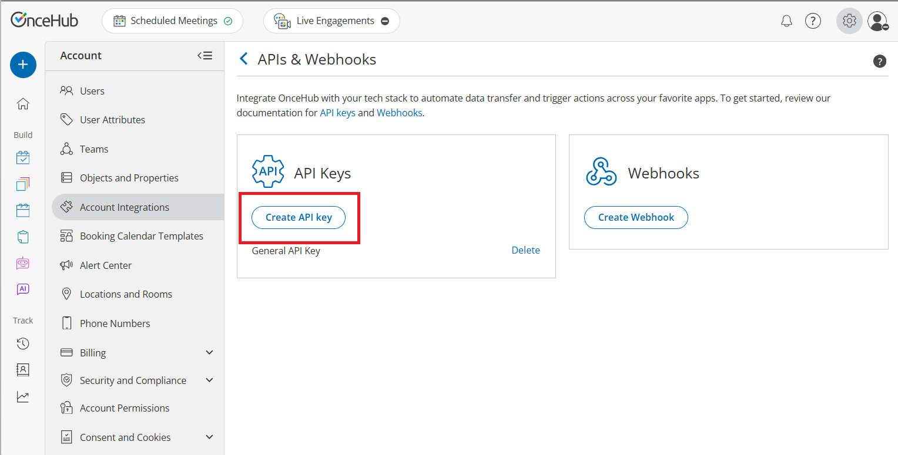
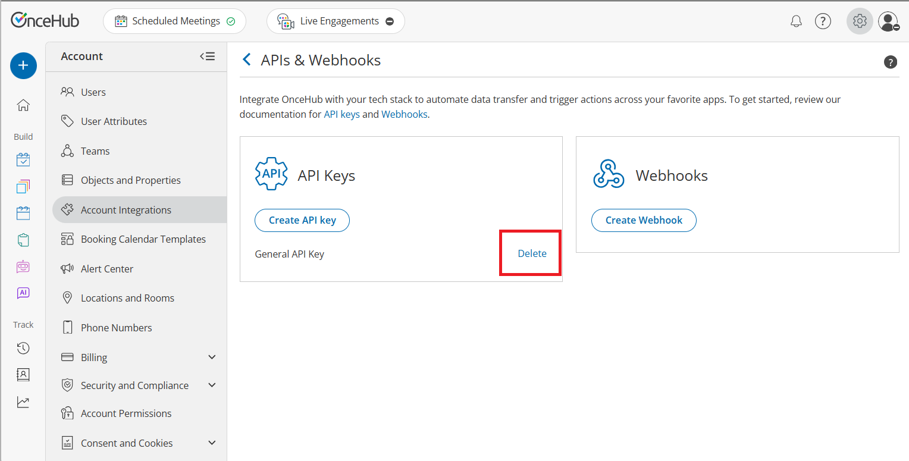

---
sidebar:
  order: 4
title: Authentication
oldUrl: "https://developers.oncehub.com/docs/overview/authentication/"
description: Generate and use API keys to authenticate requests to the OnceHub API with secure bearer token authentication.
products:
  - oncehub
---

To interact with the **OnceHub REST API and MCP Server**, you must authenticate every request using a unique **API Key**. For your security, all communication must occur over **HTTPS**; requests made over plain HTTP will be rejected.

OnceHub utilizes industry-standard cryptographic practices to protect your credentials.

- **Hashed Key Storage:** OnceHub does not store API keys in plaintext. Because we only store a secure cryptographic hash, your key is **displayed only once** upon generation. It cannot be retrieved again by any user or by OnceHub Support.
- **Multi-Key Management:** You can maintain up to **25 active API keys** per account to support:
  - **Environment Segregation:** Use separate keys for staging and production environments to prevent accidental data leaks.
  - **Vendor Management:** Assign unique keys to different third-party integrations to manage or revoke access independently.
  - **Zero-Downtime Rotation:** Supporting multiple concurrent keys allows you to generate a new key and update your application before revoking the old one, ensuring continuous service.

## Generate an API Key

1. Log in to your OnceHub account and click the **gear icon** located in the top-right corner of the page.
2. Select **Account Integrations** from the dropdown menu.
3. Select the **APIs & Webhooks** tile.
4. In the **API Keys** section, click the **Create API key** button.
5. In the pop-up, enter a descriptive **API Key Name** (e.g., "Production CRM").
6. Click **Generate key**. The **API Key Created Successfully** pop-up will appear.

   :::note
   Your API key is displayed here. For security reasons, it will only be displayed once.
   :::

7. Click **Copy & close** to copy the key to your clipboard and save it in a secure location.



## Delete an API Key

If a key is compromised or no longer needed, you should delete it immediately to protect your data.

1. Locate the specific key in the **API Keys** list.
2. Click the **Delete** link next to the key name.
3. A **Delete Key** confirmation pop-up will appear warning that any application using this key will immediately lose access.
4. Click **Delete key** button to permanently delete the credential.



## Using your API Key

Include your API key in the API-Key header of every HTTP request. If the key is missing or invalid, the API will return an error response to assist with troubleshooting. [**Learn more about error responses**](/developers/overview/error-handling/).

### Example Request

```http
GET /bookings HTTP/1.1
Host: api.oncehub.com
API-Key: your-api-key-here
Content-Type: application/json
```

## Testing your API Key

Once you have your key, test it by making a request to our [**validation endpoint**](/developers/api/#tag/authentication/GET/test) to confirm your connection is active. If the key is missing or invalid, the API will return a 401 Unauthorized error.

## Security Best Practices

Your API key grants significant access to your account data. Protect it by following these standards:

- **Server-Side Only:** Never expose your API key in client-side code (JavaScript), public GitHub repositories, or mobile app binaries.
- **Environment Variables:** Store keys in secure environment variables rather than hard-coding them into your source code.
- **Lost Keys:** If you lose an API key, OnceHub support team cannot recover it for you. You must delete the lost key, generate a new one, and update your integration.
- **Key Rotation:** As a proactive security measure, rotate your API keys at least every 6 months. If you suspect a key has been compromised, rotate it immediately by generating a new one and deleting the old key to ensure uninterrupted service during the transition.
