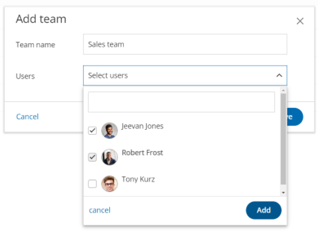
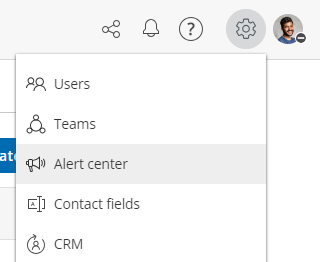
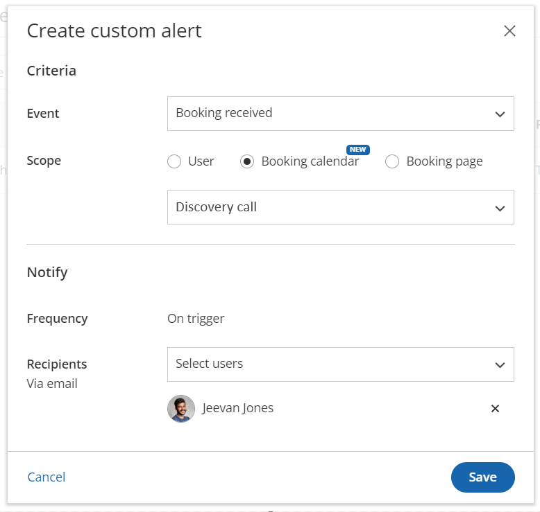
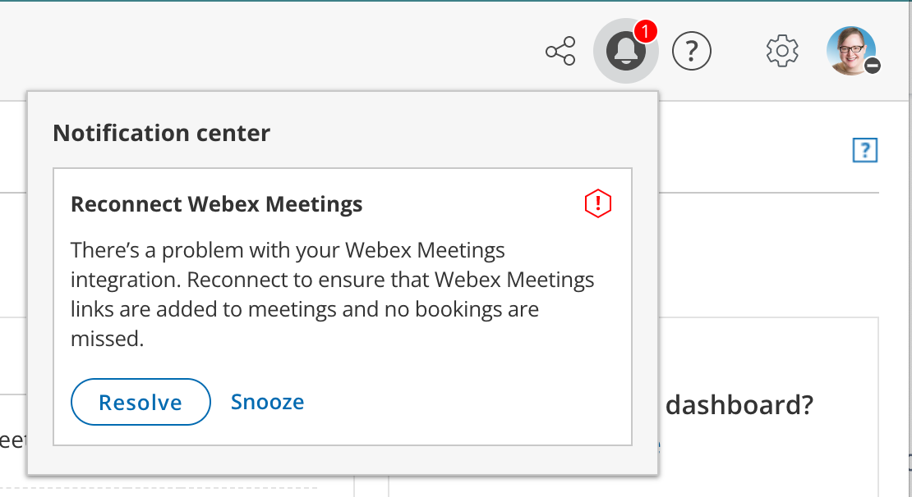
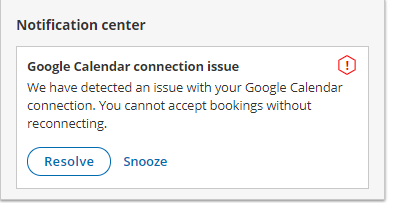
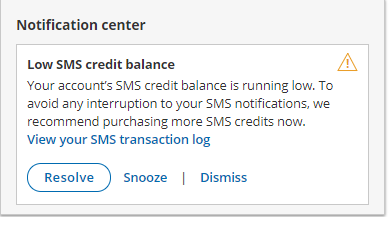

import { Aside } from '@astrojs/starlight/components';

Your account is where you can find the settings to control all of your key dealings with OnceHub, like adding users and user licenses, updating your security policies, managing your billing, and more. Read on to learn about the settings available for you in this section. 

#### Account settings

Welcome to your OnceHub account! 

To access your account, click on the gear icon in the top navigation menu. 

Only Administrators have access to the following sections in the OnceHub **Account settings** section. You do not need an assigned product license to access this section. Learn [more](/your-account-user-management/ "User management and licensing")

## [Users](/your-account-user-management/ "User management and seats")

In the **Users** section, you can manage other users in your account. This includes:

*   Adding new Users to your account
*   Accessing and editing other User profiles 
*   Deleting Users from your account
*   Assigning or unassigning User licenses

## [Teams](/managing-your-account#creating-and-managing-teams-/)

In the **Teams** section, you can create teams of OnceHub users. These teams can be assigned to field live calls, or be assigned to host scheduled meetings. You can [assign managers](/user-type-member-vs-admin-team-manager/ "Differences between administrator, member, and team manager") to these teams who can handle some of their administrative load.

## [Alert center](/managing-your-account#alert-center-/)

The **alert center** allows you to create alerts which keep you updated on every step of the booking process. Read on for [more information](/managing-your-account#alert-center-/) on how to set up an alert. 

## [Contact fields](/chatbots/configuring-your-chatbot/contacts-in-chatbots/ "Contacts")

In the **Contact fields** section, review and add fields you can use with contacts.

## CRM

In the **CRM** section, you can connect OnceHub to your CRM.

*   Click [here](/the-scheduleonce-connector-for-salesforce/ "Salesforce integration") to find more about integrating with Salesforce
*   Click [here](/the-scheduleonce-connector-for-infusionsoft/ "Infusionsoft integration") to find more about integrating with Infusionsoft

## [API & Webhooks](/connect-zapier-to-oncehub-connect-zapier-to-oncehub/ "Connect Zapier to OnceHub")

In the **API & Webhooks** section, you can generate and copy an API key to use with our API.

## [Billing](/your-account-introduction-to-billing/ "Introduction to billing")

In the **Billing** section, you can:

*   Review and add assigned licenses for Users
*   View your SMS credits and SMS log
*   Review your payment methods
*   Add and adjust notifications your account admins receive about your OnceHub account
*   View and download transactional invoices 

## [Security](/security-at-oncehub/ "Introduction to Security") and [compliance](/user-account-management/security-privacy-compliance/compliance/compliance-at-oncehub/ "Compliance at OnceHub")

In the **Security and Compliance** sections, you can manage:

*   [Password policies](/user-account-management/security-privacy-compliance/security/password-policies/ "Password Policies") - including settings for Password length, Password complexity, Password expiration, and Password history. 
*   [Account lockout policies](/user-account-management/security-privacy-compliance/security/account-lockout-policies/ "Account lockout policies") - you can enable or disable account lockout and set the number of unsuccessful login attempts allowed before account lockout occurs.
*   [Session policies](/user-account-management/security-privacy-compliance/security/session-policies/ "Session policies") - you can enable or disable session timeout and manage the session timeout period. 
*   Provide OnceHub with the contact information of your Data Protection Officer and your European Union representative. 
*   Describe your processing of personal data in OnceHub as required by the GDPR. [Learn more about maintaining records of processing in your OnceHub account](/user-account-management/security-privacy-compliance/privacy/maintaining-records-of-processing-under-the-gdpr/ "Maintaining records of processing under the GDPR")
*   Provide an email contact for data breach notification. In the event of a data breach, we always notify you via the email addresses of your account administrator and Data Protection or Privacy Officer. If there is anyone else you want us to notify, you can enter up to five email addresses here. 
*   Manage your [Corporate email](/corporate-email-account/ "Corporate email account") settings. These settings allow you to control the email address that communications to your customer are sent from.

## Settings and permissions

In the **Settings and permissions** section, you can:

*   Delete your account (more information in following section)
*   Specify a Compliance BCC email - this will allow you to automatically forward a hidden copy of all outgoing customer email notifications to a designated email address.
*   Enter your partner referral code
*   Remove OnceHub branding on customer-facing pages
*   Allow Member users to create and update chatbots, forms, and pages

**Note** Admins can update all chatbots and forms. Members can only update those an admin assigned to them

## Chatbot and form privacy

In the **Chatbot and form privacy** section, you can define the privacy and cookie policies related to visitors who encounter your chatbots and forms. 

#### Creating and managing teams

You can group users together into a team, allowing you to easily assign multiple users to host meetings and so offering more availability to your customers. Based on rules which you set, meetings can be distributed among team members equitably, or favoring availability offered to customers. 

You can assign a team manager to a team, who is able to act as similarly to an administrator for the members of their team. 

For more specific details on what team managers can and can't do, see [here](/user-type-member-vs-admin-team-manager/ "Differences between administrator, member, and team manager"). 

## To create a team:

1.  Go to your account settings (the gear icon at the top right), then go to **Teams**.
2.  If you have any existing teams in the account, you will see them here. To create a new team, click the **Add team** button at the top right.
3.  Name your team, and from the **Users** dropdown menu, select the team's members, then **Add** (Figure 1)
4.  That's it! You can now assign a team to host meetings. 

Figure 1: Creating a team and adding team members.

## To edit a team:

1.  Go to your account settings (the gear icon at the top right), then go to **Teams**.
2.  In the lobby, click the three-dot menu for the team you want to edit, and click **View/Edit team**. 
3.  Here, you can rename the team, add new users to the team by selecting them from the drop-down menu, or remove users from the team by clicking the **X** next to their name. 
4.  Click **Save** when you're finished to save any changes you have made. 

## Using a team manager

The team manager plays a role somewhere in between an administrator and member: They have access to most functionalities in the account, with restricted access to sensitive areas like customer data. Once they are assigned a team, they can create scheduling pages on behalf of their team members, as well as edit aspects of their team members' profile and scheduling settings. Team managers can manage multiple teams, and teams can have multiple managers. 

### To assign a team manager to a team: 

1.  Click the **gear icon** in the top right corner and select **Users**
    *   Here you can see all the users on your account, and their member type under the **Role** column. 
2.  Click the user whose status will be changed
3.  Click the **three-dot menu** next to **Role** → **Edit role**
4.  From the **Role** drop-down menu, select **Team manager**.
5.  From the **Team/s** menu, click the checkbox next to the team/s you want this user to be the manager of. 
6.  Click **Apply** to finalize your settings. 

 That user is now able to manage the team/s they have been assigned to!

### How can I use team managers?

Let's say you have three different sales teams in your organization, and you want each to be managed by a lead member. You also want your head of sales to oversee and administrate all of these teams. You can achieve this by:

*   Assigning your head of sales as a team manager to all of these sales teams, by selecting all of the sales teams from the **Team/s** dropdown as described above.
*   Assigning each lead member to be the team manager of their own team, by selecting just their team from the **Team/s** dropdown as described above.

The head of sales will now be able to manage all the members of all the teams, while the lead member will only be able to manage their own team.

#### Alert center

**Note** Only administrators are able to create alerts, but a member user can be added as a recipient of any global alert.

[Learn more](/user-type-member-vs-admin-team-manager/ "Differences between Administrator and Member") about the differences between administrators and member users.

Alerts are a feature which enable the administrator, and any users they add, to be CC'ed into notification emails about bookings made, canceled, or rescheduled with any users and/or scheduling tools in the account. The email will contain all the relevant information about the meeting.

The alerts builder can be found under account settings (the gear icon in the top right-hand corner).

The Alerts center

To create a new global alert:

1.   Click the **Create new alert** button.
2.  Select an **Event** which triggers the alert. These can be:
    *   Booking received
    *   Booking canceled
    *   Booking rescheduled
3.  Select a **Scope**. This is the user, booking page, or booking calendar which will be the subject of the alert.
4.  Depending on your choice above, click on the drop-down menu and select either a user, booking calendar, or booking page. 
    *   Whenever a booking is received, canceled, or rescheduled with that user, booking page or booking calendar, a notification will be triggered.
5.  In the **Notify** section, select a **Recipient** from the drop-down menu. You can select multiple users as recipients. Alerts can be sent to any user in the account.

To edit, delete, or duplicate an existing global alert, click on the three-dot menu, and select the appropriate option.

## Example of a custom alert: 

In the example below, there is a configured custom alert. In this case, the alert will work as follows:

*   When a booking is received/created in the booking calendar "Discovery call", the user "Jeevan Jones" will receive an email alert.

Creating a custom alert

**Note**If the user who has been scheduled with has turned off their email notifications for bookings received, canceled, or rescheduled, then users on the global alert will not receive any notifications either. 

#### Notification center

The Notification center allows you to manage issues and warnings reported by OnceHub.

The Notification center can be accessed via the Notification icon in the top navigation bar (Figure 1). The number of pending notifications is indicated in red.

_Figure 1: Notification center_

In this article, you will learn about the different notification types that you may receive in the Notification center. You will also learn about resolving issues reported in the Notification center, and about snoozing or dismissing notifications.

# Notification types

There are two types of notifications in the Notification center. 

## Issue

An issue is an urgent matter that should be addressed immediately. When an Issue is detected, the Notification center automatically opens to grab your attention (Figure 2). 

  
_Figure 2: Issue example_

Issue notifications include:

*   [Google Calendar](/connect-your-google-calendar/ "Connect your Google Calendar") connection error
*   [Microsoft 365 Calendar](/connect-your-microsoft-365-calendar/ "Connect your Microsoft 365 (Office 365) Calendar") connection error
*   [Exchange/Outlook Calendar](/connect-your-exchangeoutlook-calendar/ "Connect your Exchange/Outlook Calendar") connection error
*   [iCloud Calendar](/connect-your-icloud-calendar/ "Connect your iCloud Calendar") connection error
*   [Salesforce API](/connecting-a-salesforce-api-user/ "How to connect a Salesforce API User") connection error
*   [Salesforce field validation](/handling-required-salesforce-fields-in-the-field-validation-step/ "Handling required Salesforce fields in the Field validation step") error
*   [Infusionsoft](/connecting-to-infusionsoft/ "Connecting to Infusionsoft") connection error
*   [Zoom](/getting-started-with-oncehub/the-basics-of-video-conferencing-connection/connect-your-video-conferencing-app/ "Connect your video conferencing app") connection error
*   [GoToMeeting](/getting-started-with-oncehub/the-basics-of-video-conferencing-connection/connect-your-video-conferencing-app/ "Connect your video conferencing app") connection error
*   Depleted [SMS credit](/sms-pricing/ "SMS Pricing") balance

**Note**

When a connection error for a third-party integration occurs, you cannot accept bookings and should resolve the connection error as soon as possible. Such connection errors can occur when the integration is not set up correctly or when an API access token was revoked or has expired.

## Warning

A warning is a non-urgent matter that you should be aware of (Figure 3). 

  
_Figure 3: Warning example_

Warning notifications include:

*   [GoToMeeting](/getting-started-with-oncehub/the-basics-of-video-conferencing-connection/connect-your-video-conferencing-app/ "Connect your video conferencing app")’s access token is about to expire
*   Low [SMS credit](/sms-pricing/ "SMS Pricing") balance

# Resolving a notification

To resolve an item in the Notification center, click the **Resolve** button. This takes you to the relevant section in the platform where you can address the reported item. 

# Snoozing a notification

Click **Snooze** to hide the notification for a period of 24 hours. 

# Dismissing a notification

Notifications regarding your SMS credit balance have a **Dismiss** link. Clicking **Dismiss** hides the notification from the Notification center until the SMS credit balance is low or depleted again.

#### Signing up for a OnceHub account

To create a new OnceHub account:

1\. Open the [OnceHub sign up page](https://account.oncehub.com/signup) and input your name, email address, and password. 

2\. Click **Sign up**. 

## Which email address can I sign up with?

You can create a OnceHub ID with any authentic email address and a password of your choice. 

You can also create a OnceHub account using G Suite by installing the OnceHub app from [G Suite Marketplace](https://gsuite.google.com/marketplace/app/scheduleonce/144878059378). Once installed, any User on your G Suite domain can create the first User. That User will become the first Administrator on the account, and all additional Users on the domain must be invited by the Administrator.

## Can I change my email address after I sign up?

Yes, you can do so in your profile, accessed via the left navigation menu.

If you are using OnceHub with a G Suite ID, your email address is your G Suite ID and therefore can only be changed via your G Suite account. 

[Learn more about how your sign-in credentials are stored and protected by OnceHub](/how-your-passwords-are-stored-and-protected-by-oncehub/ "How your sign-in credentials are stored and protected by OnceHub")

#### Accessing your account

#### 

#### 

**Note**

Invited Users need to sign in for the first time by clicking the **Sign in to your account** button in the email invitation from the OnceHub Administrator of the account. [Learn more about joining your organization's OnceHub Account](/getting-started-with-oncehub/introduction-to-oncehub/joining-your-organizations-oncehub-account/ "Joining your organization's OnceHub account") 

# Sign in for Users with a OnceHub password

1.  Open the [OnceHub sign-in page](https://account.oncehub.com/signin).
2.  Enter your Email ID and Password and click **Sign in** (Figure 1).Figure 1: Sign in to OnceHub
3.  You will be authenticated using our secure authentication system, and redirected to the OnceHub Start page. 
    
    **Note**
    
    If you have enabled two-factor authentication for your profile, your sign in process will include an additional step. Learn more about signing in with two-factor authentication in this article.
    
4.  From the Activity stream, you can review your activities. You can also navigate to OnceHub, Chatbots, or your OnceHub Account settings by selecting an option from the top navigation menu.

# Sign in for G Suite Users 

If you have installed OnceHub using G Suite, you can access your account in two ways:

1.  **Signing in from your G Suite account:** you can sign in from within your G Suite account via G Suite Apps using Google’s secure single sign-on.
2.  **Signing in from the OnceHub sign-in page:** you can also access your OnceHub account by clicking the **Sign in with G Suite** button at the bottom of the OnceHub sign-in page. 

If you use G Suite and your OnceHub administrator did not install OnceHub through the G Suite Marketplace, it's possible they either want you to sign in with a OnceHub password (see above) or configured OnceHub so that you sign in through SSO (see below).

# Sign in through SSO 

If your Administrator has configured SSO for your account, you can sign into OnceHub by clicking the **Sign in with SSO** link at the bottom of the OnceHub sign-in page.

You will be redirected to your Identity Provider and, once authenticated, will be returned to your signed-in OnceHub account.

[Learn more about configuring SSO for your account](/user-account-management/account-management/single-sign-on-sso/configuring-single-sign-on-sso-for-your-account/)

If you're having difficulty signing in, please don't hesitate to [contact us](/contact-us/) for more help.

# Signing in with two-factor authentication

Two-factor authentication adds an extra layer of security to your account. When you enable two-factor authentication for your profile, you’ll sign in to your account in two steps using your OnceHub account password and a unique verification code sent to your mobile phone. [Learn more about how your sign-in credentials are stored and protected by OnceHub](/how-your-passwords-are-stored-and-protected-by-oncehub/ "How your sign-in credentials are stored and protected by OnceHub")

Read on to learn about signing in to your account when two-factor authentication is enabled. 

# Signing in to your account

1.  Sign in to your OnceHub account as usual, using your email ID and OnceHub password. 
2.  A unique verification code is sent to your mobile phone. If you do not receive a code, click **Resend code**. 
3.  On the **Verification** page (Figure 1), enter the verification code you just received and click **Sign in**.
4.  If the verification code is correct, you will be signed in to your OnceHub Account. 

**Note**

Two-factor authentication has a built-in lockout policy to detect irregular activity. If any irregular sign-in activity is detected, your account will be locked. If your account is locked, contact your [account Administrator](/user-type-member-vs-admin/ "Differences between Administrator and Member") to unlock it.

#### Deleting your account

You can delete your OnceHub Account at any time in the **Account settings** section of your OnceHub Account. Once your account is deleted, you will no longer be billed. 

An alternative to deleting your account is to pause your subscription by removing all of your seats. You can remove seats at any time. When you remove seats, they are still available for use in the application until the end of your current billing cycle. This is because you've already paid for all of your seats in advance at the beginning of the current billing cycle. If you remove all of your seats, you will pause your subscription. This will limit your access to OnceHub functionalities. You can resume your subscription and access at any times by adding seats.

Read on to learn about the effects of deleting your account and how to delete your account. 

# What happens when I delete my OnceHub Account?

*   When you delete your OnceHub Account, you are deleting all products linked to your account. Your data, meetings, and inbound pages will be permanently deleted for both OnceHub and Chatbots. Any credit cards used to make a purchase, as well as associated personal data, are permanently deleted. 
*   If there are multiple Users on the account, all Users will be permanently deleted when you delete your account. If you (or another User) sign in again with the same ID after the account is deleted, the system will treat you as a new User.
*   Deleting your OnceHub Account will not affect the scheduled meetings in your calendar.
*   Once your OnceHub Account is deleted, you will no longer be billed. 

Once you delete your account, it cannot be recovered or re-activated. If you are not 100% sure that you want to delete your account, please [contact us](/contact-us/) before you delete.

**Important**

If you only want your Booking page or Master page to become unavailable, you can simply disable it and there is no need to delete your account. [Learn how to disable your Booking page](/disabling-your-booking-page/ "Disabling your Booking page")

# Requirements

 To access the **Account settings** page and delete your account, you must be a [OnceHub Administrator](/user-type-member-vs-admin/ "Differences between Administrator and Member").

# Deleting your account

1.  Sign in to your OnceHub Account. 
2.  In the top navigation menu, click on the gear icon → **Settings**. 
3.  Click **Delete account**.
4.  In the **Delete account** pop-up (Figure 1), check the box marked **I want to delete my account. I understand this cannot be undone**.  
    Figure 1: Delete account pop-up - feedback box
5.  Click **Delete account** to delete your account. 

Once your account has been deleted, you will be redirected to the OnceHub pricing page to see our latest plans and pricing should you wish to create a new account.

#### OnceHub for Google Workspace

OnceHub for Google Workspace is designed specifically for organizations using Google Workspace. Its special features are the single sign-on with the user's Google Workspace account, and the automatic connection to the user's Google Calendar.

OnceHub for Google Workspace is only available to organizations running Google Workspace, and can only be installed from [Google Workspace Marketplace](https://gsuite.google.com/marketplace/app/scheduleonce/144878059378?pann=gam) by the organization's Google Workspace Administrator.

Once installed, any user on the domain can create the first OnceHub account. That account will become the first administration account and all users will be added from that account only. [Learn about adding Users](/your-account-user-management/ "User management and licensing")

When the first Administration account is created, any User on the domain who tries to create an account without receiving an invitation from the Administration account, will be instructed to ask the Administrator to add them as a User.

Once Users are added and have signed up, they can simply access OnceHub from their [Google universal navigation bar](https://support.google.com/accounts/answer/1714464?hl=en) or with the Google login for OnceHub.

OnceHub for Google Workspace uses Google’s single sign-on, so it is as secure as your Google Workspace account. If you’re already logged into Google, no login is required to access the OnceHub platform.

To install OnceHub for Google Workspace, ask your Google Workspace Administrator to visit [our OnceHub listing in the Google Workspace Marketplace](https://gsuite.google.com/marketplace/app/scheduleonce/144878059378?pann=gam).