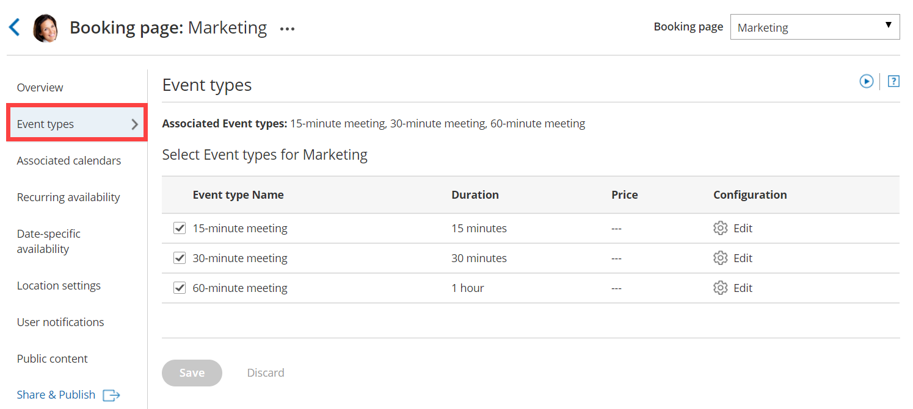

import { Aside } from '@astrojs/starlight/components';

Pooled availability combines the availability of multiple Team members and displays this to Customers as a single booking calendar. When a Customer selects a time, the booking is automatically assigned to the Team member with [the longest idle time](/the-pooled-availability-algorithm---longest-idle-time/ "The Pooled availability algorithm: Longest idle time"), meaning the Team member who has not received a booking in the longest time.  
  
Pooled availability is a Customer-focused distribution method that should be used if your top priority is providing Customers with the maximum number of time slots. Pooled availability can be used in [multi-user scenarios](/scheduleonce-for-multi-user-scenarios/ "Introduction to multi-user scenarios"), [single-user scenarios](/introduction-to-single-user-scenarios/ "Introduction to single-user scenarios"), [resource scheduling](/using-scheduleonce-for-room-and-resource-scheduling/ "Using ScheduleOnce for room and resource scheduling with Rule-based assignment"), and location scheduling. You can set up Pooled availability in a [Rule-based assignment Master page](/team-or-panel-page/ "Master page scenario: Rule-based assignment") using [Static rules](/rule-based-assignment-static-rules/ "Rule-Based Assignment: Static Rules") . 

[See a live demo](http://go.oncehub.com/AutomaticAssignment)

# How are bookings assigned with Pooled availability? 

When a Customer selects a time on your Master page, OnceHub first checks which Team members are available at the time selected by the Customer. Then, the booking is assigned to the Team member with the longest idle time.

# Using Pooled availability in Master pages with Static rules

1.  [Create a Booking page](/creating-a-booking-page/ "Creating a Booking page") for each member, resource, or any other entity that you would like to automatically assign. Don't configure any Booking page settings yet.
2.  To use Pooled availability, you must use at least one [Event type](/event-types-creating-an-event-type/ "Creating an Event type"). You can use multiple Event types to represent different types of meetings, or a single Event type if you provide only one type of meeting type.  
    If you use only one Event type, the system will automatically select it for the Customer. 
    
    **Note**All Event types used in Pooled availability must use [Automatic booking mode](/automatic-booking-or-booking-with-approval/ "Automatic booking or Booking with approval"). Pooled availability is not possible in Booking with approval mode.
    
3.  [Associate your Event types with your Booking pages](/adding-event-types-to-booking-pages/ "Adding Event types to Booking pages") in the **Event types** section of the Booking page (Figure 1).  If you've created just one Event type, all the Booking pages that are used with Pooled availability should be linked to this Event type.  
    Figure 1: Event types section 
4.  You can now configure the rest of the settings on the Booking pages and the Event types.
    
    **Note**If you have Booking pages with different time zones, the **Time zone conversion** setting for displaying time slots in your Customer's local time must be enabled in the [Time slots section](/introduction-to-time-slot-settings/ "Introduction to Time slot settings").
    
5.  Go back to **Booking pages** and [create a new Master page](/master-page-setup-creating-a-master-page/ "Creating a Master Page").
6.  Select [Rule-based assignment](/team-or-panel-page/ "Master page scenario: Rule-based assignment") as the [Master page scenario](/master-page-scenarios/ "Master page scenarios").
7.  In your newly created Master page, go to the **Assignment** section and follow these steps:
    *   In the **Rule types** section, select **Static**.
    *   In the **Distribution method** section, select **Pooled availability**.  
    *   Finally, in the **Included Booking pages** section, select the Booking pages whose availability you would like to combine into one single booking calendar. You can add or remove Booking pages from here at any time.
8.  Next, go to the [Labels and instructions](/master-page-labels-and-instructions-section/ "Master Page: Labels and Instructions section") section and define the Public labels that your Customers will see. Here, you can also define selection instructions for your Customers.

You're all set! You can test the page by clicking the Customer link in the **Share & Publish** section of the the Master page's [Overview section](/master-page-overview-section/ "Master Page: Overview section").

**Note**

You can also use Pooled availability with Resource pools. [Learn more about Resource pools with Pooled availability distribution](/resource-pool-distribution-method---pooled-availability/ "Resource pool distribution method: Pooled availability")