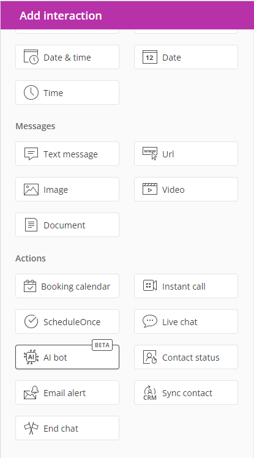
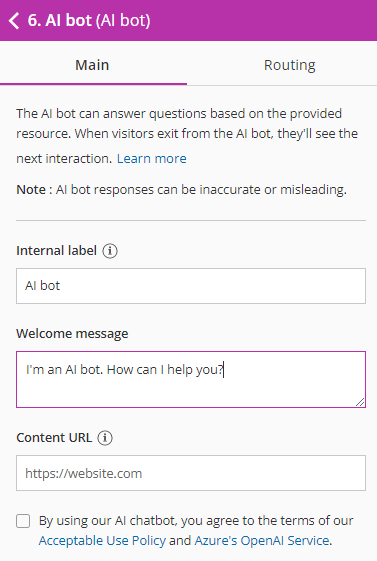
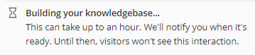

import { Aside } from '@astrojs/starlight/components';

With our AI bot, you can provide your visitors with valuable information through an automated chatbot. They can get the answers they need easily, without using up your employees' time and energy. 

Adding the AI bot to your chatbot is simple. 

1) Go to the relevant chatbot.

2) In the lefthand pane, **Add interaction**, select the action **AI bot** (Figure 1).

Figure 1: AI bot interaction 

3) Drag and drop the AI bot interaction into the conversation on the left. You can drag the interaction to the place you'd like visitors to experience the AI bot. 

4) Configure the AI bot settings (Figure 2).

FIgure 2: AI bot settings

The settings you can configure are:

*   **Internal label:** This is the name you'll see for this interaction inside your OnceHub account. Visitors to your bot will not see this label. 
*   **Welcome message:** The message that greets visitors when the chatbot conversation they're interacting with reaches the AI bot.
*   **Content URL:** The URL of the site where the AI bot will gather information, in order to answer questions for your visitors. For instance, this could be a collection of articles your organization wrote. You can either add your entire website domain or a part of it, by providing a URL to a subfolder on that domain (for instance: [http://www.website.com/example](http://www.google.com/example)). The AI bot will answer all questions based on the content of this URL. If it links to other pages on the same domain, it will include that content as well.  

5) Wait as the AI bot builds your knowledgebase (Figure 3). 

Figure 3: Wait message

In certain cases, building the AI bot's knowledgebase could take longer than an hour, depending on the size of the website. 

6) Add the chatbot to your website or to a [OnceHub page](/pages/), where your visitors can interact with it. 

7) Test the bot. Keep in mind that the AI bot's answers may be inaccurate at times. We recommend you test it thoroughly to confirm what it will say, based on the content URL's information.

8) As visitors access your AI bot, we recommend you review questions and answers regularly in your activity stream. This will give you an idea of what people are asking and how accurate the AI bot may be for those questions. Based on the questions and answers, you may want to adjust the content and refresh the AI bot's content URL periodically. 

**Note** When the visitor ends their chat with the AI bot, they will see whichever interaction is next in the conversation.