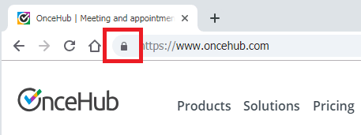

import { Aside } from '@astrojs/starlight/components';

At OnceHub we understand the importance of protecting Customer data. We have taken a comprehensive approach and placed security mechanisms throughout the data lifecycle.

Booking page security protects your data where it is typically created or used. Security mechanisms are built into the core functionality and no action needs to be taken by you to enable them. There are three security controls that protect data on your Booking page:

# Encryption in transit (HTTPS)

When new data is collected as part of the Booking process, it needs to be transmitted over public networks to reach our servers. To protect your data, we use encrypted communication via HTTPS connections. 

[HTTPS is a secure protocol](https://en.wikipedia.org/wiki/HTTPS) used to transmit data from websites to web servers. HTTPS is the industry standard and is used by military and financial institutions for transmitting sensitive data. You can tell a web page is using HTTPS if there is a lock icon in the browser address bar:

Figure 1: Lock icon in browser address bar

OnceHub is an “HTTPS only” application. OnceHub Booking pages only use HTTPS and automatically redirect to HTTPS if HTTP is manually typed by a User. We support the versions of HTTPS that are accepted across the industry (TLS 1.0 - 1.2).  

# Bot protection

Some malicious users will use automated tools (bots) to scan public pages and collect information available on the page. To protect our Users we have implemented a blocking system which identifies bots and prevents them from accessing the page in this way.

# Privacy protection for stored customer data 

We are committed to ensuring that your customer data is kept safe and secure. We have added a layer of security for bookings made with contacts stored in databases, such as your [Infusionsoft CRM](/connecting-to-infusionsoft/ "Connecting to Infusionsoft"), [Salesforce CRM](/connecting-to-salesforce/ "Connecting to Salesforce") or your OnceHub app. In these cases, customer information will not be visible on the booking form and we will only indicate that the data is used for making the booking.

Data stored on databases is sensitive and should never be exposed on a public webpage (such as your OnceHub Booking page). To keep your data private, pre-populated Booking forms automatically load in a private mode which prevents data from being displayed. [Learn more about pre-populated Booking forms](/prepopulated-booking-forms/ "Prepopulated Booking forms")