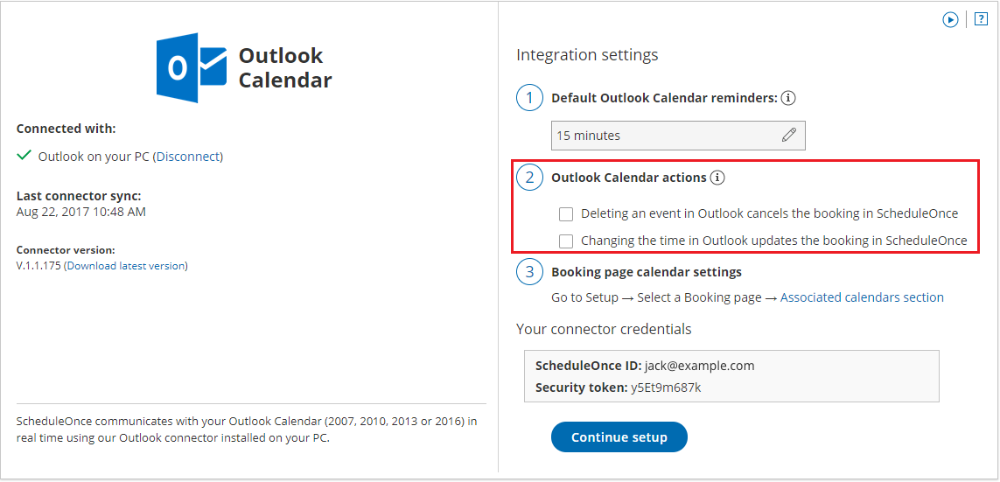

import { Aside } from "@astrojs/starlight/components";

When you're connected to an Outlook Calendar via the [PC connector for Outlook](/introduction-to-the-pc-connector-for-outlook "Introduction to the PC connector for Outlook"), you can select whether changes made in your connected calendar are reflected in OnceHub.

<Aside type="note">

This article only applies to calendar actions done by Users while connected to Outlook Calendar via the [PC connector for Outlook](/introduction-to-the-pc-connector-for-outlook "Introduction to the PC connector for Outlook"). It does not apply to other calendars integrations, or to any calendar action done by the Customer.

</Aside>

In this article, you'll learn how about cancelling and rescheduling in your Outlook calendar

## Adjusting the Outlook Calendar action settings

Log into OnceHub and go to **Setup** -> **OnceHub** **setup** -> Lefthand sidebar -> **Integrations** -> [Calendar integration](/the-basics-of-calendar-connection-ed13279-introduction-to-calendar-connection "Introduction to Calendar Connection").

Under the **Outlook Calendar actions** heading, you'll see two checkboxes (Figure 1). These control how the Outlook Calendar two-way sync will function. By default, both are unchecked.

Figure 1: Outlook Calendar integration settings

## Cancelling an event in your connected Outlook Calendar

If you delete a calendar event created by a OnceHub booking while the **Deleting an event in Outlook cancels the booking in OnceHub** box is checked, the booking will automatically be canceled in OnceHub.

When you delete an event in your calendar, the following actions are performed as if you (the User) canceled the booking in OnceHub:

- Your Customer receives a [cancellation notification](/scheduleonce/event-types-booking-pages/customer-notifications/notifications-to-customers "Notifications to Customers").
- The event is deleted from your calendar, and the time is set to Free.
- If you're using any other integrations (like CRM, video conferencing or [Zapier](/scheduleonce/account-integrations/automation/zapier/connect-zapier-to-oncehub "The ScheduleOnce connector for Zapier")), they are updated with the cancellation.
- If you are using [Payment integration](/scheduleonce/account-integrations/payment-collection/paypal/oncehub-connector-for-paypal "The ScheduleOnce connector for PayPal"), no refund is issued. If your Customer is entitled to a refund, you can [refund them manually via OnceHub ](/scheduleonce/account-integrations/payment-collection/paypal/manual-refunds-via-oncehub "Manual refund via ScheduleOnce")or via PayPal.

<Aside type="note">

In cases of a [Panel meetings](/scheduleonce/master-pages-resource-pools/panel-meetings/introduction-to-panel-meetings "Introduction to Panel Meetings"), if the [Primary team member](/scheduleonce/master-pages-resource-pools/panel-meetings/booking-owners "Primary Team Members") deletes the calendar event, the booking is automatically canceled in OnceHub for all Panel members. That means for both the Primary team member and all [Additional team members](/scheduleonce/master-pages-resource-pools/panel-meetings/additional-team-members "Additional Team Members").

</Aside>

If you delete a calendar event created by a OnceHub booking while this box is **unchecked,** the booking remains unchanged in OnceHub, no email notifications are sent and integrations are not updated.

## Rescheduling an event in your connected Outlook Calendar

The **Changing the time in Outlook updates the booking in OnceHub** option determines how OnceHub is updated with the new time of the event. When you move a booking in your connected calendar, you're actually rescheduling on behalf of your Customer. Therefore, the time change must be coordinated with your Customer. No email notifications are sent to you or your Customer.

<Aside type="note">

The reschedule functionality will only work when events are modified in the same calendar. Modifications in [Additional booking calendars](/scheduleonce/event-types-booking-pages/booking-pages/booking-pages-associated-calendars "Booking page: Associated calendars section") are disregarded.

</Aside>

When you move an event in your calendar while this box is checked, the following actions are performed:

- The OnceHub booking time is updated immediately.
- All [reminders](/scheduleonce/event-types-booking-pages/customer-notifications/customer-notification-scenarios "Customer notification scenarios") are sent on schedule.
- All integrations (CRM, video conferencing, Zapier, and payment) are updated as well.
- The [status](/scheduleonce/managing-bookings/analytics/activity-stream-managing-activities "Understanding ScheduleOnce activity statuses") of future events is changed to **Rescheduled**.

If you move a calendar event created by a OnceHub booking while this box is **unchecked**, the OnceHub booking time is only updated when the next reminder is due, subsequent reminders are sent on schedule and integrations are not updated.

<Aside type="note">

In cases of [Panel meetings](/scheduleonce/master-pages-resource-pools/panel-meetings/introduction-to-panel-meetings "Introduction to Panel meetings"), if the [Primary team member](/scheduleonce/master-pages-resource-pools/panel-meetings/booking-owners "Primary team members") moves a booking in their connected calendar, the booking is automatically rescheduled for all panel members. That means for both the Primary team member and all [Additional team members](/scheduleonce/master-pages-resource-pools/panel-meetings/additional-team-members "Additional team members").

</Aside>

## The Customer calendar event

Figure 2: Send update to Customer Whether or not your Customer’s calendar will be updated is based on your choice in Outlook’s event update dialog box. Make sure to select **Save changes and send update** or **Send cancellation**, so that your Customer’s calendar is updated.[ Learn more about the Customer's calendar event](/scheduleonce/event-types-booking-pages/customer-notifications/customer-calendar-event-options "Customer Calendar Event options")
