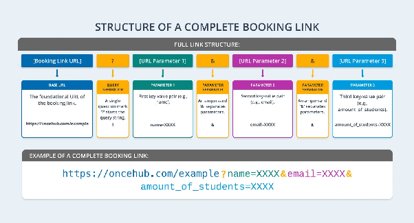

import { Aside } from "@astrojs/starlight/components";

Personalize the scheduling experience for your guests and maximize booking efficiency by utilizing custom URL parameters. URL Parameters can be used to prefill Booking Form questions as well as configure additional booking link behaviors to occur such as skipping the Booking Form step during scheduling.

---

## How to Add URL Parameters to Your Booking Links

Follow the steps below to add URL parameters to your booking links:

1. Start with your base Booking link: `https://oncehub.com/example`
2. Add a query separator `?` at the end of the Booking link: `https://oncehub.com/example?`
3. Add your first parameter after the query separator `?`: `https://oncehub.com/example?name=XXXX`
4. If adding multiple parameters, separate each parameter with an `&`: `https://oncehub.com/example?name=XXXX&email=XXXX`

---

## OnceHub System URL Parameters

Use the exact syntax below to prefill constant booking form Questions and configure specific link behaviors:

### Booking Form Questions

| Booking Link Question | URL Syntax      | Description                                    | Example                     |
| :-------------------- | :-------------- | :--------------------------------------------- | :-------------------------- |
| Contact Full Name     | `name=`         | Prefills the full name of the guest.           | `name=John%20Doe`           |
| Contact Email         | `email=`        | Prefills the email address of the guest.       | `email=john.doe@email.com`  |
| SMS Number            | `mobile_phone=` | Prefills the mobile phone number of the guest. | `mobile_phone=+17793129776` |

### Booking Link Behavior Settings

| Booking Link Setting        | URL Syntax          | Description                                                                                                                                                                                 | Example                           |
| :-------------------------- | :------------------ | :------------------------------------------------------------------------------------------------------------------------------------------------------------------------------------------ | :-------------------------------- |
| Dynamic Host                | `host=`             | Dynamically override the meeting distribution of a booking link with a specific host using their email address.                                                                             | `host=john.doe@email.com`         |
| Dynamic Co-hosts            | `co_hosts=`         | Dynamically adds co-hosts by adding comma-separated email addresses of users from your OnceHub account.                                                                                     | `co_hosts=sarah.connor@email.com` |
| Default Time Zone           | `iana_time_zone=`   | [**Sets the default time zone used to display availability to the guest.**](/human-engagement/booking-calendars/sharing-embedding/how-to-override-the-guest-time-zone-on-your-booking-link) | `iana_time_zone=America/New_York` |
| Pre-select Meeting Duration | `duration_minutes=` | Use to pre-select a meeting duration from the available meeting durations configured for a booking link.                                                                                    | `duration_minutes=15`             |
| Skip Booking Form           | `skip=1`            | Skips the booking form step entirely if all required questions are prefilled.                                                                                                               | `skip=1`                          |

---

## URL Parameters for Custom Questions

You can also prefill any additional custom Questions added to your booking forms. The parameter syntax you need to use depends on how the Question is configured:

- **Mapped Questions:** If you have [**mapped the Booking Form Question to an Object Property**](/human-engagement/booking-calendars/booking-forms/mapping-booking-calendar-questions-to-object-properties), the parameter will make use of the Property's Unique Identifier.
- **Unmapped Questions:** If the Booking Form Question is not mapped to an Object Property, the URL parameter will be based on the Question's name.

<Aside type="tip">

Use the [**Personalization and Tracking**](/human-engagement/booking-calendars/sharing-embedding/prefilling-guest-information-in-your-booking-calendar) option in the Share popup of a Booking Calendar to confirm what the URL parameter is.

</Aside>

---

## URL Parameters for Routing Forms

Routing Forms can also be prefilled using URL parameters. This allows you to create a more personalized experience for visitors by combining the prefilled information with your existing routing rules.

For Routing forms, it is important to know that you can only prefill [**Questions that are mapped to Object Properties**](/human-engagement/routing-forms/contact-data-management/mapping-routing-form-questions-to-object-properties) by using the Property's Unique Identifier as the URL parameter.

---

## URL Parameters Processing Rules

To ensure your links function correctly, adhere to the following technical processing rules:

- **Space Encoding:** Encode all spaces within your parameter values as `%20`.
- **Phone Number Formatting:** Format the `mobile_phone` parameter to include the country code written as `%2[country code]` followed immediately by the rest of the phone number.
- **SMS Number Visibility:** When the SMS number Question is included in your booking form, it will always be shown to your guest even if it is prefilled and the `skip=1` parameter is applied.
- **Parameter Key Casing:** Parameter keys are not case-sensitive; for example, `Skip=` will be treated exactly the same as `skip=`.
- **Parameter Value Casing:** Parameter values are case-sensitive; for example, `John` is treated as a completely different value than `john`.
- **Error Handling Fallback:** Questions will be fully displayed to the guest when the URL parameter value that was provided is in an incorrect format.
