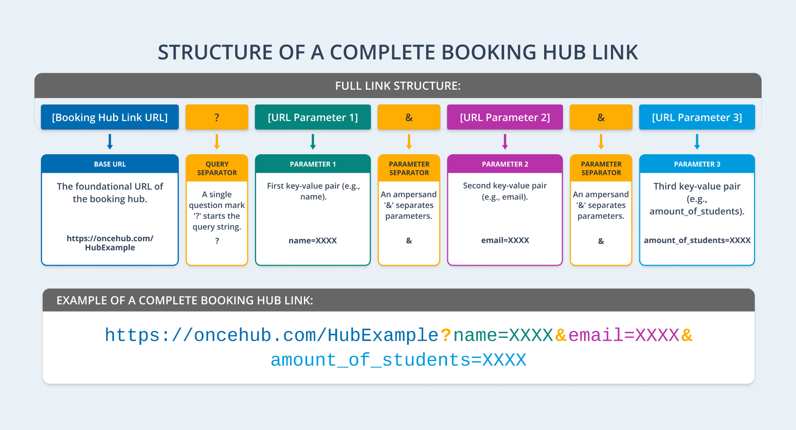

import { Aside } from "@astrojs/starlight/components";

Prefilling guest information on your [**Booking Hub**](/human-engagement/booking-hubs/introduction-to-booking-hubs/introduction-to-booking-hubs) streamlines the process for both you and your guests. By reducing manual data entry, it saves time, minimizes errors, and enhances the overall booking experience. This article covers how to use URL parameters to prefill guest details for any [**Booking Calendar**](/human-engagement/booking-calendars/introduction-to-booking-calendars/introduction-to-booking-calendars) within your Booking Hub.

We recommend mapping the Booking Form questions of each Booking Calendar to [**Object Properties**](/account-administration/objects-properties/introduction-to-objects-and-properties) if you plan to use prefilling with Booking Hubs. This ensures that if you have similar questions on multiple Booking Calendars within the Booking Hub, they can be prefilled using the same URL parameter (Object Property).

For guidance on mapping, refer to our [**Mapping Booking Calendar Questions to Object Properties**](/human-engagement/booking-calendars/booking-forms/mapping-booking-calendar-questions-to-object-properties) article.

---

## How to Build Your Prefilled Guest Link

### Step 1: Get the Base Booking Hub Link

Follow these steps to retrieve the base link for your Booking Hub:

1. Click **Booking Hubs** in the left-hand navigation menu.
2. Click **Share** next to the Booking Hub you want to get a link for.
3. Click **Copy & close** to copy the link.
4. Paste the link into a text editor for later use.

### Step 2: Get the URL Parameters for the Added Booking Calendars

Follow these steps to retrieve the URL parameters for each Booking Calendar:

1. Click **Booking Calendars** in the left-hand navigation menu.
2. Click **Share** next to the Booking Calendar you want to get the parameters for.
3. Check **Personalization and Tracking** in the pop-up.
4. **Optional:** Expand **UTM Parameters** and add any UTMs that you want to use for tracking.
5. Expand **Booking Form URL Parameters**.
6. Select the **Prefill booking form dynamically via third party tool** option.
7. Ensure that all the Questions you want to prefill are toggled on.
8. Click **Copy & close** to copy the link.
9. Paste the link into a text editor for later use.

<Aside type="caution">

&#x20;If your Booking Calendars have different questions you want to prefill, you can repeat the steps above to get the unique URL Parameters for each Booking Calendar.

</Aside>

### Step 3: Combine the URL Parameters with the Booking Hub Link

Follow the steps below to combine your Booking Hub link with the URL parameters based on the structure illustrated in the following image:

1. Start with your base Booking Hub link: **`https://oncehub.com/HubExample`**
2. Add a query separator **`?`**` `at the end of the Booking Hub link: `https://oncehub.com/HubExample?`
3. Add your first parameter after the query separator **`?`**: `https://oncehub.com/HubExample?name=XXXX`
4. If adding multiple parameters, separate each parameter with an **`&`**: `https://oncehub.com/HubExample?name=XXXX&email=XXXX`

<Aside type="caution">

&#x20;If you have Booking Calendars with different questions you want to prefill, you should add the URL Parameters for each question. They will then be automatically used when the relevant Booking Calendar is selected during scheduling.

</Aside>

### Step 4: Hide Prefilled Questions from Guests (Optional)

To minimize the number of questions your guests need to answer, add **`&skip=1`**` `to the end of your Booking Hub link. This ensures that guests only see the questions for which information has not already been supplied by you.

**`https://oncehub.com/HubExample?name=XXXX&email=XXXX&skip=1`**

<Aside type="note">

If all required questions are prefilled, guests will automatically skip the booking form, leading to a faster scheduling process.

</Aside>

### Step 5: Share the Booking Hub Link with Your Guests

The link is now ready to be used. Replace the` `**`XXXX`** for each URL parameter with your guests’ details when you share it with them. This can be done manually or dynamically with third-party tools like CRMs or marketing platforms.
