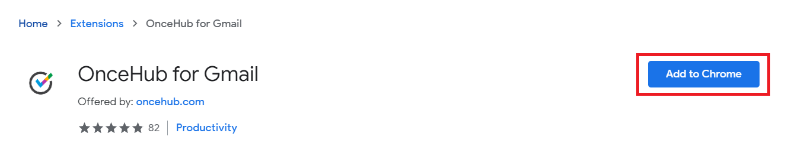
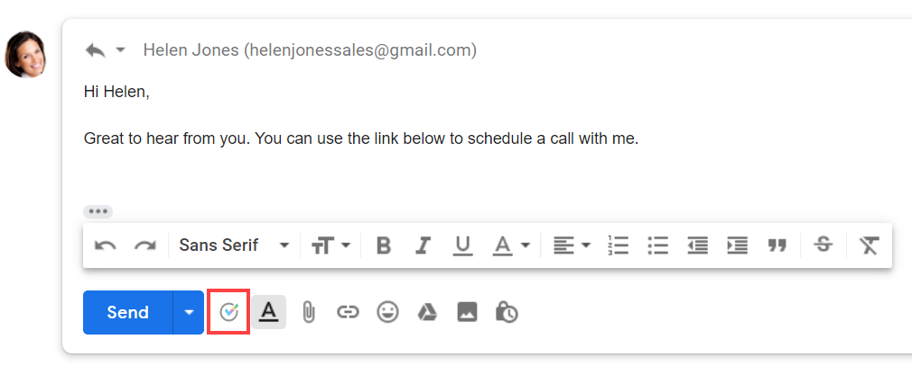
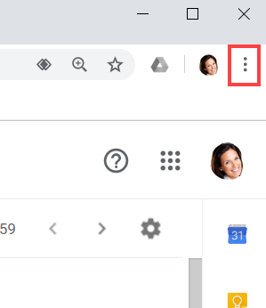
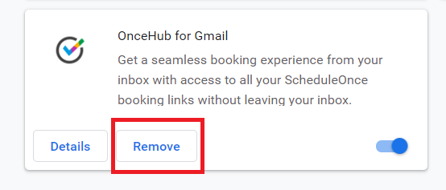
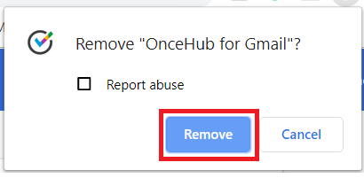

import { Aside } from '@astrojs/starlight/components';

In this article, you'll find answers to some of the most common questions related to [OnceHub for Gmail](/integrations/browser-extension/introduction-to-oncehub-for-gmail/ "Introduction to OnceHub for Gmail").

```
&lt;script id="snippet-prepend">
$(function()&#123;
  
  /*disable in widget*/
  if($('.w-documentation-article').length === 0)&#123;

     var ToC =
  "&lt;nav role='navigation' class='table-of-contents toc-top'><h4>In this article:" + "<ul>";
     var el,     title, link, header;
      //Define the heading levels you want to use in ascending order. Can add extra or remove unneeded.
     $(".hg-article-body h1, .hg-article-body h2, .hg-article-body h3, .hg-article-body h4").each(function() &#123;
              el = $(this);
              title = el.text();
                 if(title != '')&#123;
                anchorTitle = el.text().replace(/([~!@#$%^&*()_+=`&#123;&#125;\[\]\|\\:;'&lt;>,.\/\? ])+/g, '-').toLowerCase();
                link = "#" + anchorTitle;
                //Set all headers to a 0-nesting level.
                header = 'header-nesting-0';
                //Adjust header-nesting layers so that they point to the correct html tag. header-nesting-1 should match the second .hg-article-body h# listed above; header-nesting-2 should match the third, etc.
                if($(this).is('h2'))&#123;
                    header = 'header-nesting-1';
                &#125;else if($(this).is('h3'))&#123;
                    header = 'header-nesting-2'
                &#125;
                el.html('<a id="'+anchorTitle+'" class="toc-anchor">' + el.html());
                newLine =
      "<li class='"+header+"'>" +
        "<a class='article-anchor' href='" + link + "'>" +
          title +
        "" +
      "";


                ToC += newLine;
              &#125;
              &#125;);
     ToC +=
   "" +
  "";
    $("#snippet-prepend").before(ToC);
  &#125;
&#125;);

&lt;/script>
```

```
&lt;style>
/* CSS to style the TOC as it displays and the auto-created anchors
.toc-top styles the box for the TOC; adjust styles here to tweak look and feel */
  
.toc-top &#123;
  background-color: #FAFAFA; /* set to #fff or delete entirely for no background */
  border: 1px solid #C8C8C8; /* adjust the color hex here to change border color */
  box-shadow: 0 1px 1px rgba(0, 0, 0, 0.05) inset;
  margin-top: 24px;
  margin-bottom: 36px;
  min-height: 20px;
  padding: 13px 20px;
  max-width: 75%;
&#125;
.toc-top h4 &#123;
  font-size: 18px;
  line-height: 26px;
  margin: 0 0 8px;
  font-weight: 400;
&#125;
.toc-top ul &#123;
  padding: 0 0 0 15px !important;
  margin-bottom: 0;	
&#125;
.toc-top > ul &#123;
  margin-bottom: 13px!important;
&#125;
.toc-anchor &#123;
  display: block;
  height: 90px; 
  margin-top: -90px; 
  visibility: hidden;
&#125;

/* Set the indentation for the nesting levels. May need to be edited to match changes above. Increase or decrease the margin-left to get your desired level of indentation. */
.header-nesting-1 &#123;
    margin-left: 14px;
&#125;
.header-nesting-1:before &#123;
	background-image: url(https://dyzz9obi78pm5.cloudfront.net/app/image/id/5d31bcc88e121c9b25ba22c4/n/bulletv2.svg)!important;
&#125;
.header-nesting-2 &#123;
    margin-left: 28px;
&#125;
.header-nesting-2:before &#123;
	background-image: url(https://dyzz9obi78pm5.cloudfront.net/app/image/id/5d31be536e121cf22b0cc6ae/n/bulletv3.svg)!important;
&#125;
&lt;/style>
```

# How do I install the OnceHub for Gmail extension?

1.  Go to the [Chrome Web Store listing for OnceHub for Gmail](https://chrome.google.com/webstore/detail/oncehub-for-gmail/ijlpmpplkkhpkhgpingckadmlohkgddg). 
2.  Click **Add to Chrome** (Figure 1).  
    _Figure 1: Add to Chrome_ 
3.  The installation permissions pop-up will appear.
4.  Click **Add Extension** (Figure 2).  
    ****_Figure 2: Add to Chrome confirmation_
5.  Once installed, you will see the OnceHub for Gmail confirmation screen.

[Learn more about installing OnceHub for Gmail](/oncehub-for-gmail-so-installing-oncehub-for-gmail/ "Installing OnceHub for Gmail")

# How do I open the OnceHub for Gmail extension?

Once you've [installed OnceHub for Gmail](/oncehub-for-gmail-so-installing-oncehub-for-gmail/ "Installing OnceHub for Gmail"), you can open the extension in the email you're composing by clicking the OnceHub for Gmail icon (Figure 3).

Figure 3: OnceHub for Gmail icon

# Can I search for my booking links in OnceHub for Gmail?

Yes, you can filter the list of booking links by name or link by using the search box

# Why can't I see my booking links in OnceHub for Gmail?

If you can't see any booking links in the OnceHub for Gmail extension, you may need to sign in to your OnceHub account. 

# Why can't I use my booking link?

If you can't use a booking link in OnceHub for Gmail, there may be a calendar connection error in your account. Sign in to your OnceHub Account. Then, select your profile picture or initials in the top right-hand corner → **Profile settings** → **Calendar connection** and click the **Reconnect your calendar** button. 

# What happens if someone is CC'd on the email I want to create a Personalized booking link for?

In this case, the Personalized link will be automatically generated for the email address in the "To" field. You will not be asked to confirm the details before it's copied to your clipboard.

# Why do I see a "Scheduled meeting license is required" error message?

You will see a "Scheduled meetings license is required" error message if your account has not been [assigned a license](/assigning-licenses-to-users/ "Assigning licenses to Users"). Ask your OnceHub Administrator to assign a product license to your account.

# How do I uninstall OnceHub for Gmail?

1.  In your Chrome browser, click the three dots (action menu) in the top right corner (Figure 5).  
    Figure 5: Chrome browser three dots (action menu)
2.  In the drop-down menu, select **More tools -> Extensions**.
3.  In the **OnceHub for Gmail** box, click **Remove** (Figure 6).  
      
    _Figure 6: OnceHub for Gmail options in extensions menu._
4.  Once you click **Remove**, you will see a confirmation screen (Figure 7). Click **Remove.**  
      
    _Figure 7: Removal confirmation._