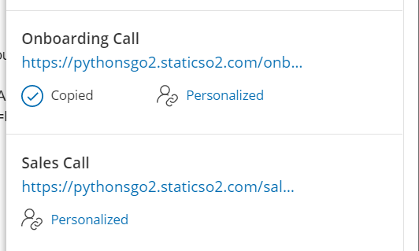
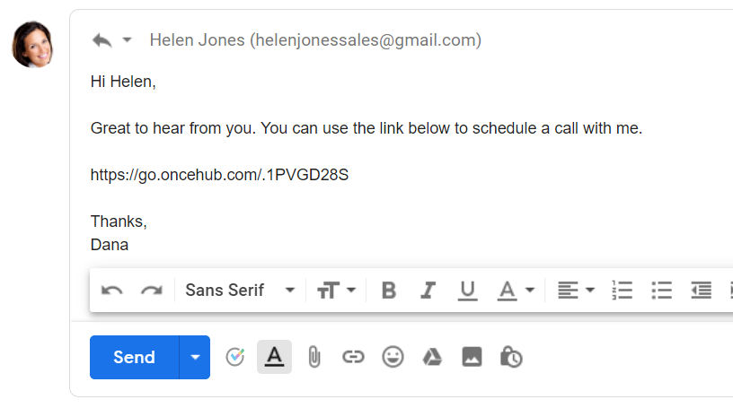
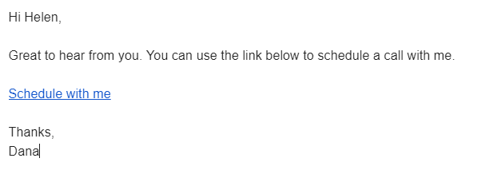
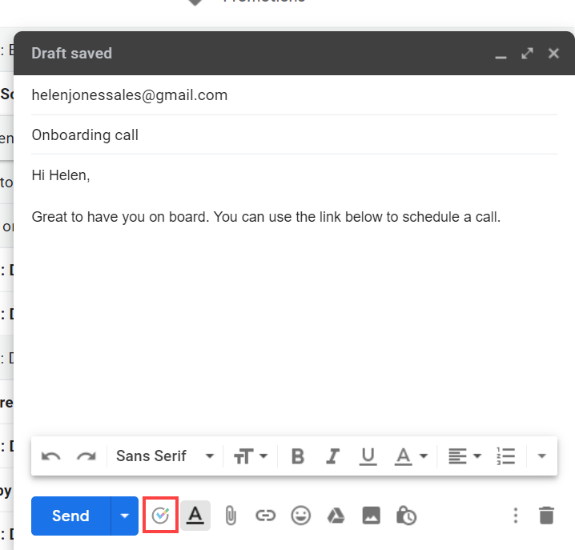
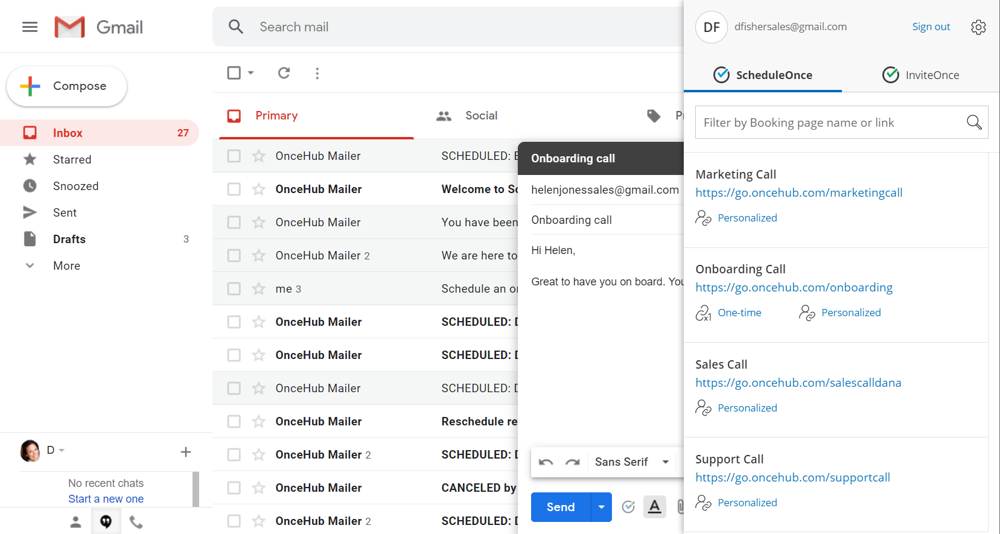
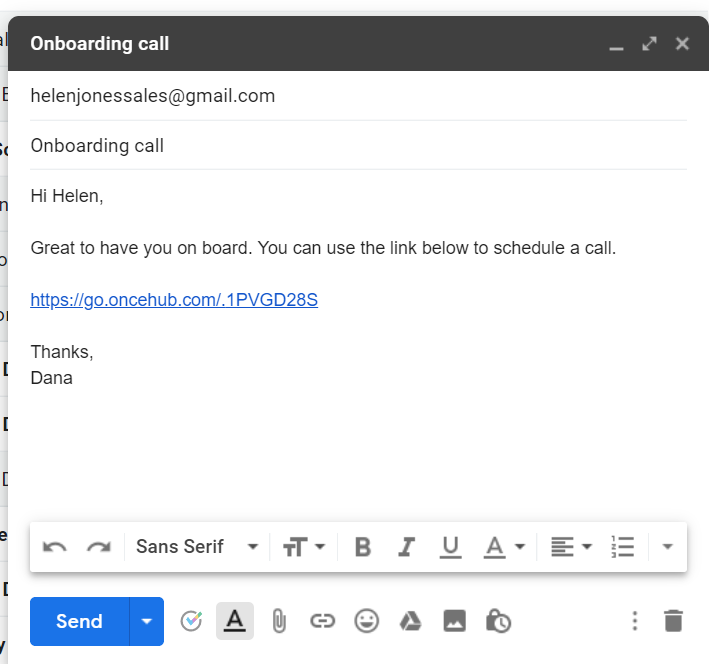
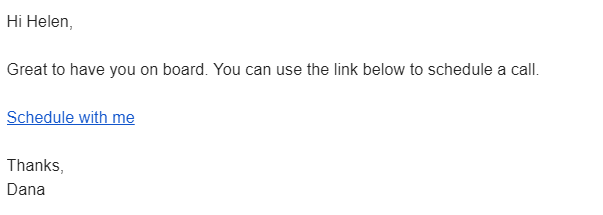

import { Aside } from '@astrojs/starlight/components';

  

The [OnceHub for Gmail extension](/integrations/browser-extension/introduction-to-oncehub-for-gmail/ "Introduction to OnceHub for Gmail") enables you to schedule meetings directly from your Gmail account. OnceHub for Gmail gives you instant access to all of your booking links without the need to change apps.

In this article, you'll learn about sending one-time links [](https://oncehub.knowledgeowl.com/help/using-personalized-links "Using Personalized links")using OnceHub for Gmail.

```
&lt;script id="snippet-prepend">
$(function()&#123;
  
  /*disable in widget*/
  if($('.w-documentation-article').length === 0)&#123;

     var ToC =
  "&lt;nav role='navigation' class='table-of-contents toc-top'><h4>In this article:" + "<ul>";
     var el,     title, link, header;
      //Define the heading levels you want to use in ascending order. Can add extra or remove unneeded.
     $(".hg-article-body h1, .hg-article-body h2, .hg-article-body h3, .hg-article-body h4").each(function() &#123;
              el = $(this);
              title = el.text();
                 if(title != '')&#123;
                anchorTitle = el.text().replace(/([~!@#$%^&*()_+=`&#123;&#125;\[\]\|\\:;'&lt;>,.\/\? ])+/g, '-').toLowerCase();
                link = "#" + anchorTitle;
                //Set all headers to a 0-nesting level.
                header = 'header-nesting-0';
                //Adjust header-nesting layers so that they point to the correct html tag. header-nesting-1 should match the second .hg-article-body h# listed above; header-nesting-2 should match the third, etc.
                if($(this).is('h2'))&#123;
                    header = 'header-nesting-1';
                &#125;else if($(this).is('h3'))&#123;
                    header = 'header-nesting-2'
                &#125;
                el.html('<a id="'+anchorTitle+'" class="toc-anchor">' + el.html());
                newLine =
      "<li class='"+header+"'>" +
        "<a class='article-anchor' href='" + link + "'>" +
          title +
        "" +
      "";


                ToC += newLine;
              &#125;
              &#125;);
     ToC +=
   "" +
  "";
    $("#snippet-prepend").before(ToC);
  &#125;
&#125;);

&lt;/script>
```

```
&lt;style>
/* CSS to style the TOC as it displays and the auto-created anchors
.toc-top styles the box for the TOC; adjust styles here to tweak look and feel */
  
.toc-top &#123;
  background-color: #FAFAFA; /* set to #fff or delete entirely for no background */
  border: 1px solid #C8C8C8; /* adjust the color hex here to change border color */
  box-shadow: 0 1px 1px rgba(0, 0, 0, 0.05) inset;
  margin-top: 24px;
  margin-bottom: 36px;
  min-height: 20px;
  padding: 13px 20px;
  max-width: 75%;
&#125;
.toc-top h4 &#123;
  font-size: 18px;
  line-height: 26px;
  margin: 0 0 8px;
  font-weight: 400;
&#125;
.toc-top ul &#123;
  padding: 0 0 0 15px !important;
  margin-bottom: 0;	
&#125;
.toc-top > ul &#123;
  margin-bottom: 13px!important;
&#125;
.toc-anchor &#123;
  display: block;
  height: 90px; 
  margin-top: -90px; 
  visibility: hidden;
&#125;

/* Set the indentation for the nesting levels. May need to be edited to match changes above. Increase or decrease the margin-left to get your desired level of indentation. */
.header-nesting-1 &#123;
    margin-left: 14px;
&#125;
.header-nesting-1:before &#123;
	background-image: url(https://dyzz9obi78pm5.cloudfront.net/app/image/id/5d31bcc88e121c9b25ba22c4/n/bulletv2.svg)!important;
&#125;
.header-nesting-2 &#123;
    margin-left: 28px;
&#125;
.header-nesting-2:before &#123;
	background-image: url(https://dyzz9obi78pm5.cloudfront.net/app/image/id/5d31be536e121cf22b0cc6ae/n/bulletv3.svg)!important;
&#125;
&lt;/style>
```

# Understanding one-time links

One-time links are good for one booking only, eliminating any chance of unwanted repeat bookings[](https://oncehub.knowledgeowl.com/help/introduction-to-booking-pages "Introduction to Booking pages"). One-time links can be personalized, allowing the Customer to pick a time and schedule without having to fill out the Booking form.

When you create a one-time link using OnceHub for Gmail, the Customer's name and email address is automatically taken from the email. When the Customer uses the Personalized link to schedule a meeting, they only need to choose a date and time, then confirm the meeting. The Booking form is skipped and they will not have to provide their name and email address.

**Note** You can also send Personalized links using OnceHub for Gmail. 

[Learn more about sending Personalized links using OnceHub for Gmail](/oncehub-for-gmail-so-sending-personalized-links-using-oncehub-for-gmail/ "Sending Personalized links using OnceHub for Gmail")

# Requirements

To send one-time links using OnceHub for Gmail, you must: 

*   [Install OnceHub for Gmail](/oncehub-for-gmail-so-installing-oncehub-for-gmail/ "Installing OnceHub for Gmail").
*   Have a [scheduled meetings User license](/assigning-licenses-to-users/ "Assigning licenses to Users").
*   Have an active booking link on your OnceHub account

# Sending one-time links using OnceHub for Gmail

## When replying to an email

1.  Sign in to your Gmail account. 
2.  Open the email that would like to reply to.
3.  Click **Reply**.
4.  Click the OnceHub for Gmail icon (Figure 1).  
    
    
    Figure 1: OnceHub for Gmail icon
    
5.  The OnceHub for Gmail extension window will open (Figure 2).  
    
    
    Figure 2: OnceHub for Gmail extension window
    
6.  Click **One-time** next to the Master page you want to share (Figure 3).  
    
    
    Figure 3: Generating a one-time link
    
7.  You will see the **Copied** confirmation when the link has been generated and copied to your clipboard (Figure 4).  
    
    
    Figure 4: One-time link copied
    
8.  Paste the one-time link into your email (Figure 5).  
    
    
    Figure 5: Pasting the one-time link into your email
    
9.    To turn your booking link into a customized html link, click the Insert Link button on the bottom email menu. (Figure 6).

  


_Figure 6: Insert Link button in Gmail._

  

    10.  A window will appear (Figure 7). Insert your booking link and the text you would like to display. Click OK. 


_Figure 7: Insert Link window_

  

   11.  Your booking link now will now appear as an html link. (Figure 8).



_Figure 8: Html link in your email._

##   

## When composing a new email

1.  Sign in to your Gmail account.
2.  Click **Compose** to create a new email.
3.  In the **To** field, enter the email address of the person you want to share your Booking page link with.
    
    **Note** If you do not enter an email address, you will need to enter the **Customer name** and **Customer email** in the OnceHub for Gmail extension window when you generate a Personalized link. 
    
4.  Click the OnceHub for Gmail icon (Figure 9).  
    
    
    Figure 9: OnceHub for Gmail icon
    
5.  The OnceHub for Gmail extension window will open (Figure 10).  
    
    
    Figure 10: OnceHub for Gmail extension window
    
6.  Click **Personalized** next to the Booking page you want to share (Figure 11).  
    
    
    Figure 11: Generating a one-time link
    
7.  You will see the **Copied** confirmation when the link has been generated and copied to your clipboard (Figure 12).  
    
    
    Figure 12: One-time link copied
    
8.  Paste the one-time link into your email (Figure 13).  
    
    
    Figure 13: Pasting the one-time link into your email
    

 9. To turn your booking link into a customized html link, click the Insert Link button on the bottom email menu. (Figure 14.)


_Figure 14: Insert Link button in Gmail._

  

   10.  A window will appear (Figure 15). Insert your booking link and the text you would like to display. Click OK. 


_Figure 15: Insert Link window_

  

   11.  Your booking link now will now appear as an html link. (Figure 16).



_Figure 16: Html link in your email._